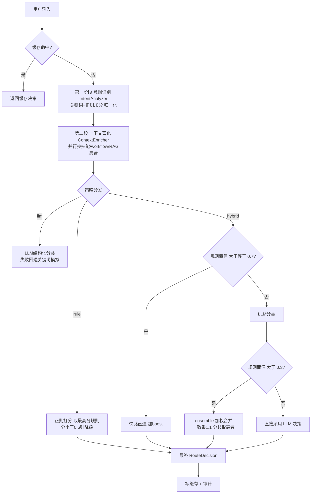
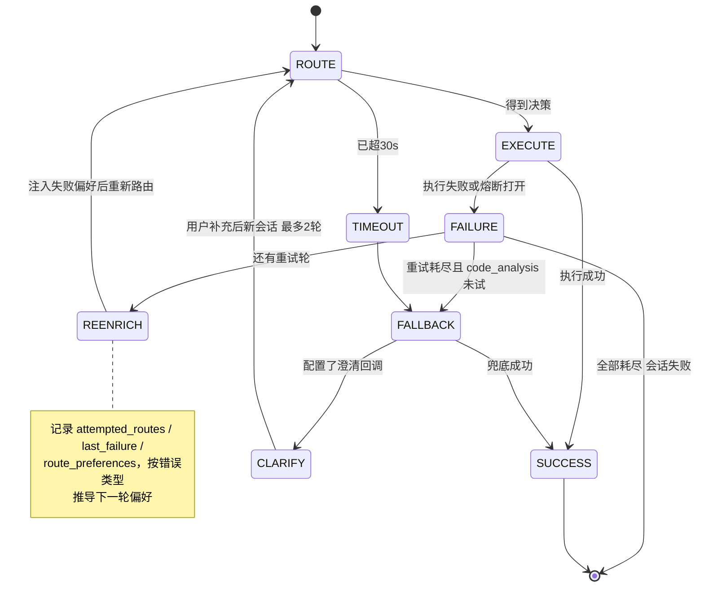
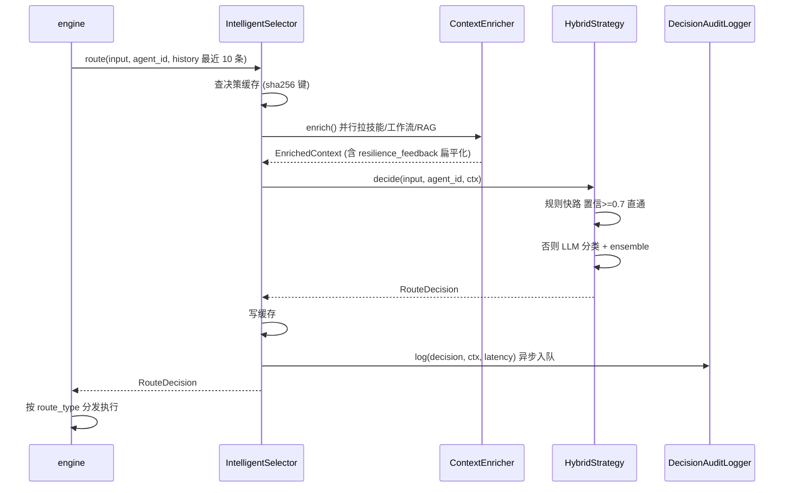

# 智能路由器 (Intelligent Selector)

> **一句话理解**：每次请求先进它裁决走哪条处理路径，裁决错了还有降级循环兜底。

## 职责

selector 模块是 ResolveAgent 的路由大脑：输入一句用户请求，输出一个 [RouteDecision](python/src/resolveagent/selector/selector.py#L22)，指明去 workflow（FTA 诊断）、skill（工具执行）、rag（知识检索）、code_analysis（代码分析）还是 direct（直接回答）。[selector.py:3-5](python/src/resolveagent/selector/selector.py#L3) 的模块注释自称 "brain of ResolveAgent's routing system"。

模块内部分四层：

| 层 | 文件 | 职责 |
|---|---|---|
| 决策编排 | [selector.py](python/src/resolveagent/selector/selector.py#L84) | 缓存、上下文富化、策略分发、审计 |
| 决策策略 | [strategies/](python/src/resolveagent/selector/strategies/rule_strategy.py#L28) | rule（正则）、llm（模型分类）、hybrid（两者混合） |
| 弹性循环 | [resilient_selector.py](python/src/resolveagent/selector/resilient_selector.py#L272) | 失败重试、渐进降级、熔断、失败反馈注入 |
| 可观测 | [audit.py](python/src/resolveagent/selector/audit.py#L40)、[cache.py](python/src/resolveagent/selector/cache.py#L20) | 决策审计、决策缓存 |

## 设计原理：三段式 meta-routing

[selector.py:103-106](python/src/resolveagent/selector/selector.py#L103) 把管线写成三段：Intent Analysis → Context Enrichment → Route Decision。落到代码上各段的输入/输出/裁决逻辑如下。

### 第一段：意图识别

输入是原始文本 [intent.py:251](python/src/resolveagent/selector/intent.py#L251)（`IntentAnalyzer.classify`），输出是带归一化分数的意图类型。裁决逻辑是**加分制**而非单条命中：

- 关键词命中每个 +0.15×权重，正则命中每个 +0.3×权重 [intent.py:278](python/src/resolveagent/selector/intent.py#L278)、[intent.py:282](python/src/resolveagent/selector/intent.py#L282)；workflow 权重 1.2、code_analysis 1.1、rag 0.8 [intent.py:90](python/src/resolveagent/selector/intent.py#L90)、[intent.py:194](python/src/resolveagent/selector/intent.py#L194)、[intent.py:146](python/src/resolveagent/selector/intent.py#L146)。
- 检测到代码块/代码语法给 code_analysis 直接 +0.5 [intent.py:294](python/src/resolveagent/selector/intent.py#L294)；问句给 rag +0.3 [intent.py:303](python/src/resolveagent/selector/intent.py#L303)。
- 分数归一化后，top-2 差距小于 `split_threshold=0.15` 判为 MULTI 意图 [intent.py:325-326](python/src/resolveagent/selector/intent.py#L325)；最终置信度 = 最高归一分 ×1.5 [intent.py:328](python/src/resolveagent/selector/intent.py#L328)。

意图识别在 selector 主类里是**惰性**构建的：只有调用 `analyze_intent` 或走富化管线才 import [selector.py:242](python/src/resolveagent/selector/selector.py#L242)。

### 第二段：上下文富化

`route()` 默认先富化 [selector.py:194-195](python/src/resolveagent/selector/selector.py#L194)：[ContextEnricher](python/src/resolveagent/selector/context_enricher.py#L81) 并行拉取可用技能、活跃 workflow、RAG 集合 [context_enricher.py:233-237](python/src/resolveagent/selector/context_enricher.py#L233)，再按输入相关性给技能排序取 top 10 [context_enricher.py:239](python/src/resolveagent/selector/context_enricher.py#L239)。富化结果带一个 `enrichment_confidence` [context_enricher.py:42](python/src/resolveagent/selector/context_enricher.py#L42)，它会进入最终 reasoning [router.py:139-140](python/src/resolveagent/selector/router.py#L139)，也在弹性循环里被失败衰减（见下）。

### 第三段：策略选择与候选排序

策略在构造时从三种里选一个（非法值回退 hybrid）[selector.py:117](python/src/resolveagent/selector/selector.py#L117)、[selector.py:137-139](python/src/resolveagent/selector/selector.py#L137)，分发点是 [selector.py:199-200](python/src/resolveagent/selector/selector.py#L199)。策略内部再做候选排序：

- **rule**：11 组规则按"最具体优先"排 [rule_strategy.py:44](python/src/resolveagent/selector/strategies/rule_strategy.py#L44)，打分公式 = 规则基础置信 × (0.7 + 0.3×命中率) [rule_strategy.py:230](python/src/resolveagent/selector/strategies/rule_strategy.py#L230)，再加 0.1 上浮 [rule_strategy.py:238](python/src/resolveagent/selector/strategies/rule_strategy.py#L238)；只有 ≥0.6 才接受，否则降级到"检测到代码块给 0.75"或 direct 0.3 [rule_strategy.py:244](python/src/resolveagent/selector/strategies/rule_strategy.py#L244)、[rule_strategy.py:261](python/src/resolveagent/selector/strategies/rule_strategy.py#L261)。
- **llm**：一个带五路示例的结构化 prompt [llm_strategy.py:37](python/src/resolveagent/selector/strategies/llm_strategy.py#L37)，从回复里正则抠 JSON [llm_strategy.py:342](python/src/resolveagent/selector/strategies/llm_strategy.py#L342)，非法 route_type 打回 direct，`fta` 统一映射回 `workflow` [llm_strategy.py:354-361](python/src/resolveagent/selector/strategies/llm_strategy.py#L354)。
- **hybrid**（默认）：三相位——规则快路直通 [hybrid_strategy.py:103](python/src/resolveagent/selector/strategies/hybrid_strategy.py#L103)、LLM 慢路兜底 [hybrid_strategy.py:109](python/src/resolveagent/selector/strategies/hybrid_strategy.py#L109)、两路结果加权 ensemble（一致时合并置信 ×1.1 奖励 [hybrid_strategy.py:137](python/src/resolveagent/selector/strategies/hybrid_strategy.py#L137)、[hybrid_strategy.py:150](python/src/resolveagent/selector/strategies/hybrid_strategy.py#L150)，分歧时取高者 [hybrid_strategy.py:163-175](python/src/resolveagent/selector/strategies/hybrid_strategy.py#L163)），最后按输入特征加微调 boost [hybrid_strategy.py:177-211](python/src/resolveagent/selector/strategies/hybrid_strategy.py#L177)。



## 三种策略：为什么不是一个

git 历史显示三者同批引入（commit 3326b08，2026-03-23，"major update"，无详细消息），但三份策略文件的 docstring 写明了分工：

- **rule**：为"可预测、可审计、零 LLM 延迟"而生 [rule_strategy.py:37-41](python/src/resolveagent/selector/strategies/rule_strategy.py#L37)，正则预编译一次复用 [rule_strategy.py:199-203](python/src/resolveagent/selector/strategies/rule_strategy.py#L199)。
- **llm**：为"开放、歧义、多意图"请求而生 [llm_strategy.py:29-34](python/src/resolveagent/selector/strategies/llm_strategy.py#L29)。
- **hybrid**：docstring 直说它是 recommended 默认 [selector.py:109](python/src/resolveagent/selector/selector.py#L109)、[hybrid_strategy.py:3-5](python/src/resolveagent/selector/strategies/hybrid_strategy.py#L3)。

只有一种的风险很直观：纯 rule 对没命中模式的话术全打到 direct 0.3（[rule_strategy.py:258-264](python/src/resolveagent/selector/strategies/rule_strategy.py#L258) 的兜底分支）；纯 LLM 则每条请求都付模型延迟与费用。hybrid 用 `rule_confidence_threshold=0.7` 划界——规则够确定就不花钱，不够才请模型 [hybrid_strategy.py:26-28](python/src/resolveagent/selector/strategies/hybrid_strategy.py#L26)。

> [!NOTE] 推测：0.7/0.6 这组阈值的数值来源无注释、无 commit 说明。从行为反推：0.7 正好是 rule 决策典型置信（0.8 基础分经打分公式后大致落点）之上，而 LLM 被要求"清晰场景给 0.7+"[llm_strategy.py:108](python/src/resolveagent/selector/strategies/llm_strategy.py#L108)，两侧同基准才好比。依据：代码行为 + prompt 约束，无直接设计记录。

### 阈值与 fallback 常量一览

| 常量 | 值 | 位置 |
|---|---|---|
| 规则快路门槛 | 0.7 | [hybrid_strategy.py:26](python/src/resolveagent/selector/strategies/hybrid_strategy.py#L26) |
| ensemble 参与门槛（规则侧） | 0.3 | [hybrid_strategy.py:114](python/src/resolveagent/selector/strategies/hybrid_strategy.py#L114) |
| ensemble 一致奖励 | ×1.1 | [hybrid_strategy.py:150](python/src/resolveagent/selector/strategies/hybrid_strategy.py#L150) |
| ensemble 权重 rule:llm | 0.6:0.4 | [hybrid_strategy.py:32-34](python/src/resolveagent/selector/strategies/hybrid_strategy.py#L32) |
| 代码块 boost / 高复杂度 / 诊断词 / 长对话 | +0.1 / +0.05 / +0.05 / +0.03 | [hybrid_strategy.py:188-204](python/src/resolveagent/selector/strategies/hybrid_strategy.py#L188) |
| rule 接受门槛 / 无匹配兜底 | 0.6 / direct 0.3 | [rule_strategy.py:244](python/src/resolveagent/selector/strategies/rule_strategy.py#L244)、[rule_strategy.py:261](python/src/resolveagent/selector/strategies/rule_strategy.py#L261) |
| 高置信/中置信（RouteDecider） | 0.75 / 0.5 | [router.py:13-14](python/src/resolveagent/selector/router.py#L13) |
| LLM 采样参数 | temperature 0.3、max_tokens 500、关闭 thinking | [llm_strategy.py:220-222](python/src/resolveagent/selector/strategies/llm_strategy.py#L220) |
| MULTI 意图判据 | top-2 差 < 0.15 | [intent.py:198](python/src/resolveagent/selector/intent.py#L198) |
| 决策缓存 | 1000 条 / TTL 300 s | [cache.py:28](python/src/resolveagent/selector/cache.py#L28) |

注意 [router.py](python/src/resolveagent/selector/router.py#L17) 的 `RouteDecider`（意图→路由映射 + 低置信代码上下文覆盖 [router.py:61-66](python/src/resolveagent/selector/router.py#L61)、高置信 workflow 强制 FTA [router.py:69-72](python/src/resolveagent/selector/router.py#L69)）**不在生产主链路上**——全仓只有集成测试引用它（详见已知坑 #2）。

## 弹性循环：ResilientSelector

[resilient_selector.py:1-17](python/src/resolveagent/selector/resilient_selector.py#L1) 把一次性路由改造成"越败越聪明"的循环，docstring 定义了三层嵌套：路由级（ResilientSelector）→ 工具级（FallbackCascade）→ 步骤级（FTA replan）。降级路径固定为 skill → rag → fta → code_analysis [resilient_selector.py:95](python/src/resolveagent/selector/resilient_selector.py#L95)。

每轮循环（[resilient_selector.py:419](python/src/resolveagent/selector/resilient_selector.py#L419)，共 `max_retries+1=4` 轮）做五件事：

1. **总超时熔断**：超过 30 s 直接 break [resilient_selector.py:421-427](python/src/resolveagent/selector/resilient_selector.py#L421)。
2. **绕过缓存**：重试轮强制 `bypass_cache`，防止拿到和上轮一模一样的决策 [resilient_selector.py:430](python/src/resolveagent/selector/resilient_selector.py#L430)。
3. **强制换路**：决策命中已试过的 route_type 就按优先级换下一条，并叠加失败偏好 [resilient_selector.py:439-440](python/src/resolveagent/selector/resilient_selector.py#L439)、[resilient_selector.py:647-652](python/src/resolveagent/selector/resilient_selector.py#L647)。
4. **熔断保护执行**：每类路由一个 `CircuitBreaker`（3 次失败 / 30 s 恢复）[resilient_selector.py:312-315](python/src/resolveagent/selector/resilient_selector.py#L312)；熔断打开直接记失败跳过 [resilient_selector.py:527-533](python/src/resolveagent/selector/resilient_selector.py#L527)。
5. **失败反馈再富化**：失败后把错误类型、已试路由、偏好写回上下文 [resilient_selector.py:468-469](python/src/resolveagent/selector/resilient_selector.py#L468)。

退出条件：任一轮成功即 break [resilient_selector.py:461-465](python/src/resolveagent/selector/resilient_selector.py#L461)；全部失败且 code_analysis 未试过，再补一发兜底（置信固定 0.5）[resilient_selector.py:472-479](python/src/resolveagent/selector/resilient_selector.py#L472)。另有交互式澄清入口，全路失败时问用户，最多 2 轮 [resilient_selector.py:348-350](python/src/resolveagent/selector/resilient_selector.py#L348)，用户补充会拼进输入文本 [resilient_selector.py:357](python/src/resolveagent/selector/resilient_selector.py#L357)；执行器还可在错误信息里塞 `suggested_rephrase:` 提示触发自动改写 [resilient_selector.py:452-454](python/src/resolveagent/selector/resilient_selector.py#L452)。

**跨轮状态保持的另一半在 session 合并。** 澄清轮发起的新会话不是丢弃旧会话重来：旧 `attempts` 被拉平进同一份 `RoutingSession`，`success / final_result / final_route` 继承新会话，总延迟做累加 [resilient_selector.py:360-370](python/src/resolveagent/selector/resilient_selector.py#L360)。也就是说一次对话里用户看到的"试了 N 种方案"包含自动重试与人工澄清两个来源。



### 失败反馈是按"错误类型"而非字符串

[ReEnricher](python/src/resolveagent/selector/resilient_selector.py#L106) 先把错误文案归到 7 类（resource_missing / timeout / permission / connection / logic_error / rate_limit / capacity）[resilient_selector.py:173-181](python/src/resolveagent/selector/resilient_selector.py#L173)，再按主导错误类型推偏好：rag 检索空 → 转推理（prefer_reasoning）[resilient_selector.py:218-221](python/src/resolveagent/selector/resilient_selector.py#L218)；超时/连接失败 → 转本地分析；FTA 自身失败 → 不再重试、直接转 code_analysis [resilient_selector.py:250-253](python/src/resolveagent/selector/resilient_selector.py#L250)。这套错误分类器是 2409af3（"close all 7 gaps from resilient selector analysis"，2026-05-31）引入的——该提交明确写着"replace fragile string-matching with error-type classifier"。

每轮之间的状态全部活在下传的 `ctx` dict 里：`attempted_routes` 累积 [resilient_selector.py:133-135](python/src/resolveagent/selector/resilient_selector.py#L133)、`last_failure` 快照 [resilient_selector.py:138-143](python/src/resolveagent/selector/resilient_selector.py#L138)、`enrichment_confidence` 线性衰减（每轮 -0.15，下限 0.3）[resilient_selector.py:159](python/src/resolveagent/selector/resilient_selector.py#L159)。第二轮起 ContextEnricher 会**保留**这些字段而不是重算覆盖 [context_enricher.py:255-265](python/src/resolveagent/selector/context_enricher.py#L255)，这是 2409af3 Phase 1 专门补的洞。衰减公式本身在 6f3a77f（2026-08-02）修过一次 bug：以前每轮读上轮已衰减值再减，衰减被复合放大（第 2 轮直接掉到 0.55），现在固定以首轮基线线性衰减 [resilient_selector.py:152-159](python/src/resolveagent/selector/resilient_selector.py#L152)，测试用 `0.85 → 0.7 → 下限 0.3` 的序列锁死该行为 [test_resilient_selector.py:186-203](python/tests/test_resilient_selector.py#L186)。

[AdaptiveWeightAdjuster](python/src/resolveagent/selector/resilient_selector.py#L692) 是一个跨会话的权重学习器（成功率偏离 0.5 时按学习率 0.1 调权重，带 0.95 衰减与 [0.1, 2.0] 夹紧 [resilient_selector.py:737-741](python/src/resolveagent/selector/resilient_selector.py#L737)），docstring 自述"设计为接入 ResilientSelector 反馈路径以闭环"，但目前**没有任何调用方**（已知坑 #1）。

## 关键决策

**为什么 selector 独立成模块，而不是散在 engine 里。** 三条证据：

1. 策略可插拔：三种策略通过 `VALID_STRATEGIES` + 惰性工厂 [selector.py:272-287](python/src/resolveagent/selector/selector.py#L272) 组装，运行时用环境变量 `RESOLVEAGENT_SELECTOR_STRATEGY` 切换 [engine.py:50-51](python/src/resolveagent/runtime/engine.py#L50)——路由逻辑必须能整体换血，塞在 engine 里做不到。
2. 接口可替换：[SelectorProtocol](python/src/resolveagent/selector/protocol.py#L16) 用结构化子类型（不要求继承）约束 `route + get_strategy_info`，于是 Hook 适配器（路由决策可被外部 hook 拦截改写 [hook_selector.py:30-31](python/src/resolveagent/selector/hook_selector.py#L30)）和 Skill 适配器（把路由当技能调用 [skill_selector.py:19](python/src/resolveagent/selector/skill_selector.py#L19)）能无痛换入。
3. 路由决策是横切观测点：审计、缓存、延迟统计都挂在 `route()` 一处 [selector.py:198-225](python/src/resolveagent/selector/selector.py#L198)。

> [!NOTE] 推测：模块独立还有"路由质量可以单独评测"的动机——仓库里有针对 selector 的完整单测/集成测矩阵（test_selector、test_selector_cache、test_router 等 7 个文件），且 e001cec 提交给 web 端接了实时路由决策数据页。依据：测试文件清单 + git log，无直接设计文档。

**为什么 strategy 实例要缓存。** [selector.py:151-152](python/src/resolveagent/selector/selector.py#L151) 注释写明动机：避免每次调用重编译正则；[RuleStrategy](python/src/resolveagent/selector/strategies/rule_strategy.py#L199) 构造时一次性预编译 11 组规则。

**为什么决策要缓存但又要有 bypass。** 同一输入+agent+策略的 sha256 键 [cache.py:37-40](python/src/resolveagent/selector/cache.py#L37)，命中直接返回 [selector.py:186-189](python/src/resolveagent/selector/selector.py#L186)。但弹性循环重试时如果还命中缓存就会拿到同一个失败决策，所以 `enable_cache_bypass_on_retry` 默认开 [resilient_selector.py:96](python/src/resolveagent/selector/resilient_selector.py#L96)。

**熔断参数选型。** ResilientSelector 用 3 次/30 s [resilient_selector.py:313-314](python/src/resolveagent/selector/resilient_selector.py#L313)，比 [CircuitBreaker 默认 5 次/30 s](python/src/resolveagent/resilience.py#L43) 更激进。无注释解释取值来源。

> [!NOTE] 推测：3 次比默认 5 次严，是因为路由层一次会话只有 4 轮机会，若同一 route 要失败 5 次才熔断，熔断永远赶不上会话结束。依据：max_retries=3 与 threshold=3 的数值关系，无直接证据。

## 依赖

- **LLM Provider**：[llm_strategy.py:212-215](python/src/resolveagent/selector/strategies/llm_strategy.py#L212) 直接 import `llm.higress_provider.create_llm_provider`，失败时降级到关键词模拟（见排查指南 #3）。
- **resilience.CircuitBreaker**：[resilient_selector.py:26](python/src/resolveagent/selector/resilient_selector.py#L26)；熔断器自身状态机细节见 13-resilience 篇。
- **registry_client（toolhub 侧）**：富化时经 `registry_client.list_skills()` 拉可用技能 [context_enricher.py:279](python/src/resolveagent/selector/context_enricher.py#L279)，失败静默回退到内置默认技能表 [context_enricher.py:291-299](python/src/resolveagent/selector/context_enricher.py#L291)。
- **RAG**：无直接 import——只通过 context dict 里的 `rag_collections` 键间接感知 [router.py:102-106](python/src/resolveagent/selector/router.py#L102)。接口级依赖，细节指向 04-rag-corpus 篇。
- **runtime.engine**：engine 持有一个 IntelligentSelector [engine.py:51](python/src/resolveagent/runtime/engine.py#L51)，每次请求前发 `selector.started` 事件 [engine.py:145-152](python/src/resolveagent/runtime/engine.py#L145)、带最近 10 条会话历史调 `route()` [engine.py:154-158](python/src/resolveagent/runtime/engine.py#L154)、发 `selector.completed` 回传 route_type/target/confidence/reasoning [engine.py:160-172](python/src/resolveagent/runtime/engine.py#L160)，随后按 route_type 分发：direct 走直连 LLM 流式 [engine.py:344-347](python/src/resolveagent/runtime/engine.py#L344)、rag 走 RAG 流式 [engine.py:349-352](python/src/resolveagent/runtime/engine.py#L349)、其余走 `agent.reply` [engine.py:356](python/src/resolveagent/runtime/engine.py#L356)。

## 数据流

一次生产请求的完整数据流：



审计侧细节见下节；弹性循环版本（ResilientSelector.route_and_execute）把上面第 4 步之后的"执行"也接管了，executor 的结果统一归一化为 [RouteAttempt](python/src/resolveagent/selector/resilient_selector.py#L37)：支持 `.success` 属性对象、dict、原始值、None（None 判失败）四种返回形态 [resilient_selector.py:561-572](python/src/resolveagent/selector/resilient_selector.py#L561)，异常一律捕获转失败记录（错误截断 500 字符）[resilient_selector.py:609-625](python/src/resolveagent/selector/resilient_selector.py#L609)。

## 审计设计 (audit.py)

**记什么。** [AuditRecord](python/src/resolveagent/selector/audit.py#L16) 一条记录覆盖：决策输出（route_type/confidence/reasoning/target/parameters）、输入元数据（**md5 前 8 位哈希 + 长度**而非原文 [audit.py:205-208](python/src/resolveagent/selector/audit.py#L205)、agent_id）、上下文快照（技能数/workflow 数/知识库数/对话长度 + 代码上下文 [audit.py:170-191](python/src/resolveagent/selector/audit.py#L170)）、性能（latency_ms）、策略名与错误。

**为什么这么记。** docstring 一句话：全部记录异步写，不阻塞主流程 [audit.py:50](python/src/resolveagent/selector/audit.py#L50)。实现是 lazy 启动的 asyncio worker [audit.py:70-75](python/src/resolveagent/selector/audit.py#L70) 消费队列 [audit.py:77-86](python/src/resolveagent/selector/audit.py#L77)，`route()` 里只做一次非阻塞入队 [selector.py:219-225](python/src/resolveagent/selector/selector.py#L219)。输入记哈希不记原文，兼顾可回溯与不落敏感内容。

**谁消费。** 两条路径：注入了 `store_client` 就调 `create_audit_record(asdict(record))` 持久化 [audit.py:90-94](python/src/resolveagent/selector/audit.py#L90)；否则退化为结构化日志（`Routing audit`，整条记录进 extra）[audit.py:96-102](python/src/resolveagent/selector/audit.py#L96)。集成测试对注入路径断言"恰好写入一次、字段完整" [test_audit_logger.py:50-51](python/tests/integration/test_audit_logger.py#L50)。**当前生产路径走的是日志兜底**：engine 用的 selector 在 [selector.py:161](python/src/resolveagent/selector/selector.py#L161) 无参构造 `DecisionAuditLogger()`，没有 store_client。生命周期上有 `flush()`（等队列清空）与 `close()`（停 worker）[audit.py:193-203](python/src/resolveagent/selector/audit.py#L193)，进程退出前不 flush 会丢尾部记录；集成测试对连发 5 条的落盘次数做了断言 [test_audit_logger.py:144](python/tests/integration/test_audit_logger.py#L144)。

> [!NOTE] 推测：审计的下游消费者是 web 端"路由决策"看板（e001cec 给 Selector/Evaluation 静态页接了实时路由决策数据）与后续离线复盘；Go 平台侧未发现直接读取该记录的代码（grep pkg/internal 无命中）。依据：commit 标题 + grep 缺失，非定论。

## 暴露接口

- `IntelligentSelector.route(input_text, agent_id, context, enrich_context, bypass_cache) -> RouteDecision` [selector.py:163](python/src/resolveagent/selector/selector.py#L163) —— 唯一主入口。
- `IntelligentSelector.analyze_intent(input_text) -> dict` [selector.py:229](python/src/resolveagent/selector/selector.py#L229) —— 只分类不路由，返回含 `suggested_target`。
- `IntelligentSelector.get_strategy_info()` [selector.py:304](python/src/resolveagent/selector/selector.py#L304) —— 自省当前策略。
- `ResilientSelector.route_and_execute(...)` / `route_and_execute_with_clarification(...)` [resilient_selector.py:317](python/src/resolveagent/selector/resilient_selector.py#L317)、[resilient_selector.py:332](python/src/resolveagent/selector/resilient_selector.py#L332) —— 带执行器的弹性入口，返回 [RoutingSession](python/src/resolveagent/selector/resilient_selector.py#L50)（`to_dict()` 截断原文至 200 字符 [resilient_selector.py:70](python/src/resolveagent/selector/resilient_selector.py#L70)）。
- `RouteDecisionCache` + `get_global_cache()` [cache.py:105](python/src/resolveagent/selector/cache.py#L105) —— instance/global 两种作用域；`cache_stats()` 暴露命中率。
- 模块 `__getattr__` 惰性导出全部公共名，避免循环依赖 [__init__.py:70-92](python/src/resolveagent/selector/__init__.py#L70)。

## 排查指南

模块内几乎不 raise——故障都被吞成低置信决策或 warning 日志，排查要靠这些信号：

1. **日志出现 `Unknown strategy 'xxx', using 'hybrid'`** → 症状：本想用 rule/llm 却跑了 hybrid。定位：[selector.py:137-139](python/src/resolveagent/selector/selector.py#L137)，非法值静默回退不报错。修复：检查 `RESOLVEAGENT_SELECTOR_STRATEGY` [engine.py:50](python/src/resolveagent/runtime/engine.py#L50) 拼写，合法值只有 llm/rule/hybrid。
2. **日志出现 `LLM call failed, using fallback: ...`** → 症状：路由结果"看起来正常"但全是关键词模拟的水准，复杂请求大量误判 direct。定位：[llm_strategy.py:229-230](python/src/resolveagent/selector/strategies/llm_strategy.py#L229)，LLM 不可用时静默切 `_simulate_llm_response`。修复：先修 provider（模型名/网络/配额），这是最容易被忽略的静默降级。
3. **日志出现 `Failed to parse LLM response`** → 症状：LLM 返回非 JSON 或多余文本。定位：[llm_strategy.py:371-373](python/src/resolveagent/selector/strategies/llm_strategy.py#L371)，解析失败转 `_fallback_decision` 启发式（含 ``` 判代码、含 ? 判 rag）[llm_strategy.py:375-401](python/src/resolveagent/selector/strategies/llm_strategy.py#L375)。修复：确认模型未关 JSON 能力；必要时收紧 prompt 约束 [llm_strategy.py:110](python/src/resolveagent/selector/strategies/llm_strategy.py#L110)。
4. **日志出现 `Circuit breaker open, skipping route` / `Circuit breaker opening`** → 症状：某类路由连续 3 次失败被整类跳过 30 s。定位：打开点 [resilience.py:114-119](python/src/resolveagent/resilience.py#L114)，跳过点 [resilient_selector.py:527-533](python/src/resolveagent/selector/resilient_selector.py#L527)。修复：查该路由下游真实故障；这里曾有真实缺陷——属性名写错导致熔断后一直无法恢复（`self._reset_timeout` 不存在），修复注释在 [resilience.py:92-93](python/src/resolveagent/resilience.py#L92)，见 commit 5ccdd3d。
5. **日志出现 `Routing session timed out`** → 症状：弹性会话 30 s 总预算烧完提前终止，attempt_count 远小于预期。定位：[resilient_selector.py:421-427](python/src/resolveagent/selector/resilient_selector.py#L421)。修复：调 `total_timeout_seconds` 或给慢 executor 单独设超时；测试用 0.3 s/100 轮的组合验证过该行为 [test_resilient_selector.py:321-335](python/tests/test_resilient_selector.py#L321)。
6. **日志出现 `Failed to query skill registry: ...`** → 症状：富化上下文里的可用技能退化为内置默认集，路由目标总落到 web-search/file-ops 等。定位：[context_enricher.py:290-291](python/src/resolveagent/selector/context_enricher.py#L290)，registry 挂了就静默用内置默认技能表 [context_enricher.py:294-309](python/src/resolveagent/selector/context_enricher.py#L294)。修复：查 registry_client 连通性；这是路由目标失真的头号隐因。
7. **审计日志里 latency 异常高但业务正常** → 症状：latency 与首请求相当、始终拿不到缓存命中收益。定位：先用 `cache_stats()` 核实命中率是否为 0 [cache.py:86-97](python/src/resolveagent/selector/cache.py#L86)，再确认弹性循环是否在反复 `bypass_cache` [resilient_selector.py:430](python/src/resolveagent/selector/resilient_selector.py#L430)（重试轮本就该 bypass，属于正常）。
8. **日志出现 `Skill selector failed, falling back to direct`** → 症状：SkillSelectorAdapter 路径的技能清单加载失败。定位：[skill_selector.py:57](python/src/resolveagent/selector/skill_selector.py#L57)。修复：核对 skill_path 与技能清单部署。

## 已知坑

1. **ResilientSelector 没接进生产主链路。** engine 每请求只调一次 `IntelligentSelector.route()` [engine.py:154](python/src/resolveagent/runtime/engine.py#L154)；全仓 grep 无任何 `route_and_execute` 调用方，ResilientSelector 与 AdaptiveWeightAdjuster 仅被导出 [__init__.py:32-38](python/src/resolveagent/selector/__init__.py#L32) 和测试引用。弹性循环当前是"建好未通电"的能力。这是事实（grep 证据），接没接别处（如 examples）未逐一排查。
2. **router.py 是平行实现。** `RouteDecider` 的意图→路由映射与置信度覆盖逻辑 [router.py:61-72](python/src/resolveagent/selector/router.py#L61) 只被 tests/integration/test_router.py 引用，生产链路走的是 strategies/。两套语义并存，读代码时容易误把 router.py 当主链路。
3. **熔断器属性名三连 bug（已修）。** `_half_open_max_calls`、`_reset_timeout`、`_failure_threshold` 三处都误写过不存在的属性名，后果分别是半开限流失效、熔断后永不恢复、达到阈值时抛 AttributeError 而非开闸，修复注释见 [resilience.py:77](python/src/resolveagent/resilience.py#L77)、[resilience.py:92-93](python/src/resolveagent/resilience.py#L92)、[resilience.py:112-113](python/src/resolveagent/resilience.py#L112)。5ccdd3d 引入修复——elastic 层刚上线时这里是重灾区，2409af3 才把熔断器真正接进 `_execute_route`（该提交 Phase 2 明确记录此事）。
4. **enrichment_confidence 复合衰减 bug（已修）。** 修前第 2 轮置信直接掉到 0.55，修后固定基线线性衰减，注释 [resilient_selector.py:152-154](python/src/resolveagent/selector/resilient_selector.py#L152)、commit 6f3a77f、测试断言三处互证。改造这段逻辑时务必保留 `enrichment_confidence_base` 基线键，否则测试 [test_resilient_selector.py:186-195](python/tests/test_resilient_selector.py#L186) 会挂。
5. **LLM 静默降级让"路由正常"成为假象。** 见排查指南 #2——`_simulate_llm_response` [llm_strategy.py:232](python/src/resolveagent/selector/strategies/llm_strategy.py#L232) 会产出结构合法的假决策，只靠 warning 日志区分真假。
6. **缓存冻结效应。** 决策缓存 TTL 300 s [cache.py:28](python/src/resolveagent/selector/cache.py#L28)，同一输入五分钟内拿到完全相同的决策（含 reasoning）；调试路由时记得 `bypass_cache=True` [selector.py:169](python/src/resolveagent/selector/selector.py#L169)。另注意 global 模式下所有 selector 共享一个缓存单例 [cache.py:100-111](python/src/resolveagent/selector/cache.py#L100)，跨 agent 串味风险由键里的 agent_id 兜住。
7. **审计输入哈希用 md5 且只取 8 位** [audit.py:208](python/src/resolveagent/selector/audit.py#L208)。

> [!NOTE] 推测：8 位 md5 有实际碰撞风险，长对话里两条不同输入可能共用审计键；作者意图应是"短且可排序的追踪符"而非防碰撞。依据：无注释说明哈希强度选择。

8. **强制换路/兜底决策的置信度是写死的**（0.4 [resilient_selector.py:666](python/src/resolveagent/selector/resilient_selector.py#L666)、0.5 [resilient_selector.py:476](python/src/resolveagent/selector/resilient_selector.py#L476)）。审计里看到低置信不代表"模型不确定"，可能只是走了弹性路径——复盘置信分布时要把这两类决策剔除，否则统计失真。
9. **测试断言锁定的边界行为**（改代码前先看）：路由类型不允许连续重复 [test_resilient_selector.py:338-355](python/tests/test_resilient_selector.py#L338)；强制换路严格按 route_priority 顺序且尊重 prefer_* 偏好 [test_resilient_selector.py:389-427](python/tests/test_resilient_selector.py#L389)；executor 返回 None 判失败 [test_resilient_selector.py:490-502](python/tests/test_resilient_selector.py#L490)；高置信规则命中时 reasoning 必含 "Hybrid" 且跳过 LLM [test_selector.py:304-311](python/tests/unit/test_selector.py#L304)；RoutingSession.to_dict 原文截断到 200 [test_resilient_selector.py:139-143](python/tests/test_resilient_selector.py#L139)。

*Last updated: 2026-09-05*
