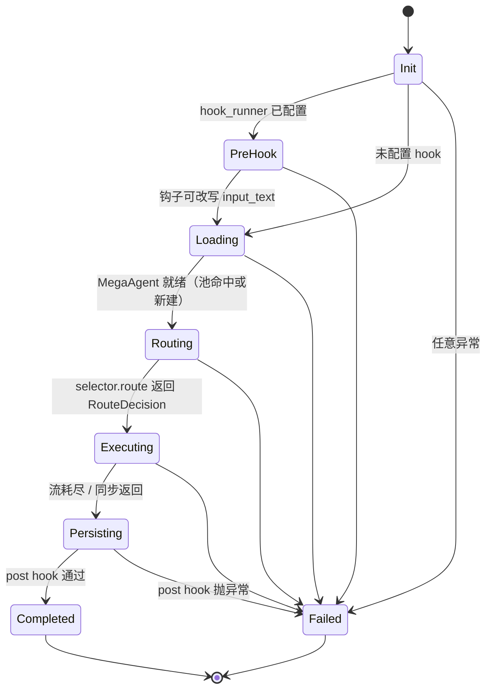
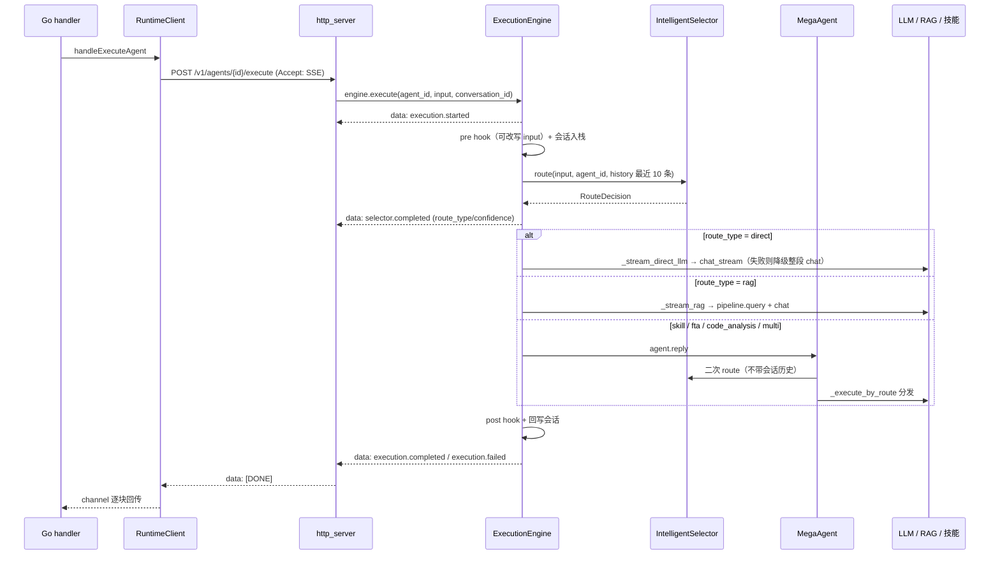

# Agent 执行引擎 (Runtime Engine)

> **一句话理解**：ExecutionEngine 是会话级编排器——统一掌管钩子、会话历史与路由时序，把每个请求变成一串 SSE 事件。

## 职责

`ExecutionEngine` 的自述职责是：创建执行上下文、加载 Agent、调用 IntelligentSelector、按路由分发到 FTA/技能/RAG 子系统，并支持前后置钩子与持久记忆 [runtime/engine.py:21-40](python/src/resolveagent/runtime/engine.py#L21-L40)。它是 Python 智能层的唯一入口：Go 平台层所有执行请求都经过 FastAPI 桥接到它（模块自述「bridges Go platform to Python runtime」[runtime/http_server.py:1](python/src/resolveagent/runtime/http_server.py#L1)）。

引擎在构造时持有五类协作对象 [runtime/engine.py:42-57](python/src/resolveagent/runtime/engine.py#L42-L57)：IntelligentSelector（策略可由 `RESOLVEAGENT_SELECTOR_STRATEGY` 环境变量切换 [runtime/engine.py:50-51](python/src/resolveagent/runtime/engine.py#L50-L51)）、Agent 对象池、会话历史表、registry/memory 客户端与 hook/mcp 适配器。

**职责边界必须澄清**——引擎实际编排的是 selector、MegaAgent、hooks、MCP 四样，而不是文档宣传里的全家桶：

- `memory_client` 只出现在构造与统计里 [runtime/engine.py:55](python/src/resolveagent/runtime/engine.py#L55)、[runtime/engine.py:780](python/src/resolveagent/runtime/engine.py#L780)，执行路径从不使用。
- `planning.py` 与 `toolhub.py` 不在引擎调用链上；规划与工具注册是平级库，等待接线。

> [!NOTE] 推测：memory/planning/toolhub 是「Loop Engineering」蓝图的预留插槽（[configs/runtime.yaml:41-44](configs/runtime.yaml#L41-L44) 声明了 feedback_loop），实现顺序上先做了路由与执行主干。依据：engine.py 全文无这三个模块的 import；runtime.yaml 无代码读取（见 00-overview.md 配置体系）。

## 设计原理

### 执行循环与状态机

引擎没有显式的状态枚举字段——状态就是 `execute()` 协程里 try 块的推进位置，对外表现为 `execution.started → selector.started → selector.completed → execution.completed/failed` 事件序列 [runtime/engine.py:108-258](python/src/resolveagent/runtime/engine.py#L108-L258)。



每次转换的触发条件（全部可锚定）：

- **Init**：`execute()` 进入，生成 execution_id，自动补齐 conversation_id，初始化会话桶 [runtime/engine.py:79-96](python/src/resolveagent/runtime/engine.py#L79-L96)。
- **PreHook**：仅当注入了 hook_runner；钩子可以改写 `input_text` 再进入主流程 [runtime/engine.py:124-135](python/src/resolveagent/runtime/engine.py#L124-L135)。
- **Loading**：`_load_agent` 先查池 [runtime/engine.py:276-278](python/src/resolveagent/runtime/engine.py#L276-L278)，未命中则查 Go Registry [runtime/engine.py:282-293](python/src/resolveagent/runtime/engine.py#L282-L293)，再失败则用默认人设兜底 [runtime/engine.py:307-313](python/src/resolveagent/runtime/engine.py#L307-L313)。
- **Routing**：`selector.route` 携带最近 10 条会话历史 [runtime/engine.py:154-158](python/src/resolveagent/runtime/engine.py#L154-L158)。
- **Executing**：按 `route_type` 分派——`direct` 走流式 LLM [runtime/engine.py:344-347](python/src/resolveagent/runtime/engine.py#L344-L347)，`rag` 走流式 RAG [runtime/engine.py:349-352](python/src/resolveagent/runtime/engine.py#L349-L352)，**其余所有类型**（skill/fta/code_analysis/multi）整段交给 `agent.reply` [runtime/engine.py:354-356](python/src/resolveagent/runtime/engine.py#L354-L356)。
- **Persisting**：拼接 content 回写会话历史（只取 `content`/`content_chunk` 两类块）[runtime/engine.py:176-196](python/src/resolveagent/runtime/engine.py#L176-L196)。
- **Completed**：post hook + `execution.completed` 事件 [runtime/engine.py:199-225](python/src/resolveagent/runtime/engine.py#L199-L225)。
- **Failed**：唯一 catch-all 在整个 try 外围，异常转 `execution.failed` 事件 + 一条「执行失败」内容 [runtime/engine.py:236-265](python/src/resolveagent/runtime/engine.py#L236-L265)。

### 关键决策

**决策 1：错误作为事件传播，而不是异常冒泡。** 引擎捕获一切异常并转成 `execution.failed` 事件再补一条错误内容块 [runtime/engine.py:247-265](python/src/resolveagent/runtime/engine.py#L247-L265)；MegaAgent 同样把异常吞成返回值 [agent/mega.py:105-123](python/src/resolveagent/agent/mega.py#L105-L123)。动因是流式契约：SSE 响应在 [runtime/http_server.py:228-235](python/src/resolveagent/runtime/http_server.py#L228-L235) 已发出 200 + `text/event-stream`，此后 HTTP 状态码不可再变，错误只能内嵌为 `error_code` 事件 [runtime/http_server.py:47-55](python/src/resolveagent/runtime/http_server.py#L47-L55)。Go 侧据此把 Python 错误码翻译为统一错误码 [pkg/server/error_mapping.go:9-31](pkg/server/error_mapping.go#L9-L31)。三处证据交叉：代码结构、异常→错误码映射表的存在 [runtime/http_server.py:28-37](python/src/resolveagent/runtime/http_server.py#L28-L37)、以及错误信息脱敏测试 [python/tests/test_http_server.py:192](python/tests/test_http_server.py#L192)。

**决策 2：引擎先路由，MegaAgent 再路由——半集中式编排及其后果。** 引擎没有把所有子系统直接接进来，而是只对 `direct`/`rag` 两条路亲自执行，其余 route_type 转交 `agent.reply`；而 MegaAgent 自己也持有一个 Selector，会**再路由一次** [agent/mega.py:76-89](python/src/resolveagent/agent/mega.py#L76-L89)。两次路由的上下文不同（引擎传最近 10 条历史 [runtime/engine.py:157](python/src/resolveagent/runtime/engine.py#L157)，MegaAgent 不传任何上下文 [agent/mega.py:86-89](python/src/resolveagent/agent/mega.py#L86-L89)），代码层面没有任何机制保证两次决策结果一致。

> [!NOTE] 推测：双重路由是演进痕迹——引擎的流式路径（direct/rag）后加，MegaAgent 的全路由分发先在，二者未合并。依据：git log 中 3e13e65（2026-09-02）还在调整引擎级 Selector 策略而非删除 MegaAgent 路由；test_engine.py 只断言事件序列与会话，未断言两次路由一致性。

**决策 3：`stream=False` 完全绕过路由。** 同步分支 `_execute_sync` 收下 `decision` 参数却从不使用，直接 `agent.reply` [runtime/engine.py:364-383](python/src/resolveagent/runtime/engine.py#L364-L383)。后果：非流式请求实际由 MegaAgent 的二次路由决定路径，引擎层 Selector 白算一次（还写了缓存）。对比另一种设计——若引擎统一编排所有路径，就不会有「路由结果取决于 stream 参数」这种隐式行为。

**决策 4：流式只覆盖 direct/rag。** FTA、技能、代码分析等重路径都是整段返回 [runtime/engine.py:354-362](python/src/resolveagent/runtime/engine.py#L354-L362)，前端在这些路由下得不到增量渲染。这是引擎级 Selector 与 MegaAgent 分工的现状权衡：先保高频简单路径的体验。

**决策 5：MCP 作为技能执行的旁路模式。** 工作流技能节点支持 `execution_mode: "mcp"`，由 mcp_adapter 代执行并携带 `duration_ms` 元数据 [runtime/engine.py:668-687](python/src/resolveagent/runtime/engine.py#L668-L687)。该分支由 88baebc（2026-05-15，feat: add MCP adapter）引入，与本地 SkillExecutor 分支并存。

**中断与取消**：Go 侧取消会传导到 SSE 消费层——`ctx.Done()` 时 RuntimeClient 停止读流 [pkg/server/runtime_client.go:142-143](pkg/server/runtime_client.go#L142-L143)，handler 写一条超时事件后返回 [pkg/server/agent_handlers.go:253-256](pkg/server/agent_handlers.go#L253-L256)。但引擎没有任何取消入口：`execute()` 无 cancel 参数，也无 `CancelledError` 处理。

> [!NOTE] 推测：客户端断开后 Python 侧会继续把执行跑完（uvicorn 断连才终止生成器），长 FTA 任务会白烧 LLM tokens。依据：engine.py 全文无取消传播代码；Go 的 ctx 取消只影响读端。

## 依赖

```text
runtime/http_server.py ─▶ runtime/engine.py ─▶ selector/selector.py（IntelligentSelector + RouteDecision）
        │                        │
        │                        ├─▶ agent/mega.py（兜底全路由执行）
        │                        ├─▶ llm/higress_provider.py（direct/rag 的 LLM 调用）
        │                        ├─▶ rag/pipeline.py（检索）
        │                        ├─▶ skills/executor.py + loader.py（技能）
        │                        ├─▶ mcp/adapter（execution_mode=mcp 时）
        │                        └─▶ fta/workflow.py（工作流骨架）
        └─▶ store/skill_client.py（lifespan 连 Go 平台层，失败不致命）
```

- 引擎级 Selector 与 RouteDecision 直接 import 自 selector 包 [runtime/engine.py:11-13](python/src/resolveagent/runtime/engine.py#L11-L13)。
- LLM Provider 在函数体内延迟 import，模型一律落到 provider 的 `default_model`，并留有注释解释原因（避免把不支持的模型名发给网关）[runtime/engine.py:403-408](python/src/resolveagent/runtime/engine.py#L403-L408)。
- Python → Go 反向依赖只有两条：RegistryClient 查 SSOT [runtime/registry_client.py:117-120](python/src/resolveagent/runtime/registry_client.py#L117-L120)，SkillStoreClient 在应用启动时连接、失败仅告警 [runtime/http_server.py:146-152](python/src/resolveagent/runtime/http_server.py#L146-L152)。

## 暴露接口

引擎对内提供六个能力（供 http_server 与测试消费）：

| 能力 | 位置 | 说明 |
|------|------|------|
| `execute()` | [runtime/engine.py:59-265](python/src/resolveagent/runtime/engine.py#L59-L265) | 主入口，async 生成器产出事件/内容块 |
| `execute_workflow()` | [runtime/engine.py:566-768](python/src/resolveagent/runtime/engine.py#L566-L768) | 工作流执行（占位实现，见已知坑） |
| `get_conversation_history()` | [runtime/engine.py:541-550](python/src/resolveagent/runtime/engine.py#L541-L550) | 会话历史只读视图 |
| `clear_conversation()` | [runtime/engine.py:552-564](python/src/resolveagent/runtime/engine.py#L552-L564) | 清会话，存在性语义有测试锁定 [python/tests/test_engine.py:82-92](python/tests/test_engine.py#L82-L92) |
| `get_stats()` | [runtime/engine.py:770-783](python/src/resolveagent/runtime/engine.py#L770-L783) | 执行计数/池大小/组件开关 |
| HTTP 端点 | `/v1/agents/{id}/execute`（SSE）[runtime/http_server.py:204-235](python/src/resolveagent/runtime/http_server.py#L204-L235)、`/v1/workflows/{id}/execute` [runtime/http_server.py:303-336](python/src/resolveagent/runtime/http_server.py#L303-L336) | Go 平台层是唯一调用方 |

## 数据流

一次执行的完整时序：



Go 侧的对应处理：`handleExecuteAgent` 按 `stream` 或 Accept 头分流 [pkg/server/agent_handlers.go:137-148](pkg/server/agent_handlers.go#L137-L148)；非流式模式聚合全部 content 块后一次返回 [pkg/server/agent_handlers.go:150-196](pkg/server/agent_handlers.go#L150-L196)；流式模式把 `execution.completed` 之外的错误也原样透传，最后补 `[DONE]` [pkg/server/agent_handlers.go:198-266](pkg/server/agent_handlers.go#L198-L266)。

## 排查指南

先抓日志关键字再对号入座（Python 侧日志在 `logs/runtime.log`）：

- **症状**：流内容出现「执行失败: ...」→ **定位**：引擎 catch-all 产生 [runtime/engine.py:261-265](python/src/resolveagent/runtime/engine.py#L261-L265)，或 MegaAgent 同款兜底 [agent/mega.py:114-123](python/src/resolveagent/agent/mega.py#L114-L123) → **修复**：取 `execution.failed` 事件里的 `data.error` [runtime/engine.py:247-258](python/src/resolveagent/runtime/engine.py#L247-L258) 看真实异常；日志搜 `Execution failed`。
- **症状**：响应从逐字流式突然变成一整段 → **定位**：流式请求异常后降级为同步 chat，日志 `Streaming failed, falling back to sync` [runtime/engine.py:441-454](python/src/resolveagent/runtime/engine.py#L441-L454) → **修复**：检查 Higress/LLM 流式接口可用性与 `HIGRESS_GATEWAY_URL` 连通性；此降级是有意设计，不是 bug。
- **症状**：Agent 总用默认人设（qwen-plus + 中文通用 prompt）→ **定位**：Registry 查询失败被 warning 吞掉后走兜底配置 [runtime/engine.py:294-295](python/src/resolveagent/runtime/engine.py#L294-L295)、[runtime/engine.py:307-313](python/src/resolveagent/runtime/engine.py#L307-L313) → **修复**：确认 Go 平台可达、`agent_id` 在 Registry 存在，且 `config` 里有 `model_id/system_prompt`。
- **症状**：工作流技能节点报 `Skill 'X' not found` → **定位**：引擎先 `SkillLoader.get` 再判空 [runtime/engine.py:696-701](python/src/resolveagent/runtime/engine.py#L696-L701)。git 佐证：9537090（2026-05-15）之前直接把 `skill_name` 当参数传给 `executor.execute`，签名不匹配会直接 TypeError 崩溃，修复后才有了这条友好降级 → **修复**：检查 skills 目录与技能名大小写。
- **症状**：`/v1/selector/route` 返回 `degraded: true` → **定位**：LLM/混合策略异常时自动降级到 RuleStrategy，`fallback_reason` 带截断的原因 [runtime/http_server.py:274-285](python/src/resolveagent/runtime/http_server.py#L274-L285)；测试保证降级时仍返回有效决策 [python/tests/test_http_server.py:293-303](python/tests/test_http_server.py#L293-L303) → **修复**：按 `fallback_reason` 修 LLM 策略，或临时固定 `strategy=rule`。
- **症状**：`/v1/solutions/semantic-search` 恒 500 → **定位**：该端点把 `filters` 透传给 `RAGPipeline.query` [runtime/http_server.py:565-570](python/src/resolveagent/runtime/http_server.py#L565-L570)，而 query 签名没有 filters 参数 [rag/pipeline.py:193-198](python/src/resolveagent/rag/pipeline.py#L193-L198)；同型 bug 已在 `/v1/rag/query` 修过（commit 2253462 删除 `filters=filters` 并留下注释警告 [runtime/http_server.py:347-349](python/src/resolveagent/runtime/http_server.py#L347-L349)）→ **修复**：给 semantic-search 做同样的参数剥离。

## 已知坑

1. **双重路由不一致**（决策 2）：引擎与 MegaAgent 各路由一次，上下文不同。代码没有任何机制保证两次决策一致；当两次决策不同时，实际按 MegaAgent 的决策执行，引擎发的 `selector.completed` 事件却展示引擎的决策——前端展示与实际执行路径脱节。
2. **`stream=false` 绕过路由**（决策 3）：[runtime/engine.py:383](python/src/resolveagent/runtime/engine.py#L383) 忽略 decision；依赖路由参数（如 RAG 的 collection）的逻辑在非流式模式下失效。
3. **`execute_workflow` 是占位实现**：代码注释自述「placeholder - use registry_client in production」，工作流定义被硬编码成 start→agent→end 三节点，注册表里的真实定义被无视 [runtime/engine.py:607-637](python/src/resolveagent/runtime/engine.py#L607-L637)。对照 MegaAgent 的 workflow 路径会查 Registry [agent/mega.py:348-358](python/src/resolveagent/agent/mega.py#L348-L358)，两条工作流执行路径行为分裂。
4. **内存只增不减**：会话表 `_conversations` [runtime/engine.py:52](python/src/resolveagent/runtime/engine.py#L52)、Agent 池 `_agent_pool` [runtime/engine.py:315](python/src/resolveagent/runtime/engine.py#L315) 均无淘汰；而 lifecycle.py 里带 LRU 淘汰的 `AgentPool`（max_size=100，驱逐时调 cleanup）[runtime/lifecycle.py:12-55](python/src/resolveagent/runtime/lifecycle.py#L12-L55) 已实现却没被引擎使用——http_server 只用它打生命周期日志 [runtime/http_server.py:131](python/src/resolveagent/runtime/http_server.py#L131)。长驻进程会随会话数缓慢膨胀。

> [!NOTE] 推测：会话只存本进程内存，多副本部署时 conversation_id 命不中同一实例，多轮对话断裂。依据：engine.py 的 `_conversations` 为进程内 dict，无外部存储读写；`memory_client` 注入但未使用（[runtime/engine.py:55](python/src/resolveagent/runtime/engine.py#L55)）。

5. **RAG 结果字段名漂移**：Milvus/Qdrant 索引层返回 `text` 字段 [rag/index/milvus.py:327](python/src/resolveagent/rag/index/milvus.py#L327)，而 HTTP 端点读 `content` [runtime/http_server.py:577-580](python/src/resolveagent/runtime/http_server.py#L577-L580)、引擎读 `source` [runtime/engine.py:537](python/src/resolveagent/runtime/engine.py#L537)；重排器不得不写兼容代码 `chunk.get("content", chunk.get("text", ""))` [rag/retrieve/reranker.py:153](python/src/resolveagent/rag/retrieve/reranker.py#L153)。

> [!NOTE] 推测：语义搜索的 snippet 与 direct/rag 路由的 sources 元数据可能恒为空串（键不匹配读不到值）。依据：上面三处键名不一致是事实，但 reranker 输出键未逐一路径验证，未标记为必然 bug。

6. **测试盲区**：test_engine.py 只覆盖事件序列、会话与统计 [python/tests/test_engine.py:20-102](python/tests/test_engine.py#L20-L102)，未覆盖路由正确性、取消传播与钩子改写 input 的语义——改动引擎时这些区域没有回归网。

*Last updated: 2026-09-05*
