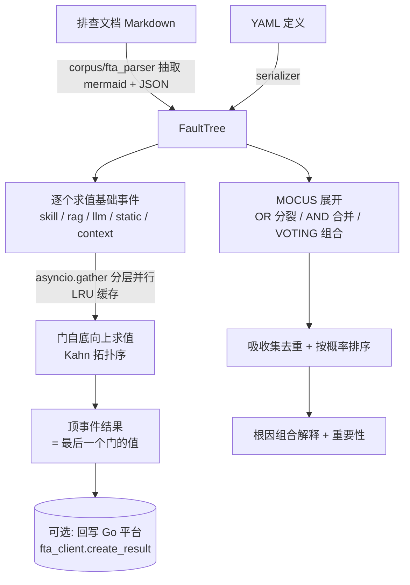

# FTA 故障树分析引擎 (FTA Engine)

> **一句话理解**：把运维排查知识建模成布尔故障树，自底向上求值、用最小割集定位最可能的根因组合。

## 职责

FTA 模块负责三件事：故障树的表示与求值（`tree.py`、`engine.py`）、叶子事件的真值判定（`evaluator.py`）、以及用于根因解释的最小割集计算（`cut_sets.py`）。它被两条链路消费：Selector 路由到 FTA 工作流时由 MegaAgent 执行 [mega.py:332-335](python/src/resolveagent/agent/mega.py#L332-L335)，Dify 集成则直接调用并行评估器 [tools.py:49](python/src/resolveagent/integrations/dify/tools.py#L49)。

树本身不是从运行数据自动推导的，而是**从排查文档里解析出来的**：`corpus/fta_parser.py` 从 Markdown 中抽取 mermaid 块构建树、从 JSON 块补充基础事件 [fta_parser.py:76-86](python/src/resolveagent/corpus/fta_parser.py#L76-L86)，也支持 YAML 直接定义 [serializer.py:12-26](python/src/resolveagent/fta/serializer.py#L12-L26)。也就是说，工程师先写故障排查手册，FTA 引擎把手册"可执行化"。

## 设计原理

### 门类型：代码里是 5 种，文档说 6 种

枚举定义了 5 种门：AND、OR、VOTING、INHIBIT、PRIORITY_AND [tree.py:23-27](python/src/resolveagent/fta/tree.py#L23-L27)。但 README 宣称"六种门类型"并包含 NOT [README.md:362-365](README.md#L362-L365)，前端页面同样按 `monte_carlo()` 的口径宣传 [index.tsx:35](web/src/pages/FTAEngine/index.tsx#L35)。代码里没有 NOT 门，也没有 `_monte_carlo_simulation`——这是文档与实现的真实漂移，使用时不要按 README 写代码。

更关键的一点：INHIBIT 和 PRIORITY_AND 的求值实现与 AND 完全相同——都是 `all(input_values)` [tree.py:72-77](python/src/resolveagent/fta/tree.py#L72-L77)。它们的"语义差异"只存在于建模约定里：INHIBIT 的条件事件被当作一个额外输入挂进 `input_ids`，PRIORITY_AND 的顺序依赖则根本没有实现。测试断言也只覆盖三种门的布尔结果（空输入返回 False、VOTING 按 k-of-n 计数）[test_fta_engine.py:7-24](python/tests/unit/test_fta_engine.py#L7-L24)，没有测试约束顺序语义。若业务真正依赖"必须先 A 后 B"，当前实现保证不了。

空输入一律返回 False [tree.py:63-64](python/src/resolveagent/fta/tree.py#L63-L64)，对应测试 `and_gate([]) is False` [test_fta_engine.py:11](python/tests/unit/test_fta_engine.py#L11)。这是保守取向：输入缺失时不触发任何告警分支。

### 求值顺序与"顶事件是最后一个门"的隐患

门按 Kahn 拓扑排序自底向上求值 [tree.py:103-137](python/src/resolveagent/fta/tree.py#L103-L137)。环检测失败时回退为"反转原始列表" [tree.py:132-134](python/src/resolveagent/fta/tree.py#L132-L134)。而引擎把"最后一个求值的门"当作顶事件结果 [engine.py:92](python/src/resolveagent/fta/engine.py#L92)（注释原文即 `# Last gate is the top event`）。拓扑序正常时最后一个门确实是顶事件门，但一旦回退到反转序，这个隐式约定就可能把中间门的值当成顶事件结果。这是结构性脆弱点，不是防御性代码。

### 最小割集（MOCUS）的复杂度取舍

`cut_sets.py` 实现了 MOCUS 算法 [cut_sets.py:1-5](python/src/resolveagent/fta/cut_sets.py#L1-L5)：从顶事件出发，OR 门按输入分裂出多个割集 [cut_sets.py:145-152](python/src/resolveagent/fta/cut_sets.py#L145-L152)，AND 门合并全部输入 [cut_sets.py:154-158](python/src/resolveagent/fta/cut_sets.py#L154-L158)，VOTING 门用 `itertools.combinations` 枚举 k-组合 [cut_sets.py:160-170](python/src/resolveagent/fta/cut_sets.py#L160-L170)。割集数量随树深指数增长，因此有两道限制：

- 展开迭代上限 `max_iterations = 100` 防死循环与爆炸，触顶时记 warning 继续返回不完整结果 [cut_sets.py:86](python/src/resolveagent/fta/cut_sets.py#L86)；
- 吸收集去重先按"尺寸升序 + 字典序"排序，再做子集包含检查 [cut_sets.py:203-215](python/src/resolveagent/fta/cut_sets.py#L203-L215)，这是 O(n²·k) 的朴素实现，靠排序减少比较次数，而非用更复杂的位集算法。

INHIBIT/PRIORITY_AND 在割集计算里同样按 AND 处理 [cut_sets.py:172-175](python/src/resolveagent/fta/cut_sets.py#L172-L175)；未知门类型按 OR 展开 [cut_sets.py:177-184](python/src/resolveagent/fta/cut_sets.py#L177-L184)——错误配置不会报错，只会静默产出偏多的割集。

### 概率：只有割集乘积近似，没有蒙特卡洛

割集概率按独立假设做乘积 `P = ∏ P(e)`，缺省概率 0.5 [cut_sets.py:279-284](python/src/resolveagent/fta/cut_sets.py#L279-L284)，再按概率降序排列给出根因重要性 [cut_sets.py:304-310](python/src/resolveagent/fta/cut_sets.py#L304-L310)。

> [!NOTE] 推测：蒙特卡洛仿真只存在于文档与前端宣传中（[README.md:368](README.md#L368)、[architecture.md:417](docs/zh/architecture.md#L417)），`fta/` 目录与全仓源码 grep `monte` 均无实现。依据：`git log -S monte_carlo -- python` 无命中；样本量/收敛条件常量因此不存在于代码中。当前代码用割集概率乘积替代了这一能力。

### 叶子事件的评估协议与 fail-open/fail-safe 不对称

基础事件通过 `evaluator` 字符串声明求值方式：`skill:` / `rag:` / `llm:` / `static:` / `context:` 五种前缀 [evaluator.py:86-95](python/src/resolveagent/fta/evaluator.py#L86-L95)。LLM 分类用 temperature=0 + 强制 "true"/"false" 输出 [evaluator.py:281-291](python/src/resolveagent/fta/evaluator.py#L281-L291)；RAG 评估按相似度阈值 0.7 判定 [evaluator.py:199](python/src/resolveagent/fta/evaluator.py#L199)。

注意默认值方向不一致的坑：**执行异常返回 False（视为未发生）** [evaluator.py:104-110](python/src/resolveagent/fta/evaluator.py#L104-L110)，但**依赖缺失（无 skill executor / 无 LLM / 无 RAG）返回 True（视为已发生）** [evaluator.py:124-128](python/src/resolveagent/fta/evaluator.py#L124-L128)。前者是 fail-safe 防误报，后者实际是 fail-open——基础设施缺位时整棵 OR 树会被直接打穿为"顶事件发生"。事件结果带 `hash(str(context))` 缓存 [evaluator.py:62-68](python/src/resolveagent/fta/evaluator.py#L62-L68)，同一上下文内不会重复付费调用 skill/LLM。

### 并行评估器：分层 gather + LRU + "剪枝"

`ParallelFTAEvaluator` 按拓扑分层，同层基础事件与门用 `asyncio.gather` 并行 [parallel_evaluator.py:260-266](python/src/resolveagent/fta/parallel_evaluator.py#L260-L266)，中间结果进容量 256 的 LRU [parallel_evaluator.py:88-101](python/src/resolveagent/fta/parallel_evaluator.py#L88-L101)。门结果缓存键由各输入当前布尔值拼接而成 [parallel_evaluator.py:313](python/src/resolveagent/fta/parallel_evaluator.py#L313)。

`prune_threshold` 名义上是"跳过低概率子树"（docstring [parallel_evaluator.py:80](python/src/resolveagent/fta/parallel_evaluator.py#L80)），实现却只对 OR 门做 `true_count > 0` 短路 [parallel_evaluator.py:337-342](python/src/resolveagent/fta/parallel_evaluator.py#L337-L342)——这与 `any()` 结果等价，只省一次函数调用，且默认 0.0 即关闭。宣称的概率剪枝并未实现。

## 关键决策

- **文档即树的来源**：树从排查手册的 mermaid 图解析而来而非运行时数据推导 [fta_parser.py:76-78](python/src/resolveagent/corpus/fta_parser.py#L76-L78)。好处是领域专家可以用最熟悉的格式维护树；代价是文档格式错误只会得到空树 [test_fta_parser.py:128-132](python/tests/unit/test_fta_parser.py#L128-L132)。
- **失败兜底不阻断主流程**：FTA 结果回写 Go 平台失败只记 warning [engine.py:118-119](python/src/resolveagent/fta/engine.py#L118-L119)，评估本身已经产出结论，持久化是尽力而为。
- **workflow.py 独立于执行链**：`fta/workflow.py` 定义了带校验的 DAG 工作流结构（单起点、不可达节点检查 [workflow.py:58-82](python/src/resolveagent/fta/workflow.py#L58-L82)），但 `FTAEngine.execute` 接收的是 `FaultTree`，当前仓库内没有代码 import 这个 Workflow 类型。它是为"FTA 内部多步骤编排"预留的结构，尚未接入。
- **反馈闭环预留**：`feedback_loop.py` 收集 FTA 工作流执行指标、对比基线、生成指向 selector/RAG 的改进建议 [feedback_loop.py:1-8](python/src/resolveagent/fta/feedback_loop.py#L1-L8)，并自述为 Go 侧 `feedback.Collector` 的 Python 对应物 [feedback_loop.py:73-75](python/src/resolveagent/fta/feedback_loop.py#L73-L75)。

## 依赖

- 上游：`corpus/fta_parser.py`（树构建）、`skills.executor` / `llm.base` / RAG pipeline（叶子求值，均为可选注入 [evaluator.py:31-46](python/src/resolveagent/fta/evaluator.py#L31-L46)）。
- 下游：`agent/mega.py`（FTA 路由执行）、`integrations/dify/tools.py`（对外暴露）、Go 平台 FTA 结果存储（可选）。
- 无 fta 内部反向依赖：`workflow.py`、`regression_validator.py`、`feedback_loop.py` 均不被 `engine.py` 引用，属平行的支撑件。

## 暴露接口

- `FTAEngine.execute(tree, context, document_id)`：流式产出 `workflow.*` / `node.*` / `gate.*` 事件 [engine.py:34-58](python/src/resolveagent/fta/engine.py#L34-L58)。
- `ParallelFTAEvaluator.evaluate_tree(tree, context)`：一次性返回顶事件布尔值 [parallel_evaluator.py:104-120](python/src/resolveagent/fta/parallel_evaluator.py#L104-L120)。
- `compute_minimal_cut_sets(tree)`：返回最小割集列表 [cut_sets.py:17-35](python/src/resolveagent/fta/cut_sets.py#L17-L35)；配套 `rank_cut_sets_by_importance` 输出根因优先级。
- `FTAMarkdownParser.parse(content, file_id)`：Markdown → FaultTree + 基础事件 [fta_parser.py:63-90](python/src/resolveagent/corpus/fta_parser.py#L63-L90)。
- `load_tree_from_yaml / dump_tree_to_yaml`：树的序列化往返 [serializer.py:12-26](python/src/resolveagent/fta/serializer.py#L12-L26)。

## 排查指南

**症状 1：日志出现 `Max iterations reached in cut set expansion`，割集结果不完整。**
→ 定位：展开循环触顶，`max_iterations = 100` [cut_sets.py:116-120](python/src/resolveagent/fta/cut_sets.py#L116-L120)。通常是树层级过深或 OR 门嵌套过多导致割集指数膨胀。
→ 修复：拆分故障树（多个子树分别求割集），或减少 OR 门嵌套层数；不要直接调大迭代上限，先看日志里 `cut_set_sizes` 是否已经爆量。

**症状 2：日志出现 `Unknown gate type: %s`，且最小割集数量明显偏多。**
→ 定位：YAML/文档里的门类型拼写不在枚举内，割集展开按 OR 处理 [cut_sets.py:177-184](python/src/resolveagent/fta/cut_sets.py#L177-L184)。合法值只有 `and/or/voting/inhibit/priority_and` [tree.py:23-27](python/src/resolveagent/fta/tree.py#L23-L27)。
→ 修复：修正门的 `type` 字段；VOTING 记得同时给 `k_value`（缺省 1 等价于 OR）。

**症状 3：顶事件结果恒为"发生"（True），但实际业务并无故障。**
→ 定位：先查基础事件是否有 `evaluator` 字段——缺省会返回 True [evaluator.py:71-76](python/src/resolveagent/fta/evaluator.py#L71-L76)；再查是否走了"依赖缺失返回 True"分支（`Skill executor not available` / `LLM provider not available` / `RAG pipeline not available` [evaluator.py:124-128](python/src/resolveagent/fta/evaluator.py#L124-L128)）。构造 FTAEngine 时没注入对应 executor 是最常见原因。
→ 修复：为每个基础事件补 `evaluator`；确认调用方注入了 skill_executor / llm_provider / rag_pipeline；对确定性事件改用 `static:true/false`。

**症状 4：日志出现 `Failed to persist FTA result`。**
→ 定位：Go 平台 FTA 客户端写入失败，被 catch 后仅 warning [engine.py:118-119](python/src/resolveagent/fta/engine.py#L118-L119)。分析结论已产出，但控制台/前端看不到历史结果。
→ 修复：检查 Go 平台连通性与 `document_id` 是否传入（未传则跳过持久化 [engine.py:104](python/src/resolveagent/fta/engine.py#L104)）。

## 已知坑

- README 与前端宣称的"六种门 + NOT + 蒙特卡洛"在代码中不存在 [README.md:362-368](README.md#L362-L368)；以本文与源码为准。
- 顶事件结果 = "最后一个求值的门"是隐式约定 [engine.py:92](python/src/resolveagent/fta/engine.py#L92)，树有环时拓扑序回退可能让中间门冒充顶事件 [tree.py:132-134](python/src/resolveagent/fta/tree.py#L132-L134)。

  > [!NOTE] 推测：环回退会让中间门冒充顶事件。依据：回退行为与"取最后求值门"均为代码可见事实，但该组合的实际触发路径无测试或故障记录佐证。
- 依赖缺失（fail-open True）与执行异常（fail-safe False）默认方向相反 [evaluator.py:76](python/src/resolveagent/fta/evaluator.py#L76)，同一棵树在不同部署形态下结论可能翻转。
- `prune_threshold` 的"概率剪枝"宣传与实现（OR 短路空操作）不符 [parallel_evaluator.py:337-342](python/src/resolveagent/fta/parallel_evaluator.py#L337-L342)。

*Last updated: 2026-09-05*
