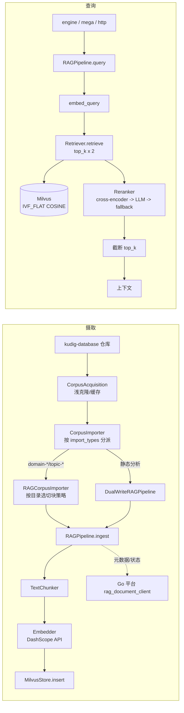

# RAG 语料与检索 (RAG Corpus & Retrieval)

> **一句话理解**：语料仓库进 Milvus，查询过嵌入、双倍召回、三级重排，吐 top-k 上下文。

## 职责

两个目录分工明确：

- `rag/` 是通用管线：解析、切块、嵌入、索引、检索、重排。核心类 `RAGPipeline` 串联四步，注释直接写明「Parse -> Chunk -> Embed -> Index」[pipeline.py:53](python/src/resolveagent/rag/pipeline.py#L53)。
- `corpus/` 是搬运层：从外部语料仓库获取数据，按类型分派到四个导入器（rag / fta / skills / code_analysis），编排成一条带 SSE 进度事件的导入流 [importer.py:74](python/src/resolveagent/corpus/importer.py#L74)。

多集合是既成事实，不是规划：语料导入默认拆到 `kudig-rag` / `kudig-fta` / `kudig-skills` 三个集合 [importer.py:138-140](python/src/resolveagent/corpus/importer.py#L138-L140)，静态分析另有 `code-analysis` 集合 [dual_writer.py:18](python/src/resolveagent/rag/dual_writer.py#L18)，种子脚本还要覆盖 45 个集合 87 篇文档 [seed_vectorizer.py:3](python/src/resolveagent/corpus/seed_vectorizer.py#L3)。

## 设计原理

### 摄取链路：元数据与向量分开登记

每篇文档先向 Go 平台登记元数据（标题、内容哈希、状态 processing）[pipeline.py:86-98](python/src/resolveagent/rag/pipeline.py#L86-L98)，再切块、嵌入、写 Milvus，最后把状态改回 indexed [pipeline.py:116-121](python/src/resolveagent/rag/pipeline.py#L116-L121)。两个登记动作失败都只打 warning，不阻断向量写入 [pipeline.py:100](python/src/resolveagent/rag/pipeline.py#L100)。单篇失败进 errors 列表继续处理下一篇 [pipeline.py:123-126](python/src/resolveagent/rag/pipeline.py#L123-L126)。

> [!NOTE] 推测：元数据先行的动机是让 Go 平台能展示摄取进度与历史，即使向量写入中途失败也有痕迹可查。依据：`RAGPipeline` 构造参数注释「document metadata and ingestion history are persisted to the Go platform store」[pipeline.py:27-29](python/src/resolveagent/rag/pipeline.py#L27-L29)，但 git log 提交信息多为 update，无直接讨论。

### 切块策略：按语料目录选，不全局一刀切

默认策略表按目录前缀匹配 [config.py:15-21](python/src/resolveagent/corpus/config.py#L15-L21)：

| 目录 | 策略 | chunk_size |
|------|------|-----------|
| `domain-*` | by_h2 | 2000 |
| `topic-fta/list` | by_h3 | 1500 |
| `topic-skills` | by_section | 3000 |
| `topic-cheat-sheet` | sentence | 50000 |
| `topic-dictionary` | sentence | 500 |

选择依据：语料是结构化 Markdown，标题边界能保住语义单元。测试钉死了行为契约——by_h2 不得切在 h3 上 [test_chunker_headings.py:34-57](python/tests/unit/test_chunker_headings.py#L34-L57)，超长章节回退按行截断 [chunker.py:125-130](python/src/resolveagent/rag/ingest/chunker.py#L125-L130)（测试允许留余量 [test_chunker_headings.py:148-157](python/tests/unit/test_chunker_headings.py#L148-L157)）。管线自身默认 `sentence/512/50` [pipeline.py:39](python/src/resolveagent/rag/pipeline.py#L39)，语料导入时按上表覆盖。

### 嵌入模型：DashScope 兼容 API + 本地维度表

模型名来自 `EMBEDDING_MODEL` 环境变量，默认 `text-embedding-v2` [pipeline.py:37](python/src/resolveagent/rag/pipeline.py#L37)、[embedder.py:46](python/src/resolveagent/rag/ingest/embedder.py#L46)；请求走 DashScope 兼容端点 [embedder.py:48](python/src/resolveagent/rag/ingest/embedder.py#L48)。维度查本地表 `MODEL_DIMENSIONS`，查不到按 1024 兜底 [embedder.py:25-30](python/src/resolveagent/rag/ingest/embedder.py#L25-L30)、[embedder.py:49](python/src/resolveagent/rag/ingest/embedder.py#L49)。没有 API key 时不报错，返回零向量 [embedder.py:66-68](python/src/resolveagent/rag/ingest/embedder.py#L66-L68)——设计意图是空环境可运行，代价见「已知坑」第 1 条。

### 向量库：Milvus 默认，Qdrant 备胎

后端由构造参数决定，默认 milvus [pipeline.py:34](python/src/resolveagent/rag/pipeline.py#L34)；`VectorStore` 抽象约束了全部后端的八个操作 [index/base.py:16-143](python/src/resolveagent/rag/index/base.py#L16-L143)，Qdrant 是第二个实现 [retriever.py:9-10](python/src/resolveagent/rag/retrieve/retriever.py#L9-L10)。Milvus 地址默认 `localhost:19530`，可被 `MILVUS_HOST` / `MILVUS_PORT` 覆盖 [milvus.py:60-61](python/src/resolveagent/rag/index/milvus.py#L60-L61)；Retriever 侧同样支持 env，Qdrant 默认端口 6333 [retriever.py:38-41](python/src/resolveagent/rag/retrieve/retriever.py#L38-L41)。

> [!NOTE] 推测：上文两处 env 覆盖（milvus 侧与 retriever 侧）是用户工作区里尚未提交的修改（`git diff` 可见），意图是让容器部署不必改代码即可指向远程 Milvus。依据：HEAD 版本硬编码 localhost，工作区版本加了 env 读取；无对应提交记录。

集合名必须净化：Go 平台生成的集合 ID 形如 `UnixNano-四位随机数` [rag_handlers.go:313](pkg/server/rag_handlers.go#L313)，数字开头带连字符，均不满足 Milvus 命名规则，于是有 `_sanitize_collection_name` 把非法字符替换为下划线、数字开头补 `c_` 前缀 [milvus.py:15-27](python/src/resolveagent/rag/index/milvus.py#L15-L27)。docstring 里直接引用了真实出错的 ID 样例 [milvus.py:21-22](python/src/resolveagent/rag/index/milvus.py#L21-L22)。映射是确定性的，保证 ingest 与 query 解析到同一个名字。向量索引用 IVF_FLAT，nlist 固定 128 [milvus.py:152-154](python/src/resolveagent/rag/index/milvus.py#L152-L154)。

## 检索链路

查询五步：嵌入查询词 → 取 `top_k * 2` 候选（注释写明「Retrieve more for reranking」[pipeline.py:228](python/src/resolveagent/rag/pipeline.py#L228)）→ 重排 → 截断 `[:top_k]` [reranker.py:134](python/src/resolveagent/rag/retrieve/reranker.py#L134) → 返回。

常量位置：

- top-k 默认 5：管线签名 [pipeline.py:197](python/src/resolveagent/rag/pipeline.py#L197)；runtime 侧读路由参数，缺省同为 5 [engine.py:478](python/src/resolveagent/runtime/engine.py#L478)；Go 平台侧默认 5、上限 100 [rag_handlers.go:265-268](pkg/server/rag_handlers.go#L265-L268)。
- 召回倍数 2：[pipeline.py:228](python/src/resolveagent/rag/pipeline.py#L228)。
- 重排混合权重：cross-encoder 路线 `0.3 * 原分 + 0.7 * 重排分` [reranker.py:167](python/src/resolveagent/rag/retrieve/reranker.py#L167)。

重排是三级降级链：本地 cross-encoder（默认 `bge-reranker-large` [reranker.py:42](python/src/resolveagent/rag/retrieve/reranker.py#L42)，模型名映射到 HuggingFace [reranker.py:66-70](python/src/resolveagent/rag/retrieve/reranker.py#L66-L70)）→ LLM 打分（提示词让模型只回 0-10 [reranker.py:213-219](python/src/resolveagent/rag/retrieve/reranker.py#L213-L219)）→ 词频 + Jaccard 兜底 [reranker.py:286-303](python/src/resolveagent/rag/retrieve/reranker.py#L286-L303)。选哪级看可用性：sentence-transformers 是可选依赖，装不上就跳过 [reranker.py:16-22](python/src/resolveagent/rag/retrieve/reranker.py#L16-L22)；cross-encoder 加载失败降 LLM，LLM 缺席走兜底 [reranker.py:126-131](python/src/resolveagent/rag/retrieve/reranker.py#L126-L131)。

没有分数阈值：全链路不存在 score cutoff，重排后直接截断。召回不足与检索故障在返回值上也无法区分——查询异常被吞掉、返回空列表 [pipeline.py:253-255](python/src/resolveagent/rag/pipeline.py#L253-L255)。

> [!NOTE] 推测：top_k=5 与倍数 2 是常规经验值，未做调参记录。依据：三处默认值一致但代码、注释、git log 均无选值依据；倍数 2 只有意图注释，无实验数据。

MMR 多样性重排已实现（`rerank_with_diversity`，惩罚与已选集合的 Jaccard 相似度 [reranker.py:353-392](python/src/resolveagent/rag/retrieve/reranker.py#L353-L392)）但主管线 `query` 未接入，只调 `rerank` [pipeline.py:236-240](python/src/resolveagent/rag/pipeline.py#L236-L240)。

## 关键决策

1. **管线内嵌进程，而非独立检索服务**。Go 平台的摄取/查询接口经 `runtimeClient` 转发给 Python runtime [rag_handlers.go:219](pkg/server/rag_handlers.go#L219)，集合删除则只有注册表操作、留了 gRPC 接入的 TODO（注明 v0.4.0 计划）[rag_handlers.go:156](pkg/server/rag_handlers.go#L156)——半桥接状态是刻意的过渡。
2. **ingest 短连接，retrieve 长连接**。摄取每篇文档新建 MilvusStore、连接、写完即断 [pipeline.py:156-160](python/src/resolveagent/rag/pipeline.py#L156-L160)、[pipeline.py:190-191](python/src/resolveagent/rag/pipeline.py#L190-L191)；检索侧则缓存连接复用 [retriever.py:44-56](python/src/resolveagent/rag/retrieve/retriever.py#L44-L56)。

   > [!NOTE] 推测：摄取用短连接是为规避批导入中的连接泄漏，代价是大规模导入时每文档一次握手。依据：代码结构对比明显，无注释或提交说明动机。
3. **重排可全程降级**。三级链保证零外部依赖也能出排序结果 [reranker.py:126-131](python/src/resolveagent/rag/retrieve/reranker.py#L126-L131)，换取的是兜底档的排序质量只有词频水平 [reranker.py:299-303](python/src/resolveagent/rag/retrieve/reranker.py#L299-L303)。
4. **双写沉淀**。静态分析成果主写 `code-analysis`，尽力次写 `kudig-rag`，让通用 RAG 问答也能命中代码分析结论；次写失败仅告警不回滚 [dual_writer.py:69-88](python/src/resolveagent/rag/dual_writer.py#L69-L88)。
5. **导入可断点续传**。独立 HTTP 导入脚本按 20 篇一批提交 [kudig_rag_import.py:26](python/src/resolveagent/corpus/kudig_rag_import.py#L26)，状态落盘 `~/.resolveagent/kudig-rag-import-state.json` [kudig_rag_import.py:27](python/src/resolveagent/corpus/kudig_rag_import.py#L27)，中断时先存状态再退出 [kudig_rag_import.py:331](python/src/resolveagent/corpus/kudig_rag_import.py#L331)——因为语料仓库按 domain-* 有上千文件，重跑代价高。

## 依赖

被谁依赖（接口级）：

- runtime 编排：`ExecutionEngine._stream_rag` 直接实例化管线，从路由参数取 collection 与 top_k [engine.py:472-478](python/src/resolveagent/runtime/engine.py#L472-L478)。
- MegaAgent：`_execute_rag` 缓存管线实例，检索后拼接 LLM 上下文 [mega.py:212-219](python/src/resolveagent/agent/mega.py#L212-L219)。
- HTTP 门面：runtime 的 /rag 端点直接建管线查询 [http_server.py:352-354](python/src/resolveagent/runtime/http_server.py#L352-L354)。
- corpus 四导入器全部以 `RAGPipeline` 为落库出口 [importer.py:18](python/src/resolveagent/corpus/importer.py#L18)。

依赖谁：selector 只通过 `RouteDecision.parameters` 传 collection/top_k，rag 不反向依赖 selector [engine.py:477-478](python/src/resolveagent/runtime/engine.py#L477-L478)；外部服务为 Milvus（pymilvus 缺失直接报错 [milvus.py:84-85](python/src/resolveagent/rag/index/milvus.py#L84-L85)）与 DashScope 嵌入 API。

## 暴露接口

| 能力 | 入口 |
|------|------|
| 摄取 / 查询 | `RAGPipeline.ingest` [pipeline.py:45](python/src/resolveagent/rag/pipeline.py#L45)、`RAGPipeline.query` [pipeline.py:193](python/src/resolveagent/rag/pipeline.py#L193) |
| 向量后端抽象 | `VectorStore` 八操作 [index/base.py:16-143](python/src/resolveagent/rag/index/base.py#L16-L143)，Milvus / Qdrant 两实现 |
| 检索独立使用 | `Retriever.retrieve` [retriever.py:58](python/src/resolveagent/rag/retrieve/retriever.py#L58)、`get_collection_stats` [retriever.py:150](python/src/resolveagent/rag/retrieve/retriever.py#L150) |
| 双写包装 | `DualWriteRAGPipeline.ingest / query / ingest_solutions` [dual_writer.py:45](python/src/resolveagent/rag/dual_writer.py#L45)、[dual_writer.py:97](python/src/resolveagent/rag/dual_writer.py#L97)、[dual_writer.py:121](python/src/resolveagent/rag/dual_writer.py#L121) |
| 语料导入编排 | `CorpusImporter.import_corpus`（异步产出 SSE 事件）[importer.py:74](python/src/resolveagent/corpus/importer.py#L74) |
| 文档解析 | `DocumentParser`（txt/md/html/pdf/docx/json）[parser.py:24-36](python/src/resolveagent/rag/ingest/parser.py#L24-L36) |

## 数据流

## 排查指南

每条按「症状 → 定位 → 修复」组织，错误信号均来自源码内的 raise / logger.error。

1. **`pymilvus not installed`**：症状是导入期崩溃、栈顶 ImportError。定位 [milvus.py:84-85](python/src/resolveagent/rag/index/milvus.py#L84-L85)。修复：按提示安装 pymilvus；这是设计好的快速失败，不降级。
2. **`Failed to connect to Milvus`**：症状是 ingest/query 全挂。定位 [milvus.py:87-89](python/src/resolveagent/rag/index/milvus.py#L87-L89)。修复：核对 `MILVUS_HOST` / `MILVUS_PORT`（默认 localhost:19530 [milvus.py:60-61](python/src/resolveagent/rag/index/milvus.py#L60-L61)）与 Milvus 服务状态；容器部署注意工作区未提交的 env 支持尚未入库。
3. **嵌入 API 4xx/5xx**：症状是 `Embedding API error: <status>`，摄取中断。定位 [embedder.py:112-117](python/src/resolveagent/rag/ingest/embedder.py#L112-L117)。修复：401 查 `EMBEDDING_API_KEY` / `DASHSCOPE_API_KEY` [embedder.py:47](python/src/resolveagent/rag/ingest/embedder.py#L47)，429 降频或分批（`embed_batch` 按 32 条切 [embedder.py:150-153](python/src/resolveagent/rag/ingest/embedder.py#L150-L153)）。
4. **静默零向量**：症状是「检索有返回但分数无区分度、排序随机」。这不是报错，是日志里一条 warning `No API key configured, returning zero vectors` [embedder.py:66-68](python/src/resolveagent/rag/ingest/embedder.py#L66-L68)。修复：配好 API key 后重新摄取，零向量数据必须重灌。
5. **`Failed to retrieve from <collection>`**：症状是查询 500。定位：Retriever 把底层异常包成 RuntimeError 上抛 [retriever.py:112-117](python/src/resolveagent/rag/retrieve/retriever.py#L112-L117)，根因看链路里的 Milvus 错误（未连接 [milvus.py:291-292](python/src/resolveagent/rag/index/milvus.py#L291-L292)、集合不存在）。修复：先 `list_collections` 对净化后的集合名（可能带 `c_` 前缀）。
6. **集合「消失」**：症状是 Go 平台建好的集合在 Milvus 找不到。定位：ID 含数字开头/连字符被净化改名 [milvus.py:15-27](python/src/resolveagent/rag/index/milvus.py#L15-L27)，Go 侧 ID 生成 [rag_handlers.go:313](pkg/server/rag_handlers.go#L313)。这不是 bug 而是映射，查 Milvus 实际名。
7. **空召回**：症状是 `No candidates found for query` 后返回空。定位 [pipeline.py:231-233](python/src/resolveagent/rag/pipeline.py#L231-L233)。修复：确认集合有数据（`get_stats`）且查询语言与语料一致。
8. **摄取部分失败**：症状是 ingest 返回值 `errors` 非空、`chunks_created` 偏少。定位：单篇异常被捕获进列表 [pipeline.py:123-126](python/src/resolveagent/rag/pipeline.py#L123-L126)。修复：按 errors 里的 message 逐篇处理，常见为嵌入 API 抖动，重跑即可。

## 已知坑

1. **零向量会入库**。无 API key 时摄取不失败，零向量全部互相「完全相似」，检索结果无意义 [embedder.py:66-68](python/src/resolveagent/rag/ingest/embedder.py#L66-L68)；嵌入返回为空同样补零 [embedder.py:99-100](python/src/resolveagent/rag/ingest/embedder.py#L99-L100)。git log 无对应 fix，属于已知接受的空环境行为。
2. **维度兜底值与默认模型不一致**。embeddings 为空时建集合按 1024 兜底 [pipeline.py:164](python/src/resolveagent/rag/pipeline.py#L164)，而默认模型 text-embedding-v2 实际 1536 [embedder.py:29](python/src/resolveagent/rag/ingest/embedder.py#L29)——一旦触发会建出错误维度的集合，后续真实插入报维度不匹配。
3. **sentence 切块对中文弱**。切句前把 `!` `?` 替换成 `.` 再按 `.` 切 [chunker.py:65](python/src/resolveagent/rag/ingest/chunker.py#L65)，中文句末标点（。！？）不处理，中文长文可能整段成一块。语料导入靠目录策略避开 sentence 档（[config.py:15-21](python/src/resolveagent/corpus/config.py#L15-L21)），但管线默认档仍是 sentence [pipeline.py:39](python/src/resolveagent/rag/pipeline.py#L39)。

   > [!NOTE] 推测：这是早期为英文语料写的实现，后续被目录级策略绕开而非修复。依据：测试只覆盖英文句子 [test_rag_pipeline.py:14-18](python/tests/unit/test_rag_pipeline.py#L14-L18)，无中文切句用例，git log 无相关 fix。
4. **按 filter 删除是占位**。`delete(filters=...)` 打 warning 直接返回 0 [milvus.py:376-379](python/src/resolveagent/rag/index/milvus.py#L376-L379)，按元数据清理集合内容目前不可用。
5. **查询故障与空结果不可分**。查询异常统一吞掉返回 `[]` [pipeline.py:253-255](python/src/resolveagent/rag/pipeline.py#L253-L255)，上游只能靠日志区分；engine 侧会照常播报「检索到 0 篇」。
6. **MMR 是死代码**。`rerank_with_diversity` 无调用方（全仓 grep 仅定义处），主链路 [pipeline.py:236-240](python/src/resolveagent/rag/pipeline.py#L236-L240) 不经过它。
7. **`kudig-rag` 集合被双写放大**。双写的次写是尽力而为 [dual_writer.py:76-88](python/src/resolveagent/rag/dual_writer.py#L76-L88)，语料导入也会写 `kudig-rag` [importer.py:138](python/src/resolveagent/corpus/importer.py#L138)，两路叠加无去重，同一内容可能重复入库（内容哈希只在 Go 平台侧登记 [pipeline.py:82](python/src/resolveagent/rag/pipeline.py#L82)，Milvus 侧无幂等）。

   > [!NOTE] 推测：重复的实际影响取决于导入频率，未见去重代码也未见过相关缺陷记录。依据：Milvus insert 使用随机 UUID 主键 [milvus.py:238-241](python/src/resolveagent/rag/index/milvus.py#L238-L241)，天然不做内容级去重。
8. **工作区未提交修改**。`milvus.py` 与 `retriever.py` 的 env 支持改动尚未提交，本文行号基于工作区状态；按 `source_commit: 21fdb74` 回溯时这两处需对照 `git diff`。

*Last updated: 2026-09-05*
