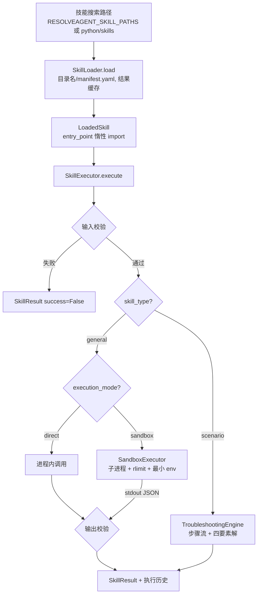

# 技能与生命周期钩子 (Skills & Lifecycle Hooks)

> **一句话理解**：技能三层执行——清单声明、执行器校验、子进程沙箱；钩子独立成层，pre/post 包住各类生命周期事件。

## 职责

`skills/` 承担技能全生命周期：`manifest.py` 定义并校验清单、`loader.py` 发现与加载、`executor.py` 校验并编排执行、`sandbox.py` 提供进程级隔离。`hooks/` 是独立的中间件层：`HookRunner` 按触发点过滤并顺序执行钩子 [runner.py:49-74](python/src/resolveagent/hooks/runner.py#L49-L74)，钩子定义本体存于 Go 平台，Python 侧只持协议客户端 [hook_client.py:15-27](python/src/resolveagent/store/hook_client.py#L15-L27)。

## 设计原理

### 第一层 manifest：默认拒绝的声明契约

清单是 Pydantic 模型，加载即校验 [manifest.py:119-130](python/src/resolveagent/skills/manifest.py#L119-L130)，校验失败直接向上抛，不做包装。权限模型默认全关：无网络、无文件系统读写，资源默认 256MB 内存 / 30s CPU / 60s 超时 [manifest.py:28-37](python/src/resolveagent/skills/manifest.py#L28-L37)——测试把这个默认值钉成契约 [test_skill_loader.py:21-26](python/tests/unit/test_skill_loader.py#L21-L26)。

技能分两类：general 与 scenario [manifest.py:16-20](python/src/resolveagent/skills/manifest.py#L16-L20)。scenario 类必须在清单里带 `scenario` 配置块（含逐步排障流程），模型校验器强制执行，违反抛 ValueError [manifest.py:112-116](python/src/resolveagent/skills/manifest.py#L112-L116)。执行模式三选一：direct / sandbox / mcp [manifest.py:104](python/src/resolveagent/skills/manifest.py#L104)。

### 第二层 executor：校验在运行时，不在加载时

`SkillExecutor.execute` 的顺序：输入校验 → 类型路由 → 执行 → 输出校验 → 记录。输入校验覆盖必填、类型、枚举 [executor.py:167-191](python/src/resolveagent/skills/executor.py#L167-L191)；未知参数只打 warning 不拒绝 [executor.py:194-200](python/src/resolveagent/skills/executor.py#L194-L200)。校验失败不抛异常，返回 `success=False` 的结果对象 [executor.py:82-93](python/src/resolveagent/skills/executor.py#L82-L93)——执行器把一切失败都变成可序列化的 SkillResult，执行期间未捕获异常同样兜底成失败结果 [executor.py:138-147](python/src/resolveagent/skills/executor.py#L138-L147)。

路由规则：scenario 技能改走 `TroubleshootingEngine` [executor.py:97-98](python/src/resolveagent/skills/executor.py#L97-L98)；否则看 `execution_mode`——manifest 声明 sandbox 则强制沙箱、声明 direct 则强制进程内，两声明都优先于全局开关 [executor.py:104-107](python/src/resolveagent/skills/executor.py#L104-L107)。输出校验与输入同构 [executor.py:115-119](python/src/resolveagent/skills/executor.py#L115-L119)。执行历史留最近 1000 条供统计 [executor.py:132-134](python/src/resolveagent/skills/executor.py#L132-L134)。

### 第三层 sandbox：OS rlimit 换零依赖

沙箱是子进程方案：技能代码写入临时文件，用 `asyncio.create_subprocess_exec` 启动，`preexec_fn` 在子进程内设资源上限 [sandbox.py:136-163](python/src/resolveagent/skills/sandbox.py#L136-L163)。上限六件套：CPU 时间、地址空间、栈、单文件大小、打开文件数、禁 core dump [sandbox.py:350-374](python/src/resolveagent/skills/sandbox.py#L350-L374)。环境变量默认最小集（PATH/HOME/LANG）[sandbox.py:379-388](python/src/resolveagent/skills/sandbox.py#L379-L388)。超时用 `wait_for` + kill 双保险 [sandbox.py:166-192](python/src/resolveagent/skills/sandbox.py#L166-L192)。

**防得住**：CPU 打满、内存膨胀、文件写爆、句柄泄漏、fork 炸弹的无限制版本——都在 rlimit 与超时覆盖内。

**防不住**（逐条读码验证）：

- **网络隔离是空头支票**。`SandboxConfig.allow_network` 默认 False [sandbox.py:56](python/src/resolveagent/skills/sandbox.py#L56)，但全仓无任何强制实现——没有 netns/unshare/防火墙代码，字段只有 builtin 技能在声明 [code_exec.py:41](python/src/resolveagent/skills/builtin/code_exec.py#L41)。
- **`SecureSandbox` 是桩**。类注释宣称 chroot / 网络命名空间 / seccomp-bpf [sandbox.py:439-446](python/src/resolveagent/skills/sandbox.py#L439-L446)，实现直接委托基础沙箱，注释承认「Full implementation would use Docker or Firecracker」[sandbox.py:459-461](python/src/resolveagent/skills/sandbox.py#L459-L461)。
- **rlimit 设置失败只告警**。`_set_resource_limits` 捕获所有异常仅打 warning [sandbox.py:376-377](python/src/resolveagent/skills/sandbox.py#L376-L377)，此时子进程以无限制状态运行，调用方无从得知。
- **文件系统未隔离**。工作目录与 tempfile 共享宿主环境，RLIMIT_FSIZE 只限单文件大小，不限可写范围。

  > [!NOTE] 推测：`preexec_fn` 与 asyncio 事件循环组合在多线程宿主里有平台安全争议，生产加固应换 `SecureSandbox` 的容器方案。依据：上述两条均为代码可见缺口，无项目内缺陷记录。

**输出协议**：沙箱内技能通过 stdout 传 JSON，执行器先整体解析、失败则倒序扫描最后一行可解析 JSON [executor.py:357-376](python/src/resolveagent/skills/executor.py#L357-L376)。为此便携技能有硬约束：不 import resolveagent、不写 `from __future__`（wrapper 内联展开会语法报错），测试用源码扫描断言强制 [test_portable_rule_route.py:201-214](python/tests/unit/test_portable_rule_route.py#L201-L214)。样例技能 rule-route 的清单自述「零依赖、镜像 RuleStrategy、沙箱安全」[manifest.yaml:1](python/skills/rule-route/manifest.yaml#L1)，端到端测试验证 Loader→Executor→沙箱回路 [test_portable_rule_route.py:237-257](python/tests/unit/test_portable_rule_route.py#L237-L257)。

### scenario 技能：把 SOP 写进 manifest

排障流程是清单里的步骤数组，每步类型为 collect / diagnose / verify / action，可引用其他技能（skill_ref）、可设条件分支 [manifest.py:56-68](python/src/resolveagent/skills/manifest.py#L56-L68)。`TroubleshootingEngine` 按 order 排序顺序执行、评估条件跳步 [troubleshoot.py:109-120](python/src/resolveagent/skills/troubleshoot.py#L109-L120)，失败的 diagnose 步骤收集为症状，最终合成四要素 `StructuredSolution`（症状 / 关键信息 / 排障步骤 / 处置步骤）[solution.py:31-48](python/src/resolveagent/skills/solution.py#L31-L48)。与 FTA 引擎刻意解耦——模块 docstring 写明「Independent of the FTA engine」[troubleshoot.py:1-6](python/src/resolveagent/skills/troubleshoot.py#L1-L6)。

## 数据流：技能链路全景

## 钩子系统

### 事件清单与触发点

四类触发点、两类时机：`trigger_point` 模型注释列明 agent.execute / skill.invoke / workflow.run [hooks/models.py:17](python/src/resolveagent/hooks/models.py#L17)，第四类 `selector.route` 在 HookSelectorAdapter 中实际使用 [hook_selector.py:66](python/src/resolveagent/selector/hook_selector.py#L66)；`hook_type` 分 pre / post。当前真实接线情况：

- **agent.execute 已接线**：ExecutionEngine 在执行前跑 pre 钩子、且接受钩子对输入的改写 [engine.py:124-135](python/src/resolveagent/runtime/engine.py#L124-L135)，执行后跑 post 钩子 [engine.py:198-209](python/src/resolveagent/runtime/engine.py#L198-L209)。
- **selector.route 已接线**：HookSelectorAdapter 把选择器包进 pre → selector → post 管道，pre 钩子可短路决策 [hook_selector.py:105-126](python/src/resolveagent/selector/hook_selector.py#L105-L126)，MegaAgent 用它作为 selector 策略 [mega.py:62-64](python/src/resolveagent/agent/mega.py#L62-L64)。
- **skill.invoke / workflow.run 未接线**：仅存在于模型注释与示例 docstring，全仓无调用点（grep 验证）。

### 执行顺序与失败语义

匹配逻辑：enabled 且 trigger_point / hook_type / target_id 三者相符 [runner.py:63-71](python/src/resolveagent/hooks/runner.py#L63-L71)，按 `execution_order` 排序后串行执行 [runner.py:74-82](python/src/resolveagent/hooks/runner.py#L74-L82)。失败语义是「不中断」：单钩子异常被捕获成 `success=False` 的结果，链条继续 [runner.py:121-131](python/src/resolveagent/hooks/runner.py#L121-L131)；唯一中断手段是钩子主动返回 `skip_remaining=True` [runner.py:87-92](python/src/resolveagent/hooks/runner.py#L87-L92)。钩子处理函数缺失视为跳过而非失败——打 warning 后返回 success=True [runner.py:113-119](python/src/resolveagent/hooks/runner.py#L113-L119)。钩子的产出通过 `modified_data` 回写上下文：pre 改输入、post 改输出，供链条下游使用 [runner.py:94-99](python/src/resolveagent/hooks/runner.py#L94-L99)。执行记录是尽力而为，失败不影响主链 [runner.py:141-142](python/src/resolveagent/hooks/runner.py#L141-L142)。

> [!NOTE] 推测：process 内钩子失败不中断主流程，是因为钩子被定位为「旁路增强」（审计、意图分析、置信度微调），挂了不应拖垮业务。依据：内建钩子三个全部是旁路性质（intent_analysis / decision_audit / confidence_override [selector_handlers.py:18](python/src/resolveagent/hooks/selector_handlers.py#L18)、[selector_handlers.py:43](python/src/resolveagent/hooks/selector_handlers.py#L43)、[selector_handlers.py:67](python/src/resolveagent/hooks/selector_handlers.py#L67)），无阻塞性钩子用例；但 git log 无直接讨论。

注意存在第二套语义：`hooks/patterns.py` 的 `HookChain` 是 Loop Engineering 的「规范模式」（pre → execute → post → feedback [patterns.py:47-61](python/src/resolveagent/hooks/patterns.py#L47-L61)），其中 **pre-hook 失败会中止主执行** [patterns.py:82-89](python/src/resolveagent/hooks/patterns.py#L82-L89)，post-hook 失败才只记 warning [patterns.py:113-119](python/src/resolveagent/hooks/patterns.py#L113-L119)。两套语义并存且相反，见已知坑第 4 条。

### 钩子定义的存放

定义存 Go 平台（`HookClient` 协议 [hook_client.py:15-27](python/src/resolveagent/store/hook_client.py#L15-L27)），`InMemoryHookClient` 是开发/测试替身 [memory_client.py:15-16](python/src/resolveagent/hooks/memory_client.py#L15-L16)；HTTP server 缺省就用内存替身启动引擎 [http_server.py:126-128](python/src/resolveagent/runtime/http_server.py#L126-L128)。HookSelectorAdapter 首次路由时若无任何钩子，懒安装两个默认钩子（intent-pre-analysis / decision-audit）[hook_selector.py:56-82](python/src/resolveagent/selector/hook_selector.py#L56-L82)，安装只发生一次（测试断言 [test_hook_selector.py:123-133](python/tests/unit/test_hook_selector.py#L123-L133)）。

## 关键决策

1. **技能默认走沙箱**。`SkillExecutor` 的 `use_sandbox` 默认 True [executor.py:39](python/src/resolveagent/skills/executor.py#L39)，manifest 必须显式声明 direct 才豁免 [executor.py:106-107](python/src/resolveagent/skills/executor.py#L106-L107)——把信任决定交给声明而非配置。沙箱用 OS rlimit 而非容器，是零依赖、测试可跑（macOS/Linux 均可）的取舍，隔离强度缺口由 `SecureSandbox` 桩预留升级路径 [sandbox.py:439-461](python/src/resolveagent/skills/sandbox.py#L439-L461)。
2. **便携技能协议 = stdout JSON + 纯 stdlib**。让技能可以被「离线、沙箱化的 agent」携带运行（rule-route 清单自述），代价是输出解析要容忍日志噪声（倒序找 JSON 行 [executor.py:364-376](python/src/resolveagent/skills/executor.py#L364-L376)）。
3. **钩子独立于技能**。钩子按 trigger_point 泛化到 agent/selector 等宿主，而非挂在技能内部；定义在平台侧、可远程增删，本地只注册 handler。这使 selector 路由也能被外挂干预（短路 [hook_selector.py:107-113](python/src/resolveagent/selector/hook_selector.py#L107-L113)），服务于反馈闭环——patterns.py 自述目标是「consistent lifecycle management and feedback loop closure」[patterns.py:1-7](python/src/resolveagent/hooks/patterns.py#L1-L7)。
4. **校验双段式**：manifest 校验结构合法性（加载时一次），executor 校验输入输出契约（每次执行）。副作用是 manifest 里的 permissions 在运行时无人消费（见已知坑第 1 条）。

## 依赖

技能层的消费者（接口级）：

- MegaAgent：技能路由直接 Loader + Executor [mega.py:284-306](python/src/resolveagent/agent/mega.py#L284-L306)；workflow 节点同样 [mega.py:428-436](python/src/resolveagent/agent/mega.py#L428-L436)。
- ExecutionEngine：workflow 步骤执行技能 [engine.py:690-708](python/src/resolveagent/runtime/engine.py#L690-L708)；并持 HookRunner 做生命周期包裹 [engine.py:46-56](python/src/resolveagent/runtime/engine.py#L46-L56)。
- FTA 求值器：可选注入 SkillExecutor 执行评估步骤 [fta/evaluator.py:33](python/src/resolveagent/fta/evaluator.py#L33)。
- LangGraph 集成：`SkillExecutorNode` 包装执行器 [node.py:99-116](python/src/resolveagent/integrations/langgraph/node.py#L99-L116)。
- scenario 引擎内嵌技能引用：`_execute_via_skill` 复用主执行器 [troubleshoot.py:211-227](python/src/resolveagent/skills/troubleshoot.py#L211-L227)。

外部依赖刻意最少：沙箱只用标准库 `resource`/`asyncio`，内存计量用 `getrusage` 并区分 macOS/Linux 单位 [sandbox.py:26-36](python/src/resolveagent/skills/sandbox.py#L26-L36)。

## 暴露接口

| 能力 | 入口 |
|------|------|
| 清单加载 | `load_manifest` [manifest.py:119](python/src/resolveagent/skills/manifest.py#L119)、`SkillManifest` 模型族 |
| 发现加载 | `SkillLoader.load / load_from_directory`（带缓存）[loader.py:75-90](python/src/resolveagent/skills/loader.py#L75-L90) |
| 技能执行 | `SkillExecutor.execute`（输入输出校验 + 沙箱路由）[executor.py:52](python/src/resolveagent/skills/executor.py#L52) |
| 代码执行 | `SandboxExecutor.execute`（python/bash/javascript 三语言）[sandbox.py:96-127](python/src/resolveagent/skills/sandbox.py#L96-L127) |
| 排障流执行 | `TroubleshootingEngine.execute`（产出四要素解）[troubleshoot.py:69](python/src/resolveagent/skills/troubleshoot.py#L69) |
| 钩子执行 | `HookRunner.run`（按触发点过滤、顺序执行）[runner.py:49](python/src/resolveagent/hooks/runner.py#L49)、`register_handler` [runner.py:40](python/src/resolveagent/hooks/runner.py#L40) |
| 规范链模式 | `HookChain.run`（pre → execute → post → feedback）[patterns.py:73](python/src/resolveagent/hooks/patterns.py#L73) |
| 钩子存储 | `HookClient` 协议 / `InMemoryHookClient` [memory_client.py:15](python/src/resolveagent/hooks/memory_client.py#L15) |

## 排查指南

1. **`Skill not found: <name>`**：症状是路由到技能直接失败。定位：按名搜索后未命中即抛 FileNotFoundError [loader.py:90](python/src/resolveagent/skills/loader.py#L90)。修复：核对 `RESOLVEAGENT_SKILL_PATHS`（冒号分隔 [loader.py:70-72](python/src/resolveagent/skills/loader.py#L70-L72)）或默认路径 `python/skills/` 下是否存在同名目录及 manifest.yaml。
2. **workflow 里技能「找不到」但文件存在**：症状是输出 `Skill 'x' not found`。定位：workflow 步骤用 `loader.get()` 只查**已加载**缓存，不触发搜索 [engine.py:696-702](python/src/resolveagent/runtime/engine.py#L696-L702)。修复：执行前先 `loader.load(skill_name)`。
3. **`Scenario skills must include a 'scenario' configuration block`**：症状是加载 scenario 技能即抛 ValueError。定位 [manifest.py:112-116](python/src/resolveagent/skills/manifest.py#L112-L116)。修复：manifest.yaml 补 scenario 块（domain / troubleshooting_flow 必填）。
4. **`Input validation failed: Missing required parameter: x`**：症状是执行返回失败但无异常。定位 [executor.py:82-93](python/src/resolveagent/skills/executor.py#L82-L93) 与必填检查 [executor.py:167-170](python/src/resolveagent/skills/executor.py#L167-L170)。修复：按 manifest 的 inputs/parameters 补齐入参；调用方（如 MegaAgent）在无入参时会把首参数名当默认键 [mega.py:308-311](python/src/resolveagent/agent/mega.py#L308-L311)。
5. **`Entry file not found: <module>`**：症状是沙箱路径技能必失败。定位：entry_module 先按包路径、再按平铺文件名两级猜测 [executor.py:336-338](python/src/resolveagent/skills/executor.py#L336-L338)。修复：让 entry_point 与目录内实际 .py 文件名对齐（如 `rule_route:main`）。
6. **`Execution timed out after 30.0s`**：症状是沙箱技能超时被杀。定位 [sandbox.py:184-192](python/src/resolveagent/skills/sandbox.py#L184-L192)。修复：调整 `SandboxConfig.timeout_seconds`——注意 manifest 的 `permissions.timeout_seconds` 并未传导到沙箱（见已知坑第 1 条），必须改 SandboxConfig。
7. **钩子配置了却毫无效果**：症状是钩子记录里 success=True 但没做任何事。定位：`No handler registered for hook type` 的 warning [runner.py:113-119](python/src/resolveagent/hooks/runner.py#L113-L119)——handler_type 未被 `register_handler` 注册。修复：注册对应 handler，或核对平台侧配置的 handler_type 拼写。
8. **沙箱技能输出不可解析**：症状是 outputs 变成整段 stdout 文本而非结构化数据。定位：JSON 解析失败的倒序回退链最终兜底 `{"result": stdout}` [executor.py:364-376](python/src/resolveagent/skills/executor.py#L364-L376)。修复：技能保证末行输出单个 JSON 对象（测试对单行输出有断言 [test_portable_rule_route.py:185-193](python/tests/unit/test_portable_rule_route.py#L185-L193)）。
9. **macOS 上沙箱技能内存误杀**：症状是本地跑通、CI 失败或反之。定位：RLIMIT_AS 在 macOS 上限制粒度更苛刻，测试为此专门放宽到 512MB 并留注释 [test_portable_rule_route.py:243-244](python/tests/unit/test_portable_rule_route.py#L243-L244)。修复：按平台调 `max_memory_mb`，不要复用默认 512 一刀切。

## 已知坑

1. **manifest.permissions 是摆设**。清单声明的 256MB 内存 / 30s CPU / 60s 超时 [manifest.py:35-37](python/src/resolveagent/skills/manifest.py#L35-L37) 与沙箱默认 512MB / 10s CPU / 30s 超时 [sandbox.py:44-48](python/src/resolveagent/skills/sandbox.py#L44-L48) 是两套数字；executor 只用全局 SandboxConfig，从不读 manifest.permissions（executor.py 全文无 permissions 引用，构造沙箱在 [executor.py:47-49](python/src/resolveagent/skills/executor.py#L47-L49)）。git log 无对应 fix。
2. **allow_network 无强制**（见设计原理第三节），清单里声明 `network_access: false` 不构成隔离 [sandbox.py:56](python/src/resolveagent/skills/sandbox.py#L56)。
3. **SecureSandbox 空壳**：所有宣称的 chroot/netns/seccomp 均未实现 [sandbox.py:459-461](python/src/resolveagent/skills/sandbox.py#L459-L461)，不可被类名误导。
4. **两套钩子语义并存**：`HookRunner`（钩子失败不中断）与 `HookChain`（pre 失败中止）对「失败语义」给出相反答案（[runner.py:121-131](python/src/resolveagent/hooks/runner.py#L121-L131) vs [patterns.py:82-89](python/src/resolveagent/hooks/patterns.py#L82-L89)）。新代码接入前必须先确认用哪套。
5. **skill.invoke / workflow.run 触发点未接线**：常量存在、无调用点，技能执行当前不经过任何钩子——「哪些钩子服务技能执行」的实际答案是：只有 selector.route 钩子间接决定技能路由，执行本身无钩子包裹。
6. **scenario 的 command 步骤是占位**：`_execute_command` 直接返回 `[Command execution placeholder]` 文本 [troubleshoot.py:242-244](python/src/resolveagent/skills/troubleshoot.py#L242-L244)，未接 SandboxExecutor——含 command 步骤的排障流不会真的执行命令。
7. **调用方反复新建 Loader/Executor**：MegaAgent 与 Engine 每次执行都实例化 SkillLoader/SkillExecutor（[mega.py:302-305](python/src/resolveagent/agent/mega.py#L302-L305)、[engine.py:690-694](python/src/resolveagent/runtime/engine.py#L690-L694)），Loader 自身的缓存 [loader.py:84-85](python/src/resolveagent/skills/loader.py#L84-L85) 在新实例上无效，manifest 重复解析。

   > [!NOTE] 推测：MegaAgent 对 RAG 管线做了实例缓存 [mega.py:214-216](python/src/resolveagent/agent/mega.py#L214-L216) 而技能没有，属疏漏而非决策。依据：同函数内两种处理并存，无注释解释。
8. **真实修复记录**：沙箱内存计量曾缺失，后经 backlog 清理提交补上 `resource.getrusage` 实现（提交 c47b88f 明确列出「python/skills/sandbox.py: track actual memory usage via resource.getrusage」，对应 [sandbox.py:26-36](python/src/resolveagent/skills/sandbox.py#L26-L36)）。这是本子系统在 git log 中少有的可考 fix。

*Last updated: 2026-09-05*
