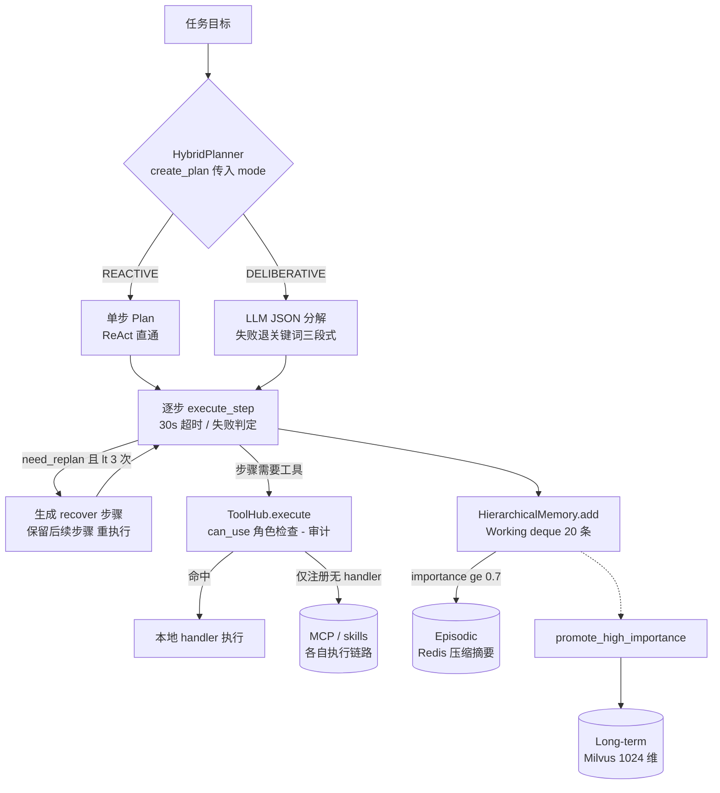

# 记忆 / 规划 / 工具中枢 (Memory · Planner · ToolHub)

> **一句话理解**：Agent 的三块底座——会话记忆分层存放、任务规划分快慢两档、工具统一注册与审计。

## 职责

三个单文件模块各管一摊：`memory.py` 维护会话上下文的三层存储；`planning.py` 把目标变成可执行的计划并支持失败重规划；`toolhub.py` 提供工具的注册、能力索引、权限与审计的统一门面。它们目前都还没有生产调用点接入 `src/`（除类型注释引用），定位是可插拔底座而非已被编排层串联的运行时。

## memory.py：三层记忆，但 TTL 不在这里

### 层级划分

- **Working Memory**：进程内 deque 滚动窗口，默认 20 条 [memory.py:41](python/src/resolveagent/memory.py#L41)，超容量丢最旧条目，测试断言保留的正是最新三条 [test_memory.py:33-35](python/tests/unit/test_memory.py#L33-L35)。
- **Episodic Memory**：Redis 按 session 存储，超过 10 条时做"语义压缩"——实际是保留最近 5 条 + 全部高重要性条目、截断 500 字符 [memory.py:242-250](python/src/resolveagent/memory.py#L242-L250)；原始条目最多存 `max_session_entries = 100` 条 [memory.py:148](python/src/resolveagent/memory.py#L148)。
- **Long-term Memory**：Milvus 向量库，只有 `importance >= 0.7` 的条目才允许写入 [memory.py:351-352](python/src/resolveagent/memory.py#L351-L352)，阈值常量在构造参数 [memory.py:304](python/src/resolveagent/memory.py#L304)。

沉淀链路：`add()` 时若 importance ≥ 0.7 且已连接，就异步触发整窗写入 episodic [memory.py:475-482](python/src/resolveagent/memory.py#L475-L482)；`promote_high_importance` 负责把高重要性条目提升进 long-term [memory.py:555-573](python/src/resolveagent/memory.py#L555-L573)。

### 淘汰顺序与 TTL 的真相

淘汰顺序是：Working 层 FIFO 滚动（deque `maxlen` 截断）→ Episodic 层压缩摘要 + 条目数截断 → Long-term 层用 importance 阈值挡在门口。**`memory.py` 里没有任何 TTL 常量**——全仓的 TTL 语义在别处：路由决策缓存 300 秒 [cache.py:28](python/src/resolveagent/selector/cache.py#L28)、registry 客户端缓存 60 秒 [registry_client.py:146](python/src/resolveagent/runtime/registry_client.py#L146)。记忆层的"过期"靠容量与重要性门槛隐式完成，而非时间戳。

> [!NOTE] 推测：三层记忆未配 TTL 可能有意为之——Working 层 20 条的窗口本身就限定了生命周期，Episodic/Long-term 的价值随会话衰减难以用固定时长刻画。依据：代码无 TTL 字段、注释无相关讨论；但这也意味着陈旧长期记忆不会被清理。

### 为什么 Working 层不外置、外置层坏了不兜底报错

同步 `add()` 必须无锁低延迟，注释明确 `deque.append` 是原子操作、并发场景才用 `add_async` 加锁 [memory.py:59-85](python/src/resolveagent/memory.py#L59-L85)；高重要性条目也只是 `create_task` 异步落盘，不阻塞请求。Redis/Milvus 连接失败一律降级为 warning 或返回空 [memory.py:167-169](python/src/resolveagent/memory.py#L167-L169)、[memory.py:194-196](python/src/resolveagent/memory.py#L194-L196)——外部存储缺失时 Agent 照常工作，只是失去跨会话能力。测试专门断言"无事件循环时不抛异常" [test_memory.py:93-100](python/tests/unit/test_memory.py#L93-L100)。

这个文件里留着四次真实故障的修复痕迹，每条注释都指向一类排查线索：

- `maxlen` 曾硬编码 20，导致可配置容量失效 [memory.py:47-48](python/src/resolveagent/memory.py#L47-L48)；
- Redis 连接必须 `decode_responses=True`，否则 bytes key 让 `load()` 永远命中不了 `entries` 字段 [memory.py:161-163](python/src/resolveagent/memory.py#L161-L163)；
- 条目序列化曾用 `str()/ast.literal_eval`，已改 JSON [memory.py:212-213](python/src/resolveagent/memory.py#L212-L213)；
- 伪嵌入曾只产出 32 维，与 Milvus 集合 1024 维不匹配"写入必败"，现在循环扩展到 1024 [memory.py:542-553](python/src/resolveagent/memory.py#L542-L553)，测试固定断言维度与确定性 [test_memory.py:117-129](python/tests/unit/test_memory.py#L117-L129)。

`_simple_embed` 是 SHA-256 伪嵌入、注释自认"用于演示"，真实语义检索需要换专业 embedding 模型 [memory.py:531-534](python/src/resolveagent/memory.py#L531-L534)——在此前提下 long-term 的"语义搜索"实为精确字符串哈希匹配，不要期待召回质量。

## planning.py：REACTIVE + DELIBERATIVE 双模式

### 模式判定：调用方说了算，框架不自判

分支点在 `create_plan`：`mode == REACTIVE` 走单步直通 [planning.py:120-135](python/src/resolveagent/planning.py#L120-L135)，否则进入深思路径 [planning.py:137-142](python/src/resolveagent/planning.py#L137-L142)。模式是显式入参、默认 REACTIVE [planning.py:104](python/src/resolveagent/planning.py#L104)。当前仓库内没有任何生产代码按"任务复杂度"自动选模式——唯一的调用示意在 docstring 与 resilient selector 的架构注释里 [planning.py:81-87](python/src/resolveagent/planning.py#L81-L87)、[resilient_selector.py:16](python/src/resolveagent/selector/resilient_selector.py#L16)。

> [!NOTE] 推测：实际约定是"简单单步请求走 REACTIVE、多步诊断/修复走 DELIBERATIVE"，判据应由调用方（如 ResilientSelector 或 MegaAgent）基于路由结果给出。依据：`HybridPlanner` 在 `src/` 内无调用点（grep 仅命中定义与注释），自动判定逻辑尚未落地。

### 两种产出物

- REACTIVE：单步 Plan，action 固定 `execute`，本质是把目标原样交给 ReAct 循环 [planning.py:122-135](python/src/resolveagent/planning.py#L122-L135)。
- DELIBERATIVE：多步 Plan，有 LLM 时用提示词要求 JSON 步骤列表（含 expected_outcome）[planning.py:163-207](python/src/resolveagent/planning.py#L163-L207)；无 LLM 或失败时退化为关键词启发式——按"诊断/修复/验证"三类关键词生成 gather_info → execute_fix → verify 三段式 [planning.py:273-301](python/src/resolveagent/planning.py#L273-L301)，测试锁定这三个 action [test_planning.py:49-57](python/tests/unit/test_planning.py#L49-L57)。

### replan：什么时候重规划、怎么重

单步超时（默认 30 秒 [planning.py:94](python/src/resolveagent/planning.py#L94)）或连接类错误标记 `replan_triggered` [planning.py:353-362](python/src/resolveagent/planning.py#L353-L362)、[planning.py:386](python/src/resolveagent/planning.py#L386)；失败步骤若不是最后一步也会触发 [planning.py:404-410](python/src/resolveagent/planning.py#L404-L410)。重规划生成一个 `recover` 修复步骤并保留失败步骤之后的所有原步骤 [planning.py:450-468](python/src/resolveagent/planning.py#L450-L468)，全程最多 3 次 [planning.py:93](python/src/resolveagent/planning.py#L93)、[planning.py:522](python/src/resolveagent/planning.py#L522)。

这附近有两个历史上真踩过的坑，现在都有测试钉住：LLM 返回空步骤列表时必须回退关键词分解，避免产出"空计划直接判完成" [planning.py:195-198](python/src/resolveagent/planning.py#L195-L198)、[test_planning.py:81-95](python/tests/unit/test_planning.py#L81-L95)；replan 产生的新计划 status 是 `pending`，必须重置为 `executing`，否则 while 循环直接退出、重规划永远不执行 [planning.py:529-531](python/src/resolveagent/planning.py#L529-L531)、[test_planning.py:144-174](python/tests/unit/test_planning.py#L144-L174)。LLM 输出的 JSON 提取也有完整容错链（markdown 围栏 → 全文 → 首尾花括号子串）[planning.py:229-247](python/src/resolveagent/planning.py#L229-L247)，因为"LLM 常在 JSON 外包裹围栏"是真实发生过的失败模式 [planning.py:216-218](python/src/resolveagent/planning.py#L216-L218)。

REACTIVE 的另一半 `ReActExecutor` 目前是半成品：`_execute_action` 只返回占位字符串，没有接任何真实工具 [planning.py:663-666](python/src/resolveagent/planning.py#L663-L666)。

## toolhub.py：注册、发现、安全、审计的统一门面

### 组合结构

`ToolHub` 聚合四个协作件：SchemaRegistry（name→version→schema 三级版本管理 [toolhub.py:169-184](python/src/resolveagent/toolhub.py#L169-L184)）、CapabilityMap（能力→工具索引 + 关键词打分检索，工具名命中加 0.5 分 [toolhub.py:125-147](python/src/resolveagent/toolhub.py#L125-L147)）、SecurityPolicy（PUBLIC/SENSITIVE/RESTRICTED 三级 + 角色判定 [toolhub.py:32-37](python/src/resolveagent/toolhub.py#L32-L37)、[toolhub.py:251-274](python/src/resolveagent/toolhub.py#L251-L274)）、DiscoveryService（注册 handler 与自动发现 [toolhub.py:332-340](python/src/resolveagent/toolhub.py#L332-L340)）。能力映射注释明确"关键词匹配是演示，语义检索需要 embedding" [toolhub.py:95-96](python/src/resolveagent/toolhub.py#L95-L96)。

### 与 MCP（08 篇）和 skills（05 篇）的边界

toolhub 对 MCP 工具做的是**目录化**：从 MCP Registry 拉工具清单、自动生成 schema 并按名字推断能力 [toolhub.py:352-388](python/src/resolveagent/toolhub.py#L352-L388)、[toolhub.py:431-457](python/src/resolveagent/toolhub.py#L431-L457)，真正的 MCP 调用仍由 `mcp/` 包执行。skills 走的是 `SkillExecutor` 直连（如 FTA 评估器的用法 [evaluator.py:112-138](python/src/resolveagent/fta/evaluator.py#L112-L138)），不经 toolhub。`ToolHub.execute` 在 `src/` 内无生产调用点。

> [!NOTE] 推测：toolhub 的定位是"工具目录 + 安全审计门面"，为跨来源（本地 / MCP）工具提供统一检索与权限收口，而不是第四种执行通道。依据：execute 已实现鉴权与审计闭环 [toolhub.py:572-616](python/src/resolveagent/toolhub.py#L572-L616) 但无人调用；skills/MCP 各自的执行链路完好。

### 一个必须知道的权限坑

`execute` 内部固定以 `["user"]` 角色做鉴权 [toolhub.py:588](python/src/resolveagent/toolhub.py#L588)。对照角色表：SENSITIVE 需要 operator/admin、RESTRICTED 需要 admin [toolhub.py:266-272](python/src/resolveagent/toolhub.py#L266-L272)——也就是说，任何被显式设置为 SENSITIVE/RESTRICTED 的工具**从 ToolHub 永远调用不通**。只有未设置策略的工具（默认 PUBLIC [toolhub.py:249](python/src/resolveagent/toolhub.py#L249)）能通过。每次调用无论成败都写审计、环形保留最近 1000 条 [toolhub.py:298-302](python/src/resolveagent/toolhub.py#L298-L302)。

## 依赖

- `memory.py`：可选依赖 `redis.asyncio` 与 `pymilvus`，均运行时 import、失败即降级 [memory.py:156-169](python/src/resolveagent/memory.py#L156-L169)、[memory.py:312-332](python/src/resolveagent/memory.py#L312-L332)。
- `planning.py`：可选依赖 `llm.provider`（无 LLM 时走关键词分解）；`asyncio.wait_for` 做步骤超时。
- `toolhub.py`：零外部依赖，MCP Registry 以鸭子类型注入 `list_tools()`。
- 三者互相独立，无 import 关系；与 selector 的关系目前只是注释层面的架构描述 [resilient_selector.py:13-16](python/src/resolveagent/selector/resilient_selector.py#L13-L16)。

## 暴露接口

- `HierarchicalMemory`：`add / get_recent / load_episodic / search_long_term / promote_high_importance` [memory.py:416-429](python/src/resolveagent/memory.py#L416-L429)。
- `HybridPlanner`：`create_plan / execute_step / execute_plan / replan / need_replan` [planning.py:68-88](python/src/resolveagent/planning.py#L68-L88)。
- `ToolHub`：`register_tool / find_tools / can_use / execute / list_tools / get_audit_trail` [toolhub.py:481-490](python/src/resolveagent/toolhub.py#L481-L490)。

## 排查指南

**症状 1：日志反复出现 `Redis not connected, skipping episodic store`，会话记忆无法跨进程恢复。**
→ 定位：episodic 写入前置检查失败即静默跳过 [memory.py:194-196](python/src/resolveagent/memory.py#L194-L196)；连接失败只记 warning [memory.py:167-169](python/src/resolveagent/memory.py#L167-L169)。
→ 修复：确认 Redis 地址可达；若写入成功但读不回来，检查连接参数——历史上 bytes/str 不匹配曾让 `load()` 永远读不到数据 [memory.py:161-163](python/src/resolveagent/memory.py#L161-L163)。

**症状 2：长期记忆写入报 `Failed to store long-term memory`。**
→ 定位：Milvus 写入异常被捕获 [memory.py:372-374](python/src/resolveagent/memory.py#L372-L374)。最典型原因是向量维度与集合 1024 维不匹配 [memory.py:322](python/src/resolveagent/memory.py#L322)——旧版本 32 维伪嵌入"写入必败"的修复注释就在 `_simple_embed` 上方 [memory.py:542-546](python/src/resolveagent/memory.py#L542-L546)。
→ 修复：确认 `_simple_embed`/真实 embedding 输出维度 == 集合维度；importance 低于 0.7 的条目本来就会被拒绝 [memory.py:351-352](python/src/resolveagent/memory.py#L351-L352)，不属于故障。

**症状 3：日志出现 `LLM decomposition failed, using simple fallback`，计划质量突然变成三段式模板。**
→ 定位：LLM 调用或 JSON 解析失败，整体降级为关键词分解 [planning.py:209-211](python/src/resolveagent/planning.py#L209-L211)。
→ 修复：先看 `LLM decomposition returned no steps`（空列表同样回退 [planning.py:195-198](python/src/resolveagent/planning.py#L195-L198)）与 `_extract_json` 的 ValueError [planning.py:247](python/src/resolveagent/planning.py#L247)；前者调整提示词要求非空 steps，后者检查模型是否输出了非 JSON 内容。

**症状 4：ToolHub 调用工具返回 `Access denied for tool: xxx`。**
→ 定位：execute 固定以 user 角色鉴权 [toolhub.py:588-593](python/src/resolveagent/toolhub.py#L588-L593)，SENSITIVE/RESTRICTED 工具必然被拒 [toolhub.py:266-272](python/src/resolveagent/toolhub.py#L266-L272)。
→ 修复：要么把工具安全级别留回 public，要么修改调用侧传入真实角色列表；每次拒绝都会进审计轨迹，可用 `get_audit_trail` 复盘 [toolhub.py:622-624](python/src/resolveagent/toolhub.py#L622-L624)。

**症状 5：计划执行卡死后日志出现 `Step execution failed` + `Execution timeout`。**
→ 定位：步骤超过 30 秒默认超时 [planning.py:340-343](python/src/resolveagent/planning.py#L340-L343)，会触发 replan（最多 3 次）[planning.py:522](python/src/resolveagent/planning.py#L522)。
→ 修复：调大 `step_timeout` 或让执行器自身带快速失败；若 replan 后计划没被执行，检查是否踩过 status 未重置的旧版本行为 [planning.py:529-531](python/src/resolveagent/planning.py#L529-L531)。

## 已知坑

- 记忆层无 TTL：长期记忆只进不出，陈旧内容永不清理（见设计原理一节的推测标注）。
- `_simple_embed` 是演示级哈希嵌入 [memory.py:531-534](python/src/resolveagent/memory.py#L531-L534)，long-term 检索在换真实 embedding 前没有语义能力。
- `ReActExecutor._execute_action` 是占位实现 [planning.py:663-666](python/src/resolveagent/planning.py#L663-L666)，REACTIVE 模式跑不出真实动作。
- ToolHub 的 `["user"]` 硬编码角色让 SENSITIVE/RESTRICTED 工具形同虚设（见排查指南症状 4）。

*Last updated: 2026-09-05*
