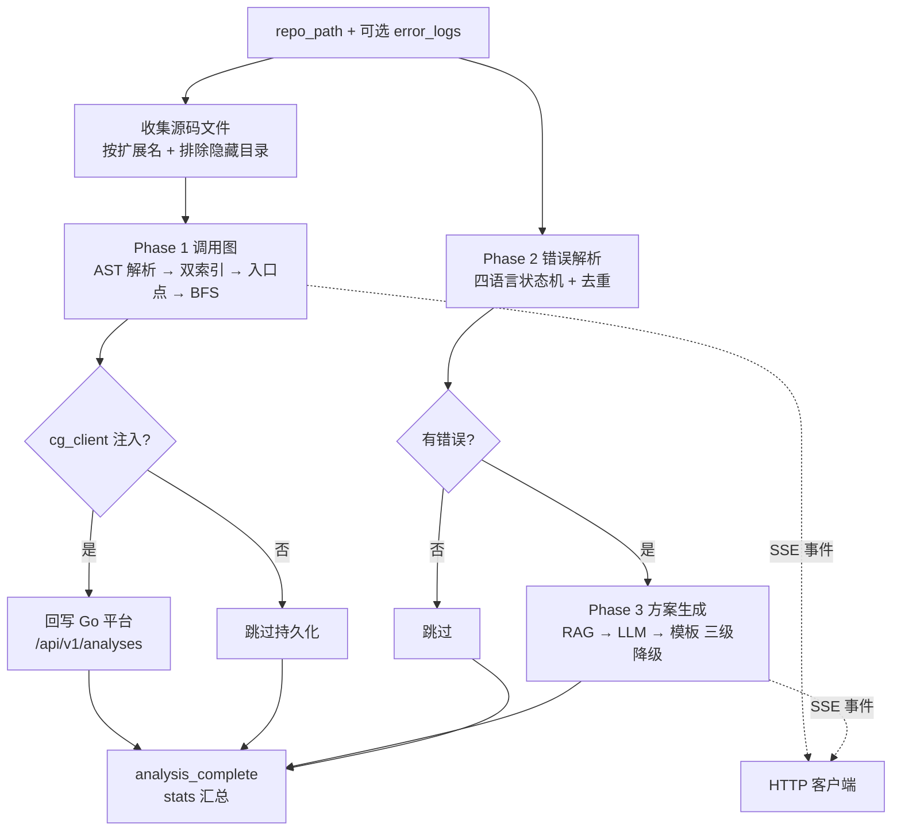

# 代码分析子系统 (Code Analysis)

> **一句话理解**：把仓库源码解析成调用图、把报错日志解析成结构化错误，再生成排查方案文档。

## 职责

code_analysis 回答两个问题：「这段代码长什么样」和「这个报错怎么办」。分析对象是**本地仓库目录的源码文件**（按扩展名收集 [call_graph.py:138-144](python/src/resolveagent/code_analysis/call_graph.py#L138)），不是 diff、也不是运行时数据；额外接受一段**原始错误日志文本**作为可选输入 [engine.py:106](python/src/resolveagent/code_analysis/engine.py#L106)。产出三类结构化结果：

- 调用图：节点（函数定义）+ 边（调用关系）+ 入口点集合，定义在 [call_graph.py:50-58](python/src/resolveagent/code_analysis/call_graph.py#L50)；
- 结构化错误：`ParsedError`（错误类型、消息、语言、栈帧列表），定义在 [error_parser.py:28-40](python/src/resolveagent/code_analysis/error_parser.py#L28)；
- 方案文档：`SolutionDocument`（根因、步骤、代码示例），定义在 [solution_generator.py:17-30](python/src/resolveagent/code_analysis/solution_generator.py#L17)。

编排入口是 [StaticAnalysisEngine](python/src/resolveagent/code_analysis/engine.py#L42)，一条 `analyze()` 协程把三件事串成流水线并以 SSE 兼容事件逐步吐出 [engine.py:88-123](python/src/resolveagent/code_analysis/engine.py#L88)。

模块里实际存在**两套并行的解析体系**，这是读懂本目录的关键：

| 体系 | 文件 | 服务对象 |
|---|---|---|
| 引擎链路 | [ast_parser.py](python/src/resolveagent/code_analysis/ast_parser.py#L230) | 调用图构建（Python 用 `ast`，其余语言正则回退） |
| 多语言解析器 | [parsers/](python/src/resolveagent/code_analysis/parsers/base.py#L55) | Dify 插件等单文件诊断（stdlib ast + tree-sitter） |

按文件拆开看，六个主要文件各管一段：

| 文件 | 一句话职责 |
|---|---|
| [call_graph.py](python/src/resolveagent/code_analysis/call_graph.py#L73) | 解析全部源码、建双索引、BFS 生成调用图与入口点 |
| [ast_parser.py](python/src/resolveagent/code_analysis/ast_parser.py#L292) | 单文件解析：Python 走 `ast`，非 Python 逐行正则匹配函数声明 |
| [error_parser.py](python/src/resolveagent/code_analysis/error_parser.py#L45) | Python/Go/JS/Java 四语言逐行正则错误解析与合并 |
| [solution_generator.py](python/src/resolveagent/code_analysis/solution_generator.py#L144) | 单个错误的方案文档生成（三级降级调度在这里） |
| [parsers/factory.py](python/src/resolveagent/code_analysis/parsers/factory.py#L46) | 多语言解析器工厂：惰性 try-import，拿不到返回 None |
| [engine.py](python/src/resolveagent/code_analysis/engine.py#L88) | 三段流水线编排 + SSE 事件流 + 可选持久化 |

## 设计原理：三段流水线 + 事件流输出

### 流水线三段

`analyze()` 固定按 call_graph → error_parsing → solution_generation 三段推进 [engine.py:133](python/src/resolveagent/code_analysis/engine.py#L133)、[engine.py:163](python/src/resolveagent/code_analysis/engine.py#L163)、[engine.py:182](python/src/resolveagent/code_analysis/engine.py#L182)。两个刻意的约束：

- **错误为空就跳过方案生成**：`if result.errors` 才进入第三段 [engine.py:181](python/src/resolveagent/code_analysis/engine.py#L181)——没有错误就没有值得生成的方案；
- **单段失败不中断整体**：每段用独立 try/except 包住，失败只发 `phase error` 事件继续走 [engine.py:158-160](python/src/resolveagent/code_analysis/engine.py#L158)。调用图建不出来时，错误解析和方案生成照常进行。

调用图构建是「全量解析 → 双索引 → BFS」：先把所有函数按 `文件::函数名` 建索引、再按简单名建一份跨文件索引 [call_graph.py:173-177](python/src/resolveagent/code_analysis/call_graph.py#L173)；入口点解析支持显式传入、装饰器探测、常见名字（main/handler/run 等）兜底三级策略 [call_graph.py:186-220](python/src/resolveagent/code_analysis/call_graph.py#L186)；之后从入口点做 BFS，`max_depth` 默认 10 [call_graph.py:260](python/src/resolveagent/code_analysis/call_graph.py#L260)。

### 未解析调用不丢弃，落 phantom 节点

BFS 遇到解析不出来的被调函数时，不丢边，而是造一个 `<external>::名字` 的占位节点 [call_graph.py:277-284](python/src/resolveagent/code_analysis/call_graph.py#L277)，边照加但不再往下展开 [call_graph.py:296](python/src/resolveagent/code_analysis/call_graph.py#L296)。这样调用图始终保留「这里有个外部依赖」的信息——对故障排查来说，外部调用点往往正是故障边界。

### 错误解析：多语言各自状态机 + 合并去重

Python/Go/JS/Java 各有一个正则驱动的逐行解析器 [error_parser.py:45-58](python/src/resolveagent/code_analysis/error_parser.py#L45)。不带语言提示时，四路解析器全跑一遍再按 `(error_type, message)` 去重 [error_parser.py:88-103](python/src/resolveagent/code_analysis/error_parser.py#L88)——用冗余计算换「用户不用告诉我是哪种语言的报错」。

### 方案生成的三级降级

单个错误按 RAG → LLM → 模板三级走 [solution_generator.py:144-157](python/src/resolveagent/code_analysis/solution_generator.py#L144)：先查 RAG 拿相关上下文 [solution_generator.py:159-173](python/src/resolveagent/code_analysis/solution_generator.py#L159)；有 LLM 就做 RAG 增强生成 [solution_generator.py:175-219](python/src/resolveagent/code_analysis/solution_generator.py#L175)；LLM 挂了回退到不依赖任何外部服务的模板 [solution_generator.py:277-303](python/src/resolveagent/code_analysis/solution_generator.py#L277)。这套降级保证了离线环境下方案生成依然有产出。

## 数据流：一次分析的端到端事件序列

以 `POST /v1/code-analysis/static` 为例，HTTP 层把请求体原样透传给 `analyze()`（repo_path、language、entry_points、error_logs、max_depth、repository_url、branch 七个字段，[http_server.py:613-621](python/src/resolveagent/runtime/http_server.py#L613)），SSE 客户端按顺序收到：

1. `analysis_started`：携带随机生成的 analysis_id、repo_path、language（缺省 auto）[engine.py:116-123](python/src/resolveagent/code_analysis/engine.py#L116)；
2. `phase` call_graph started → `call_graph_complete`（节点/边/入口点统计）或 `phase` error [engine.py:133](python/src/resolveagent/code_analysis/engine.py#L133)、[engine.py:145](python/src/resolveagent/code_analysis/engine.py#L145)、[engine.py:160](python/src/resolveagent/code_analysis/engine.py#L160)；
3. `phase` error_parsing started → `errors_parsed`（结构化错误清单）或 phase error [engine.py:163](python/src/resolveagent/code_analysis/engine.py#L163)、[engine.py:173](python/src/resolveagent/code_analysis/engine.py#L173)；
4. 有错误才有第三段：`phase` solution_generation started → `solutions_generated` [engine.py:182](python/src/resolveagent/code_analysis/engine.py#L182)、[engine.py:189](python/src/resolveagent/code_analysis/engine.py#L189)；
5. `analysis_complete`：最终统计收尾 [engine.py:211](python/src/resolveagent/code_analysis/engine.py#L211)，随后 HTTP 层补一条 `data: [DONE]` [http_server.py:623](python/src/resolveagent/runtime/http_server.py#L623)。

每条事件是 `{"type": str, "data": dict}` 两键字典 [engine.py:111-112](python/src/resolveagent/code_analysis/engine.py#L111)，消费方只需按 type 分发。error_logs 字段是纯文本，直接进四语言合并解析（[engine.py:106](python/src/resolveagent/code_analysis/engine.py#L106) 的入参注释）。

## 关键决策

### tree-sitter 是可选依赖，工厂惰性注册

parsers/ 体系（Java/Go/Rust）在 d809d3f 提交中引入，提交信息明确写了「Add ParserFactory with **lazy loading for optional dependencies**」。实现上每个解析器都 try-import，失败只记 debug 日志 [factory.py:34-41](python/src/resolveagent/code_analysis/parsers/factory.py#L34)。代价是 `get_parser()` 可能返回 `None` [factory.py:55-56](python/src/resolveagent/code_analysis/parsers/factory.py#L55)，所有调用方必须自己兜底——Dify 插件就是这么做的：拿不到解析器直接返回「语言不支持」文案 [tools.py:160-162](python/src/resolveagent/integrations/dify/tools.py#L160)，外层再包一层模板兜底 [tools.py:150-153](python/src/resolveagent/integrations/dify/tools.py#L150)。

### 持久化失败静默吞掉

调用图回写 Go 平台失败只记 warning，不向上抛 [engine.py:300-301](python/src/resolveagent/code_analysis/engine.py#L300)。写法是 try 包住整个 create + add_nodes + add_edges 序列 [engine.py:252-298](python/src/resolveagent/code_analysis/engine.py#L252)。

> [!NOTE] 推测：静默吞掉是为了不让存储故障毁掉一次本已成功的分析会话（SSE 事件流已经把结果交给了调用方）。依据：engine 把 SSE 流式输出作为第一交付物（[engine.py:51-52](python/src/resolveagent/code_analysis/engine.py#L51) 注释），持久化只是「if client is available」的附加动作（[engine.py:155](python/src/resolveagent/code_analysis/engine.py#L155)）；git log 里没有相关修复或讨论记录。

## 依赖

**上游（谁调用本模块）**：

- [mega.py:519](python/src/resolveagent/agent/mega.py#L519)：MegaAgent 按 `sub_type` 分发，`static` 子类型实例化引擎执行完整分析 [mega.py:461-468](python/src/resolveagent/agent/mega.py#L461)；
- [http_server.py:601](python/src/resolveagent/runtime/http_server.py#L601)：`POST /v1/code-analysis/static` 把 SSE 流直接透传给 HTTP 客户端 [http_server.py:613-622](python/src/resolveagent/runtime/http_server.py#L613)；`POST /v1/code-analysis/errors/parse` 单独暴露错误解析 [http_server.py:671-682](python/src/resolveagent/runtime/http_server.py#L671)；
- [code_analysis_importer.py:16](python/src/resolveagent/corpus/code_analysis_importer.py#L16)：语料导入管线跑完分析后经双写管道沉淀进 RAG（文档来源标记 `code_analysis`，见 [dual_writer.py:135](python/src/resolveagent/rag/dual_writer.py#L135)）；
- [tools.py:157](python/src/resolveagent/integrations/dify/tools.py#L157)：Dify 插件用 parsers/ 做单文件诊断。

**下游（本模块调用谁）**：

- [code_analysis_client.py:52-53](python/src/resolveagent/store/code_analysis_client.py#L52)：经 Go 平台 REST `/api/v1/analyses` 持久化分析记录、节点、边 [code_analysis_client.py:102-106](python/src/resolveagent/store/code_analysis_client.py#L102)；
- `llm.provider` 与 `rag`：方案生成的模型与检索依赖，均以构造参数注入 [engine.py:69-76](python/src/resolveagent/code_analysis/engine.py#L69)。

**路由关系**：selector 只负责把请求路由到 `code_analysis`，不消费分析产物——低置信度 + 检测到代码块时强制改道 [router.py:61-66](python/src/resolveagent/selector/router.py#L61)；弹性路由把它设为所有常规路径失败后的最终兜底 [resilient_selector.py:472-478](python/src/resolveagent/selector/resilient_selector.py#L472)，超时/连接类错误也会提升其优先级 [resilient_selector.py:226-228](python/src/resolveagent/selector/resilient_selector.py#L226)。测试 [test_resilient_selector.py:297](python/tests/test_resilient_selector.py#L297) 断言兜底路径必须包含 code_analysis。

## 暴露接口

- `StaticAnalysisEngine.analyze()`：流式版，逐个 yield 事件字典 [engine.py:88](python/src/resolveagent/code_analysis/engine.py#L88)；
- `StaticAnalysisEngine.analyze_single()`：非流式封装，只取最终 stats [engine.py:218-242](python/src/resolveagent/code_analysis/engine.py#L218)；
- `CallGraphBuilder.build()`：只要调用图不要方案 [call_graph.py:73](python/src/resolveagent/code_analysis/call_graph.py#L73)；
- `ErrorParser.parse()` / `parse_file()`：文本或日志文件 → 结构化错误 [error_parser.py:71](python/src/resolveagent/code_analysis/error_parser.py#L71)、[error_parser.py:105](python/src/resolveagent/code_analysis/error_parser.py#L105)；
- `ParserFactory.get_parser()` / `get_parser_for_file()`：按语言或扩展名取解析器 [factory.py:46](python/src/resolveagent/code_analysis/parsers/factory.py#L46)、[factory.py:69](python/src/resolveagent/code_analysis/parsers/factory.py#L69)；
- HTTP：`/v1/code-analysis/static`、`/v1/code-analysis/errors/parse` 两个端点（见依赖一节）。

## 排查指南

**症状 1：SSE 流里出现 `{"type": "phase", "data": {"phase": "call_graph", "status": "error"}}`，日志有 `Call graph construction failed`**
定位：[engine.py:159-160](python/src/resolveagent/code_analysis/engine.py#L159)。最常见根因是 repo_path 无效——`build()` 对非目录只 warning 然后返回带 `{"error": "invalid_repo_path"}` 的空结果 [call_graph.py:96-98](python/src/resolveagent/code_analysis/call_graph.py#L96)，注意这个空结果是「正常返回」不会进 except，后续 stats 全为 0。走 MegaAgent 时没有 repo_path 会直接返回 `missing_repo_path` 错误 [mega.py:533-541](python/src/resolveagent/agent/mega.py#L533)。
修复：确认 repo_path 是存在的目录；检查挂载路径（容器场景常见路径没映射进去）。

**症状 2：调用图节点数是 0，但没有任何报错**
定位：两层原因。其一，单文件语法错误被静默跳过——`ast.parse` 失败只 warning，该文件返回空的 ParsedModule 带上 `parse_error` 元数据 [ast_parser.py:259-266](python/src/resolveagent/code_analysis/ast_parser.py#L259)；其二，入口点一个都没命中——装饰器白名单只认 Flask/Django/Celery 风格的装饰器 [ast_parser.py:77-94](python/src/resolveagent/code_analysis/ast_parser.py#L77)，兜底常见名只有 main/app/handler/run/execute [call_graph.py:214-218](python/src/resolveagent/code_analysis/call_graph.py#L214)，都不命中就整张图为空。
修复：显式传 `entry_points` 参数（支持部分匹配 [call_graph.py:196-203](python/src/resolveagent/code_analysis/call_graph.py#L196)）；先单独验证出错文件能否被 `ast.parse` 解析。

**症状 3：分析正常完成，但 Go 平台列表里查不到这次分析**
定位：[engine.py:300-301](python/src/resolveagent/code_analysis/engine.py#L300) 的 `Failed to persist call graph` warning——Go 平台不可达或 `/api/v1/analyses` 返回异常时整个持久化被吞掉 [code_analysis_client.py:52-53](python/src/resolveagent/store/code_analysis_client.py#L52)。
修复：grep runtime 日志找 `Failed to persist call graph`；确认 Go 平台地址与 `/api/v1/analyses` 可用。注意持久化失败不影响 SSE 流里拿到完整结果。

**症状 4：Dify 代码诊断输出「Language 'xxx' is not yet supported」**
定位：[tools.py:160-162](python/src/resolveagent/integrations/dify/tools.py#L160) 拿到 `None` 解析器。惰性注册失败时只有 debug 级日志 [factory.py:40-41](python/src/resolveagent/code_analysis/parsers/factory.py#L40)，线上默认日志级别下看不到原因。
修复：安装对应 tree-sitter 依赖（如 `tree-sitter-java`，失败提示见 [treesitter_parser.py:67-72](python/src/resolveagent/code_analysis/parsers/treesitter_parser.py#L67)）；Python 语言则无需依赖（stdlib ast）。

## 已知坑

- **两套解析体系互不复用**：engine 链路对非 Python 语言的「解析」是逐行正则匹配函数声明 [ast_parser.py:292-303](python/src/resolveagent/code_analysis/ast_parser.py#L292)，连调用点都提不出来（calls 恒为空 [ast_parser.py:350-357](python/src/resolveagent/code_analysis/ast_parser.py#L350)）；而真正能解析 Go/Java/Rust 的 tree-sitter 解析器在 parsers/ 里，engine 却没接。模块注释自称「tree-sitter bindings for other languages」[ast_parser.py:4](python/src/resolveagent/code_analysis/ast_parser.py#L4)，与实际行为不符。
- **方案生成的结构化解析依赖中文关键词**：LLM 输出按「标题/摘要/根因/解决步骤」逐行匹配提取 [solution_generator.py:243-258](python/src/resolveagent/code_analysis/solution_generator.py#L243)，模型换了措辞（或换成英文模型）后只有 summary 兜底（全文塞进 summary [solution_generator.py:230-231](python/src/resolveagent/code_analysis/solution_generator.py#L230)）。
- **简单名索引可能张冠李戴**：跨文件索引用简单函数名做 key [call_graph.py:176-177](python/src/resolveagent/code_analysis/call_graph.py#L176)，同名函数（如各模块的 `handle`）会被后解析的文件覆盖，BFS 边可能指到错误实现上。

*Last updated: 2026-09-05*
