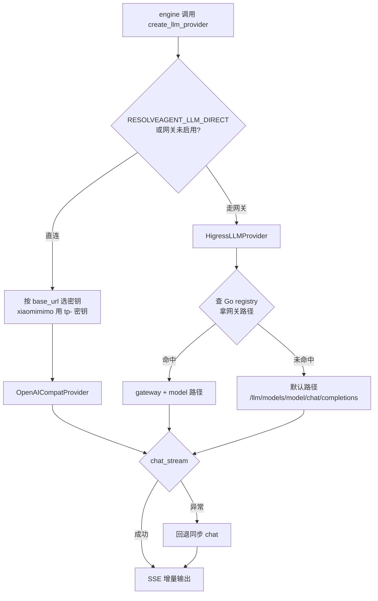

# MCP 接入与 LLM Provider 层 (MCP & LLM)

> **一句话理解**：对外接工具（MCP），对内接模型（LLM Provider），把第三方依赖统一进两条可降级的通道。

## 职责

本篇覆盖两个互不调用的目录，它们是 Agent 运行时与外部世界的两张门：

| 目录 | 回答的问题 | 关键类 |
|---|---|---|
| `mcp/` | 「外部 MCP Server 提供的工具怎么接进来、怎么调」 | [MCPAdapter](python/src/resolveagent/mcp/adapter.py#L24)、[MCPRegistry](python/src/resolveagent/mcp/registry.py#L26)、Stdio/HTTP MCPClient |
| `llm/` | 「对话能力从哪个模型端点来、挂了怎么办」 | [HigressLLMProvider](python/src/resolveagent/llm/higress_provider.py#L24)、[OpenAICompatProvider](python/src/resolveagent/llm/openai_compat.py#L28)、[QwenProvider](python/src/resolveagent/llm/qwen.py#L20) |

mcp/ 的边界：**只管连接与执行**。工具的能力索引、权限审计、与本地 handler 的统一分发在 toolhub（见 [toolhub.py:572-616](python/src/resolveagent/toolhub.py#L572) 的 `execute`：先鉴权、再找 handler、失败写审计）；toolhub 通过 [discover_from_mcp](python/src/resolveagent/toolhub.py#L352) 想把 MCP 工具纳管进来，但这条链路当前有类型不匹配的坑（见已知坑）。

两条边界落到表上：

| 关注点 | 归属 | 锚点 |
|---|---|---|
| 建立/关闭与 MCP server 的连接 | mcp/ registry + client | [registry.py:140-148](python/src/resolveagent/mcp/registry.py#L140) |
| 真正执行一次远程工具调用 | mcp/ registry.execute_tool | [registry.py:100-104](python/src/resolveagent/mcp/registry.py#L100) |
| 能力索引、关键词推断、schema 注册 | toolhub | [toolhub.py:371-382](python/src/resolveagent/toolhub.py#L371) |
| 执行前鉴权与审计落盘 | toolhub | [toolhub.py:588-589](python/src/resolveagent/toolhub.py#L588) |
| workflow 步骤按 mcp 模式分发 | runtime engine | [engine.py:672-687](python/src/resolveagent/runtime/engine.py#L672) |

llm/ 的边界：**只管把 messages 变成文本**。何时调用、调几次、结果怎么进工作流，全部在 runtime/engine。

## 设计原理：MCP 三层架构

- **adapter 层**：对外的唯一入口，持初始化状态并把返回统一成 `MCPToolResult`。未初始化直接返回失败 [adapter.py:94-99](python/src/resolveagent/mcp/adapter.py#L94)，执行异常被包成 success=False 而不是向上抛 [adapter.py:123-131](python/src/resolveagent/mcp/adapter.py#L123)；
- **registry 层**：启动时对每个 server `list_tools()` 并以工具名为 key 收进字典 [registry.py:47-49](python/src/resolveagent/mcp/registry.py#L47)；支持 `server.tool` 限定名消歧 [registry.py:82-98](python/src/resolveagent/mcp/registry.py#L82)；`execute_tool` 负责定位 server 并调用 [registry.py:123-138](python/src/resolveagent/mcp/registry.py#L123)；
- **client 层**：按 transport 分流到 stdio 子进程或 HTTP [registry.py:140-148](python/src/resolveagent/mcp/registry.py#L140)。stdio 版是手写的 JSON-RPC 2.0：写请求行、等响应行，超时与进程死亡都转成显式异常 [client.py:203-211](python/src/resolveagent/mcp/client.py#L203)。

Server 配置支持 `${VAR}` 与 `${VAR:-default}` 环境变量插值 [config.py:84-100](python/src/resolveagent/mcp/config.py#L84)，配置文件按固定顺序搜索四个位置（`mcp_servers.json` 优先）[config.py:122-128](python/src/resolveagent/mcp/config.py#L122)。

消费侧：workflow 节点声明 `execution_mode: mcp` 时，engine 把该步骤交给 MCP adapter 执行并把结果包装进事件流 [engine.py:672-687](python/src/resolveagent/runtime/engine.py#L672)。

## 设计原理：Provider 工厂与降级链

所有模型调用都实现统一的 `LLMProvider` 协议（`chat` / `chat_stream`）。选择走网关还是直连，集中在工厂函数 [create_llm_provider](python/src/resolveagent/llm/higress_provider.py#L409)：

- **直连模式**：`RESOLVEAGENT_LLM_DIRECT=true` 或网关未启用时，直接构造 OpenAI 兼容 provider [higress_provider.py:426-433](python/src/resolveagent/llm/higress_provider.py#L426)，base_url 取自 `LLM_BASE_URL`；
- **密钥按端点路由**：`xiaomimimo.com` 端点用 tp- 前缀的 Token Plan 密钥，其余端点用 KIMI 密钥 [higress_provider.py:440-443](python/src/resolveagent/llm/higress_provider.py#L440)——这是 daec347 提交的真实修复：避免把 tp- 密钥误发给 Moonshot 等其他端点；
- **模型名匹配保护**：agent 配置的 model_id 只在与端点匹配时才生效（mimo 端点只接受 mimo 系模型名）[higress_provider.py:446-447](python/src/resolveagent/llm/higress_provider.py#L446)；
- **网关模式**：走 HigressLLMProvider，先查 Go 平台 registry 拿模型的网关路径 [higress_provider.py:130-154](python/src/resolveagent/llm/higress_provider.py#L130)，查不到就回退默认路径 `/llm/models/{model}/chat/completions`。

llm/ 里实际存在三个 provider 实现，工厂只会产出前两者；QwenProvider 的唯一构造点在未接线的 [ModelRegistry.get_provider](python/src/resolveagent/llm/model_config.py#L58) 里，同样处于休眠状态：

| Provider | 端点 | 密钥来源 | 定位 |
|---|---|---|---|
| [HigressLLMProvider](python/src/resolveagent/llm/higress_provider.py#L24) | Higress 网关 | 网关侧管理 | 生产默认，统一限流/故障转移 |
| [OpenAICompatProvider](python/src/resolveagent/llm/openai_compat.py#L28) | 任意 OpenAI 兼容 base_url | KIMI 或小米 Token Plan 密钥（按端点选） | 直连模式，本地开发与逃生门 |
| [QwenProvider](python/src/resolveagent/llm/qwen.py#L20) | DashScope 兼容端点（硬编码）[qwen.py:27-28](python/src/resolveagent/llm/qwen.py#L27) | DASHSCOPE API key | qwen 系直连，不经工厂 |

工厂分支背后的环境变量全集：

| 环境变量 | 作用 | 锚点 |
|---|---|---|
| `RESOLVEAGENT_LLM_DIRECT` | true 时强制直连 | [higress_provider.py:426](python/src/resolveagent/llm/higress_provider.py#L426) |
| `RESOLVEAGENT_GATEWAY_ENABLED` | 未启用也走直连 | [higress_provider.py:427-431](python/src/resolveagent/llm/higress_provider.py#L427) |
| `LLM_BASE_URL` | 直连端点，默认 Moonshot | [higress_provider.py:437](python/src/resolveagent/llm/higress_provider.py#L437) |
| `KIMI_API_KEY` / `XIAOMI_TOKEN_PLAN_API_KEY` | 按 base_url 二选一 | [higress_provider.py:440-443](python/src/resolveagent/llm/higress_provider.py#L440) |
| `LLM_DEFAULT_MODEL` | 直连模式实际模型名 | [higress_provider.py:447](python/src/resolveagent/llm/higress_provider.py#L447) |

运行时还有一层兜底：engine 优先流式输出，流式异常时记 warning 并回退到同步 `chat()`，用户只会感觉变慢、不会失败 [engine.py:441-445](python/src/resolveagent/runtime/engine.py#L441)。

**设计动因（git 交叉验证）**：3326b08 提交引入 Higress 集成（新增 AgentScope_Higress 集成文档与 CI 改动）；[HigressLLMProvider](python/src/resolveagent/llm/higress_provider.py#L24) 的 docstring 列出动机——中心化限流与配额、自动故障转移、流量观测 [higress_provider.py:27-32](python/src/resolveagent/llm/higress_provider.py#L27)；1b6600a 补充了网关评估并落地 direct mode 逃生门；daec347 修复密钥误路由与 MiMo 空响应。三处证据一致指向「先统一走网关、再为本地开发留直连」的演进顺序。

## 关键决策

### K2.5 系模型锁死温度

`FIXED_TEMPERATURE_MODELS` 把 kimi-k2.5 / k2 / k2-thinking 的温度硬编码：开思考 1.0、关思考 0.6 [openai_compat.py:59-63](python/src/resolveagent/llm/openai_compat.py#L59)，调用方传的温度参数在 K2.5 上直接被覆盖 [openai_compat.py:75-79](python/src/resolveagent/llm/openai_compat.py#L75)。同一段逻辑在流式路径重复了一遍 [openai_compat.py:172-173](python/src/resolveagent/llm/openai_compat.py#L172)。

> [!NOTE] 推测：锁温度是因为 K2.5 的思考模式对采样温度敏感，上层业务传入的温度会破坏其思考行为。依据：代码注释只写了「require fixed temperature based on thinking mode」[openai_compat.py:59-60](python/src/resolveagent/llm/openai_compat.py#L59)，git log 中无讨论记录。

### MCP 工具名以「后注册者覆盖」为冲突策略

registry 把工具收进以名字为 key 的字典时没有任何冲突检测 [registry.py:47-49](python/src/resolveagent/mcp/registry.py#L47)。两个 server 暴露同名工具时，最后一个连上的赢。

## 依赖

**上游（谁调用本模块）**：

- [engine.py:403-408](python/src/resolveagent/runtime/engine.py#L403)：runtime engine 每次执行 agent 时经工厂创建 provider，并采纳 provider 的 default_model 作为实际模型名（避免把不支持的模型名发给端点）；
- [engine.py:672-687](python/src/resolveagent/runtime/engine.py#L672)：workflow 的 mcp 执行模式；
- [toolhub.py:352-388](python/src/resolveagent/toolhub.py#L352)：ToolHub 尝试纳管 MCP 工具到能力索引。

**下游（本模块调用谁）**：

- stdio 子进程（stdio transport）与 aiohttp/httpx（HTTP transport）；
- Go 平台 registry：网关模式下查模型路由 [higress_provider.py:143-146](python/src/resolveagent/llm/higress_provider.py#L143)；
- 配置文件：`mcp_servers.json` / `mcp_servers.yaml` / `configs/resolveagent.yaml` [config.py:122-128](python/src/resolveagent/mcp/config.py#L122)。

## 暴露接口

- `create_llm_provider(gateway_url, model)`：唯一的 provider 构造入口 [higress_provider.py:409](python/src/resolveagent/llm/higress_provider.py#L409)；
- `LLMProvider.chat()` / `chat_stream()`：同步与流式两种调用形态；
- `MCPAdapter.initialize()` / `execute()`：MCP 生命周期与调用入口，返回统一 `MCPToolResult`；
- `MCPRegistry.list_tools()` / `execute_tool()`：工具枚举与执行 [registry.py:74-76](python/src/resolveagent/mcp/registry.py#L74)、[registry.py:100-104](python/src/resolveagent/mcp/registry.py#L100)；
- `load_mcp_config()`：配置加载与环境变量插值 [config.py:103-110](python/src/resolveagent/mcp/config.py#L103)。

## 排查指南

**症状 1：`RuntimeError("Qwen API request timed out")`**
定位：[qwen.py:133-135](python/src/resolveagent/llm/qwen.py#L133) 捕获 httpx 超时后重新抛出，日志同时有 `Qwen API timeout`。engine 会把它当流式失败回退同步调用，最终用户看到的是响应极慢或超时报错。
修复：检查 `DASHSCOPE_API_KEY` 对应端点的网络连通与限流；同步路径整体超时约 60 秒（[openai_compat.py:109](python/src/resolveagent/llm/openai_compat.py#L109) 同级实现），端点 P99 超过这个值就需要走网关的备用模型。

**症状 2：`RuntimeError("API error: empty choices in response: …")`，模型是 MiMo**
定位：[openai_compat.py:122-125](python/src/resolveagent/llm/openai_compat.py#L122)。MiMo 等 reasoning 模型会返回空 choices 的响应，旧代码直接取 `choices[0]` 崩溃——daec347 提交为此补了判空。注意流式路径的处理不同：空 choices 的 chunk 只是静默跳过 [openai_compat.py:219-223](python/src/resolveagent/llm/openai_compat.py#L219)，若整条流都是空 chunk 会得到空回答而非报错。
修复：先升级到含 daec347 的版本；输出为空时确认 finish_reason 与 usage-only chunk 语义。

**症状 3：`RuntimeError("OpenAI API error: 401")`（或 4xx/5xx）**
定位：HTTP 状态错误在 [openai_compat.py:149-154](python/src/resolveagent/llm/openai_compat.py#L149) 转成 RuntimeError，完整响应体在日志 `OpenAI API HTTP error` 的 extra 里。常见根因是 tp- 密钥配错了端点（修复见 [higress_provider.py:440-443](python/src/resolveagent/llm/higress_provider.py#L440)）。
修复：核对 `LLM_BASE_URL` 与所用密钥是否来自同一家；401 时优先检查环境变量注入顺序。

**症状 4：MCP 调用返回 `{"success": false, "error": "MCP request timeout after 30s"}` 或 `"MCP server closed stdout"`**
定位：[client.py:207-211](python/src/resolveagent/mcp/client.py#L207)。超时是子进程没在配置时限内回响应行；closed stdout 是 server 进程崩溃或启动命令路径错误。
修复：单独手动运行 `mcp_servers.json` 里的 command 验证 server 能起；调大该 server 的 `timeout_seconds`；再看该 server 的 stderr 日志。

**症状 5：所有 MCP 工具都返回 `"MCP adapter not initialized"` 或 `"MCP tool 'x' not found or server not connected"`**
定位：前者是 [adapter.py:94-99](python/src/resolveagent/mcp/adapter.py#L94) 的状态闸门（忘了调 `initialize()`）；后者是 registry 找不到 server [registry.py:126-130](python/src/resolveagent/mcp/registry.py#L126)——检查限定名前缀是否等于 server 名，或工具根本没被发现（server 连接失败时发现阶段只有 warning）。
修复：确认 adapter 初始化时序；用限定名 `server.tool` 重试；检查配置文件搜索路径下是否真的有配置。

## 已知坑

- **ToolHub 纳管 MCP 工具的链路是断的**：`list_tools()` 返回的是 `MCPTool` 对象 [registry.py:74-76](python/src/resolveagent/mcp/registry.py#L74)，而 [discover_from_mcp](python/src/resolveagent/toolhub.py#L365) 把每个元素当字典调 `tool.get("name")`，必然 AttributeError，被外层 except 吞成一条 `Failed to discover from MCP` 日志 [toolhub.py:385-386](python/src/resolveagent/toolhub.py#L385)。结果是 MCP 工具永远进不了 ToolHub 的能力索引，只能靠 engine 的 mcp 执行模式直达 adapter。
- **工具参数 schema 在发现阶段被丢弃**：`list_tools()` 组装 `MCPTool` 时只填 name/description/server_name，parameters 恒为空 [client.py:81-87](python/src/resolveagent/mcp/client.py#L81)，定义本有 schema 字段 [types.py:27-33](python/src/resolveagent/mcp/types.py#L27)。任何想基于 schema 做参数校验或 UI 表单的下游都拿不到数据。
- **models.yaml 是「声明式摆设」**：[configs/models.yaml:3-5](configs/models.yaml#L3) 的注释自己承认「ModelRegistry consumption is not wired up yet」；[ModelRegistry](python/src/resolveagent/llm/model_config.py#L24) 在整个 src 下无任何 import 者（grep 验证）。模型路由的真实事实来源是环境变量 + 工厂函数，改 models.yaml 不会有效果。
- **同名工具静默覆盖**：见关键决策第二条 [registry.py:47-49](python/src/resolveagent/mcp/registry.py#L47)。

*Last updated: 2026-09-05*
