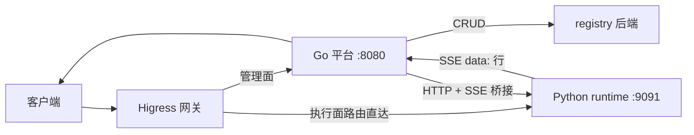
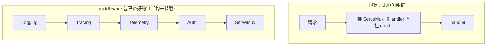
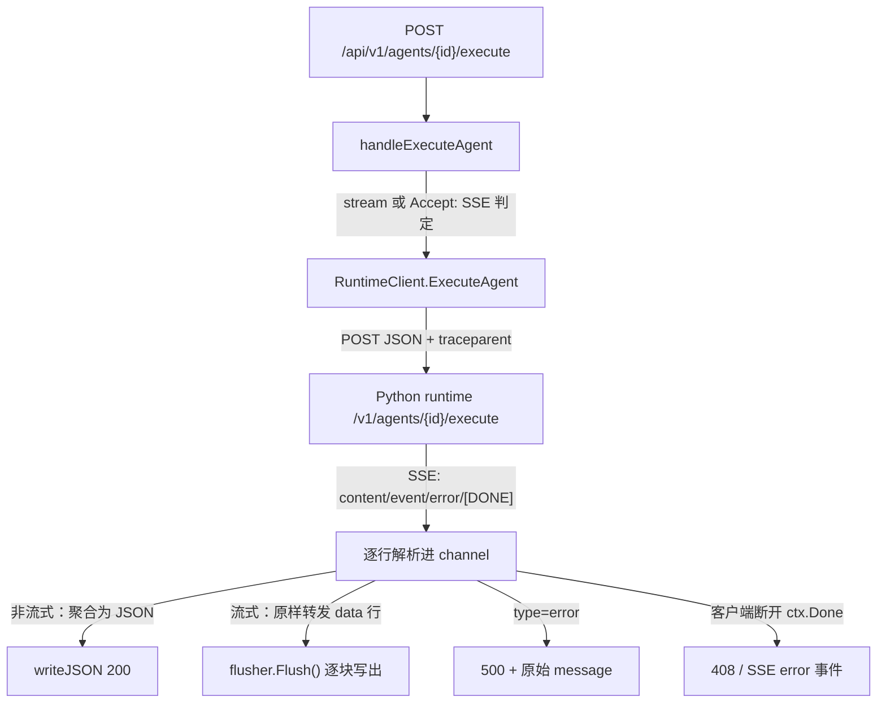

# Go 平台层：REST 门面与 Python 智能层桥接

> **一句话理解**：Go 做管理面 HTTP 门面与注册表宿主，把"执行"转发给 Python，把 Python 的错误翻译成 HTTP。

## 职责

- 对外暴露约 130 条 REST 路由，覆盖 agent / skill / workflow / RAG / FTA / 代码分析 / 记忆 / 方案 / hook / 配置十个域，全部注册在 [router.go:6-136](pkg/server/router.go#L6-L136) 的一个 `ServeMux` 上。
- 按配置装配 registry 后端：`store.backend=postgres` 走 PostgreSQL，否则全内存，见 [server.go:52-96](pkg/server/server.go#L52-L96)。
- 充当 Go → Python 的协议桥：把执行类请求转成 HTTP + SSE 流，见 [runtime_client.go:17-37](pkg/server/runtime_client.go#L17-L37)。
- 同时监听 gRPC，但当前只注册了健康检查与反射服务，见 [server.go:99-106](pkg/server/server.go#L99-L106)。
- 进程入口在 [main.go:16-55](cmd/resolveagent-server/main.go#L16-L55)：加载配置、建 Server、等待 SIGINT/SIGTERM 后优雅关停。

## 设计原理：平台层与智能层的边界

### 哪些请求 Go 自己处理

所有"管理面"请求（增删改查、校验、配置）由 Go 直接读写 registry 后端完成，不经过 Python。典型如 agent CRUD [agent_handlers.go:28-64](pkg/server/agent_handlers.go#L28-L64)、workflow 校验 [router.go:34](pkg/server/router.go#L34)、配置读写 [router.go:49-50](pkg/server/router.go#L49-L50)。

### 哪些请求转发给 Python

所有"执行面"请求转发给 Python runtime：

- Agent 执行：Go 侧路由 [router.go:20](pkg/server/router.go#L20)，经 `ExecuteAgent` 转发 [agent_handlers.go:141-148](pkg/server/agent_handlers.go#L141-L148)。
- Workflow 执行：[workflow_handlers.go:265](pkg/server/workflow_handlers.go#L265)。
- RAG 摄取与查询：[rag_handlers.go:219](pkg/server/rag_handlers.go#L219)、[rag_handlers.go:281](pkg/server/rag_handlers.go#L281)。
- 语料导入（长任务 SSE）：[corpus_handler.go:48](pkg/server/corpus_handler.go#L48)。

### 转发协议

- **地址**：默认 `localhost:9091`，可用 `server.runtime_addr` 覆盖，见 [runtime_client.go:26-29](pkg/server/runtime_client.go#L26-L29)。注意配置里遗留的 `runtime.grpc_addr`（[config.go:27](pkg/config/config.go#L27)、[resolveagent.yaml:26](configs/resolveagent.yaml#L26)）没有任何代码读取——HTTP 桥真正读的是 [types.go:35](pkg/config/types.go#L35) 的 `server.runtime_addr`。
- **URL**：`http://<addr>/v1` 为基座，执行类拼 `/agents/{id}/execute`、`/workflows/{id}/execute`，RAG 拼 `/rag/query`、`/rag/ingest`，见 [runtime_client.go:32](pkg/server/runtime_client.go#L32) 与 [runtime_client.go:93](pkg/server/runtime_client.go#L93)。
- **超时**：执行类客户端 120 s（注释"Long timeout for streaming"）见 [runtime_client.go:34](pkg/server/runtime_client.go#L34)；语料导入单独用**无超时**客户端，见 [runtime_client.go:438-440](pkg/server/runtime_client.go#L438-L440)。
- **序列化**：请求体 JSON，响应声明 `Accept: text/event-stream`，逐行解析 `data: ` 前缀、遇 `[DONE]` 结束，见 [runtime_client.go:105-106](pkg/server/runtime_client.go#L105-L106) 与 [runtime_client.go:123-133](pkg/server/runtime_client.go#L123-L133)。语料导入把 scanner 缓冲提到 1 MB 以容纳大事件，见 [runtime_client.go:456](pkg/server/runtime_client.go#L456)。
- **分布式追踪**：把当前 OTel span 编码为 W3C `traceparent` 头注入下游，见 [runtime_client.go:72-78](pkg/server/runtime_client.go#L72-L78)。

> [!NOTE] 推测：执行面流量既可经 Go 代理也可被网关直连 runtime，是"先直通、后收口"的过渡态。依据：Higress 的 agent/skill 执行路由指向 runtime:9091（[route_sync.go:222-226](pkg/gateway/route_sync.go#L222-L226)），而 Go 平台同路径也有代理实现（[agent_handlers.go:117](pkg/server/agent_handlers.go#L117)），两条路径并存且无文档说明取舍。

## 鉴权设计

### 鉴权链（设计）

`authenticate` 按顺序尝试三种凭证，见 [auth.go:114-132](pkg/server/middleware/auth.go#L114-L132)：

1. **网关转发头**：存在 `X-Auth-User` 即信任 Higress 转发的身份与 `X-Auth-Roles`，见 [auth.go:134-151](pkg/server/middleware/auth.go#L134-L151)。对应配置注释"Higress handles external auth, platform validates forwarded headers"，见 [resolveagent.yaml:47-48](configs/resolveagent.yaml#L47-L48)。
2. **JWT**：`Authorization: Bearer` 前缀触发；仅接受 HMAC 签名并校验 issuer，见 [auth.go:158-163](pkg/server/middleware/auth.go#L158-L163) 与 [auth.go:174-178](pkg/server/middleware/auth.go#L174-L178)。签发端 `GenerateJWT` 固定 HS256，见 [auth.go:267](pkg/server/middleware/auth.go#L267)。
3. **API Key**：按配置的头名（默认 `X-API-Key` / `Authorization`）查进程内注册表并检查过期，见 [auth.go:125-129](pkg/server/middleware/auth.go#L125-L129) 与 [auth.go:217-219](pkg/server/middleware/auth.go#L217-L219)；另提供常数时间比较助手 [auth.go:272-274](pkg/server/middleware/auth.go#L272-L274)。

放行清单为健康与指标类前缀：`/health`、`/healthz`、`/api/v1/health` 等，见 [auth.go:30](pkg/server/middleware/auth.go#L30)；匹配用前缀而非全等，见 [auth.go:105-112](pkg/server/middleware/auth.go#L105-L112)。

### 为什么用 middleware 而不是每 handler 自查

- 三种凭证的解析与角色上下文注入只在此处发生一次，handler 通过 `GetAuthContext` / `HasRole` 消费，见 [auth.go:231-250](pkg/server/middleware/auth.go#L231-L250)。
- 失败响应与告警日志集中在 [auth.go:91-98](pkg/server/middleware/auth.go#L91-L98)，避免每个 handler 重复 401 逻辑。
- 放行清单与开关集中在 [AuthConfig](pkg/server/middleware/auth.go#L16-L22)，运维改配置即生效，不动代码。

### 现状：未挂载

`server.New` 直接把裸 mux 设为 Handler，见 [server.go:111-112](pkg/server/server.go#L111-L112)；全仓 grep `NewAuthMiddleware` 无生产调用方。同理 `Logging` / `Tracing` / `TelemetryMiddleware` 三个中间件（[logging.go:20](pkg/server/middleware/logging.go#L20)、[tracing.go:14](pkg/server/middleware/tracing.go#L14)、[telemetry.go:12](pkg/server/middleware/telemetry.go#L12)）也全部待命未接线。

> [!NOTE] 推测：未挂载是"网关先行"策略的过渡态，而非放弃本层鉴权。依据：ADR-002 把统一认证列为网关集成模式之一（[002-gateway-choice.md:79](docs-site/docs/adr/002-gateway-choice.md#L79)）；配置文件同样声明由 Higress 先行认证（[resolveagent.yaml:47-48](configs/resolveagent.yaml#L47-L48)）；但 auth.go 仍完整实现了网关头信任、JWT、API Key 三路兜底，说明本层防御是预留项。

## 错误映射

映射是两级串联：

**第一级（Python → Go 语义码）**：Python 侧把异常分类为 `error_code`（`ValueError→INVALID_ARGUMENT`、`KeyError→NOT_FOUND`、`TimeoutError→TIMEOUT` 等，见 [http_server.py:28-37](python/src/resolveagent/runtime/http_server.py#L28-L37)），随 SSE error 事件下发（[http_server.py:47-55](python/src/resolveagent/runtime/http_server.py#L47-L55)）。Go 侧 `mapPythonErrorCode` 把 10 个语义码翻译为 `errors.Code`，未知码与空串一律归 `INTERNAL`，见 [error_mapping.go:9-32](pkg/server/error_mapping.go#L9-L32)；测试固化了全部映射与两个兜底分支，见 [error_mapping_test.go:24-25](pkg/server/error_mapping_test.go#L24-L25)。

**第二级（语义码 → HTTP 状态）**：`errors.HTTPStatus` 完成 `NOT_FOUND→404`、`ALREADY_EXISTS/CONFLICT→409`、`TIMEOUT→504`、`UNAVAILABLE→503`、`RATE_LIMITED→429` 等翻译，未匹配一律 500，见 [errors.go:97-122](pkg/errors/errors.go#L97-L122)；测试见 [errors_test.go:52-66](pkg/errors/errors_test.go#L52-L66)。

映射表完整语义：`INVALID_ARGUMENT→400`、`UNAUTHORIZED→401`、`FORBIDDEN→403`、`NOT_FOUND→404`、`ALREADY_EXISTS/CONFLICT→409`、`RATE_LIMITED→429`、`UNAVAILABLE→503`、`TIMEOUT→504`、其余/未知→500。

> [!NOTE] 推测：`mapPythonErrorCode` 目前是"备而未接"——没有任何 handler 调用它，执行错误仍硬编码 500 并透传原始消息。依据：提交 4df99f8 同时加入 error_mapping.go、其测试，并给 `ExecutionError` 增补 `error_code`/`category`/`trace_id` 字段（[runtime_client.go:63-69](pkg/server/runtime_client.go#L63-L69)），但 agent_handlers 仍只取 `Error.Message` 返 500（[agent_handlers.go:167-171](pkg/server/agent_handlers.go#L167-L171)）。

## 路由分组与超时结构

- 路由按域分组平铺：系统（[router.go:8-12](pkg/server/router.go#L8-L12)）、agent（[router.go:15-20](pkg/server/router.go#L15-L20)）、workflow（[router.go:29-35](pkg/server/router.go#L29-L35)）、RAG（[router.go:38-66](pkg/server/router.go#L38-L66)）、FTA / 代码分析 / 语料（[router.go:69-87](pkg/server/router.go#L69-L87)）、记忆（[router.go:90-99](pkg/server/router.go#L90-L99)）、方案（[router.go:102-110](pkg/server/router.go#L102-L110)）、调用图与流量（[router.go:113-135](pkg/server/router.go#L113-L135)）。
- HTTP Server 超时四件套：Read 30 s / ReadHeader 10 s / Write 60 s / Idle 120 s，见 [server.go:113-117](pkg/server/server.go#L113-L117)。
- gRPC 端口 `:9090`（[config.go:17](pkg/config/config.go#L17)）目前只有健康检查与反射，见 [server.go:99-106](pkg/server/server.go#L99-L106)。
- HTTP 与 gRPC 并行启动，任一失败经 `errCh` 上抛终止进程，见 [server.go:124-172](pkg/server/server.go#L124-L172)。

## 关键决策

**为什么 Go 做平台层、Python 做智能层**。ADR-001 的决策表：平台服务用 Go（高并发、云原生生态），Agent 运行时用 Python（AI/ML 生态与 AgentScope），Web 用 TypeScript，见 [001-why-multilang.md:20-27](docs-site/docs/adr/001-why-multilang.md#L20-L27)；结论是"每个组件用最适合的技术，整体收益大于成本"（[001-why-multilang.md:73](docs-site/docs/adr/001-why-multilang.md#L73)）。落到代码上：Go 侧持有全部注册表与 HTTP 门面，Python 侧只做执行引擎。

**网关选 Higress**。ADR-002 对比 Higress/Kong/Envoy/自建后，取其 AI 场景优化（LLM 路由、Token 限流、模型熔断）与 Wasm 扩展能力，见 [002-gateway-choice.md:23-50](docs-site/docs/adr/002-gateway-choice.md#L23-L50)；集成模式声明"Route Sync: Go Registry → Higress"与"LLM Proxy: Python Runtime → Higress → LLM"，见 [002-gateway-choice.md:75-79](docs-site/docs/adr/002-gateway-choice.md#L75-L79)。

**桥接协议：ADR 说 gRPC，实现走了 HTTP/SSE**。ADR-001 的缓解措施写"使用 gRPC 和 Protocol Buffers"（[001-why-multilang.md:66](docs-site/docs/adr/001-why-multilang.md#L66)），但实际桥接是 HTTP+JSON+SSE（见上文"转发协议"）；Go 侧 gRPC 只剩健康检查，配置里的 `runtime.grpc_addr` 成为遗留键。Python 侧自己的注释也承认 REST 是"gRPC 之外的等价面"，见 [http_server.py:112-113](python/src/resolveagent/runtime/http_server.py#L112-L113)。

**双后端注册表**。`store.backend` 二选一：postgres 分支先连库再跑迁移，迁移失败直接启动失败（[server.go:53-62](pkg/server/server.go#L53-L62)）；否则 13 类实体全部退化为进程内 map（[server.go:82-95](pkg/server/server.go#L82-L95)）。例外：方案（solution）registry 即使在 postgres 模式下也保持内存实现，见 [server.go:77-78](pkg/server/server.go#L77-L78)。

## 依赖

- **上游被谁依赖**：进程入口 [cmd/resolveagent-server/main.go](cmd/resolveagent-server/main.go#L30) 是唯一生产调用方；web 前端与外部客户端经 REST 消费；Higress 按 RouteSync 投影的规则把执行流量送到 runtime（旁路 Go）或管理流量送到 Go。
- **下游依赖谁**：pkg/config（装配期读 [server.go:52](pkg/server/server.go#L52)）、pkg/registry 的 13 个接口（[server.go:28-42](pkg/server/server.go#L28-L42)）、pkg/store/postgres（postgres 模式装配）、pkg/errors（错误码翻译）、golang-jwt（[auth.go:12](pkg/server/middleware/auth.go#L12)）、pgxpool、OTel trace（[runtime_client.go:14](pkg/server/runtime_client.go#L14)）。
- **反向依赖**：Python runtime 通过环境变量 `RESOLVEAGENT_PLATFORM_ADDR` 默认回连平台 `localhost:8080`（[http_server.py:104-106](python/src/resolveagent/runtime/http_server.py#L104-L106)）——桥接是双向 HTTP，不存在 Python 直接 import Go 状态的通道。
- 中间件包与 gateway/service 包在装配上**当前无依赖关系**（未被 server 引用），属预留层。

## 暴露接口

- **REST**：上述十个域全部经 [router.go:6](pkg/server/router.go#L6) 起的注册函数暴露；响应统一走 [response.go:8](pkg/server/response.go#L8) 的 `writeJSON` / [response.go:14](pkg/server/response.go#L14) 的 `writeError`（错误体为 `{"error": msg}`）。
- **gRPC**：标准健康协议与反射（[server.go:102-106](pkg/server/server.go#L102-L106)）。
- **桥接客户端**：`RuntimeClient` 8 个方法，其中 5 个有 handler 调用（ExecuteAgent / ExecuteWorkflow / QueryRAG / IngestRAG / ImportCorpus）；`ExecuteSkill`（[runtime_client.go:358](pkg/server/runtime_client.go#L358)）、`SyncSolutionToRAG`（[runtime_client.go:530](pkg/server/runtime_client.go#L530)）、`SemanticSearchSolutions`（[runtime_client.go:588](pkg/server/runtime_client.go#L588)）与 `Health`（[runtime_client.go:489](pkg/server/runtime_client.go#L489)）暂无调用方。

## 数据流：一次 Agent 执行

非流式路径下 Go 聚合全部 content 块后一次返回（[agent_handlers.go:151-195](pkg/server/agent_handlers.go#L151-L195)）；流式路径下 Go 是纯 SSE 转发器，并补发 `[DONE]` 结束帧（[agent_handlers.go:265](pkg/server/agent_handlers.go#L265)）。

## 排查指南

**信号 1：执行请求返回 500，消息含 `unexpected status: 4xx/5xx, body: ...`**
- 症状：客户端看到 `execution failed: do request 成功但 unexpected status: ...`，日志打 "Agent execution failed"（[agent_handlers.go:174-179](pkg/server/agent_handlers.go#L174-L179)）。
- 定位：Go 已连上 runtime，但 Python 返回非 200——错误文本在 [runtime_client.go:116-120](pkg/server/runtime_client.go#L116-L120) 拼装。body 内容即 Python 的错误详情。
- 修复：按 body 修 Python 侧；确认 runtime 端口与 `server.runtime_addr` 一致（[runtime_client.go:26-29](pkg/server/runtime_client.go#L26-L29)）。

**信号 2：恰好 120 s 后执行失败（超时）**
- 症状：长执行在约 2 分钟时报 `do request: context deadline exceeded`，或客户端先断开时 handler 返回 408 `request timeout`（[agent_handlers.go:181-183](pkg/server/agent_handlers.go#L181-L183)）。
- 定位：120 s 来自 [runtime_client.go:34](pkg/server/runtime_client.go#L34)；语料导入则无超时（[runtime_client.go:438-440](pkg/server/runtime_client.go#L438-L440)），挂住表现为连接长期无数据。
- 修复：调大 `server.runtime_addr` 所在部署的超时无入口——需改代码常量；流式场景建议客户端改用 SSE（`Accept: text/event-stream`）绕开聚合等待。

**信号 3：401 / 未鉴权访问直达平台**
- 症状：绕过网关直接访问 `:8080` 的管理面接口全部成功，无任何 401。
- 定位：auth 中间件从未挂载——Handler 是裸 mux（[server.go:111-112](pkg/server/server.go#L111-L112)），`authenticate` 三路验证（[auth.go:114-132](pkg/server/middleware/auth.go#L114-L132)）不在请求路径上。
- 修复：在 `server.New` 组装 `auth.Middleware(mux)` 并配置 `jwt_secret`；短期靠 Higress 侧 `gateway.auth`（[resolveagent.yaml:49-55](configs/resolveagent.yaml#L49-L55)）兜底。

**信号 4：panic 后连接被重置、日志无业务堆栈**
- 症状：偶发请求直接 EOF / connection reset，没有 JSON 错误体。
- 定位：pkg 内无任何 `recover()` 中间件；net/http 默认恢复 panic 后只向标准日志打堆栈并关闭连接。中间件包里也没有 Recovery（可挂载的仅 Logging/Tracing/Telemetry/Auth，见上文鉴权一节）。
- 修复：在挂载中间件链时补一个 Recovery（包一层 `defer recover()` 记录堆栈并返回 500）。

**信号 5：启动即退出，日志含 `failed to connect to postgres` / `failed to migrate postgres`**
- 症状：进程起不来，`os.Exit(1)`（[main.go:30-34](cmd/resolveagent-server/main.go#L30-L34)）。
- 定位：连接失败在 [server.go:53-55](pkg/server/server.go#L53-L55)，迁移失败在 [server.go:59-62](pkg/server/server.go#L59-L62)；迁移逐版本报错并带版本号（[postgres.go:473-475](pkg/store/postgres/postgres.go#L473-L475)）。
- 修复：核对 `database.*` 与 `RESOLVEAGENT_DATABASE_PASSWORD`（[config.go:85-88](pkg/config/config.go#L85-L88)）；或临时把 `store.backend` 改回 `memory` 先跑通。

**信号 6：重启后 GET 返回 404 `agent not found`**
- 症状：重启前创建的实体全部消失。
- 定位：后端是内存 map（[server.go:82-95](pkg/server/server.go#L82-L95)）；`store.backend` 未设为 `postgres` 时一切不落盘。
- 修复：显式配置 `store.backend: postgres`（[resolveagent.yaml:74-76](configs/resolveagent.yaml#L74-L76)）。

## 已知坑

1. **鉴权、日志、追踪、指标四个中间件全部未挂载**，平台层当前是"裸奔"状态（[server.go:111-112](pkg/server/server.go#L111-L112)）。
2. **WriteTimeout 60 s 截断长流式响应**：HTTP Server 的 WriteTimeout 是 60 s（[server.go:115](pkg/server/server.go#L115)），小于 RuntimeClient 的 120 s（[runtime_client.go:34](pkg/server/runtime_client.go#L34)）。
   > [!NOTE] 推测：超过 60 s 的 SSE 流会被 Go 侧写超时掐断，客户端表现为流中途断开。依据：两个超时值数值矛盾；net/http 的 WriteTimeout 覆盖从读完请求头到写完响应的全周期，对 SSE 长流天然不利。
3. **健康检查恒真**：`/healthz` 与 `/api/v1/health` 不探测任何依赖，Postgres 宕机仍返回 healthy，见 [system_handlers.go:9-14](pkg/server/system_handlers.go#L9-L14)；registry/store 的 `Health` 能力（[store.go:10](pkg/store/store.go#L10)）未被使用。
4. **错误码翻译断链**：`mapPythonErrorCode` 与 `errors.HTTPStatus` 就绪，但执行类 handler 硬编码 500（[agent_handlers.go:167-171](pkg/server/agent_handlers.go#L167-L171)），Python 的 `TIMEOUT/UNAVAILABLE` 等语义丢失。
5. **ID 生成非强唯一**：`generateID` 用纳秒时间戳 + 4 位随机数（[rag_handlers.go:311-314](pkg/server/rag_handlers.go#L311-L314)），高并发同纳秒可能碰撞。
6. **删除集合不删向量**：`DELETE /rag/collections/{id}` 只删 registry 记录，向量库清理是 TODO（[rag_handlers.go:149-156](pkg/server/rag_handlers.go#L149-L156)），RAG 元数据与 Milvus 会漂移（详见 [10-registry-store.md](10-registry-store.md)）。

*Last updated: 2026-09-05*
