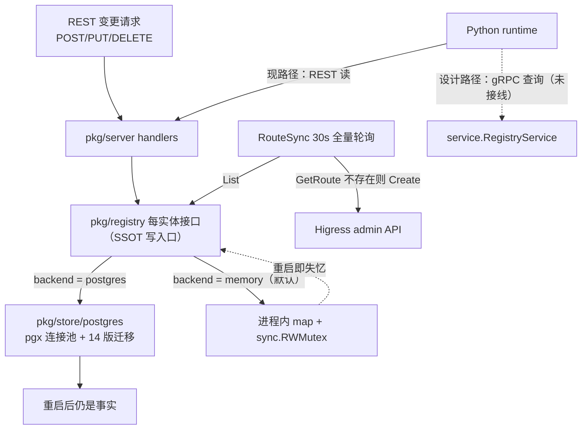

# SSOT Registry 与存储层

> **一句话理解**：registry 是全系统唯一事实源，内存与 Postgres 是它的两副身体，Higress 是它最下游的投影。

> [!NOTE] 升档说明：该组件按引用维度脚本评分偏低，但作为全系统事实源被升档为 core。依据：所有 server handler 与 gateway 同步都经它读写（[server.go:52-96](pkg/server/server.go#L52-L96)、[route_sync.go:17-27](pkg/gateway/route_sync.go#L17-L27)），配置注释明确写着"Go Registry serves as single source of truth"（[resolveagent.yaml:29](configs/resolveagent.yaml#L29)）。

## 职责

- **registry**：为 13 类实体（agent、skill、workflow、RAG 集合/文档、FTA 文档、代码分析、记忆、方案、hook、调用图、流量捕获/图）各定义一个接口和一份内存实现，如 [agent.go:22-28](pkg/registry/agent.go#L22-L28)、[skill.go:25-32](pkg/registry/skill.go#L25-L32)、[memory.go:43-60](pkg/registry/memory.go#L43-L60)、[solution.go:63-74](pkg/registry/solution.go#L63-L74)。
- **store**：提供物理后端。`Store` 接口本身只有 `Health`/`Close` 两个方法（[store.go:8-13](pkg/store/store.go#L8-L13)）——真正的持久化契约是 registry 的每实体接口，由 postgres 包逐一实现。
- **同步**：`RouteSync` 周期性把 registry 内容投影到 Higress，见 [route_sync.go:13-27](pkg/gateway/route_sync.go#L13-L27)。
- 两个包合计约 6.4k 行（含测试），是仓库最大的 Go 模块群。

## 设计原理：为什么是 SSOT，谁写谁读

**写方**只有一条路：REST handler 调 registry 接口。agent 创建走 [agent_handlers.go:58](pkg/server/agent_handlers.go#L58)，skill 注册走 skill handlers，方案批量导入走 [solution_handler.go:198](pkg/server/solution_handler.go#L198)。Python runtime 不直接写 registry——智能层要注册实体必须经平台 REST API。

**读方**有三类：

1. 平台自身 handler（查询/列表响应）。
2. `RouteSync` 每 30 秒全量 List，把 agent/skill 变成网关路由（[route_sync.go:88-106](pkg/gateway/route_sync.go#L88-L106)）。
3. `service.RegistryService` gRPC 门面，设计上供 Python runtime 查询实体与模型路由，见 [registry_service.go:11-34](pkg/service/registry_service.go#L11-L34)——但它尚未注册到 gRPC server（见"已知坑"）。

**数据流向**：变更 → registry 接口 → store 持久化（postgres）或内存 map → RouteSync 周期投影 → Higress。方向严格单向，网关从不反向写。

## 关键决策

**为什么每实体一个接口而不是一个大仓库**。各实体形状差异大：skill 以 name 为主键且有 Register/Unregister 语义（[skill.go:27-31](pkg/registry/skill.go#L27-L31)），memory 有短/长两态加 TTL 清理（[memory.go:43-60](pkg/registry/memory.go#L43-L60)），solution 带执行记录与搜索（[solution.go:64-74](pkg/registry/solution.go#L63-L74)）。统一接口会逼出大量空实现；代价是 13 套 CRUD 手写样板（见下文"store 为什么大"）。

**skills 用 upsert，agents 用 create-only**。内存与 Postgres 两副身体里，skill 的 Register 都是"同名覆盖"：[skill.go:47-53](pkg/registry/skill.go#L47-L53) 直接写 map，[skill_store.go:25-34](pkg/store/postgres/skill_store.go#L25-L34) 用 `ON CONFLICT (name) DO UPDATE`；而 agent 的 Create 遇重复即报错（[agent.go:47-49](pkg/registry/agent.go#L47-L49)）。
> [!NOTE] 推测：这是"技能=可重入制品、Agent=受管资源"的语义区分——技能会被反复重新分发，幂等覆盖比报错友好。依据：两类实现行为一致且无注释解释；git log 中未见相关讨论。

**迁移内嵌在 Go 代码里，版本化但不回滚**。`Migrate` 先建 `schema_migrations` 版本表（[postgres.go:112-120](pkg/store/postgres/postgres.go#L112-L120)），再逐版本检查-执行-记录：v1-v5 建核心四表加索引（[postgres.go:127-203](pkg/store/postgres/postgres.go#L127-L203)），v6-v14 按功能域追加 hooks、RAG、FTA、代码分析、记忆、方案集合等（[postgres.go:207-453](pkg/store/postgres/postgres.go#L207-L453)），应用循环见 [postgres.go:456-486](pkg/store/postgres/postgres.go#L456-L486)。只有前进没有 down 迁移；好处是启动时零依赖自动到位（[server.go:59-62](pkg/server/server.go#L59-L62)）。

**并发控制：内存用读写锁，Postgres 靠连接池，两者都没有乐观锁**。内存实现每实体一把 `sync.RWMutex`（[agent.go:32-33](pkg/registry/agent.go#L32-L33)）；Postgres 侧池上限 25、下限 5（[postgres.go:44-47](pkg/store/postgres/postgres.go#L44-L47)），事务入口 `Begin` 已暴露（[postgres.go:103-105](pkg/store/postgres/postgres.go#L103-L105)）但没有任何 store 使用。`patterns.go` 声明了 `Versioned` mixin 并要求"更新时递增并拒绝过期写"（[patterns.go:60-64](pkg/store/patterns.go#L60-L64)），但 schema 里的 version 列由客户端随意传值、服务端不校验不递增（[agent_store.go:87-94](pkg/store/postgres/agent_store.go#L87-L94)）。

**store 为什么大、大在哪**。不是算法复杂，而是三份重复：14 个 `*_store.go` 文件各自手写同构 CRUD SQL（如 agent 的 [agent_store.go:21-33](pkg/store/postgres/agent_store.go#L21-L33) 与 skill 的 [skill_store.go:21-40](pkg/store/postgres/skill_store.go#L21-L40)），列名清单在 Get/List/Update 三处重复；迁移 SQL 约 350 行全部内嵌在 [postgres.go:123-454](pkg/store/postgres/postgres.go#L123-L454)；`patterns.go` 的泛型契约 `CRUDStore[T]`（[patterns.go:18-29](pkg/store/patterns.go#L18-L29)）本可消除样板，但全仓零实现。

## 数据流：谁拥有事实，谁是投影

- **Postgres 模式**：事实在数据库。`Store`（[postgres.go:13-17](pkg/store/postgres/postgres.go#L13-L17)）是连接池宿主，`PostgresAgentRegistry` 等只是把 registry 接口翻译成 SQL 的薄适配层（[agent_store.go:11-19](pkg/store/postgres/agent_store.go#L11-L19)）。registry 不是缓存——重启后事实仍由 DB 重建。
- **内存模式**：事实在进程 map 里，"持久化"根本不存在，重启即空。这是开发默认后端（`store.backend` 无默认值，[types.go:19](pkg/config/types.go#L19)）。
- **Higress 是投影不是事实**：网关路由由 RouteSync 全量 upsert 生成（[route_sync.go:280-291](pkg/gateway/route_sync.go#L280-L291)），`GetRoute` 把 404 归一化为"不存在"再决定建或改（[client.go:145-147](pkg/gateway/client.go#L145-L147)）；删 registry 实体并不会删网关路由，只能等下一轮同步改写 Enabled 状态（[route_sync.go:227](pkg/gateway/route_sync.go#L227)）。
- `syncedRoutes`（route 名 → hash，[route_sync.go:25](pkg/gateway/route_sync.go#L25)）声明了却从未写入——同步是每轮无差别全量覆盖，没有增量。

## Python 侧消费面：REST 才是真链路

Python 智能层读写 Go 事实源，不走 gRPC，走 HTTP REST：

- **客户端基座**：`BaseStoreClient` 默认连 `localhost:8080`、30 秒超时（[base_client.py:22-23](python/src/resolveagent/store/base_client.py#L22-L23)），拼出 `http://` 基址（[base_client.py:27](python/src/resolveagent/store/base_client.py#L27)）后用 httpx.AsyncClient 建连（[base_client.py:30-36](python/src/resolveagent/store/base_client.py#L30-L36)）。
- **10 个具体客户端**继承同一基座（如 [memory_client.py:43](python/src/resolveagent/store/memory_client.py#L43)、[skill_client.py:32](python/src/resolveagent/store/skill_client.py#L32)），覆盖 memory / rag_document / fta_document / skill / solution / code_analysis / call_graph / hook / traffic_capture / traffic_graph 十个数据面。
- **gRPC 门面是死代码**：proto 声明了 RegistryService（[registry.proto:15](api/proto/resolveagent/v1/registry.proto#L15)），Go 侧也备好了实现与门面方法（[registry_service.go:11](pkg/service/registry_service.go#L11)、GetAgent 等，[registry_service.go:100-116](pkg/service/registry_service.go#L100-L116)），但 pkg/ internal/ cmd/ 全域 grep 不到任何 `RegisterRegistryServiceServer` 注册点——服务从未上线。Python 侧的 gRPC 只用于反方向（Go→Python 调 AgentExecutionService，[server.py:44](python/src/resolveagent/runtime/server.py#L44)）。
  > [!NOTE] 推测：该门面是预留而非废弃。依据：实现完整、无删除标记，但"从未注册"这一状态无提交记录或注释佐证。
- **消费示例**：Agent 会话消息经 MemoryClient 落到 Go 平台（[memory.py:27](python/src/resolveagent/agent/memory.py#L27) docstring 明示该行为）。

## 依赖

- **被谁依赖**：pkg/server（13 个 registry 字段，[server.go:28-42](pkg/server/server.go#L28-L42)）、pkg/gateway（RouteSync 依赖 Agent/Skill 两个 registry，[route_sync.go:19-21](pkg/gateway/route_sync.go#L19-L21)）、pkg/service（gRPC 门面依赖三个 registry + ModelRouter，[registry_service.go:35-41](pkg/service/registry_service.go#L35-L41)）。
- **依赖谁**：pgx/v5 连接池（[postgres.go:8-9](pkg/store/postgres/postgres.go#L8-L9)）；go-redis 客户端（[redis.go:10](pkg/store/redis/redis.go#L10)）。SQL 方言仅限 PostgreSQL——没有 etcd 或文件后端，`Store` 接口的抽象（[store.go:8-13](pkg/store/store.go#L8-L13)）目前只有内存与 Postgres 两档。
- **Redis 位置**：`pkg/store/redis` 是带 JSON 助手的 KV 缓存（[redis.go:118-139](pkg/store/redis/redis.go#L118-L139)），与 registry 平行、当前无任何调用方，不在 SSOT 链路上。

## 暴露接口

- 每实体一套 CRUD/领域接口（13 组），实现有 InMemory 与 Postgres 两版；装配在 [server.go:64-78](pkg/server/server.go#L64-L78)。
- 通用分页参数 `ListOptions`（Limit/Offset/Filter，[agent.go:97-104](pkg/registry/agent.go#L97-L104)）跨实体复用。
- 维护能力：记忆过期清理 `PruneExpiredMemories`（[memory.go:261-274](pkg/registry/memory.go#L261-L274)），由 REST 触发（[router.go:99](pkg/server/router.go#L99)），无后台定时任务。
- 对网关暴露的是 HTTP admin API 适配（Create/Update/Delete/Get/List 路由与服务注册，[client.go:101-221](pkg/gateway/client.go#L101-L221)）；对 Python 预留的 gRPC 门面（[registry_service.go:100-116](pkg/service/registry_service.go#L100-L116)）从未注册上线，Python 实际消费走 REST 客户端（见「Python 侧消费面」）。

## 排查指南

**信号 1：集合删除后，RAG 查询仍能命中旧向量**
- 症状：`DELETE /api/v1/rag/collections/{id}` 返回成功，但语义搜索结果照旧。
- 定位：删除只清 registry 记录，向量库清理是显式 TODO（[rag_handlers.go:149-156](pkg/server/rag_handlers.go#L149-L156)）；建集合时也有同款注释——向量库由 Python 侧负责（[rag_handlers.go:112-113](pkg/server/rag_handlers.go#L112-L113)）。
- 修复：走 Python runtime 的删除入口清理 Milvus 集合，或在 Go 侧补发删除调用。

**信号 2：创建实体返回 409，消息是原始 SQL 错误**
- 症状：重复创建 agent 得到 409，Postgres 模式下 error 文本形如 `creating agent: ERROR: duplicate key value ...`。
- 定位：内存实现的重复检查在 [agent.go:47-49](pkg/registry/agent.go#L47-L49)；Postgres 实现不翻译唯一键冲突，直接包装上抛（[agent_store.go:29-31](pkg/store/postgres/agent_store.go#L29-L31)），handler 统一映射 409（[agent_handlers.go:58-60](pkg/server/agent_handlers.go#L58-L60)）。
- 修复：客户端改用 Update 语义或换 ID；如需友好文案，需在 store 层识别 `pgx` 唯一键错误码。

**信号 3：并发 PUT 后更新互相覆盖（丢更新）**
- 症状：两个客户端先后 Update 同一实体，后写者完全覆盖前写者，无任何冲突报错。
- 定位：Update 全字段替换且不校验 version（[agent_store.go:87-94](pkg/store/postgres/agent_store.go#L87-L94)）；`patterns.go` 承诺的乐观锁从未实现（[patterns.go:60-64](pkg/store/patterns.go#L60-L64)）。
- 修复：短期先读-比对-写；长期在 UPDATE 语句加 `WHERE version = $n` 并递增。

**信号 4：新注册的 agent 在网关 404，平台里却一切正常**
- 症状：平台 API 可见实体，经 Higress 访问执行路由失败。
- 定位：同步是 30 秒周期任务（[route_sync.go:38-45](pkg/gateway/route_sync.go#L38-L45)），启动首轮失败仅 Warn（[route_sync.go:75-77](pkg/gateway/route_sync.go#L75-L77)），单条路由 upsert 失败只记 Error 不中断本轮（[route_sync.go:235-238](pkg/gateway/route_sync.go#L235-L238)）；查日志关键字 `Route sync failed` / `Failed to sync agent route`。
- 修复：确认 Higress admin 可达（`admin_url`，健康探针见 [client.go:35-54](pkg/gateway/client.go#L35-L54)）后等下一轮；注意 `gateway.enabled` 默认 false（[config.go:29](pkg/config/config.go#L29)），且 `NewRouteSync` 当前无生产调用方——同步根本没在跑（见已知坑 1）。

**信号 5：同名 skill 被"静默换血"**
- 症状：重新注册同名 skill 后旧版本直接消失，没有告警也没有 409。
- 定位：Register 在两种后端里都是覆盖写（[skill.go:47-53](pkg/registry/skill.go#L47-L53)、[skill_store.go:25-34](pkg/store/postgres/skill_store.go#L25-L34)）。
- 修复：注册流程前置 Get 校对 version；或为 skill 增加"同名不同版本即拒绝"的入口。

**信号 6：postgres 模式下重启，方案（solution）全没了**
- 症状：agents/workflows 等都在，唯独 troubleshooting solutions 清零，而 RAG 沉淀文档还在。
- 定位：solution registry 在 postgres 分支里也是内存实现，注释写明"remains in-memory until PostgreSQL implementation is added"（[server.go:77-78](pkg/server/server.go#L77-L78)）。
- 修复：等待/补齐 Postgres 实现；此前把重要方案同步到 RAG（同步接口已备好：[runtime_client.go:530](pkg/server/runtime_client.go#L530)，但目前无调用方）。

**信号 7：迁移失败，启动崩溃**
- 症状：日志含 `failed to apply migration %d`（[postgres.go:473-475](pkg/store/postgres/postgres.go#L473-L475)）。
- 定位：对照 `schema_migrations` 表里已应用版本，检查报错版本的 DDL 与库内残留对象；测试环境复现可用 `RESOLVEAGENT_TEST_DSN`（[registry_test.go:14-22](pkg/store/postgres/registry_test.go#L14-L22)）。
- 修复：无 down 迁移，只能手工修库或回滚该版本 SQL 后重跑。

## 已知坑

1. **SSOT 的两大消费面均未接线**：`NewRouteSync`（[route_sync.go:48](pkg/gateway/route_sync.go#L48)）与 `NewRegistryService`（[registry_service.go:44](pkg/service/registry_service.go#L44)）都没有生产调用方；gRPC server 只注册了健康与反射（[server.go:99-106](pkg/server/server.go#L99-L106)）。当前 Python 读实体只有 REST 一条真实路径。
2. **每注册局后端覆写是空头支票**：配置支持 `store.registries` 按实体覆盖后端（[types.go:20](pkg/config/types.go#L20)、[resolveagent.yaml:79-84](configs/resolveagent.yaml#L79-L84)），但装配逻辑只读全局 `store.backend`（[server.go:52](pkg/server/server.go#L52)）。
3. **`CRUDStore[T]` 泛型契约零实现**：包注释自称 canonical 模式（[patterns.go:1-8](pkg/store/patterns.go#L1-L8)），实际没有任何 store 实现它，样板重复依旧。
4. **Delete 不校验存在性**：Postgres 删除不检查 RowsAffected（[agent_store.go:104-107](pkg/store/postgres/agent_store.go#L104-L107)），内存删除同样直接 `delete`（[agent.go:89-95](pkg/registry/agent.go#L89-L95)）——删不存在的 ID 一律返回成功，与 Update 的行为不对称（Update 检查了，[agent_store.go:98-100](pkg/store/postgres/agent_store.go#L98-L100)）。
5. **Postgres 测试静默跳过**：连不上库就 `t.Skipf`（[registry_test.go:21-22](pkg/store/postgres/registry_test.go#L21-L22)），CI 无库时持久化层覆盖率归零且绿灯。
6. **内存搜索是全量线性扫描**：长时记忆检索按 importance 排序于内存中完成（[memory.go:182-224](pkg/registry/memory.go#L182-L224)），Postgres 实现才是索引路径（v13 建了 importance 索引，[postgres.go:431](pkg/store/postgres/postgres.go#L431)）；两种后端行为随规模分化。
7. **Redis 缓存包游离在外**：无调用方、无淘汰策略接入，属预留件（[redis.go:13-20](pkg/store/redis/redis.go#L13-L20)）。

*Last updated: 2026-09-06*
