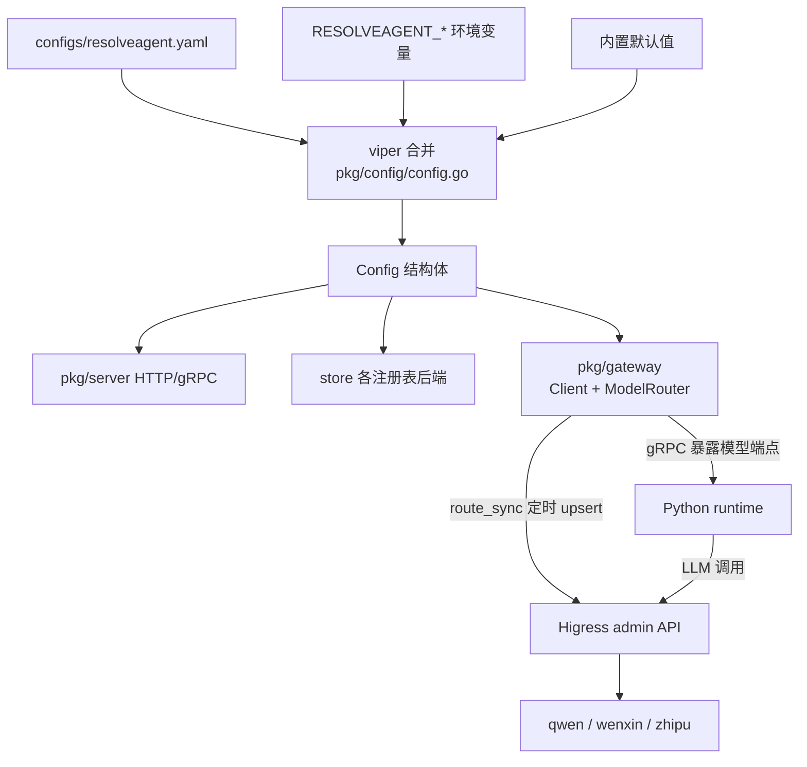

# 网关与配置体系（Gateway & Config）

> **一句话理解**：一份 viper 主配置驱动 Go 平台，路由与模型清单以 Higress 为出口单向同步。

## 职责

本模块由三块组成：配置加载（pkg/config）、网关集成（pkg/gateway）、部署形态定义（deploy/）。

- 配置加载：把 configs/resolveagent.yaml、环境变量、内置默认值合并成唯一的 Config 结构，喂给平台所有子系统 [config.go:12-74](pkg/config/config.go#L12-L74)。
- 网关集成：把 Go Registry 里的 agent/skill 路由与 LLM 模型路由单向推送到 Higress admin API，Higress 只消费不反写 [route_sync.go:13-16](pkg/gateway/route_sync.go#L13-L16)。
- 部署形态：docker-compose 面向单机全栈，helm 面向 K8s 分发，两者只做"环境注入"，不承载业务逻辑。

## 设计原理

### 三份 YAML 的分工与加载优先级

| 文件 | 面向的进程 | 实际消费者 |
|------|-----------|-----------|
| configs/resolveagent.yaml | Go 平台 | viper 加载 [config.go:48-52](pkg/config/config.go#L48-L52)；Python 侧 MCP 配置也读它的 `mcp` 段 [config.py:110-127](python/src/resolveagent/mcp/config.py#L110-L127) |
| configs/runtime.yaml | Python 运行时（预期） | 目前无代码加载，运行时实际读环境变量 [__main__.py:23-24](python/src/resolveagent/runtime/__main__.py#L23-L24) |
| configs/models.yaml | 模型清单（预期） | 自述"声明式元数据，ModelRegistry 消费尚未接线" [models.yaml:3-5](configs/models.yaml#L3-L5) |

加载优先级：内置默认值 → 配置文件 → `RESOLVEAGENT_` 前缀环境变量，后者自动覆盖前者 [config.go:56-58](pkg/config/config.go#L56-L58)。文件不存在不报错，只有格式非法才致命 [config.go:61-65](pkg/config/config.go#L61-L65)。开发环境由 setup 脚本把 configs/resolveagent.yaml 拷到 `$HOME/.resolveagent/`，正对应 viper 的第三个搜索路径 [setup-dev.sh:46-50](hack/setup-dev.sh#L46-L50)。

这套加载有一个刻意的设计取向：**零配置可启动**。Load 在读文件前先铺了约 40 条 SetDefault，覆盖 server、database、gateway 全部关键字段 [config.go:16-43](pkg/config/config.go#L16-L43)，`DefaultConfig()` 甚至允许完全不提供文件 [config.go:78-81](pkg/config/config.go#L78-L81)。代价是 YAML 里的值与代码默认值存在两份来源，排查时要先分辨"配置没生效"还是"本来就是默认值"。

为什么拆三份而不是一份：三份文件的目标进程与生命周期不同——resolveagent.yaml 属于 Go 平台进程，runtime.yaml 属于 Python 运行时，models.yaml 是无主的模型清单；三份拆分保留的是"进程边界"，不是"环境边界"。且敏感信息（数据库密码、JWT secret）被刻意从 YAML 挪到环境变量 [resolveagent.yaml:13-14](configs/resolveagent.yaml#L13-L14)，YAML 只留结构化基线，环境差异靠 env 注入而非改文件。

> [!NOTE] 推测：runtime.yaml 与 models.yaml 是"先写配置、后接线"的占位设计。依据：runtime.yaml 的 `agent_pool`/`selector` 段在全仓无任何加载代码（Python 运行时仅读 `RESOLVEAGENT_RUNTIME_*` 等环境变量 [__main__.py:23-24](python/src/resolveagent/runtime/__main__.py#L23-L24)）；models.yaml 头部注释自述未接线 [models.yaml:3-5](configs/models.yaml#L3-L5)。

### 配置的三个"影子段"

resolveagent.yaml 里有三段内容在 Go 的 Config 结构体里找不到对应字段 [types.go:6-15](pkg/config/types.go#L6-L15)——viper Unmarshal 对未知键静默忽略 [config.go:68-70](pkg/config/config.go#L68-L70)：

- `mcp` 段：唯一被接管的影子段，由 Python 侧 mcp/config.py 在搜索路径里直接读文件解析 [config.py:110-127](python/src/resolveagent/mcp/config.py#L110-L127)，一份 YAML 两进程共读。
- `feedback` 段：pkg/feedback 的环形缓冲大小在代码里硬编码 1000 [pkg/feedback/types.go:144](pkg/feedback/types.go#L144)，与 YAML 里的 `ring_buffer_size: 1000` [resolveagent.yaml:121](configs/resolveagent.yaml#L121) 只是巧合同值，改 YAML 不生效。
- `observability_loop` 段：告警规则（如 retry_storm 触发熔断）[resolveagent.yaml:147-155](configs/resolveagent.yaml#L147-L155) 无任何加载代码。

### 部署形态：compose 与 helm

两条部署路线共享同一套环境变量注入机制，差别只在编排层：

- **docker-compose 三文件分层**：docker-compose.deps.yaml 只起 PostgreSQL/Redis/NATS 基础设施，供本地 `make compose-deps` 使用 [Makefile:196-198](Makefile#L196-L198)；docker-compose.yaml 是全栈生产形态，六服务互联、healthcheck 门控启动顺序（platform 等 postgres/redis 健康）[docker-compose.yaml:70-76](deploy/docker-compose/docker-compose.yaml#L70-L76)；docker-compose.dev.yaml 叠加源码挂载、热重载与 Milvus（RAG 开发件）[docker-compose.dev.yaml:7-11](deploy/docker-compose/docker-compose.dev.yaml#L7-L11)、[docker-compose.dev.yaml:56-68](deploy/docker-compose/docker-compose.dev.yaml#L56-L68)。
- **helm 面向 K8s 分发，但仍是骨架**：templates/ 只覆盖 platform 与 runtime 两个应用的 Deployment + Service，探针指向 `/api/v1/health` [platform-deployment.yaml:29-38](deploy/helm/resolveagent/templates/platform-deployment.yaml#L29-L38)。values.yaml 里声明的 webui、ingress、postgresql/redis/nats 都没有对应模板，Chart.yaml 也没有 dependencies 段——这些键目前是占位，打开不生效。资源配额刻意不对称：runtime 上限 2Gi 内存远高于 platform 的 512Mi [values.yaml:12-34](deploy/helm/resolveagent/values.yaml#L12-L34)；webui 连 resources 段都没配 [values.yaml:36-43](deploy/helm/resolveagent/values.yaml#L36-L43)。

> [!NOTE] 推测：runtime 配额放大是因为 Agent 编排与 RAG 链路的内存峰值远高于纯 API 门面的 Go 平台。依据：values.yaml 中的数值差异；未找到容量规划文档佐证。

环境差异注入遵循同一条路径：compose 模板把 `RESOLVEAGENT_*` 变量成组透传，viper 的 AutomaticEnv 完成覆盖 [config.go:56-58](pkg/config/config.go#L56-L58)，因此"换环境"= 换 env 文件，不动 YAML。helm 路线暂无等价机制——两个 Deployment 模板都没有 env 段，这是它仍是骨架的另一处证据。

### Higress 选型与同步语义

选型动因与集成模式记录在 ADR：候选对比 Kong/Envoy/自建后选 Higress，看重 AI 场景优化与 Wasm 扩展 [002-gateway-choice.md:27-30](docs-site/docs/adr/002-gateway-choice.md#L27-L30)；集成模式定为 "Route Sync: Go Registry → Higress" 与 "LLM Proxy: Python Runtime → Higress → LLM Providers" [002-gateway-choice.md:77-79](docs-site/docs/adr/002-gateway-choice.md#L77-L79)。

同步的数据与触发时机：

1. 平台静态路由：agents/skills/workflows/rag/health 五条 prefix 路由指向 platform:8080，随每次 Sync 全量 upsert [route_sync.go:132-195](pkg/gateway/route_sync.go#L132-L195)。
2. Agent 动态路由：从 Registry List 拉全量，为每个 agent 生成 `POST /api/v1/agents/{id}/execute` 路由指向 runtime:9091，仅 `active` 状态启用 [route_sync.go:216-233](pkg/gateway/route_sync.go#L216-L233)。
3. Skill 动态路由：同理，仅 `ready` 状态启用 [route_sync.go:253-270](pkg/gateway/route_sync.go#L253-L270)。
4. LLM 模型路由：三家 provider 的基座路由（dashscope/百度/智谱 upstream 硬编码）加每模型一条 `/llm/models/{id}` 路由 [model_router.go:165-203](pkg/gateway/model_router.go#L165-L203)。

推送的路由模型是统一抽象：HigressRoute 把路径匹配、方法、upstream、rewrite、限流、重试、超时全部收进一个结构 [client.go:56-70](pkg/gateway/client.go#L56-L70)，限流与重试作为可插拔子结构在注册时按需挂载 [client.go:87-99](pkg/gateway/client.go#L87-L99)。也就是说平台对 Higress 的认知被压缩成"CRUD 路由对象"，不暴露 Higress 特有的配置格式——未来换网关只需换 Client 实现。

触发时机是定时轮询（默认 30s ticker）加启动即同步，没有事件驱动钩子 [route_sync.go:88-106](pkg/gateway/route_sync.go#L88-L106)。失败语义是"尽力而为"：首轮同步失败只 Warn 不阻断启动 [route_sync.go:75-77](pkg/gateway/route_sync.go#L75-L77)，周期内失败记 Error 等下一轮，单条路由失败不中断同批其他路由 [route_sync.go:197-201](pkg/gateway/route_sync.go#L197-L201)。upsert 前先 Get，404 被归一化为"不存在"再 Create [client.go:145-147](pkg/gateway/client.go#L145-L147)。

> [!NOTE] 推测：RouteSync 尚未接入服务启动链路，属"已建成未通车"状态。依据：全仓 grep `NewRouteSync` 仅命中 pkg/gateway/route_sync.go 自身与测试，cmd/、internal/、pkg/server/ 均无实例化；且 pkg/gateway 下没有 route_sync_test.go。

### ModelRouter 的定位

ModelRouter 是 LLM 流量的控制面：负载均衡、按模型/租户限流、故障切换都在网关层完成而非各 agent 自行处理 [model_router.go:52-55](pkg/gateway/model_router.go#L52-L55)。Python 运行时不直接调 ModelRouter，而是经 gRPC RegistryService 的 `GetModelRoute` 拿到网关端点再走 Higress [registry_service.go:11-13](pkg/service/registry_service.go#L11-L13)、[registry_service.go:84-90](pkg/service/registry_service.go#L84-L90)。限流换算有讲究：配置给的是每分钟请求数，注册到 Higress 时除以 60 转成 RPS，限流 key 固定用 Authorization 头 [model_router.go:224-230](pkg/gateway/model_router.go#L224-L230)。

实现细节上有两处与 RouteSync 风格不一致：模型路由的 upsert 是先 Create、失败才 Update [model_router.go:93-100](pkg/gateway/model_router.go#L93-L100)，而路由同步是先 Get、404 再 Create [client.go:145-147](pkg/gateway/client.go#L145-L147)——两套 upsert 风格并存；basePath `/llm` 与默认模型 `qwen-plus` 在构造函数里硬编码 [model_router.go:67-75](pkg/gateway/model_router.go#L67-L75)，不走配置。

## 数据流

一轮同步内部是严格的顺序管线：先平台静态路由，再 agent 路由，最后 skill 路由，任一环节失败立即中止整轮 [route_sync.go:113-126](pkg/gateway/route_sync.go#L113-L126)；但环节内部的每条路由失败只记日志不传染 [route_sync.go:197-201](pkg/gateway/route_sync.go#L197-L201)。这是个值得注意的取舍——Registry List 失败会让 skill 路由整轮跳过，等 30s 后重试。

一次 agent 执行会把同一张网关走两遍：外部请求先被 Higress 的 agent 动态路由转给 runtime:9091；runtime 执行时经 gRPC `GetModelRoute` 拿到网关上的 LLM 端点 [registry_service.go:84-90](pkg/service/registry_service.go#L84-L90)，再经 Higress 按 `/llm/models/{id}` 命中模型路由打到上游 provider。用户入站与 LLM 出站共用一张路由表，这正是 ADR 里两条集成模式（Route Sync + LLM Proxy）拼在一起的样子。

## 依赖

- 上游：pkg/registry（Agent/Skill 全量列表的来源）[route_sync.go:211](pkg/gateway/route_sync.go#L211)、viper [config.go:8](pkg/config/config.go#L8)。
- 下游：Higress admin API（/health、/routes、/services）[client.go:35-54](pkg/gateway/client.go#L35-L54)。
- 部署链：deploy/docker/platform.Dockerfile、runtime.Dockerfile、webui.Dockerfile 三个镜像，由 compose 编排 [docker-compose.yaml:27-128](deploy/docker-compose/docker-compose.yaml#L27-L128)。

## 暴露接口

- `config.Load(path) (*Config, error)`：唯一加载入口，空路径走默认搜索 [config.go:12](pkg/config/config.go#L12)。
- `RouteSync.Start/Stop/Sync/RemoveRoute`：路由同步生命周期 [route_sync.go:71-86](pkg/gateway/route_sync.go#L71-L86)。
- `RouteSync.SyncService` / `Client.RegisterService` / `DeregisterService`：向 Higress 注册/注销后端服务实例 [route_sync.go:294-304](pkg/gateway/route_sync.go#L294-L304)、[client.go:196-242](pkg/gateway/client.go#L196-L242)。
- `ModelRouter.RegisterModel/GetGatewayEndpoint`：模型注册与端点换算 [model_router.go:88-108](pkg/gateway/model_router.go#L88-L108)、[model_router.go:258-263](pkg/gateway/model_router.go#L258-L263)。
- `GET /api/v1/config`：返回脱敏配置（只暴露 server 地址与 gateway.enabled）[config_handlers.go:6-17](pkg/server/config_handlers.go#L6-L17)。
- `PUT /api/v1/config`：占位，未实现，固定返回 501 [config_handlers.go:19-21](pkg/server/config_handlers.go#L19-L21)。

## 关键决策

- 敏感字段启动自检：密码为空、JWT secret 缺失只告警不拒绝启动，把"能跑起来"排在"安全"前面 [config.go:85-95](pkg/config/config.go#L85-L95)。
- 网关 Client 是 30s 超时、无重试的裸 HTTP [client.go:27-29](pkg/gateway/client.go#L27-L29)：重试职责整体上移给同步循环——失败等下一轮 30s，而不是请求层退避。
- compose 生产文件对数据库密码用 `:?` 强制注入，不留默认值 [docker-compose.yaml:47](deploy/docker-compose/docker-compose.yaml#L47)。
- helm values 里 Postgres 默认弱口令 resolveagent，仅作开箱体验基线 [values.yaml:54-59](deploy/helm/resolveagent/values.yaml#L54-L59)。

## 已知坑

- `gateway.sync_interval` 配置项存在但无人消费：RouteSync 硬编码 30s，`SetSyncInterval` 无调用方 [types.go:79](pkg/config/types.go#L79)、[route_sync.go:59](pkg/gateway/route_sync.go#L59)。
- RouteSync 的 `syncedRoutes` 字段（意图做版本/哈希对比避免重复推送）只有声明和初始化，从未被写入或读取 [route_sync.go:25](pkg/gateway/route_sync.go#L25)，当前每轮都是全量 upsert。
- dev compose 把 configs 挂到 `/etc/resolveagent` 供运行时读取 [docker-compose.dev.yaml:33-35](deploy/docker-compose/docker-compose.dev.yaml#L33-L35)，但如上所述 runtime.yaml 实际无人加载，挂载目前是仪式性的。
- compose 里 init-db.sql 被刻意不挂载，因其携带过期 schema 会打断 Go store 自身的迁移链 [docker-compose.yaml:152-155](deploy/docker-compose/docker-compose.yaml#L152-L155)。
- dev 环境 gateway 与 telemetry 被强制关闭 [docker-compose.dev.yaml:29-30](deploy/docker-compose/docker-compose.dev.yaml#L29-L30)，本地联调网关功能必须改 compose 而非 configs。
- helm 两个 Deployment 模板都没有 env 段（[platform-deployment.yaml:18-38](deploy/helm/resolveagent/templates/platform-deployment.yaml#L18-L38) 全文无 env 注入），RESOLVEAGENT_* 透传机制在 helm 路线缺失；叠加数据库模板缺位，helm 装出来的平台实际跑在 viper 默认值上。
- viper 未启用 WatchConfig（全仓 grep 无命中）：配置是启动时快照，运行期改 YAML 或环境变量都不生效，必须重启进程才能让新配置进入 Load。

## 排查指南

1. **症状**：启动即退出，日志 `Failed to load configuration`。
   定位：serve 入口报错 [serve.go:30-34](internal/cli/serve.go#L30-L34)；注意文件"不存在"会被容忍 [config.go:61-65](pkg/config/config.go#L61-L65)，出现此错说明文件存在但 YAML 非法。
   修复：校验 YAML 语法，或用 `--config` 显式指向正确文件（dev compose 即此做法 [docker-compose.dev.yaml:21](deploy/docker-compose/docker-compose.dev.yaml#L21)）。
2. **症状**：日志 `[WARN] gateway auth is enabled but jwt_secret is empty`。
   定位：敏感字段自检 [config.go:89-91](pkg/config/config.go#L89-L91)。
   修复：设置 `RESOLVEAGENT_GATEWAY_AUTH_JWT_SECRET`（compose 已预留注入口 [docker-compose.yaml:64-65](deploy/docker-compose/docker-compose.yaml#L64-L65)）。
3. **症状**：`Initial route sync failed` 或周期性 `Route sync failed`。
   定位：先 `curl {gateway.admin_url}/health` [client.go:35-54](pkg/gateway/client.go#L35-L54)；非 200 会带出 `gateway error (status %d)` [client.go:270-273](pkg/gateway/client.go#L270-L273)。另确认 `gateway.enabled`（默认 false [config.go:29](pkg/config/config.go#L29)）。
   修复：拉起 Higress admin 服务或修正 admin_url；失败本身不阻断平台，仅网关路由缺失。
4. **症状**：改了 configs/models.yaml 但运行时模型不生效。
   定位：该文件声明式未接线 [models.yaml:3-5](configs/models.yaml#L3-L5)，运行时 LLM 凭据走 env [docker-compose.yaml:100-103](deploy/docker-compose/docker-compose.yaml#L100-L103)。
   修复：改环境变量，或在代码中真正接线 ModelRegistry 前不指望此文件。
5. **症状**：Settings 页保存配置报 501。
   定位：更新接口未实现，占位返回 [config_handlers.go:19-21](pkg/server/config_handlers.go#L19-L21)。
   修复：当前版本配置只能改文件/环境变量后重启。
6. **症状**：agent 已注册且平台可查，但经网关访问 `/api/v1/agents/{id}/execute` 返回 404。
   定位：路由虽已同步，但只有 `active` 状态的 agent 会启用路由 [route_sync.go:227](pkg/gateway/route_sync.go#L227)，skill 同理要求 `ready` [route_sync.go:264](pkg/gateway/route_sync.go#L264)。
   修复：把 agent 状态置为 active，等下一轮 30s 同步。
7. **症状**：日志 `[WARN] database password is empty` 或 `[WARN] redis password is empty`。
   定位：敏感字段自检 [config.go:86-94](pkg/config/config.go#L86-L94)；平台仍会启动，但生产环境等于裸奔。
   修复：设置 `RESOLVEAGENT_DATABASE_PASSWORD` / `RESOLVEAGENT_REDIS_PASSWORD`（生产 compose 对前者强制 [docker-compose.yaml:47](deploy/docker-compose/docker-compose.yaml#L47)）。

*Last updated: 2026-09-05*
