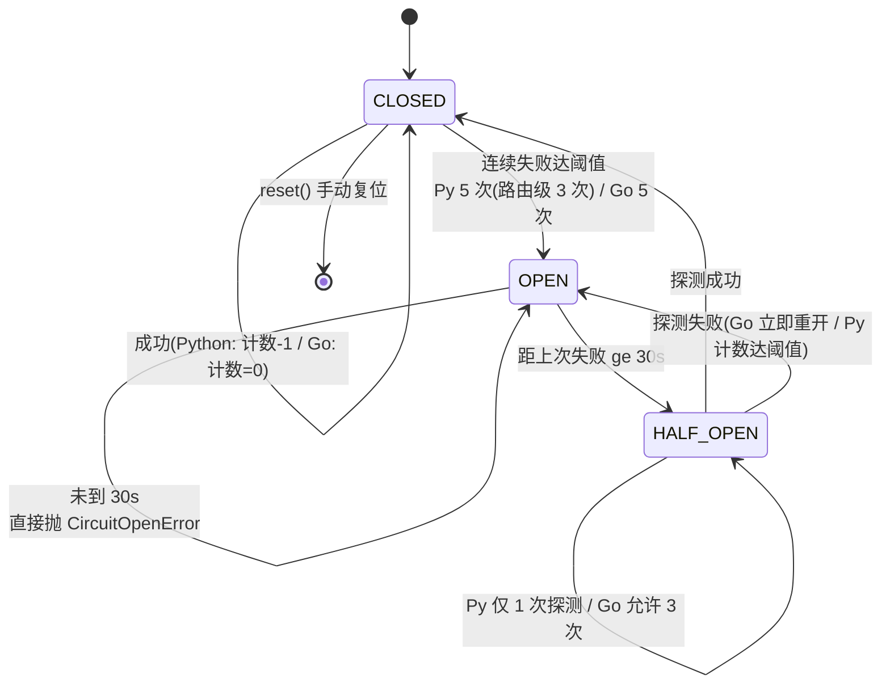

# 韧性与反馈闭环 (Resilience & Feedback Loop)

> **一句话理解**：熔断挡住级联失败、降级链兜住用户体验、反馈信号让下一次路由更聪明。

## 职责

韧性设施分布在两层：Python 侧 `resilience.py` 提供熔断器与多级降级，保护 Agent 运行时的每次路由执行；Go 侧 `pkg/circuitbreaker` 与 `pkg/feedback` 构成"Loop Engineering 自愈闭环"的信号侧——采集、聚合、告警、外发。两者没有共享代码，语义大体对齐但常量与细节不同（下文逐条对比）。

## 设计原理

### 熔断器状态机：双侧同构，细节不同

Python `CircuitBreaker` 定义 CLOSED/OPEN/HALF_OPEN 三态 [resilience.py:17-22](python/src/resolveagent/resilience.py#L17-L22)，默认阈值 failure_threshold=5、reset_timeout=30s、half_open_max_calls=1 [resilience.py:43-45](python/src/resolveagent/resilience.py#L43-L45)。Go `Breaker` 的状态机画在包注释里 [breaker.go:6-11](pkg/circuitbreaker/breaker.go#L6-L11)，默认 FailureThreshold=5、RecoveryTimeout=30s、**HalfOpenMaxCalls=3** [breaker.go:72-79](pkg/circuitbreaker/breaker.go#L72-L79)。

语义差异逐条对比：

| 行为 | Python | Go |
|------|--------|-----|
| 半开态探测请求数 | 1 次 [resilience.py:45](python/src/resolveagent/resilience.py#L45) | 3 次 [breaker.go:77](pkg/circuitbreaker/breaker.go#L77) |
| CLOSED 态成功后计数 | 递减 1（渐进冷却）[resilience.py:104](python/src/resolveagent/resilience.py#L104) | 归零（立即洗白）[breaker.go:157](pkg/circuitbreaker/breaker.go#L157) |
| 半开态探测失败 | 走统一失败计数，达到阈值再开 [resilience.py:114](python/src/resolveagent/resilience.py#L114) | 立即重开 [breaker.go:173-175](pkg/circuitbreaker/breaker.go#L173-L175) |
| 状态变更通知 | 无 | StateObserver 接口 [breaker.go:53-55](pkg/circuitbreaker/breaker.go#L53-L55) |

递减 vs 归零不是实现误差，测试显式钉住了 Python 的渐进冷却语义：`test_success_decays_failure_count_while_closed` 断言两次成功把计数从 2 降到 0 [test_resilience.py:86-94](python/tests/unit/test_resilience.py#L86-L94)。Go 侧测试则钉住"3 次失败开、探测成功关、探测失败重开、Observer 收到一次 CLOSED→OPEN"四条 [breaker_test.go:38-121](pkg/circuitbreaker/breaker_test.go#L38-L121)。

> [!NOTE] 推测：两侧重复实现是因为跨语言边界——Go 保护平台层服务（包注释自述服务于 Loop Engineering 自愈 [breaker.go:1-4](pkg/circuitbreaker/breaker.go#L1-L4)），Python 保护 Agent 路由执行；Go 侧 `circuitbreaker.New` 目前全仓只有测试引用（grep 仅命中 breaker.go 与 breaker_test.go），Observer 接口已就绪但尚未接入生产反馈链路。

### Python 熔断器的三个历史 AttributeError

`resilience.py` 里留着三处"此前误写为不存在的属性"的修复注释：`_half_open_max_calls` [resilience.py:76-79](python/src/resolveagent/resilience.py#L76-L79)、`_reset_timeout`（导致 OPEN 后永远无法恢复）[resilience.py:90-94](python/src/resolveagent/resilience.py#L90-L94)、`_failure_threshold`（达到阈值时抛 AttributeError 而不是打开熔断）[resilience.py:112-114](python/src/resolveagent/resilience.py#L112-L114)。这三个 bug 的共同根因是 dataclass 字段没有下划线前缀、实例属性有——排查同类问题时先怀疑属性名写错。并发安全也有测试背书：50 个并发失败在锁保护下计数不多不少 [test_resilience.py:116-127](python/tests/unit/test_resilience.py#L116-L127)。

### 多级降级：路由级、工具级、步骤级三层嵌套

`FallbackCascade` 按顺序尝试多个策略直到成功，全部失败返回结构化结果 [resilience.py:202-249](python/src/resolveagent/resilience.py#L202-L249)；`execute_with_circuit_breaker` 把熔断与降级缝合，OPEN 时静默返回 fallback 值 [resilience.py:280-287](python/src/resolveagent/resilience.py#L280-L287)。在 ResilientSelector 的架构里形成三层嵌套（docstring 自述 [resilient_selector.py:13-16](python/src/resolveagent/selector/resilient_selector.py#L13-L16)）：

1. **路由级**（ResilientSelector）：每个 route_type 一个独立熔断器（阈值 3 次 [resilient_selector.py:308-315](python/src/resolveagent/selector/resilient_selector.py#L308-L315)），OPEN 的路由在日志里留下 `Circuit breaker open, skipping route` 后被跳过 [resilient_selector.py:526-540](python/src/resolveagent/selector/resilient_selector.py#L526-L540)；
2. **工具级**（FallbackCascade）：单次路由内多策略尝试；
3. **步骤级**（HybridPlanner.replan）：计划内失败重规划。

### 反馈闭环：信号从哪来、到哪去

Go 侧是完整闭环，`feedback` 包注释自述闭合"observe-orient-decide-act"循环 [types.go:1-5](pkg/feedback/types.go#L1-L5)：

- **采集（隐式为主）**：预置七个信号源——health、retry、workflow、telemetry、selector、skill、circuit_breaker [types.go:42-50](pkg/feedback/types.go#L42-L50)；health 检查器状态迁移时经 `FeedbackEmitter` 自动发信号（接口解耦，典型实现是 Collector [health.go:48-51](pkg/health/health.go#L48-L51)、触发点 [health.go:99-100](pkg/health/health.go#L99-L100)）；retry 成功与耗尽也各发一条 [retry.go:70](pkg/retry/retry.go#L70)、[retry.go:115](pkg/retry/retry.go#L115)。
- **流转**：`Collector.Emit` 分配 ID/时间戳 → 压入 1000 容量环形缓冲 → 通知按 source 订阅的 handler（`"*"` 收全量）→ 逐个 Dispatcher 外发 [collector.go:52-98](pkg/feedback/collector.go#L52-L98)。Dispatcher 有 log / webhook / NATS 三种 [dispatcher.go:16-128](pkg/feedback/dispatcher.go#L16-L128)，默认只开日志 [types.go:147](pkg/feedback/types.go#L147)。
- **聚合与告警**：Aggregator 按 `(source, event)` 分桶、5 分钟滑窗统计频次与最高严重级 [aggregator.go:34-63](pkg/feedback/aggregator.go#L34-L63)、[types.go:145](pkg/feedback/types.go#L145)；AlertEngine 用 `metric_name > threshold` 字符串表达式做阈值判定 [alerts.go:150-181](pkg/feedback/alerts.go#L150-L181)。

**对 selector 的影响分两档**：

- **会话内（已接线）**：每次路由失败经 `ReEnricher` 增量注入上下文——失败路由进 `attempted_routes`、错误按 7 类关键词归因 [resilient_selector.py:173-181](python/src/resolveagent/selector/resilient_selector.py#L173-L181)、并推导路由偏好（RAG 查不到 → 转推理；超时/连不上 → 转本地分析 [resilient_selector.py:218-253](python/src/resolveagent/selector/resilient_selector.py#L218-L253)）；偏好最终在强制换路时生效 [resilient_selector.py:647-652](python/src/resolveagent/selector/resilient_selector.py#L647-L652)。置信度衰减也有真实修复：曾用上一轮已衰减值再乘轮数导致复合放大，已改为首轮基线线性衰减 [resilient_selector.py:152-159](python/src/resolveagent/selector/resilient_selector.py#L152-L159)。
- **跨会话（已实现未接线）**：`AdaptiveWeightAdjuster` 按成功率调整路由权重（学习率 0.1、钳位 [0.1, 2.0]、0.95 衰减回中性）[resilient_selector.py:692-749](python/src/resolveagent/selector/resilient_selector.py#L692-L749)，docstring 自述"设计为插进 ResilientSelector 的反馈路径" [resilient_selector.py:702-703](python/src/resolveagent/selector/resilient_selector.py#L702-L703)，但全仓无调用点。

> [!NOTE] 推测：跨会话权重学习是预留的闭环扩展点，当前真正"影响模型/路由选择"的反馈只有会话内 re-enrichment 与用户澄清（最多 2 轮的追问补充 [resilient_selector.py:332-372](python/src/resolveagent/selector/resilient_selector.py#L332-L372)，属显式反馈）。依据：`AdaptiveWeightAdjuster` 与 Go `feedback.Collector` 在 src/ 内均无消费方；用户显式输入会拼进 input_text 重新路由 [resilient_selector.py:357-365](python/src/resolveagent/selector/resilient_selector.py#L357-L365)。

## 关键决策

- **失败计数语义分侧**：Python 渐进冷却（递减）、Go 立即洗白（归零），各有测试锁定（见上表）。调参时不要假设两边行为一致。
- **熔断以 route_type 为粒度**：skill/rag/fta/code_analysis 四类路由各持独立熔断器 [resilient_selector.py:308-315](python/src/resolveagent/selector/resilient_selector.py#L308-L315)，单条链路故障不会牵连其他路由。
- **Go 反馈信号用接口解耦**：health 不直接依赖 feedback 包，而是通过 `FeedbackEmitter` 接口注入 [health.go:48-51](pkg/health/health.go#L48-L51)，避免包间环依赖。
- **降级优先保可用**：FallbackCascade 全失败也返回结构化 `FallbackResult`（success=false + error），不抛异常 [resilience.py:245-249](python/src/resolveagent/resilience.py#L245-L249)。

## 依赖

- Python：`resilience.py` 零外部依赖（纯 asyncio）；`resilient_selector` 依赖 `selector.selector` 与 `resilience.CircuitBreaker` [resilient_selector.py:26-27](python/src/resolveagent/selector/resilient_selector.py#L26-L27)。
- Go：`pkg/feedback` 依赖 `pkg/health`（反向：health 通过接口调用）、`pkg/retry`（Observer 回调）；`pkg/circuitbreaker` 无包内依赖，通过 `StateObserver` 对接 feedback。

## 暴露接口

- Python：`CircuitBreaker.call / reset / get_state_info` [resilience.py:53-150](python/src/resolveagent/resilience.py#L53-L150)；`FallbackCascade.execute / execute_with_circuit_breaker` [resilience.py:202-295](python/src/resolveagent/resilience.py#L202-L295)；`ResilientSelector.route_and_execute[_with_clarification]` [resilient_selector.py:317-372](python/src/resolveagent/selector/resilient_selector.py#L317-L372)。
- Go：`breaker.Execute(ctx, fn)` 与 `ErrCircuitOpen` [breaker.go:49](pkg/circuitbreaker/breaker.go#L49)、[breaker.go:113-122](pkg/circuitbreaker/breaker.go#L113-L122)；`Collector.Emit / Subscribe / AddDispatcher / Snapshot` [collector.go:52-118](pkg/feedback/collector.go#L52-L118)。

## 排查指南

**症状 1：日志大量 `Circuit breaker open, skipping route`，某类路由（如 rag）持续被跳过。**
→ 定位：该 route_type 的熔断器已达 3 次失败进入 OPEN [resilient_selector.py:312-315](python/src/resolveagent/selector/resilient_selector.py#L312-L315)、[resilience.py:114-119](python/src/resolveagent/resilience.py#L114-L119)；30 秒冷却后允许一次探测，探测仍失败会再开。
→ 修复：先看上游错误（`Route execution failed` 日志里的真实 error [resilient_selector.py:543-551](python/src/resolveagent/selector/resilient_selector.py#L543-L551)）修下游；确认恢复后可用 `get_state_info` 观察状态 [resilience.py:142-150](python/src/resolveagent/resilience.py#L142-L150) 或 `reset()` 手动复位 [resilience.py:131-140](python/src/resolveagent/resilience.py#L131-L140)。

**症状 2：调用返回 `error: "All fallback strategies failed"`。**
→ 定位：FallbackCascade 逐个尝试全部失败，每个策略的失败都留有 `Fallback strategy failed` warning（含 strategy 名与错误）[resilience.py:234-243](python/src/resolveagent/resilience.py#L234-L243)、[resilience.py:245-249](python/src/resolveagent/resilience.py#L245-L249)。
→ 修复：按 warning 里的逐策略错误定位最底层故障；若首策略熔断器长期 OPEN，注意 `execute_with_circuit_breaker` 返回的 `strategy_used` 会带 `_circuit_open` 后缀 [resilience.py:280-287](python/src/resolveagent/resilience.py#L280-L287)，可用它区分"策略失败"与"被熔断挡下"。

**症状 3：熔断器行为怪异——抛 AttributeError 或 OPEN 后永不恢复。**
→ 定位：这是本模块的真实历史故障群：`_failure_threshold` 拼写错导致达到阈值时抛异常而非开闸 [resilience.py:112-114](python/src/resolveagent/resilience.py#L112-L114)，`_reset_timeout` 拼写错导致 OPEN 后 `_should_attempt_reset` 必抛异常、永远无法进入半开 [resilience.py:90-94](python/src/resolveagent/resilience.py#L90-L94)。当前代码已修复，但任何字段重命名（如把 dataclass 字段加下划线）都可能复发。
→ 修复：跑 `python/tests/unit/test_resilience.py` 全量；重点盯 `test_opens_after_threshold_failures` 与 `test_half_open_then_close_on_success` 两条状态机路径 [test_resilience.py:35-59](python/tests/unit/test_resilience.py#L35-L59)。

**症状 4：Go 侧 webhook/NATS 信号丢失或 `dispatcher <name>: <err>` 报错。**
→ 定位：Collector 按 dispatcher 逐个外发，只返回第一个错误 [collector.go:91-97](pkg/feedback/collector.go#L91-L97)，后续 dispatcher 的失败被吞掉；Collector 关闭后 Emit 直接报 `feedback collector is closed` [collector.go:54-57](pkg/feedback/collector.go#L54-L57)。
→ 修复：webhook 目标不可达时先修 URL/网络 [dispatcher.go:69-92](pkg/feedback/dispatcher.go#L69-L92)；确认进程没有误调 `Close()`；默认配置只开 log dispatcher [types.go:147](pkg/feedback/types.go#L147)，看不到 webhook 信号先确认配置确实启用。

## 已知坑

- Python 与 Go 熔断常量不同源：半开探测数 1 vs 3、成功后计数递减 vs 归零（见对比表），配置迁移时需逐项核对。
- Go `pkg/circuitbreaker` 尚未接入生产链路，`StateObserver` → feedback 的自愈闭环是"接口就绪、接线未完成"状态（见推测标注）。
- `AdaptiveWeightAdjuster` 的跨会话权重学习未接线，权重不会自动影响路由 [resilient_selector.py:702-703](python/src/resolveagent/selector/resilient_selector.py#L702-L703)。
- Go 侧 `pkg/feedback`、`pkg/circuitbreaker` 均诞生于单次批量提交（git log 仅一条 `5e2bf90 update`），无细粒度演进史可考。

*Last updated: 2026-09-05*
