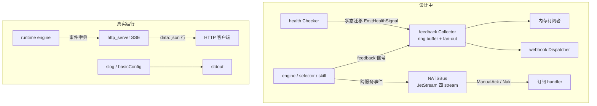

# 事件总线与可观测性 (Event Bus & Observability)

> **一句话理解**：事件总线与可观测性的零件都造好了，但多数还躺在货架上没装进机器。

## 职责

本篇覆盖 Python 侧的消息总线与 tracing 初始化，以及 Go 侧的事件、反馈信号、telemetry、health 五个包。先给结论表：

| 组件 | 位置 | 设计用途 | 生产接线 |
|---|---|---|---|
| AgentMessageBus | [message_bus.py](python/src/resolveagent/message_bus.py#L61) | Python 进程内 pub/sub + 请求-响应 | 无调用者 |
| NATSBus | [nats.go](pkg/event/nats.go#L22) | 跨服务持久化事件流（JetStream） | 无调用者 |
| Collector（反馈信号） | [collector.go](pkg/feedback/collector.go#L52) | 运行信号收集 → ring buffer + 订阅 + 外部分发 | 仅 e2e 测试 |
| 日志 | [main.go:17-20](cmd/resolveagent-server/main.go#L17) / [__main__.py:13-16](python/src/resolveagent/runtime/__main__.py#L13) | 结构化 JSON / 文本 | **已接线** |
| tracing / metrics | [tracer.go:43](pkg/telemetry/tracer.go#L43)、[metrics.go:42](pkg/telemetry/metrics.go#L42) | OTLP :4317 / Prometheus :9090 | 无调用点 |
| health Checker | [health.go](pkg/health/health.go#L65) | 就绪探针 + 状态迁移发信号 | /healthz 用的是静态 handler |

**当前唯一真实的事件通路是 SSE**：engine 执行产生的字典事件被 http_server 逐条序列化成 `data:` 行推给 HTTP 客户端 [http_server.py:216-223](python/src/resolveagent/runtime/http_server.py#L216)，代码分析端点同样把 `analyze()` 的逐步事件直透为 SSE [http_server.py:611-622](python/src/resolveagent/runtime/http_server.py#L611)。

> [!NOTE] 推测：三套总线并存是平台化演进的中途状态——Go 侧按微服务方向建了 NATS 事件面与反馈信号面，Python 侧先建了进程内总线，最终哪套胜出尚未收敛。依据：三个包代码完整且互相无引用，git log 提交信息（init / major update / update）未记录取舍决策；grep 全仓无任何生产 import。

## 设计原理：三套总线各自的形态

**Python AgentMessageBus**：单个 `asyncio.Queue` 加一个 worker 协程串行消费 [message_bus.py:102](python/src/resolveagent/message_bus.py#L102)、[message_bus.py:129-133](python/src/resolveagent/message_bus.py#L129)，按 channel 精确匹配投递 [message_bus.py:143](python/src/resolveagent/message_bus.py#L143)。在 pub/sub 之上提供请求-响应模式：`request()` 用 correlation_id 挂 Future、临时订阅 `{sender}.reply` 回复通道、超时返回 None [message_bus.py:283-309](python/src/resolveagent/message_bus.py#L283)。

**Go NATSBus**：面向跨进程持久化。启动时创建 AGENTS/SKILLS/WORKFLOWS/EXECUTIONS 四个 JetStream stream [nats.go:71-76](pkg/event/nats.go#L71)；Publish 按 `TYPE.SUBJECT` 组 subject 后进流 [nats.go:99-116](pkg/event/nats.go#L99)；Subscribe 用 `TYPE.*` 通配 subject、ManualAck 消费 [nats.go:136-163](pkg/event/nats.go#L136)。

**Go feedback Collector**：进程内同步 fan-out，是三套里完成度最高的。`Emit()` 在调用方 goroutine 内顺序完成四件事：校验关闭状态 [collector.go:54-57](pkg/feedback/collector.go#L54)、写 ring buffer [collector.go:70](pkg/feedback/collector.go#L70)、通知按 source 精确订阅与 `*` 通配订阅的 handler [collector.go:74-83](pkg/feedback/collector.go#L74)、分发给外部 Dispatcher 并包装首个错误返回 [collector.go:87-97](pkg/feedback/collector.go#L87)。信号类型清单集中在 [types.go:41-65](pkg/feedback/types.go#L41)：7 个 source（health/retry/workflow/telemetry/selector/skill/circuit_breaker）× 11 个事件（retry.exhausted、health.degraded、circuit_breaker.open 等）。

**确认语义对比**：NATSBus 是显式确认（处理失败 Nak 重投 [nats.go:142-145](pkg/event/nats.go#L142)、成功 Ack [nats.go:160-162](pkg/event/nats.go#L160)）；Collector 是调用方同步执行、错误以返回值传达、无重试；AgentMessageBus 则完全 fire-and-forget，投递失败只有一条 debug 日志。

feedback 面预定义的 11 个事件（常量定义在 [types.go:53-65](pkg/feedback/types.go#L53)），全部按「来源.结果」命名：

| 事件 | 含义 |
|---|---|
| `retry.exhausted` / `retry.success` | 重试耗尽 / 重试成功 |
| `health.degraded` / `health.down` / `health.recovered` | 健康降级 / 下线 / 恢复（由 Checker 状态迁移发出） |
| `workflow.complete` / `workflow.failed` | workflow 结束 / 失败 |
| `selector.fallback` | 路由降级发生 |
| `circuit_breaker.open` / `.half_open` / `.close` | 熔断器打开 / 半开试探 / 关闭 |

## 设计原理：日志、tracing、metrics 的实现与去向

- **日志**：Go 入口直接构造 JSON slog [main.go:17-20](cmd/resolveagent-server/main.go#L17)，没有用它自己的 [NewLogger](pkg/telemetry/logger.go#L9)（后者支持 level/format 配置但无人调用）；Python 入口是 basicConfig 文本格式 [__main__.py:13-16](python/src/resolveagent/runtime/__main__.py#L13)。
- **tracing**：[InitTracer](pkg/telemetry/tracer.go#L43) 建 OTLP/gRPC exporter，端点默认 `localhost:4317` [tracer.go:50-55](pkg/telemetry/tracer.go#L50)，exporter 连不上时降级为无 exporter 继续运行 [tracer.go:75-80](pkg/telemetry/tracer.go#L75)；[StartSpan](pkg/telemetry/tracer.go#L156) 在未初始化时返回 no-op span，所以接入点可以放心写。Python 侧对应 [init_tracing](python/src/resolveagent/telemetry/tracing.py#L15)，[create_span](python/src/resolveagent/telemetry/tracing.py#L80) 未初始化时返回 nullcontext。
- **metrics**：[InitMetrics](pkg/telemetry/metrics.go#L42) 起一个独立 Prometheus HTTP 服务（默认 :9090，路径 /metrics）[metrics.go:100-113](pkg/telemetry/metrics.go#L100)，注册请求计数、耗时直方图、agent 执行指标等 [metrics.go:132-178](pkg/telemetry/metrics.go#L132)，并提供 HTTP 中间件打点 [middleware/telemetry.go:12](pkg/server/middleware/telemetry.go#L12)。

能被 :9090 暴露的指标清单（命名带服务名前缀，见 [metrics.go:136](pkg/telemetry/metrics.go#L136)）：

| 指标 | 类型 | 锚点 |
|---|---|---|
| `<svc>_requests_total` | Counter | [metrics.go:134-142](pkg/telemetry/metrics.go#L134) |
| `<svc>_request_duration_seconds` | Histogram（1ms 到 10s 桶） | [metrics.go:145-151](pkg/telemetry/metrics.go#L145) |
| `<svc>_active_requests` | Gauge | [metrics.go:154-159](pkg/telemetry/metrics.go#L154) |
| `<svc>_agent_executions_total` | CounterVec（agent_id × status） | [metrics.go:162-168](pkg/telemetry/metrics.go#L162) |
| `<svc>_agent_latency_seconds` | HistogramVec（按 agent_id） | [metrics.go:171-178](pkg/telemetry/metrics.go#L171) |
| `<svc>_go_goroutines` / `<svc>_go_memory_alloc_bytes` | GaugeFunc | [metrics.go:181-201](pkg/telemetry/metrics.go#L181) |

打点入口是包级函数（`RecordRequest` / `RecordAgentExecution` / `IncActiveRequests` [metrics.go:226-256](pkg/telemetry/metrics.go#L226)），未初始化时静默 no-op，调用方无需判空。

**接线现状（grep 验证）**：`InitTracer`、`InitMetrics`、`TelemetryMiddleware`、`NewNATSBus` 在 cmd/、internal/、pkg/ 的生产代码中零调用点；Python 的 `init_tracing` 同样无生产调用者。也就是说 tracing 与 metrics 目前导不出任何数据。

## 关键决策

### health → feedback 信号闭环

health 包预留了把状态变化喂回反馈系统的接口：`SetFeedbackEmitter` 的注释明确写着「close the health observe loop」[health.go:62-64](pkg/health/health.go#L62)，`Run()` 在组件状态迁移（UP→DOWN 等）时调 `EmitHealthSignal` [health.go:99-110](pkg/health/health.go#L99)。[feedback_loop_test.go:20](test/e2e/feedback_loop_test.go#L20) 有一条完整的反馈环 e2e 测试佐证这是有意设计，而非顺手加的钩子。这套闭环的开发完成度高于其余总线——但 Checker 本身仍未挂上真实路由。

### NATS 消费失败一律 Nak 重投

Subscribe 回调里 unmarshal 失败立即 `msg.Nak()` [nats.go:142-145](pkg/event/nats.go#L142)，handler 执行成功才 Ack。没有毒丸（poison pill）隔离与重试上限，坏消息会被 JetStream 无限重投。

## 依赖

**上游（谁被观测 / 谁发事件）**：runtime engine（SSE 事件源）、health Checker（信号源，设计中）、retry / circuit breaker / selector（事件类型清单中的预设来源 [types.go:41-50](pkg/feedback/types.go#L41)）。

**下游（观测数据去哪）**：

- 日志 → stdout（JSON / 文本）；
- metrics → Prometheus :9090（`InitMetrics` 被调用后）；
- tracing → OTLP collector :4317；
- feedback 信号 → webhook Dispatcher（非 2xx 视为失败 [dispatcher.go:87-89](pkg/feedback/dispatcher.go#L87)）与内存订阅者。

## 暴露接口

- `AgentMessageBus.publish()` / `subscribe()` / `request()`：进程内 pub/sub 与请求-响应 [message_bus.py:247](python/src/resolveagent/message_bus.py#L247)；
- `event.Bus` 接口（Publish / Subscribe / Close）[event.go:15-22](pkg/event/event.go#L15)，NATSBus 为其唯一实现；
- `feedback.Collector.Emit()` / `Subscribe()`：信号采集入口 [collector.go:52](pkg/feedback/collector.go#L52)；
- `health.Checker.Run()` 与 `/healthz`、`/readyz` handler 工厂 [health.go:118-139](pkg/health/health.go#L118)；
- `telemetry.InitTracer()` / `InitMetrics()` / `StartSpan()` / `RecordRequest()`；
- SSE 端点：`POST /v1/agents/{agent_id}/execute` [http_server.py:204](python/src/resolveagent/runtime/http_server.py#L204) 与 `/v1/code-analysis/static`。

## 排查指南

**症状 1：调用 Emit 返回 `feedback collector is closed`**
定位：[collector.go:54-57](pkg/feedback/collector.go#L54) 的关闭闸门——`Close()` 之后任何 Emit 都被拒绝。多见于 shutdown 顺序问题：先关了 collector，异步任务还在发信号。
修复：调整关闭顺序（先停任务再关 collector）；对延迟到达的信号在调用方忽略该错误。

**症状 2：NATS 日志反复刷 `Failed to unmarshal event data`，同一条消息不断重投**
定位：[nats.go:142-145](pkg/event/nats.go#L142)——unmarshal 失败的消息被 Nak 回队列，而格式错误是永久性的，Nak 只会再遇到它。
修复：修复生产者序列化格式；临时止血可在 handler 入口对 unmarshal 失败的消息改为 Ack + 记录死信（需改代码，当前无开箱死信队列）。

**症状 3：服务明显异常，但 `/healthz` 和 `/api/v1/health` 始终返回 healthy**
定位：两个路由挂的都是**静态** handler——直接写死 `{"status": "healthy"}` [system_handlers.go:9-14](pkg/server/system_handlers.go#L9)，挂载点见 [router.go:8-9](pkg/server/router.go#L8)。带真实检查逻辑的 `ReadinessHandler` [health.go:127-139](pkg/health/health.go#L127) 没有被注册到任何路由。
修复：路由切换为 `health.ReadinessHandler(checker)`，并在 checker 上 `Register` 各组件探针、`SetFeedbackEmitter` 接上反馈环。

**症状 4：feedback webhook 日志出现 `webhook returned status 4xx`**
定位：[dispatcher.go:87-89](pkg/feedback/dispatcher.go#L87) 把非 2xx 视为分发失败并向上冒泡（最终成为 Emit 的返回错误 [collector.go:93-94](pkg/feedback/collector.go#L93)）。
修复：检查接收方鉴权与 payload 格式；webhook 本身无重试，需要可靠送达就在接收端或调用方补重试。

## 已知坑

- **三套总线全部未接线**：`NewNATSBus`、`feedback.NewCollector` 只有 test/e2e 引用，`message_bus.py` 在 src 下零 import（grep 验证）。平台当前没有内部事件机制，跨组件协作全靠直接函数调用，事件面上的订阅/重放/审计能力均不可用。
- **AgentMessageBus 的通配符承诺没兑现**：`subscribe()` 的 docstring 声称支持 `code_analysis.*` 通配符 [message_bus.py:200](python/src/resolveagent/message_bus.py#L200)，实现是字典精确匹配 [message_bus.py:143](python/src/resolveagent/message_bus.py#L143)，通配订阅会静默收不到任何消息。另外消息的 priority 字段 [message_bus.py:42](python/src/resolveagent/message_bus.py#L42) 从未被消费，单 worker 纯 FIFO。
- **OTel metrics 是条死路**：`InitMetrics` 建了 MeterProvider 后直接 `_ = meterProvider` 丢弃 [metrics.go:86-94](pkg/telemetry/metrics.go#L86)，ManualReader 永不被读——OTel 管道产生的任何指标都进不了 :9090；真正能被 Prometheus 抓到的只有 promauto 注册到独立 registry 的那批。
- **中间件与网关模式未启用**：`TelemetryMiddleware` [middleware/telemetry.go:12](pkg/server/middleware/telemetry.go#L12) 无挂载点；`InitTracer`/`InitMetrics` 无调用点。即使未来接线，Prometheus 与 OTLP 两个导出口也需要部署侧配套。

*Last updated: 2026-09-05*
