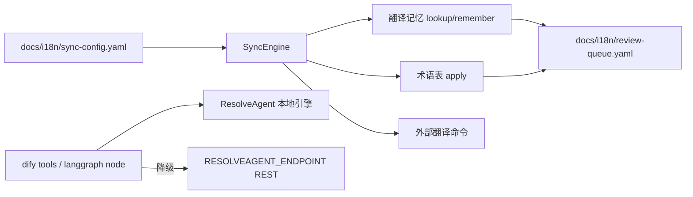

# 文档同步与外部集成（DocSync & Integrations）

> **一句话理解**：双语文档靠记忆库自愈同步，诊断能力靠插件外销给 Dify 和 LangGraph。

本文是浅度分析，仅覆盖职责、接口与排查入口。

## 职责

### docsync：双语文档同步引擎

python/src/resolveagent/docsync/ 负责中英双语文档对的自动同步。核心是 SyncEngine——加载 docs/i18n/sync-config.yaml 里声明的文档对，对比快照哈希决定同步方向，双向都改则停手进冲突审查 [engine.py:457-505](python/src/resolveagent/docsync/engine.py#L457-L505)。翻译走三级管道：翻译记忆精确命中 → 外部翻译命令（可配置任意 CLI）→ 无路可走抛错 [engine.py:111-156](python/src/resolveagent/docsync/engine.py#L111-L156)；术语表在翻译结果上强制统一用词。产出的未决问题落在 docs/i18n/review-queue.yaml 供人工裁决。

方向决策是一个小型状态机，几个关键分支都有设计意图：

- **bootstrap**：首次遇到已双语齐全的文档对时，不翻译，而是把现有对齐段落双向灌入翻译记忆，作为后续同步的基线；段落数对不上会拒绝引导 [engine.py:346-382](python/src/resolveagent/docsync/engine.py#L346-L382)。
- **conflict 冻结**：双端哈希都变了就写入"检测到双向同时修改，已停止自动覆盖"并落盘审查队列，绝不自动选边 [engine.py:480-490](python/src/resolveagent/docsync/engine.py#L480-L490)。
- **单向对保护**：`sync_mode` 配成 source_to_target 的对，目标侧被人工改动时不覆盖，只发 warning 条目 [engine.py:496-504](python/src/resolveagent/docsync/engine.py#L496-L504)、[models.py:96-105](python/src/resolveagent/docsync/models.py#L96-L105)。

快照是整个状态机的"记忆"：每次同步落盘后会重读双端文件，把两边哈希、方向、时间写回状态文件 `docs/i18n/.sync-state.json` [engine.py:309-317](python/src/resolveagent/docsync/engine.py#L309-L317)、[sync-config.yaml:4](docs/i18n/sync-config.yaml#L4)；下次运行全靠和这份快照比哈希来判定"哪边变了"。没有任何快照时走首向判定——双侧都空则跳过、单侧有内容就朝另一侧翻、双侧齐全且可对齐则 bootstrap [engine.py:466-475](python/src/resolveagent/docsync/engine.py#L466-L475)。

翻译记忆是段落级精确匹配：lookup 按（方向, 原文）逐字段比对返回译文 [engine.py:69-73](python/src/resolveagent/docsync/engine.py#L69-L73)，remember 命中同源文则覆盖、否则追加并立即落盘 [engine.py:75-94](python/src/resolveagent/docsync/engine.py#L75-L94)。这意味着原文改一个字符就会 miss——这正是外部翻译命令兜底存在的意义。仓库默认 translator.kind 为 memory、command 留空、超时 120s，`watch` 的轮询间隔默认只有 1 秒 [sync-config.yaml:6-10](docs/i18n/sync-config.yaml#L6-L10)。

分段与语言判定交给可插拔处理器：按 file_type 取 Markdown 等处理器 [processors.py:288](python/src/resolveagent/docsync/processors.py#L288)，用 CJK 字符启发式判断"这段是不是还没翻" [processors.py:296](python/src/resolveagent/docsync/processors.py#L296)。双向同步与冲突检测、术语别名校验都有单测钉死行为 [test_docsync.py:27](python/tests/unit/test_docsync.py#L27)、[test_docsync.py:170](python/tests/unit/test_docsync.py#L170)。`watch` 子命令是纯轮询：sync + proofread 后 sleep 配置间隔 [engine.py:230-235](python/src/resolveagent/docsync/engine.py#L230-L235)。

### integrations：诊断能力外销

python/src/resolveagent/integrations/ 把平台诊断能力二次封装给外部编排框架：dify 包提供 FTAAnalyzerTool 与 CodeDiagnosisTool，本地引擎失败自动降级调远端 REST API [tools.py:41-45](python/src/resolveagent/integrations/dify/tools.py#L41-L45)；langgraph 包把 BaseAgent 包成图节点 [node.py:11-14](python/src/resolveagent/integrations/langgraph/node.py#L11-L14)。仓库根 integrations/dify/resolveagent-dify/ 是可打包上传的 Dify 插件本体（manifest + provider + tools 声明）[manifest.yaml:1-9](integrations/dify/resolveagent-dify/manifest.yaml#L1-L9)。

## 暴露接口

- **CLI**：安装后命令 `resolveagent-docsync` [pyproject.toml:33-35](python/pyproject.toml#L33-L35)。

| 子命令 | 作用 | 入口 |
|--------|------|------|
| sync | 同步变更的文档对（可 --pair 指定单个） | [cli.py:25-26](python/src/resolveagent/docsync/cli.py#L25-L26) |
| watch | 轮询式持续 sync + proofread | [cli.py:28-30](python/src/resolveagent/docsync/cli.py#L28-L30) |
| proofread | 结构/未翻译/术语三查，结果写入审查队列 | [cli.py:32-33](python/src/resolveagent/docsync/cli.py#L32-L33) |
| glossary list/add | 术语表维护 | [cli.py:35-42](python/src/resolveagent/docsync/cli.py#L35-L42) |
| review list/resolve | 查看/标记解决人工审查项 | [cli.py:44-49](python/src/resolveagent/docsync/cli.py#L44-L49) |

`--config` 相对路径按 workspace 根解析 [cli.py:58-64](python/src/resolveagent/docsync/cli.py#L58-L64)。

- **SyncOutcome 状态语义**：`sync` 对每个文档对返回四种 status——`noop`（无有效变更）、`synced`（翻译完成）、`bootstrapped`（基线已建立）、`conflict`（冻结待人工）[engine.py:287-324](python/src/resolveagent/docsync/engine.py#L287-L324)；脚本化消费时按 status 分流即可，不用重新解析文件。
- **库入口**：`from resolveagent.docsync import SyncEngine` [__init__.py:1-4](python/src/resolveagent/docsync/__init__.py#L1-L4)。
- **外部翻译命令契约**：子进程经 stdin 收一段 JSON（source_text/source_lang/target_lang/pair_id/file_type）[engine.py:167-181](python/src/resolveagent/docsync/engine.py#L167-L181)，退出码非 0 报错并透传 stderr [engine.py:182-187](python/src/resolveagent/docsync/engine.py#L182-L187)；stdout 可为纯文本，或含 `translation` 字段的 JSON [engine.py:188-194](python/src/resolveagent/docsync/engine.py#L188-L194)。任何输出合法 JSON 的 CLI/脚本都能当翻译后端。
- **sync-config.yaml 文档对声明**：id、source/target 路径、file_type、语言方向、sync_mode，加 proofread 三开关（结构/术语/未翻字符）[sync-config.yaml:11-22](docs/i18n/sync-config.yaml#L11-L22)。
- **Dify 工具**：FTAAnalyzerTool.invoke / CodeDiagnosisTool.invoke，远端模式依赖 `RESOLVEAGENT_ENDPOINT` 与 `RESOLVEAGENT_API_KEY` 两个环境变量 [tools.py:102-103](python/src/resolveagent/integrations/dify/tools.py#L102-L103)。
- **LangGraph 节点**：`ResolveAgentNode(agent, node_name, output_key)`，async 可调用对象 [node.py:34-49](python/src/resolveagent/integrations/langgraph/node.py#L34-L49)。
- **状态文件**（全部在 docs/i18n/ 下，即事实上的对外数据契约）：sync-config.yaml（文档对声明 [sync-config.yaml:11-14](docs/i18n/sync-config.yaml#L11-L14)）、translation-memory.yaml、glossary.yaml、review-queue.yaml、.sync-state.json（快照 [sync-config.yaml:4](docs/i18n/sync-config.yaml#L4)）。

## 排查指南

出问题了按下面的顺序看，不展开完整路径：

- 同步结果不对 / 有文档没被翻译：先 `resolveagent-docsync review list` 看 review-queue.yaml 里的未决项；"检测到双向同时修改"意味着冲突已冻结，等人工合并 [engine.py:480-490](python/src/resolveagent/docsync/engine.py#L480-L490)。
- 报 `MissingTranslationError`：某段既无记忆命中也没配翻译命令，按报错提示配 `defaults.translator.command` 或预置记忆 [engine.py:155](python/src/resolveagent/docsync/engine.py#L155)。
- 报 `Unable to bootstrap pair ... segment counts diverge`：双语段落结构没对齐，bootstrap 被拒绝；先人工对齐段落数再重跑 [engine.py:350-355](python/src/resolveagent/docsync/engine.py#L350-L355)。
- 翻译命令失败：错误信息就是子进程 stderr 原文，直接看它 [engine.py:182-187](python/src/resolveagent/docsync/engine.py#L182-L187)。
- 译稿结构错乱 / 残留中文：proofread 会写入"结构签名不一致"与"英文稿仍检测到中文字符"两类条目 [engine.py:413-433](python/src/resolveagent/docsync/engine.py#L413-L433)。
- Dify 工具返回 `Remote analysis failed`：检查 `RESOLVEAGENT_ENDPOINT` 是否可达、API key 是否有效 [tools.py:121](python/src/resolveagent/integrations/dify/tools.py#L121)。
- 指定了不存在的 pair id：报 `Unknown sync pair`，对照 sync-config.yaml 里的 id [engine.py:262-269](python/src/resolveagent/docsync/engine.py#L262-L269)。
- 突然对现有双语文档重新 bootstrap / 同步结果"失忆"：状态文件 `.sync-state.json` 缺失或损坏时引擎没有可比基准，会把现状当首次引导处理 [engine.py:466-475](python/src/resolveagent/docsync/engine.py#L466-L475)；文件不存在时静默当作无快照 [engine.py:536-538](python/src/resolveagent/docsync/engine.py#L536-L538)。修复动作：恢复该文件，或接受一次 bootstrap 重建基线。
- `watch` 模式下日志/磁盘持续跳动：默认 `poll_interval_seconds` 只有 1 秒 [sync-config.yaml:6](docs/i18n/sync-config.yaml#L6)，每秒全量跑一遍 sync + proofread，属预期行为但代价不低。修复动作：调大该值，或改用定时任务触发一次性 `sync`。

*Last updated: 2026-09-05*
