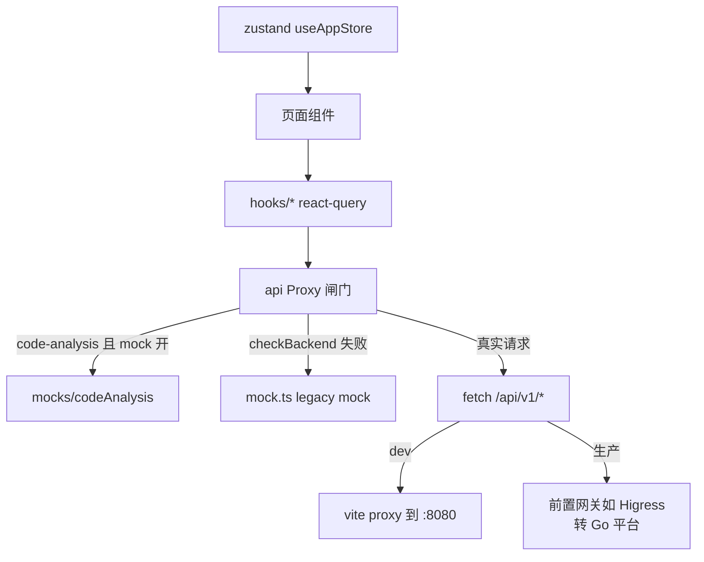

# Web 前端（React SPA）

> **一句话理解**：为"静态托管也能演示"而生的 SPA——后端在就吃真数据，不在就整层 mock。

## 职责

web/src 是平台的控制台：47 条路由覆盖 Agent 全生命周期、技能、工作流、RAG、方案库、代码分析、监控与架构展示页 [App.tsx:62-108](web/src/App.tsx#L62-L108)。它只通过 `/api/v1` 相对路径与 Go 平台通信 [client.ts:48](web/src/api/client.ts#L48)，不直连 Python runtime，也不持有任何业务规则——前端是纯消费方。目录按域组织：pages/ 下按后端域建目录（Agents、Workflows、RAG、Solutions、CodeAnalysis 等 20 余个），页面与所属子组件就近放置；跨页复用的展示组件（MetricCard、StatusBadge、DataTable、PageHeader、TreeEditor、TrafficGraph）收在 components/，radix-ui 原语包装在 components/ui/。

分层边界清晰且被物理目录固化：类型定义单点收在 web/src/types/（854 行，Agent 类型即从此处分发）[types/index.ts:1-4](web/src/types/index.ts#L1-L4)；页面禁止直接 fetch，必须经 hooks/* 的 react-query 封装；UI 组件库用 shadcn/ui 形态（radix-ui 原语 + cva 组合，见 [package.json:15-38](web/package.json#L15-L38) 的依赖清单）；MainLayout 作为全局壳承载侧栏与命令面板 [App.tsx:3](web/src/App.tsx#L3)。

## 设计原理

### 通信契约：client.ts 封装了什么

- **统一基址与错误归一**：所有请求走 `request<T>()`，非 2xx 一律抛 `Error(message)`，message 取自后端 JSON 的 message 字段，兜底 statusText [client.ts:90-105](web/src/api/client.ts#L90-L105)。调用方拿到的永远是带可读信息的异常，不用各自判 res.ok。
- **没有鉴权头**：request 只设 Content-Type，不注入 Authorization/token [client.ts:91-97](web/src/api/client.ts#L91-L97)，全仓也没有登录路由与 401 拦截。鉴权被外置给网关层（Higress JWT/API Key，见 11-gateway-config 篇），前端刻意保持无状态。
- **后端探测防"假 200"**：`checkBackend()` 请求 /health 并要求响应能解析出 JSON 对象——因为静态托管域名会把未知路径 SPA fallback 成 200 的 index.html，只看状态码会把"没有后端"误判为"后端健康" [client.ts:67-75](web/src/api/client.ts#L67-L75)。探测是单飞的：并发请求共享同一个 in-flight promise，不会重复打 /health [client.ts:52-56](web/src/api/client.ts#L52-L56)；结果缓存 30s，到期在 finally 里重置为 null，下次请求重新探测 [client.ts:82-84](web/src/api/client.ts#L82-L84)、[client.ts:84](web/src/api/client.ts#L84)。
- **Proxy 化的 mock 闸门**：`api` 不是普通对象而是 Proxy，每个方法调用前按优先级分流：code-analysis 专用 mock → 后端探测失败时的 legacy mock → 真实请求 [client.ts:376-414](web/src/api/client.ts#L376-L414)。mock 模块是动态 import 的，生产无后端场景才加载 [client.ts:326-341](web/src/api/client.ts#L326-L341)。
- **真实请求无超时**：全 client 只有探测请求带 `AbortSignal.timeout(1500)` [client.ts:58-61](web/src/api/client.ts#L58-L61)，`request()` 本身既无超时也无重试。后端握手卡死时该请求会一直 pending，超时控制完全交给浏览器默认行为与 react-query 的重试。
- **类型契约手工镜像**：web/src/types/ 的接口类型是照后端 schema 手写的（854 行），web 目录 grep 不到任何 openapi/swagger/codegen 痕迹。后端改字段必须同步手改 types/，没有编译期联动，是纯人工契约。
- **没有流式**：agent 执行是一次性 POST 拿完整响应 [client.ts:162-166](web/src/api/client.ts#L162-L166)，全仓无 EventSource/WebSocket/getReader。Playground 页据此直接 await executeAgent [Playground/index.tsx:254-256](web/src/pages/Playground/index.tsx#L254-L256)。

### 为什么独立成 SPA 而不是服务端渲染

三处证据同向：commit ada51a1 的说明明确写了"HashRouter + base:'./' + VITE_MOCK_FALLBACK 生产 mock 回退 + checkBackend JSON 校验"是为 Meoo 静态部署（CDN 无后端）配套；mockRuntime.ts 头部注释自述"生产构建也启用 mock 回退，用于无后端的静态演示部署（如 meoo CDN）" [mockRuntime.ts:3-4](web/src/api/mockRuntime.ts#L3-L4)；生产镜像是纯 Nginx 静态服务 [webui.Dockerfile:27](deploy/docker/webui.Dockerfile#L27)。HashRouter [main.tsx:21](web/src/main.tsx#L21) 加相对 base [vite.config.ts:8](web/vite.config.ts#L8) 让产物可以丢进任意静态目录，不需要服务端路由配合——SSR 框架（Next/Remix）与这套"CDN 丢文件即用"的目标直接冲突。

部署链路的最后一段在 nginx：生产镜像把 dist 交给 nginx [webui.Dockerfile:38-39](deploy/docker/webui.Dockerfile#L38-L39)，配置只做三件事——静态资源一年 immutable 缓存 [default.conf:12-15](deploy/docker/nginx/default.conf#L12-L15)、SPA fallback [default.conf:17-20](deploy/docker/nginx/default.conf#L17-L20)、自身文本探活 /health [default.conf:23-27](deploy/docker/nginx/default.conf#L23-L27)。这份配置没有 /api 反代：容器化 webui 单独部署时，API 流量要靠 Higress 等前置网关转给 platform；同源的 `/api/v1/*` 会被 fallback 吞成 index.html，checkBackend 的 JSON 校验正是为这种"假 200"兜底 [client.ts:67-75](web/src/api/client.ts#L67-L75)。

> [!NOTE] 推测：compose 全栈形态下若绕过网关直接访问 webui 端口，前端会整层退到 mock。依据：nginx 配置无 /api 反代 [default.conf:17-20](deploy/docker/nginx/default.conf#L17-L20) + checkBackend 对 HTML 响应判死 [client.ts:67-75](web/src/api/client.ts#L67-L75)；未实测容器内行为。

> [!NOTE] 推测：选 Vite SPA 还有团队栈与迭代速度的考量（无 SSR 经验包袱、构建产物小）。依据：package.json 从 init 起就是 vite+react 组合且从未出现 SSR 依赖（[package.json:20-37](web/package.json#L20-L37)），但没有决策记录佐证，此半句为推断。

### 状态管理选型与划分逻辑

选型是 zustand 5 + @tanstack/react-query 5 [package.json:25](web/package.json#L25)、[package.json:37](web/package.json#L37)。划分逻辑按"状态归属"切三份：

1. **服务端态 → react-query**：所有 API 数据用 useQuery/useMutation 包，key 即缓存坐标，例如 agents 列表与详情 [useAgents.ts:5-16](web/src/hooks/useAgents.ts#L5-L16)。九个 hooks 文件按后端域分文件，前端没有手写的数据缓存。写路径统一走"mutation 成功后失效"：创建失效整个列表 key [useAgents.ts:42](web/src/hooks/useAgents.ts#L42)，更新同时失效列表与详情两个 key [useAgents.ts:53-54](web/src/hooks/useAgents.ts#L53-L54)——跨页面一致性靠 queryKey 失效广播，不靠事件总线。
2. **全局 UI 态 → 唯一的 zustand store**：侧栏开合、选中 agent、命令面板、主题四项 [app.ts:26-40](web/src/stores/app.ts#L26-L40)。只有侧栏与主题参与 localStorage 持久化，瞬态字段被 partialize 排除 [app.ts:41-47](web/src/stores/app.ts#L41-L47)；主题还原时直接改 documentElement 的 class [app.ts:17-24](web/src/stores/app.ts#L17-L24)。
3. **URL 态 → react-router**：agent id、workflow id 等实体选择全在路径参数里 [App.tsx:70-82](web/src/App.tsx#L70-L82)，可分享可刷新。

没有引入 redux/mobx 之类的全局容器：依赖清单里只有 zustand 一个状态库 [package.json:15-38](web/package.json#L15-L38)，stores/ 目录也只有一个 app.ts。状态放哪由"谁的数据"决定，而不是建一个大 store——这正是 react-query 5 接管服务端态之后 zustand 只剩 UI 态的自然结果。

> [!NOTE] 推测：选 zustand 而非 redux 是体积与样板代码考量（无中间件需求，persist 一个中间件就够）。依据：唯一用到的 zustand 中间件就是 persist [app.ts:27](web/src/stores/app.ts#L27)；无决策记录佐证。

QueryClient 全局配置 30s staleTime 加 1 次重试 [main.tsx:12-13](web/src/main.tsx#L12-L13)，与 checkBackend 的 30s 缓存同频——页面轮询压力刻意压在"半分钟一次"量级。

### 页面与 API 消费对照

| 路由 | 页面 | 主要消费的 API |
|------|------|---------------|
| / | Home（首屏，非 lazy） | 不发请求，纯展示 |
| /dashboard | 总览 | /dashboard/metrics、/dashboard/agents、/activity、/alerts |
| /agents 及子页 | Agent 管理（14 条子路由） | /agents、/agents/:id/executions、/memory、/deployment |
| /workflows | 工作流 | /workflows、/workflows/:id/fault-tree（FTA 编辑） |
| /rag/* | 语料管理 | /rag/collections、/rag/documents |
| /solutions | 方案库 | /solutions CRUD + /solutions/search |
| /code-analysis | 代码分析 | /call-graphs、/traffic/*（默认走 mock，见已知坑） |
| /playground | 对话调试 | /agents/:id/execute（一次性 POST） |
| /traces、/monitoring、/evaluation | 观测与评测 | /traces、/monitoring/overview |
| /settings | 设置 | /config（只读，保存接口未实现） |
| /architecture/* | 架构展示页群 | 不依赖后端，静态图文与 SVG 图解 |

表格之外还有 /demo、/mobile、/database、/database-schema 等展示型路由 [App.tsx:92-107](web/src/App.tsx#L92-L107)。注意架构展示页群（/architecture/selector、/fta-engine 等）不调 API，是"文档可视化"，与控制台功能页职责不同。

## 数据流

以 Dashboard 打开为例走一遍完整链路：路由命中 lazy 加载的页面块 [App.tsx:6](web/src/App.tsx#L6) → useDashboard 系 hooks 以 queryKey 发起 api 调用 → Proxy 先试 code-analysis mock（非该域则跳过）→ checkBackend 探测通过后直连真实方法 → fetch `/api/v1/dashboard/metrics` → 非 2xx 归一为 Error 交给 react-query 重试一次后抛给页面。mock 探测结果被 30s 缓存，链路中只有第一跳有额外开销 [client.ts:54-88](web/src/api/client.ts#L54-L88)。若探测失败，同一链路在 Proxy 处拐进 mock：动态 import mock 模块 [client.ts:326-341](web/src/api/client.ts#L326-L341) 返回写死数据，页面组件无感。

## 依赖

- 运行时：react 18、react-router-dom 7、zustand 5、@tanstack/react-query 5、radix-ui 系（shadcn/ui 底座）、tailwindcss 3。
- 构建链：vite 6 + vitest 2（jsdom）[vite.config.ts:23-26](web/vite.config.ts#L23-L26)；dev server 固定 5174 端口并把 /api 代理到 Go 平台 8080 [vite.config.ts:14-21](web/vite.config.ts#L14-L21)。
- 测试工具链：vitest 2 + jsdom + @testing-library/react、jest-dom、user-event [package.json:41-43](web/package.json#L41-L43)、[package.json:59](web/package.json#L59)；mock 开关行为、hooks、纯展示组件三层都有单测（[mockRuntime.test.ts:8-60](web/src/api/mockRuntime.test.ts#L8-L60)、useSkills.test.ts）。
- mock 数据层：api/mock.ts（legacy 全量 mock）与 src/mocks/（按域拆分的新 mock），二者并存是历史迁移的中间态。

## 暴露接口

- `api`（Proxy 对象）：约 90 个方法，覆盖 agents/skills/workflows/rag/solutions/memory/traces/monitoring/call-graphs [client.ts:108-310](web/src/api/client.ts#L108-L310)。
- `useAppStore`：全局 UI 态 store [app.ts:26](web/src/stores/app.ts#L26)。
- hooks 命名空间：useAgents/useSkills/useWorkflows/useRAG/useDashboard/useMonitoring/useCodeAnalysis/useSettings，页面禁止直接 fetch。
- mock 开关（构建期环境变量）：`VITE_MOCK_FALLBACK=1` 打开生产 mock、`VITE_ENABLE_MOCK=false` 全关、`VITE_CODE_ANALYSIS_FORCE_REAL=true` 强制 code-analysis 走真 API [mockRuntime.ts:17-22](web/src/api/mockRuntime.ts#L17-L22)。
- toast 反馈通道：页面只调 sonner 的 `toast.success/error` [AgentMemory.tsx:47-48](web/src/pages/Agents/AgentMemory.tsx#L47-L48)，呈现由 MainLayout 挂载的全局 `<Toaster />` 统一接管 [MainLayout.tsx:29](web/src/components/Layout/MainLayout.tsx#L29)、[MainLayout.tsx:119](web/src/components/Layout/MainLayout.tsx#L119)。

## 关键决策

- **mock 必须可关可留**：mockRuntime 的行为有单测钉死——dev 默认开、生产只在 fallback 标志下开、禁用标志最高优先 [mockRuntime.test.ts:8-60](web/src/api/mockRuntime.test.ts#L8-L60)。四种运行态（dev+mock 默认、dev+real、prod+fallback、prod+real）的组合只由两个布尔函数表达 [mockRuntime.ts:9-15](web/src/api/mockRuntime.ts#L9-L15)，环境变量解析集中在三行 [mockRuntime.ts:17-22](web/src/api/mockRuntime.ts#L17-L22)。
- **装配顺序固定四层**：StrictMode → QueryClientProvider → HashRouter → TooltipProvider → App [main.tsx:18-27](web/src/main.tsx#L18-L27)，QueryClient 的全局行为（staleTime 30s、retry 1）在进入组件树前定死 [main.tsx:9-16](web/src/main.tsx#L9-L16)——不存在页面级再包 Provider 的二次定制。
- **路由用 lazy 分包**：除 Home 外 47 个页面全部 lazy import [App.tsx:6-48](web/src/App.tsx#L6-L48)，统一 Suspense 转圈兜底 [App.tsx:50-56](web/src/App.tsx#L50-L56)，把 3 万行前端切成按需 chunk，服务首屏。
- **mock 分层迁移而非一刀切**：legacy 全量 mock（api/mock.ts）与按域新 mock（src/mocks/）并存，Proxy 按"新 mock 域优先、legacy 兜底"两级解析 [client.ts:317-341](web/src/api/client.ts#L317-L341)，让 code-analysis 等新域能先独立脱离 legacy。
- **后端探测结果不信任状态码**：见设计原理一节，这是静态托管特有的防御。

## 已知坑

- 仓库里有一份被误提交的 `web/src/api/client 2.ts`，无任何 import 引用，内容落后于 client.ts，属于应删的脏文件（grep 全仓仅自身命中）。
- Proxy 兜底的 catch 分支只捕同步异常：`return (realFn)(...)` 未加 await，真实请求的网络 rejection 不会进入 `catch (err)` 走 legacy mock [client.ts:399-407](web/src/api/client.ts#L399-L407)。实际兜底主要靠 checkBackend 前置探测，"请求时后端刚挂"的场景会直接把错误抛给页面。
- Go 平台侧没有任何 CORS 中间件（grep pkg/server 无命中），跨域全靠 vite 代理或网关；Python runtime 的 CORS 默认白名单是 `http://localhost:5173` [http_server.py:169-170](python/src/resolveagent/runtime/http_server.py#L169-L170)，而 web dev server 实际跑在 5174 [vite.config.ts:15](web/vite.config.ts#L15)，前端若直连 runtime 会吃 CORS 拒绝。
- 测试路由器与生产不一致：App.test.tsx 用 BrowserRouter 包 App [App.test.tsx:9](web/src/App.test.tsx#L9)，生产却是 HashRouter [main.tsx:21](web/src/main.tsx#L21)。依赖 hash 路由行为的断言在单测里根本测不到，路由回归只能靠手工验证。
- mock 数据形状无契约保护：mockRuntime 单测只钉开关优先级 [mockRuntime.test.ts:8-60](web/src/api/mockRuntime.test.ts#L8-L60)，不校验返回结构与 web/src/types/ 的一致性；后端改字段后，mock 页面会悄悄展示过期结构而不报错。
- webui 容器里有两个同名 `/health`：nginx 的 `/health` 返回纯文本 `healthy` [default.conf:23-27](deploy/docker/nginx/default.conf#L23-L27)，只证明静态服务活着；后端健康检查是 `/api/v1/health` 的 JSON。探活时 curl 错路径会得到"后端健康"的错觉。
- dev compose 的 webui 映射 5173 端口 [docker-compose.dev.yaml:49-50](deploy/docker-compose/docker-compose.dev.yaml#L49-L50)，而 vite 固定 5174 [vite.config.ts:15](web/vite.config.ts#L15)、dev 镜像 `EXPOSE 5173` 且直接 `pnpm dev` 启动 [webui.dev.Dockerfile:15-17](deploy/docker/webui.dev.Dockerfile#L15-L17)。
  > [!NOTE] 推测：容器内 dev 模式实际监听 5174，映射目标却是 5173，宿主机页面可能打不开。依据：上述三处端口配置互斥；未实际起容器复现。

## 排查指南

1. **症状**：页面上全是"假数据"，接口数据不生效。
   定位：先看构建/运行环境变量——`VITE_MOCK_FALLBACK=1` 或处于 dev 模式会让 mock 生效 [mockRuntime.ts:9-11](web/src/api/mockRuntime.ts#L9-L11)；再确认 checkBackend 是否把后端判死：/health 必须返回 JSON，返回 HTML 会被判无后端 [client.ts:67-75](web/src/api/client.ts#L67-L75)。
   修复：生产构建去掉 mock 标志；后端确认 /api/v1/health 返回 JSON。
2. **症状**：请求报 401/403，页面无跳转只弹 Error。
   定位：这是预期行为——前端无 token 层，非 2xx 直接抛 message [client.ts:99-102](web/src/api/client.ts#L99-L102)；问题在网关/后端的 JWT 或 API Key 配置，不在前端。
   修复：查 Higress 鉴权与 `RESOLVEAGENT_GATEWAY_AUTH_*` 配置。
3. **症状**：控制台 CORS 报错。
   定位：dev 环境请求应走 vite 代理（/api → 8080）[vite.config.ts:16-21](web/vite.config.ts#L16-L21)，绕过代理直连才会跨域；Go 平台无 CORS 中间件，Python runtime 白名单默认不含 5174 [http_server.py:170](python/src/resolveagent/runtime/http_server.py#L170)。
   修复：保持同源代理，或给 runtime 设 `RESOLVEAGENT_CORS_ORIGINS`。
4. **症状**：code-analysis 页图数据与真实仓库不符。
   定位：该域默认走 mock [client.ts:317-324](web/src/api/client.ts#L317-L324)；确认 `VITE_CODE_ANALYSIS_FORCE_REAL=true` 是否生效 [mockRuntime.ts:13-15](web/src/api/mockRuntime.ts#L13-L15)。
   修复：加环境变量后重新构建。
5. **症状**：后端半路宕机，页面既不报错也不出数据。
   定位：见已知坑——请求期 rejection 不触发 mock 兜底 [client.ts:399-407](web/src/api/client.ts#L399-L407)，react-query 重试 1 次后把错误交给页面。
   修复：恢复后端；等 checkBackend 30s 缓存过期后刷新页面可退回 mock。
6. **症状**：从站外/邮件点 `/dashboard` 这类路径链接，落到了首页而不是对应页面。
   定位：路由是 HashRouter，真实路径形如 `/#/dashboard` [main.tsx:21](web/src/main.tsx#L21)；静态托管把未知路径 fallback 成 index.html 后 [client.ts:67-68](web/src/api/client.ts#L67-L68)，path 部分不会被路由读取。
   修复：站外链接统一带 `/#/` 前缀。
7. **症状**：Settings 页保存无响应或报 501。
   定位：前端只实现了读取 [useSettings.ts:7](web/src/hooks/useSettings.ts#L7)，后端更新接口本身未实现（见 11-gateway-config 篇排查条目 5）。
   修复：此为功能缺口，非故障。
8. **症状**：页面操作成功但 toast 提示不显示。
   定位：`<Toaster />` 全局只有 MainLayout 一个挂点 [MainLayout.tsx:119](web/src/components/Layout/MainLayout.tsx#L119)；脱离 MainLayout 渲染的页面或弹层里调 toast 没有容器承接。
   修复：确认组件包在 MainLayout 内，或自补挂 Toaster。
9. **症状**：绕过页面直接改库/调接口后，列表数据一直是旧的。
   定位：react-query 30s staleTime [main.tsx:12-13](web/src/main.tsx#L12-L13) 加"失效只由 mutation 成功触发" [useAgents.ts:42](web/src/hooks/useAgents.ts#L42)，绕过前端 API 的数据变更不会自动失效缓存。
   修复：刷新页面，或手动 `queryClient.invalidateQueries`。
10. **症状**：容器内 `curl /health` 返回 healthy，但页面接口全部失败。
    定位：那是 nginx 的文本探活 [default.conf:23-27](deploy/docker/nginx/default.conf#L23-L27)，只代表静态服务在；后端健康检查是 `/api/v1/health`。
    修复：改用带 `/api` 前缀的路径探测，并确认网关把 `/api` 转给了 platform。

### mobile/ 与 web 的关系

mobile/ 是第二个独立的 Vite + React SPA（包名 mobile-ai-ops，react-router 6，仅 5 个 tab 页，无 api 层与状态库）[mobile/package.json:1-9](mobile/package.json#L1-L9)、[mobile/src/App.tsx:1-6](mobile/src/App.tsx#L1-L6)，与 web/ 不共享代码；web 内另有一个 /mobile 路由页是展示用页面，两者不是一套东西。

*Last updated: 2026-09-05*
