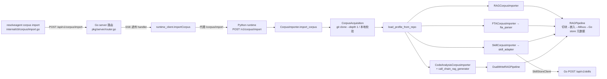
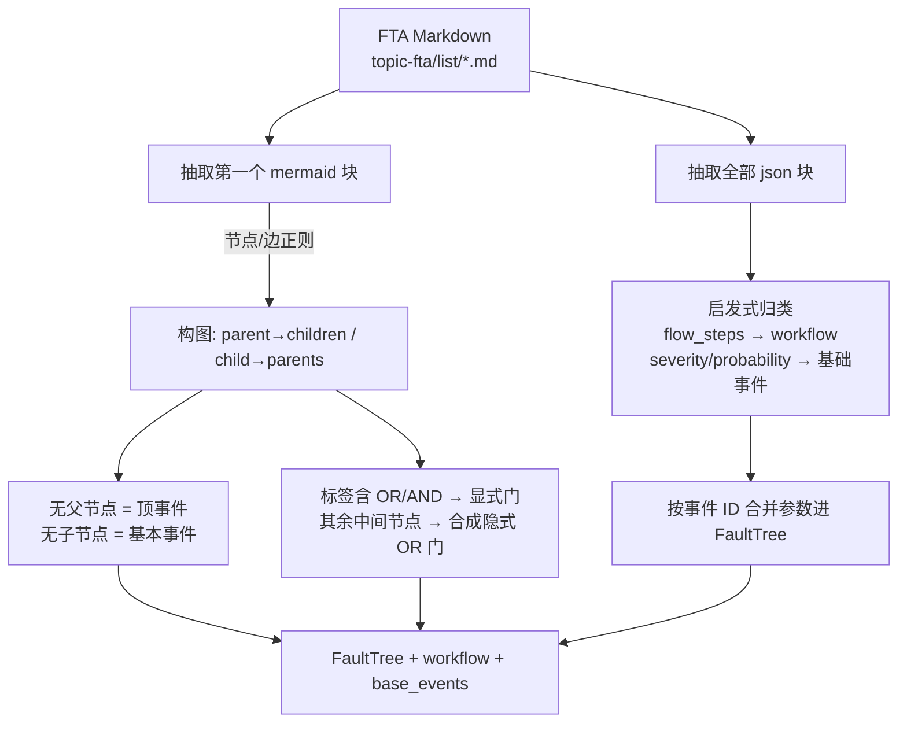

# 语料导入子系统（corpus）

> **一句话理解**：外部语料到平台资产的离线 ETL 层：RAG、故障树、技能、代码分析四路导入，进度经 SSE 回传。

## 职责定位

corpus 是「外部语料仓库 → 平台存储」的离线导入层，数据源默认是 kudig-database Git 仓库 [importer.py:30](python/src/resolveagent/corpus/importer.py#L30)。它按内容类型把数据分派给四个导入器：rag / fta / skills / code_analysis [importer.py:31](python/src/resolveagent/corpus/importer.py#L31)，编排成一条产出 SSE 进度事件的异步流水线 [importer.py:74-78](python/src/resolveagent/corpus/importer.py#L74)。

与邻居模块的分工：

- `rag/` 是运行时检索管线（切块、嵌入、Milvus 索引、检索重排，见 04 篇）。corpus 只调用它的 `ingest` 入口落库 [rag_importer.py:77-80](python/src/resolveagent/corpus/rag_importer.py#L77)，不触碰检索逻辑。
- `skills/` 是运行时技能执行（见 05 篇）。corpus 里的 skill_importer 只负责把 kudig 技能文件转成注册格式并 POST 给 Go 平台 [skill_importer.py:88-92](python/src/resolveagent/corpus/skill_importer.py#L88)，执行语义不在本模块。
- `fta/` 的 FaultTree 模型来自 corpus 的解析产物——03 篇已把 [fta_parser.py:63](python/src/resolveagent/corpus/fta_parser.py#L63) 列为树的上游来源。

> [!NOTE] 推测：导入逻辑独立成模块，是为了让运行时进程不必承载离线批处理的依赖（git clone、语料目录约定、批量续传状态），同时让同一段 ETL 可被 HTTP 端点和独立脚本复用。依据：corpus 与 rag/skills 仅有 ingest 调用与客户端注入两条边（[importer.py:18](python/src/resolveagent/corpus/importer.py#L18)、[importer.py:62-72](python/src/resolveagent/corpus/importer.py#L62)）；仓库 git 历史已被压缩为 4 个泛化提交，无讨论记录可查。

## 设计原理

**目录即 schema。** 语料仓库的目录布局被硬编码为协议：`domain-\d+` 目录是 RAG 知识文档 [rag_importer.py:20](python/src/resolveagent/corpus/rag_importer.py#L20)、`topic-fta/list/*.md` 是故障树 [fta_importer.py:49](python/src/resolveagent/corpus/fta_importer.py#L49)、`topic-skills/*.md` 是技能 [skill_importer.py:46](python/src/resolveagent/corpus/skill_importer.py#L46)，本地路径校验也以这两个 topic 目录为准 [acquisition.py:60-62](python/src/resolveagent/corpus/acquisition.py#L60)。README、schema 等说明文件按名字黑名单跳过 [skill_importer.py:19](python/src/resolveagent/corpus/skill_importer.py#L19)（测试断言了该行为 [test_corpus_import.py:295-301](python/tests/integration/test_corpus_import.py#L295)）。

**切分策略按目录前缀预设。** 每个 import_types 类别对应不同 chunker：domain 走 by_h2/2000、FTA 走 by_h3/1500、技能走 by_section/3000、cheat-sheet 近似全文 50000 [config.py:15-21](python/src/resolveagent/corpus/config.py#L15)。可由语料仓内 `corpus-config/profiles/<name>.yaml` 覆盖，profile 缺失时仅告警并回落默认 [config.py:99-101](python/src/resolveagent/corpus/config.py#L99)。FTA/Skills 导入器则绕过 profile，直接写死 by_h3/1500 与 by_section/3000 [fta_importer.py:127-129](python/src/resolveagent/corpus/fta_importer.py#L127)——配置面只对 RAG 主路径生效。

**默认拆多集合，集合名即用途。** RAG 进 `kudig-rag`，FTA 进 `kudig-fta`，技能进 `kudig-skills` [importer.py:138-140](python/src/resolveagent/corpus/importer.py#L138)；集合 ID 可被请求覆盖（仅 RAG 主集合）[importer.py:32](python/src/resolveagent/corpus/importer.py#L32)。

**两条导入路径并存。** 进程内编排器（经 RAGPipeline 落 Milvus 与 Go store）之外，还有一个独立 HTTP 脚本 kudig_rag_import.py，直接打 Go 平台 RAG API，带断点续传——这是 corpus 内唯一有真实断点设计的地方（见「进度与失败语义」）。04 篇将此归纳为「语料上千文件、重跑代价高」的动因。

**动因证据的局限。** 模块内无任何 TODO/FIXME 注释（grep 0 命中），git log 亦被压缩为 4 个泛化提交（`7b04d8f` major update → `e70778e` 2026-04-27），无 fix 提交可考。设计动因主要靠测试断言交叉验证：[test_corpus_import.py:197-233](python/tests/integration/test_corpus_import.py#L197) 锁定 FTA 解析契约（门类型、基础事件富化、workflow 识别），[test_corpus_import.py:312-326](python/tests/integration/test_corpus_import.py#L312) 锁定目录→切分策略映射。

## 依赖

- 上游：`resolveagent.rag.pipeline`（落库出口）[importer.py:18](python/src/resolveagent/corpus/importer.py#L18)；`resolveagent.rag.dual_write` 的 DualWriteRAGPipeline [code_analysis_importer.py:24](python/src/resolveagent/corpus/code_analysis_importer.py#L24)；`resolveagent.fta.tree` 的 FaultTree/事件/门模型 [fta_parser.py:15](python/src/resolveagent/corpus/fta_parser.py#L15)；`resolveagent.code_analysis.engine` [code_analysis_importer.py:16](python/src/resolveagent/corpus/code_analysis_importer.py#L16)。
- 下游写入：RAGPipeline 内部把文档元数据注册进 Go store（rag_document_client，可选注入）[pipeline.py:80-87](python/src/resolveagent/rag/pipeline.py#L80)，chunk 嵌入后写入 Milvus [pipeline.py:156-176](python/src/resolveagent/rag/pipeline.py#L156)；技能注册走 store 客户端 `POST /api/v1/skills` [skill_client.py:51](python/src/resolveagent/store/skill_client.py#L51)，基类固定连 Go 平台 8080 [base_client.py:22](python/src/resolveagent/store/base_client.py#L22)。
- 被谁调用：仅 Python runtime 的 `POST /v1/corpus/import` 端点 [http_server.py:433-452](python/src/resolveagent/runtime/http_server.py#L433) 与两个独立脚本 [kudig_rag_import.py:484](python/src/resolveagent/corpus/kudig_rag_import.py#L484)、[seed_vectorizer.py:433](python/src/resolveagent/corpus/seed_vectorizer.py#L433)。

## 暴露接口

- `CorpusImporter.import_corpus(request)`：异步生成器，逐个 yield SSE 就绪的事件 dict [importer.py:74-78](python/src/resolveagent/corpus/importer.py#L74)；事件类型约定见 [progress.py:26-35](python/src/resolveagent/corpus/progress.py#L26)。
- `CorpusImportRequest`：source / import_types / rag_collection_id / profile / force_clone / dry_run [importer.py:27-35](python/src/resolveagent/corpus/importer.py#L27)；dry_run 只数文件不写数据 [importer.py:125-135](python/src/resolveagent/corpus/importer.py#L125)。
- 两个独立 CLI：`kudig-rag-import` [kudig_rag_import.py:485-487](python/src/resolveagent/corpus/kudig_rag_import.py#L485) 与 `vectorize-rag-seeds` [seed_vectorizer.py:435-437](python/src/resolveagent/corpus/seed_vectorizer.py#L435)，均以 `python -m` 或打包入口运行。
- 供测试/复用的纯函数：`FTAMarkdownParser.parse`、`KudigSkillAdapter.convert`、`parse_front_matter`、`CallChainRAGGenerator.generate`（包导出面仅含后两者与编排器 [__init__.py:3-18](python/src/resolveagent/corpus/__init__.py#L3)）。

## 数据流全景

链路分层：CLI 到 Go 是 SSE 转发（Go 端 corpus_handler 把 Python runtime 的事件逐条透传并补 `[DONE]` 结尾 [corpus_handler.go:76-110](pkg/server/corpus_handler.go#L76)）；Python 内部按 acquire → 读 profile → 数文件 → 四阶段导入 → 汇总九步执行 [importer.py:87-192](python/src/resolveagent/corpus/importer.py#L87)。独立脚本则绕开编排器，自己 clone 后按 20 篇一批 POST Go 的 `/rag/collections/{id}/ingest` [kudig_rag_import.py:26](python/src/resolveagent/corpus/kudig_rag_import.py#L26)、[kudig_rag_import.py:88-91](python/src/resolveagent/corpus/kudig_rag_import.py#L88)。

**入口关系。** Python 侧 corpus 没有自己的 main，只有三处入口：

- CLI `resolveagent corpus import <source>`：cobra 子命令注册于根命令 [root.go:49](internal/cli/root.go#L49)，固定打 Go 平台（默认 localhost:8080，可用 `--server` 覆盖）[import.go:76-81](internal/cli/corpus/import.go#L76)，SSE 逐行解析后按事件类型打印 [import.go:136-152](internal/cli/corpus/import.go#L136)。
- Go API：路由 `POST /api/v1/corpus/import` [router.go:87](pkg/server/router.go#L87)，handler 校验 source 必填后转发 Python runtime 并流式回传 [corpus_handler.go:32-48](pkg/server/corpus_handler.go#L32)；Go 客户端库另有编程封装 [client.go:658-659](internal/cli/client/client.go#L658)。Go 自身不做任何导入逻辑，是纯代理。
- Python 直连：`POST /v1/corpus/import`（[http_server.py:433](python/src/resolveagent/runtime/http_server.py#L433)，见依赖一节）——Web 前端与 CLI 都经 Go 中转，Python 端点理论上也可直连。

## FTA 解析：mermaid 故障树如何变成可执行模型

图示三步对应代码：图抽取与判定 [fta_parser.py:77-86](python/src/resolveagent/corpus/fta_parser.py#L77)、门/事件分类 [fta_parser.py:142-177](python/src/resolveagent/corpus/fta_parser.py#L142)、JSON 富化 [fta_parser.py:221-260](python/src/resolveagent/corpus/fta_parser.py#L221)。产出的 FaultTree 经 `_tree_to_dict` 序列化成与 `load_tree_from_dict` 兼容的 dict [fta_importer.py:134-135](python/src/resolveagent/corpus/fta_importer.py#L134)，03 篇的 FTA 引擎即以此为树的来源。

## 各导入器

- **FTA 文档**：解析器取第一个 mermaid 块 [fta_parser.py:101](python/src/resolveagent/corpus/fta_parser.py#L101)，用正则抽节点与边 [fta_parser.py:39-57](python/src/resolveagent/corpus/fta_parser.py#L39)；标签含 OR/AND 关键词的节点判为逻辑门 [fta_parser.py:142-145](python/src/resolveagent/corpus/fta_parser.py#L142)，无父节点者判顶事件、无子节点者判基本事件 [fta_parser.py:130-134](python/src/resolveagent/corpus/fta_parser.py#L130)；中间节点若没有显式门则合成隐式 OR 门 [fta_parser.py:192-206](python/src/resolveagent/corpus/fta_parser.py#L192)。JSON 块按启发式归类：含 `flow_steps` 的当 workflow，值含 severity/probability 的当基础事件，后者按 ID 合并进事件参数 [fta_parser.py:235-239](python/src/resolveagent/corpus/fta_parser.py#L235)、[fta_parser.py:252-260](python/src/resolveagent/corpus/fta_parser.py#L252)。文件名 slug 化后作为树 ID [fta_importer.py:20-22](python/src/resolveagent/corpus/fta_importer.py#L20)。
- **kudig RAG（独立脚本）**：SHA256 内容哈希判重 [kudig_rag_import.py:170-171](python/src/resolveagent/corpus/kudig_rag_import.py#L170)，blockquote 元数据（`> key：value`）并进 chunk metadata [kudig_rag_import.py:163-167](python/src/resolveagent/corpus/kudig_rag_import.py#L163)。
- **调用链生成**：CallChainRAGGenerator 是纯内存变换，把一条调用链膨胀成六类中文文档——总览、逐文件、逐函数、流程步骤（每步带前后文窗口）、跨组件交互、预生成 Q&A 对 [call_chain_rag_generator.py:165-228](python/src/resolveagent/corpus/call_chain_rag_generator.py#L165)；Q&A 按链类型分叉：排查链追加关键函数与异步调用问题，初始化链追加阶段顺序问题 [call_chain_rag_generator.py:647-676](python/src/resolveagent/corpus/call_chain_rag_generator.py#L647)。文档 ID 确定性取内容哈希前 16 位 [call_chain_rag_generator.py:100-102](python/src/resolveagent/corpus/call_chain_rag_generator.py#L100)。
- **代码分析**：一个类两个入口——对本地仓库跑 StaticAnalysisEngine 后把 solutions 经双写管线落库、调用图摘要压成单文档 [code_analysis_importer.py:107-160](python/src/resolveagent/corpus/code_analysis_importer.py#L107)；或接收前端风格的 JSON（camelCase/snake_case 双兼容归一化 [code_analysis_importer.py:250-317](python/src/resolveagent/corpus/code_analysis_importer.py#L250)）走调用链生成路径。
- **技能**：skill_adapter 把 YAML front matter 映射为注册 dict——skill_id 即技能名（缺省回退 skill_name 并 slug 化 [skill_adapter.py:85-90](python/src/resolveagent/corpus/skill_adapter.py#L85)）、trigger_keywords 转 tags [skill_adapter.py:113-117](python/src/resolveagent/corpus/skill_adapter.py#L113)、按 `## ` 标题切十段 Runbook 塞进 manifest [skill_adapter.py:159-180](python/src/resolveagent/corpus/skill_adapter.py#L159)；全部技能硬编码为 scenario 型 [skill_adapter.py:119-120](python/src/resolveagent/corpus/skill_adapter.py#L119)。
- **seed_vectorizer**：seed-rag.sql 只给了 87 篇文档的元数据没有正文，本脚本按集合名关键词挑模板**生成确定性占位正文**再嵌入入库 [seed_vectorizer.py:1-9](python/src/resolveagent/corpus/seed_vectorizer.py#L1)、[seed_vectorizer.py:219-249](python/src/resolveagent/corpus/seed_vectorizer.py#L219)。

> [!NOTE] 推测：其目的是给演示与联调提供可检索的非空向量库，而非真实知识。依据：模板正文是通用运维话术填充 [seed_vectorizer.py:174-216](python/src/resolveagent/corpus/seed_vectorizer.py#L174)，与真实文档无对应关系。

## 进度与失败语义

progress.py 只是内存计数器 + 事件发射器：四类各一份 processed/errors/chunks 计数 [progress.py:48-53](python/src/resolveagent/corpus/progress.py#L48)，逐文件发 `import.<category>.file_processed`，结束时发带耗时与总错误的 `import.completed` [progress.py:135-164](python/src/resolveagent/corpus/progress.py#L135)。**它没有任何断点/重试设计**——任务若中断，进程内导入需从头重来。

失败语义分级：

- 致命：只有获取语料失败会终止导入并发 `import.error`（data.fatal=true）[importer.py:94-101](python/src/resolveagent/corpus/importer.py#L94)。
- 可容错：单文件异常计入 errors 后继续下一个文件 [rag_importer.py:57-58](python/src/resolveagent/corpus/rag_importer.py#L57)；FTA 目录缺失直接返回 0 棵树 [fta_importer.py:50-52](python/src/resolveagent/corpus/fta_importer.py#L50)。
- 真正的断点续传在独立脚本：ImportState 按「相对路径 + 内容哈希」记录完成文件并落盘 `~/.resolveagent/kudig-rag-import-state.json` [kudig_rag_import.py:216-228](python/src/resolveagent/corpus/kudig_rag_import.py#L216)、[kudig_rag_import.py:27](python/src/resolveagent/corpus/kudig_rag_import.py#L27)，SIGINT 只置位不硬退，finally 里兜底存状态 [kudig_rag_import.py:328-334](python/src/resolveagent/corpus/kudig_rag_import.py#L328)、[kudig_rag_import.py:422-425](python/src/resolveagent/corpus/kudig_rag_import.py#L422)；HTTP 层另有 3 次指数退避重试（5xx 与 429 才重试）[kudig_rag_import.py:116-136](python/src/resolveagent/corpus/kudig_rag_import.py#L116)。

## 关键决策

- **store 客户端全部可选注入**：编排器五个构造参数均可为 None [importer.py:60-72](python/src/resolveagent/corpus/importer.py#L60)，这让纯解析/切分逻辑可以脱离 Go 平台单测（integration test 即如此运行 [test_corpus_import.py:4-6](python/tests/integration/test_corpus_import.py#L4)），代价是接线遗漏会静默降级（见已知坑第 1 条）。
- **FTADocumentClient 已备未用**：store 层定义了 FTA 文档客户端 [store/__init__.py:14](python/src/resolveagent/store/__init__.py#L14)，但 corpus 全模块无人 import，运行时也未传 `fta_client`——FTA 树注册 Go 存储的通路目前是断头路。
- **错误处理以「计数」代替「中断」**：批量导入中单文件失败不影响整体成功，错误汇入 `import.completed` 的 total_errors [progress.py:160-162](python/src/resolveagent/corpus/progress.py#L160)。权衡是导入结果「看似成功」，须主动检查 errors 字段。

## 已知坑

1. **FTA 树不落 Go 存储（接线遗漏）**：运行时端点只注入 skill_client [http_server.py:452](python/src/resolveagent/runtime/http_server.py#L452)，而 FTA 注册代码有 `if self._fta_client is not None` 守卫 [fta_importer.py:90](python/src/resolveagent/corpus/fta_importer.py#L90)——静默跳过，FTA 只进 RAG 集合。修复需在 http_server 传入 FTADocumentClient 并接到编排器。
2. **SSE 进度是阶段粒度，非文件粒度**：文件级事件先攒进 `events` 列表，等阶段 `phase_completed` 后才批量 yield [importer.py:80-83](python/src/resolveagent/corpus/importer.py#L80)、[importer.py:146-151](python/src/resolveagent/corpus/importer.py#L146)。导入上千文件时客户端在单阶段结束前收不到任何 file_processed。
3. **CLI 与 Python 事件类型不匹配**：Python 发的是 `import.started` / `import.rag.file_processed` / `import.completed` 等 [progress.py:71](python/src/resolveagent/corpus/progress.py#L71)、[progress.py:102](python/src/resolveagent/corpus/progress.py#L102)；CLI printEvent 匹配的却是 `start` / `phase_start` / `progress` 等类型 [import.go:168-171](internal/cli/corpus/import.go#L168)——全部落入 default 分支，结构化输出（含 summary 统计）永不生效，只打印 message [import.go:217-220](internal/cli/corpus/import.go#L217)。
4. **默认 import_types 不一致**：Python 默认含 code_analysis [importer.py:31](python/src/resolveagent/corpus/importer.py#L31)，CLI 默认只有 rag/fta/skills [import.go:66](internal/cli/corpus/import.go#L66)——同一仓库经 CLI 导入会静默少一路。
5. **无 mermaid 块 = 空树且「成功」**：解析返回空 FaultTree [fta_parser.py:272-280](python/src/resolveagent/corpus/fta_parser.py#L272)，测试明确断言该行为 [test_fta_parser.py:128-132](python/tests/unit/test_fta_parser.py#L128)；FTA 文档格式走样不会报错，只有 RAG 侧留有原文。
6. **两条路径 embedding 模型默认不一致**：独立脚本建集合固定 bge-large-zh [kudig_rag_import.py:79](python/src/resolveagent/corpus/kudig_rag_import.py#L79)，进程内 RAGPipeline 默认取 EMBEDDING_MODEL 环境变量否则 text-embedding-v2 [pipeline.py:41](python/src/resolveagent/rag/pipeline.py#L41)。

> [!NOTE] 推测：若两路对同一集合混用，向量将来自不同嵌入空间，检索质量劣化且无告警。依据：两处默认值均有锚点，但混用场景未在代码或测试中处理。

7. **演进考古受限**：git 历史仅 4 个提交且信息泛化（`7b04d8f`…`e70778e`），最近一次全模块改动（2026-04-27 `e70778e`）以重排版为主（git log 证据）。

## 排查指南

1. **症状**：SSE 流一开始就收到 `Acquisition failed: ...` → **定位**：acquisition 三类错误——clone 失败带 stderr [acquisition.py:92-93](python/src/resolveagent/corpus/acquisition.py#L92)、git 不在 PATH [acquisition.py:94-95](python/src/resolveagent/corpus/acquisition.py#L94)、clone 超 300 秒 [acquisition.py:96-97](python/src/resolveagent/corpus/acquisition.py#L96) → **修复**：查网络/凭证后用 `--force-clone` 重试，或改传本地路径。
2. **症状**：`Path does not look like kudig-database: missing [...]` → **定位**：本地路径缺 topic-fta/topic-skills 目录校验 [acquisition.py:60-62](python/src/resolveagent/corpus/acquisition.py#L60) → **修复**：确认传的是语料仓库根目录而非其子目录。
3. **症状**：独立脚本报 `API server at ... is unreachable` 且 exit 1 → **定位**：导入前健康检查失败 [kudig_rag_import.py:352-354](python/src/resolveagent/corpus/kudig_rag_import.py#L352) → **修复**：先起 Go 平台并核对 `--api-url`（默认 localhost:3004 [kudig_rag_import.py:38](python/src/resolveagent/corpus/kudig_rag_import.py#L38)）。
4. **症状**：技能导入了但技能列表里没有（RAG 却能检索到内容）→ **定位**：register_skill 失败仅 warning [skill_importer.py:93-97](python/src/resolveagent/corpus/skill_importer.py#L93)，且 base_client._post 吞掉所有 HTTP 异常返回 None [base_client.py:62-68](python/src/resolveagent/store/base_client.py#L62) → **修复**：查 runtime 日志 `Failed to register skill` 与 Go 平台 8080 连通性；这是静默降级的典型。
5. **症状**：独立脚本重跑全量、之前进度丢失 → **定位**：状态文件损坏时仅告警并从零开始 [kudig_rag_import.py:272-274](python/src/resolveagent/corpus/kudig_rag_import.py#L272) → **修复**：恢复/删除 `~/.resolveagent/kudig-rag-import-state.json`；或确认没加 `--force-reimport` [kudig_rag_import.py:323](python/src/resolveagent/corpus/kudig_rag_import.py#L323)。
6. **症状**：FTA/RAG 导入量远低于预期（0 棵树）→ **定位**：目录缺失仅 warning [fta_importer.py:51](python/src/resolveagent/corpus/fta_importer.py#L51)、profile 拼错回落默认并 warning [config.py:100](python/src/resolveagent/corpus/config.py#L100)、被 exclude 名单过滤 [config.py:72-86](python/src/resolveagent/corpus/config.py#L72) → **修复**：先看 warning 日志，再用 `--dry-run`（CLI 透传 [importer.py:125-135](python/src/resolveagent/corpus/importer.py#L125)）核对文件计数。

*Last updated: 2026-09-05*
