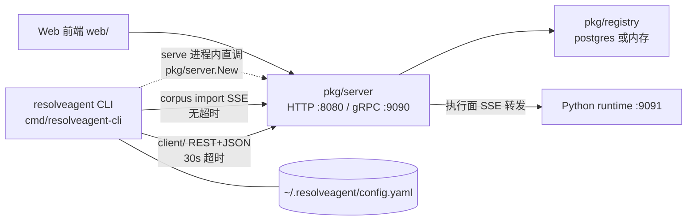

# CLI 入口篇：resolveagent 命令树与 Go API 门面

> **一句话理解**：cobra 命令树加一个薄 REST 客户端，把平台管理面搬进终端；唯一不碰网络的是 config 组。

## 职责

- 定义根命令 `resolveagent` 并注册 9 个顶级子命令：agent / skill / workflow / rag / corpus / config / version / dashboard / serve，见 [root.go:21](internal/cli/root.go#L21) 与 [root.go:45-53](internal/cli/root.go#L45-L53)；[root_test.go:18-30](internal/cli/root_test.go#L18-L30) 用断言锁住这份命令清单。
- 充当第三入口：与 Go server（cmd/resolveagent-server，09 篇）、Web 前端（15 篇）并列，全部收敛到同一套 `pkg/server` REST API。
- 封装 API 客户端 `client/`：base URL、超时、JSON 编解码与错误呈现集中在一处（[client.go:22-34](internal/cli/client/client.go#L22-L34)）。
- `serve` 在进程内直调 `pkg/server.New` 起本地平台（[serve.go:36](internal/cli/serve.go#L36)），是 compose 部署之外的裸进程形态。
- `config` 组读写本地 `~/.resolveagent/config.yaml`，是 CLI 里唯一不发起网络请求的命令组（[config.go:92-99](internal/cli/config/config.go#L92-L99)）。

## 设计原理

### 三入口拓扑

哪些操作只有 CLI 能做（读代码确认）：

- `config set/get/view/init`：写本地配置文件（[config.go:33-38](internal/cli/config/config.go#L33-L38)）；Web 前端的配置页走服务端 config API，管的是另一份事实源。
- `serve`：本机一条命令起 HTTP + gRPC 双协议平台（[serve.go:57](internal/cli/serve.go#L57)、[server.go:124](pkg/server/server.go#L124)）。
- `dashboard`：唯一 TUI（[dashboard.go:17](internal/cli/dashboard.go#L17)）。
- 读本地文件类操作：`agent create -f` 读 YAML（[create.go:28-33](internal/cli/agent/create.go#L28-L33)）、`rag ingest` 在客户端读文件再逐个上传（[ingest.go:64-90](internal/cli/rag/ingest.go#L64-L90)）。
- CI / 脚本等无浏览器环境：CI 构建随制品发布 `bin/resolveagent`（[ci.yaml:191](.github/workflows/ci.yaml#L191)、[Makefile:58-59](Makefile#L58-L59)）。

### serve：本地编排

`serve` 复用与生产二进制完全相同的装配路径：`config.Load("")`（[serve.go:30](internal/cli/serve.go#L30)）→ `server.New`（[serve.go:36](internal/cli/serve.go#L36)）→ `srv.Run`。它**不启动任何新组件**，只是把 `pkg/server` 的进程从 `cmd/resolveagent-server` 挪进 CLI 进程，并在输出里明确提示生产用 `resolveagent-server`（[serve.go:55](internal/cli/serve.go#L55)）。装配内容：`store.backend=postgres` 时连库并跑迁移，失败即拒绝启动（[server.go:52-79](pkg/server/server.go#L52-L79)）；默认监听 `:8080` / `:9090`（[config.go:16-17](pkg/config/config.go#L16-L17)）。依赖检查不在此层——PostgreSQL / Redis / NATS 由 compose 的 deps 文件提供（deploy/docker-compose/docker-compose.deps.yaml），内存后端则零依赖。

### client：与 Go API 通信

- **base URL**：来自 viper 键 `server`（--server flag 绑定于 [root.go:39-42](internal/cli/root.go#L39-L42)），缺省 `localhost:8080`，拼成 `http://<server>/api/v1`（[client.go:23-29](internal/cli/client/client.go#L23-L29)）。
- **鉴权**：没有。`New()` 不设置任何 Authorization 头，也没有 token 字段——与 09 篇"鉴权设施已备好但未挂载"的现状一致。
- **超时**：统一 30 s（[client.go:31](internal/cli/client/client.go#L31)）。
- **错误呈现**：≥400 时把状态码和响应体一起抛出 `API error %d: %s`（[client.go:55-57](internal/cli/client/client.go#L55-L57)），[client_test.go:159-176](internal/cli/client/client_test.go#L159-L176) 断言 404 必须报错。
- **例外——corpus import**：不走 `client/`，自建请求声明 `Accept: text/event-stream` 并用无超时客户端（[import.go:117-120](internal/cli/corpus/import.go#L117-L120)），1 MB scanner 缓冲容纳大事件（[import.go:133](internal/cli/corpus/import.go#L133)），逐行解析 SSE 事件渲染进度（[import.go:166-222](internal/cli/corpus/import.go#L166-L222)）。对应服务端路由 [router.go:87](pkg/server/router.go#L87)。

### 五组子命令的后端归属

| 组 | 后端 | 证据 |
|---|---|---|
| agent | HTTP（先查后执行的两段式） | run 先 `GetAgent` 预检再 `ExecuteAgent`（[run.go:40-55](internal/cli/agent/run.go#L40-L55)） |
| skill | HTTP（含源类型自动推断 git/local/registry） | [install.go:42-51](internal/cli/skill/install.go#L42-L51)、[test.go:44-52](internal/cli/skill/test.go#L44-L52) |
| workflow | HTTP（validate / visualize 全走 API） | [validate.go:36-44](internal/cli/workflow/validate.go#L36-L44)、[visualize.go:20-24](internal/cli/workflow/visualize.go#L20-L24) |
| rag | HTTP + 客户端本地文件读取 | [query.go:44](internal/cli/rag/query.go#L44)、[ingest.go:81](internal/cli/rag/ingest.go#L81) |
| corpus | 直连 HTTP + SSE（不经 client 包） | [import.go:75-123](internal/cli/corpus/import.go#L75-L123) |
| config | 本地 viper 写盘，无网络 | [config.go:35](internal/cli/config/config.go#L35) |

没有任何子命令直接调用 Go 函数或 Python runtime——CLI 只面对 REST API，这是刻意保持的进程边界。

### dashboard / TUI 的数据来源

`dashboard` 调 `tui.Run()`（[dashboard.go:17](internal/cli/dashboard.go#L17)），但 TUI 目前是**纯展示壳**：视图数据全部硬编码（"System Status: Healthy / Active Agents: 0"，[app.go:78-81](internal/tui/app.go#L78-L81)），`internal/tui` 内没有任何 HTTP / viper / client 引用。数据来源设计上是"应该连 API"，实现上还没接。

## 依赖

- cobra + viper：命令树与配置绑定（go.mod#L13-L14）；`initConfig` 搜 `$HOME/.resolveagent/config.yaml`（[root.go:65](internal/cli/root.go#L65)），环境变量前缀 `RESOLVEAGENT`（[root.go:70](internal/cli/root.go#L70)）。
- charmbracelet bubbletea / lipgloss：仅 dashboard 间接依赖（go.mod#L6-L7）。
- `serve` 依赖 `pkg/config` + `pkg/server` + `pkg/version`；`version` 命令打印 [version.go:15](internal/cli/version.go#L15)。
- 运行时网络依赖：Go API 一个；corpus import 还要求平台侧能访问 git 源。

## 暴露接口

- 唯一导出函数 `cli.Execute()`（[root.go:30](internal/cli/root.go#L30)），仅被 [main.go:9-13](cmd/resolveagent-cli/main.go#L9-L13) 消费。
- `client/` 提供 30+ 个类型化方法：agent 增删查执行与日志（[client.go:147](internal/cli/client/client.go#L147)、[client.go:223](internal/cli/client/client.go#L223)）、workflow 执行与校验（[client.go:490](internal/cli/client/client.go#L490)、[client.go:458](internal/cli/client/client.go#L458)）、RAG 摄取与查询（[client.go:594](internal/cli/client/client.go#L594)、[client.go:633](internal/cli/client/client.go#L633)）、corpus 导入（[client.go:658-660](internal/cli/client/client.go#L658-L660)）。

## 关键决策

### 从 stub 到 REST 门面的两步演进

git 历史给出了清晰的三段：init（85ab232，2026-03-22）时命令树 762 行、多数子命令只打印占位文案，agent run 里留着 `// TODO: Implement interactive chat via gRPC streaming`；两天后 3326b08 把 `resolvenet` 全量改名为 `resolveagent`（根命令、模块路径、配置目录同步换）；4 月 2 日 a893f88 引入 `client/client.go`（266 行）并把 agent 组接上 HTTP，cfe4e45 再扩到 379 行、skill / workflow / rag 全量接入并补 176 行 `client_test.go`。值得注意：TODO 里的 gRPC 直连从未做，最终形态是**统一走 REST**——CLI 与 server 之间只用 HTTP。

### 为什么放 internal/ 而不是 cmd/

cmd 侧只留 13 行壳（[main.go:9-13](cmd/resolveagent-cli/main.go#L9-L13)），命令树全在 `internal/cli`。Go 工具链规则使 internal 包无法被仓库外 import，命令树只能以二进制形态触达。init 提交里 cmd 与 internal 的分离即已存在（85ab232 的 cmd/resolvenet-cli/main.go 就是 13 行）。

> [!NOTE] 推测：这一分离的动机是防止外部程序把 CLI 命令树当库复用、强制走二进制边界；依据是 init 起两目录即分离但仓库内无注释明说意图，属纯推断。

### 为什么用 cobra

cobra 自 init 提交即与 viper 一起引入（85ab232 的 root.go 已 import 二者），后续仅 dependabot 升级 3a8352c（1.8.1 → 1.10.2）。选型的直接受益可从代码看出：多级子命令树、`cobra.OnInitialize` 挂配置初始化（[root.go:35](internal/cli/root.go#L35)）、flag 与 viper 键绑定（[root.go:42](internal/cli/root.go#L42)）、`Args` 校验器。

> [!NOTE] 推测：选 cobra 而非标准库 flag 或 urfave/cli，主要是看中其子命令组织 + viper 集成 + 自动 help/completion；git 历史只有 init 一个快照、无选型讨论记录，无法交叉验证，故标推测。

## 已知坑

- `agent run --stream` 是假流式：stream / 非 stream 两分支代码完全相同，都打印完整 `resp.Content`（[run.go:60-65](internal/cli/agent/run.go#L60-L65)）。
- `agent logs` 整条链路断裂：客户端拼查询串在无 `--execution` 时会产出 `.../logs&limit=50` 这种没有 `?` 的路径（[client.go:246-253](internal/cli/client/client.go#L246-L253)），而服务端根本未注册 `/agents/{id}/logs` 路由（[router.go:14-20](pkg/server/router.go#L14-L20)）——任何调用必然 404。
- `workflow run --async` 完成后提示使用 `resolveagent workflow logs`（[run.go:63](internal/cli/workflow/run.go#L63)），但 workflow 组没有 logs 子命令。
- `workflow visualize` 在定义缺 tree/root 键时打印固定示例树（[visualize.go:55-61](internal/cli/workflow/visualize.go#L55-L61)），易误读为真实结构。
- 配置文件读取错误被静默吞掉：`_ = viper.ReadInConfig()`（[root.go:72](internal/cli/root.go#L72)），写错的 config.yaml 不会报错，需用 `config view`（[config.go:66-73](internal/cli/config/config.go#L66-L73)）间接验证。

## 排查指南

- **症状：`Error: API error 404: ...` 或 `connection refused`** → 定位：CLI 把 ≥400 响应连体抛出（[client.go:55-57](internal/cli/client/client.go#L55-L57)），目标地址来自 --server / 配置 / 环境变量三层（[root.go:39-42](internal/cli/root.go#L39-L42)、[root.go:70-71](internal/cli/root.go#L70-L71)）→ 修复：先 `resolveagent serve` 或 `docker compose up` 起平台；地址不对用 `resolveagent config set server <addr>`（[config.go:33-38](internal/cli/config/config.go#L33-L38)）或 `RESOLVEAGENT_SERVER` 覆盖。
- **症状：`resolveagent agent logs <id>` 恒报 `API error 404`** → 定位：服务端无该路由（[router.go:14-20](pkg/server/router.go#L14-L20)），且客户端查询串拼接有缺陷（[client.go:246-253](internal/cli/client/client.go#L246-L253)）→ 修复：代码问题，无 flag 可绕；改查平台侧日志或等两侧同时修复。
- **症状：`streaming not yet implemented`** → 定位：`agent logs --follow` 直接返回该错误（[logs.go:78](internal/cli/agent/logs.go#L78)）→ 修复：去掉 `-f`（但见上一条，非 follow 同样会 404）。
- **症状：`collection not found: <id>`** → 定位：query / ingest 前置校验 `GetCollection` 失败（[query.go:30-32](internal/cli/rag/query.go#L30-L32)、[ingest.go:37-40](internal/cli/rag/ingest.go#L37-L40)）→ 修复：`resolveagent rag collection list` 核对 ID 或先 `rag collection create`。
- **症状：serve 启动报 `Failed to load configuration` / `failed to connect to postgres`** → 定位：前者是 `config.Load` 找不到 resolveagent.yaml（[serve.go:30-34](internal/cli/serve.go#L30-L34)、[config.go:48-52](pkg/config/config.go#L48-L52)），后者是 postgres 后端装配失败（[server.go:52-56](pkg/server/server.go#L52-L56)）→ 修复：配置文件放 cwd / /etc/resolveagent / `~/.resolveagent` 其一，或依赖 compose deps 先起数据库、退回内存后端。
- **症状：`message is required`** → 定位：agent run 需位置参数或 `-m`（[run.go:28-30](internal/cli/agent/run.go#L28-L30)）→ 修复：补 message 参数。

## 与 docs/zh/cli-reference.md 的分工

docs/zh/cli-reference.md 是**用法手册**：安装方式、命令清单、flag 与示例，自 init 提交即存在。本文是**设计文档**：只回答为什么这样设计、边界在哪、坑在哪——两者不互相重复，查"怎么用"去前者，查"为什么 / 哪里会坏"留在此处。

*Last updated: 2026-09-05*
