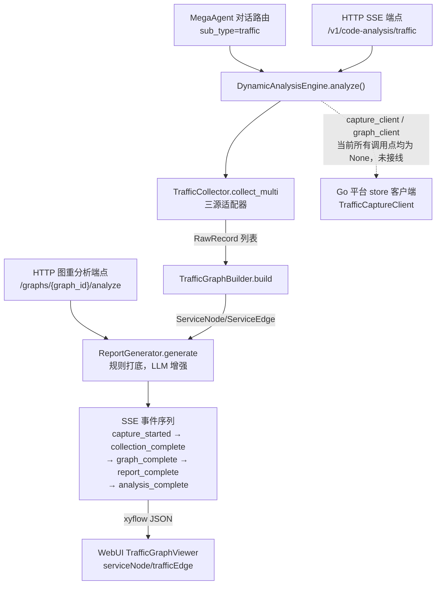

# 动态流量分析 (Traffic Analysis)

> **一句话理解**：把 OTel/代理日志/eBPF 流量聚合成服务依赖图，规则加 LLM 生成排障报告，SSE 流式吐出。

## 职责

traffic 回答的问题是：「运行时谁在调谁、错在哪条链路」。分析对象不是源码，而是**外部喂进来的流量原始数据**；产出是服务依赖图与结构化报告。四个文件一条线：[collector.py:1](python/src/resolveagent/traffic/collector.py#L1) 归一化 → [graph_builder.py:1](python/src/resolveagent/traffic/graph_builder.py#L1) 聚合 → [report_generator.py:1](python/src/resolveagent/traffic/report_generator.py#L1) 分析 → [engine.py:1](python/src/resolveagent/traffic/engine.py#L1) 编排。

## 链路全景

## 设计原理

**三源适配器，注册表分发，静默降级。** [collector.py:1-7](python/src/resolveagent/traffic/collector.py#L1) 把 eBPF/tcpdump 抓包、Higress/Envoy 访问日志、OTel Span 三种异构数据统一成 [RawRecord](python/src/resolveagent/traffic/collector.py#L20)。三个适配器以字典注册（[collector.py:129-133](python/src/resolveagent/traffic/collector.py#L129)），未知 source_type 只打 warning 并返回空列表而非抛错（[collector.py:168-170](python/src/resolveagent/traffic/collector.py#L168)），单源解析异常同样吞掉继续（[collector.py:176-178](python/src/resolveagent/traffic/collector.py#L176)）。

> [!NOTE] 推测：静默降级是为了 collect_multi 多源合并时单源故障不拖垮整体分析。依据：[collect_multi](python/src/resolveagent/traffic/collector.py#L180) 的逐源追加合并语义，但代码与注释均未明说此动机。

**两段式报告：规则打底，LLM 只做摘要增强。** [generate()](python/src/resolveagent/traffic/report_generator.py#L90) 永远先跑规则分析（[report_generator.py:92-93](python/src/resolveagent/traffic/report_generator.py#L92)）：节点按请求量取 Top 5 为热点（[report_generator.py:117-118](python/src/resolveagent/traffic/report_generator.py#L117)），错误率 >10%（[report_generator.py:132](python/src/resolveagent/traffic/report_generator.py#L132)）、延迟 >1000ms（[report_generator.py:143](python/src/resolveagent/traffic/report_generator.py#L143)）、边错误率 >5% 且请求 >10（[report_generator.py:155](python/src/resolveagent/traffic/report_generator.py#L155)）为异常。建议由异常类型一一映射生成（[report_generator.py:166-191](python/src/resolveagent/traffic/report_generator.py#L166)），另有一条纯结构启发式：边数超过节点数两倍就建议收敛服务依赖（[report_generator.py:184](python/src/resolveagent/traffic/report_generator.py#L184)）。LLM 可用才走增强路径，失败即回落规则（[report_generator.py:95-102](python/src/resolveagent/traffic/report_generator.py#L95)）。关键点：**LLM 只接管 summary**，hotspots/anomalies/suggestions 全部保持规则结果（[report_generator.py:258-267](python/src/resolveagent/traffic/report_generator.py#L258)），保证结论可复现、可回退。prompt 内联定义在 [_generate_with_llm](python/src/resolveagent/traffic/report_generator.py#L217)，节点/边各截断 Top 20 防 prompt 膨胀（[report_generator.py:207](python/src/resolveagent/traffic/report_generator.py#L207)）；可选 RAG 上下文默认查 `code-analysis` collection、top_k=3（[report_generator.py:82](python/src/resolveagent/traffic/report_generator.py#L82)、[report_generator.py:233-234](python/src/resolveagent/traffic/report_generator.py#L233)）。

**节点/边语义。** 节点即服务名，边即「source → target」调用方向，边 id 为 `{src}->{dst}`（[graph_builder.py:131](python/src/resolveagent/traffic/graph_builder.py#L131)）。两个易踩的口径：节点 error_count 只在该服务**作为调用方**时统计（[graph_builder.py:91-92](python/src/resolveagent/traffic/graph_builder.py#L91)），作为被调方不累计（[graph_builder.py:98-99](python/src/resolveagent/traffic/graph_builder.py#L98)），所以「B 返回 500」会记在调用方 A 头上；总请求数用节点计数除以 2 得出，而总错误数只统计边（[graph_builder.py:144-145](python/src/resolveagent/traffic/graph_builder.py#L144)），error_rate 分子分母口径不同。此外缺服务名的记录统一归并为 `unknown` 假节点（[graph_builder.py:85-86](python/src/resolveagent/traffic/graph_builder.py#L85)），每条边最多记 20 条 path（[graph_builder.py:112](python/src/resolveagent/traffic/graph_builder.py#L112)）。

## 编排：DynamicAnalysisEngine 串了哪几步

[engine.py:26-31](python/src/resolveagent/traffic/engine.py#L26) 的 docstring 即设计意图：采集 → 建图 → 报告 → 持久化四步。构造函数只做组件装配（[engine.py:54-62](python/src/resolveagent/traffic/engine.py#L54)），collector/graph_builder 内部 new，capture_client/graph_client/llm_provider/rag_pipeline 全部可选注入——这决定了持久化与 LLM 两个环节是否生效。`analyze()` 的编排骨架：

1. 生成 capture_id 并吐 `capture_started`（[engine.py:82-92](python/src/resolveagent/traffic/engine.py#L82)），未传 name 时自动命名 `capture-<id 前 8 位>`；
2. 采集并给捕获会话建档（[engine.py:97](python/src/resolveagent/traffic/engine.py#L97)、[engine.py:105-116](python/src/resolveagent/traffic/engine.py#L105)）；
3. **空记录短路**：一条记录都没有时直接吐 `analysis_complete` 且 `status: empty` 就返回（[engine.py:135-144](python/src/resolveagent/traffic/engine.py#L135)），不建图、不出报告——排查「没结果」类问题先看这里；
4. 建图由 `TrafficGraphBuilder.build` 聚合（[engine.py:147](python/src/resolveagent/traffic/engine.py#L147)、[graph_builder.py:68](python/src/resolveagent/traffic/graph_builder.py#L68)）→ 报告（[engine.py:161](python/src/resolveagent/traffic/engine.py#L161)）→ 图与报告回写（[engine.py:175-188](python/src/resolveagent/traffic/engine.py#L175)）→ 终事件（[engine.py:192-194](python/src/resolveagent/traffic/engine.py#L192)）。

给 SSE 消费者一个契约细节：每个阶段的 `phase` 事件**只有 `started` 态**（如 [engine.py:95](python/src/resolveagent/traffic/engine.py#L95)），完成信号由领域事件（`collection_complete`/`graph_complete`/`report_complete`）承担，不要等 `phase: finished`。

## 与 code_analysis（07 篇）的分工

静态分析看「代码长什么样、报错怎么办」，动态分析看「运行时谁在调谁」。两者**代码级零依赖**：traffic/ 不 import code_analysis/ 任何模块，反向 grep 也无命中。结合点只有三个「约定层」巧合：路由同族——traffic 是 `code_analysis` 路由的 sub_type 之一（[mega.py:465-466](python/src/resolveagent/agent/mega.py#L465)，分发于 [mega.py:461-468](python/src/resolveagent/agent/mega.py#L461)）；HTTP 路由同前缀 `/v1/code-analysis/`（[http_server.py:672](python/src/resolveagent/runtime/http_server.py#L672)）；RAG 上下文默认复用静态分析的 `code-analysis` collection（[report_generator.py:82](python/src/resolveagent/traffic/report_generator.py#L82)）。**不存在**静态调用图与动态流量图的对齐/合并代码——「动静互补」目前只是产品叙事，不是代码事实。

## 关键决策

- **编排器吐 SSE 事件而非最终值**：[analyze()](python/src/resolveagent/traffic/engine.py#L64) 是 async 生成器，按阶段 yield `capture_started`（[engine.py:85](python/src/resolveagent/traffic/engine.py#L85)）→ `collection_complete`（[engine.py:99](python/src/resolveagent/traffic/engine.py#L99)）→ `graph_complete`（[engine.py:149](python/src/resolveagent/traffic/engine.py#L149)）→ `report_complete`（[engine.py:163](python/src/resolveagent/traffic/engine.py#L163)）→ `analysis_complete`（[engine.py:192-194](python/src/resolveagent/traffic/engine.py#L192)），末端直接携带 xyflow JSON 与报告（[engine.py:198-199](python/src/resolveagent/traffic/engine.py#L198)）。非流式场景用 [analyze_single](python/src/resolveagent/traffic/engine.py#L204) 只取最后一个事件。
- **双输出格式**：[to_xyflow](python/src/resolveagent/traffic/graph_builder.py#L168) 产出 WebUI 直接可渲染的节点/边（`serviceNode`/`trafficEdge` 类型，Web 端注册见 [TrafficGraphViewer.tsx:24-25](web/src/components/TrafficGraph/TrafficGraphViewer.tsx#L24)，出错边加动画 [graph_builder.py:208](python/src/resolveagent/traffic/graph_builder.py#L208)）；[to_store_format](python/src/resolveagent/traffic/graph_builder.py#L222) 产出 Go 平台 store 格式。同一份图，两个消费端，避免二次转换。
- **图重分析走独立旁路，不经 collector/engine**：`/graphs/{graph_id}/analyze` 从 Go 平台读已存图（[http_server.py:762](python/src/resolveagent/runtime/http_server.py#L762)），在端点内手工把 store 字段重建成 [TrafficGraphData](python/src/resolveagent/runtime/http_server.py#L768)（序列化时未保留的 metadata 在此丢失），只跑 [ReportGenerator](python/src/resolveagent/runtime/http_server.py#L797) 再回写 `status: analyzed`（[http_server.py:801-806](python/src/resolveagent/runtime/http_server.py#L801)）。这是 `TrafficGraphClient` 全库唯一的真实使用点（[http_server.py:761-762](python/src/resolveagent/runtime/http_server.py#L761)）。
- **持久化失败不中断分析**：capture/graph 回写 Go 平台仅 warning（[engine.py:131](python/src/resolveagent/traffic/engine.py#L131)、[engine.py:188](python/src/resolveagent/traffic/engine.py#L188)），分析结果照常返回。
- **演进：快照式交付**。[7b04d8f]（2026-04-15）一次性提交全部 980 行；[e70778e]（2026-04-27）此后唯一一次改动仅做格式化与 import 清理（`AsyncIterator` 移入 `TYPE_CHECKING`），无行为变更。模块内无 TODO/FIXME、无任何测试覆盖（python/tests 下 grep traffic 零命中）——后续改动没有回归网，动它前先在本地造流量样本。

## 已知坑

1. **持久化链路未接线**：`capture_client`/`graph_client` 在两个真实调用点都未传入（[mega.py:583-587](python/src/resolveagent/agent/mega.py#L583) 与 [http_server.py:680](python/src/resolveagent/runtime/http_server.py#L680) 均为默认 None），`TrafficCaptureClient` 全库零引用（仅定义于 [traffic_capture_client.py:49](python/src/resolveagent/store/traffic_capture_client.py#L49)）。store 分支形同虚设。
   > [!NOTE] 推测：Go 平台回写是有意推迟的对接项而非缺陷。依据：store 客户端已建好、graph_builder 还专门写了 to_store_format（[graph_builder.py:222-223](python/src/resolveagent/traffic/graph_builder.py#L222)），docs/zh/agentscope-higress-integration.md 也规划了 Go TrafficGraphRegistry 作为下游；但接线代码缺失。
2. **HTTP 端点没有 LLM 能力**：[http_server.py:680](python/src/resolveagent/runtime/http_server.py#L680) 构造引擎时只传 `model` 不传 `llm_provider`，报告永远 rule_based；`model` 参数形同虚设。MegaAgent 路径才注入 provider（[mega.py:584-585](python/src/resolveagent/agent/mega.py#L584)）。
   > [!NOTE] 推测：可能是有意控制成本，也可能是漏配。依据：同函数内 RAG/persist 同样未注入，无注释解释；无法从代码判定意图。
3. **错误被吞导致难排查**：未知 source_type 与解析异常都静默返回空（[collector.py:168-178](python/src/resolveagent/traffic/collector.py#L168)），唯一可见信号是 record_count=0，误配「看起来分析成功了」。

## 依赖

- 内部：仅惰性引入 `llm.provider.ChatMessage`（[report_generator.py:202](python/src/resolveagent/traffic/report_generator.py#L202)）；store 侧两个客户端为可选注入。
- 外部：零第三方依赖，纯 dataclass + logging；xyflow 格式只是 JSON 约定。

## 暴露接口

| 消费方式 | 位置 | 说明 |
|---|---|---|
| Python 包级 re-export | [__init__.py:7-25](python/src/resolveagent/traffic/__init__.py#L7) | 六个公开符号 |
| HTTP `POST /v1/code-analysis/traffic` | [http_server.py:672](python/src/resolveagent/runtime/http_server.py#L672) | SSE 流式分析 |
| HTTP `POST .../traffic/graphs/{graph_id}/analyze` | [http_server.py:747](python/src/resolveagent/runtime/http_server.py#L747) | 从 Go 平台取已存图重跑 LLM 分析并回写（[http_server.py:801-806](python/src/resolveagent/runtime/http_server.py#L801)） |
| MegaAgent 路由 | [mega.py:574](python/src/resolveagent/agent/mega.py#L574) | route_type=code_analysis + sub_type=traffic |

三处惰性 import（[http_server.py:678](python/src/resolveagent/runtime/http_server.py#L678)、[http_server.py:753-759](python/src/resolveagent/runtime/http_server.py#L753)、[mega.py:580](python/src/resolveagent/agent/mega.py#L580)）与全仓风格一致，延迟加载分析链路。
> [!NOTE] 推测：惰性 import 旨在让未启用流量分析的场景不付出加载成本。依据：http_server 对 ErrorParser（[http_server.py:713](python/src/resolveagent/runtime/http_server.py#L713)）等各分析器均用同一模式，但无注释明说。

## 排查指南

1. **SSE 直接收到 `analysis_complete` 且 `status: empty`，record_count=0** → source_type 拼错，[collect](python/src/resolveagent/traffic/collector.py#L153) 静默返回空（[collector.py:169](python/src/resolveagent/traffic/collector.py#L169)）。修复：核对 type 只能是 `otel`/`proxy`/`ebpf`（[collector.py:129-133](python/src/resolveagent/traffic/collector.py#L129)）。
2. **type 正确但 record_count 仍为 0** → 适配器解析抛异常被吞（[collector.py:177](python/src/resolveagent/traffic/collector.py#L177)），查日志 `Failed to collect from`。修复：对齐数据结构——OTel 需 `spans`、Proxy 需 `entries`、eBPF 需 `packets` 键，或直接传 list（[collector.py:50](python/src/resolveagent/traffic/collector.py#L50)、[collector.py:78](python/src/resolveagent/traffic/collector.py#L78)、[collector.py:106](python/src/resolveagent/traffic/collector.py#L106)）。
3. **报告 `metadata.analysis_type` 始终是 `rule_based`** → LLM 增强未生效。先查调用方：HTTP 路径根本没注入 provider（坑 2）；再查日志 `LLM report generation failed`（[report_generator.py:100](python/src/resolveagent/traffic/report_generator.py#L100)）。修复：走 MegaAgent 路径，或给端点补 `llm_provider`。
4. **Agent 回复「流量分析需要指定 sources 参数」** → 路由参数缺 sources（[mega.py:589-601](python/src/resolveagent/agent/mega.py#L589)，错误码 `missing_sources`）。修复：在 decision.parameters 补 `sources` 数组。
5. **图重分析返回 404 `Traffic graph not found`** → graph_id 不存在或 `platform_url` 指错（默认 localhost:8080，[http_server.py:761-765](python/src/resolveagent/runtime/http_server.py#L761)）。修复：核对 Go 平台地址与图 id；500 时查日志 `Traffic graph analysis failed`（[http_server.py:821](python/src/resolveagent/runtime/http_server.py#L821)）。

*Last updated: 2026-09-06*
