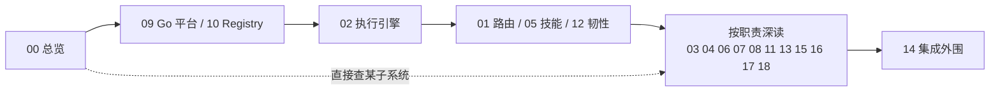

# 设计文档索引 (Design Docs Index)

> **一句话理解**：本目录 19 篇文档的地图——从总览进，按需跳转到各子系统深读。

本文是浅度分析，仅作导航，不含源码级蒸馏。

蒸馏计划与范围声明见 [_plan.md](_plan.md) / [_plan.yaml](_plan.yaml)，基于 commit `21fdb74` 生成。

## 文档清单

### core（必须精读）

| 文档 | 内容 | 适用读者 |
|---|---|---|
| [00-overview.md](00-overview.md) | 系统总览：Go 平台层 + Python 智能层 + React 前端的分工与事实源 | 所有人，新成员首读 |
| [01-selector.md](01-selector.md) | 智能路由器：意图识别与五路分发的元路由决策 | 平台与算法开发者 |
| [02-runtime.md](02-runtime.md) | Agent 执行引擎：请求到事件流的编排全链路（含 agent/MegaAgent 双路由陷阱） | 运行时开发者 |
| [04-rag-corpus.md](04-rag-corpus.md) | RAG 语料与检索：语料入湖与三级重排 | 检索与知识库维护者 |
| [05-skills-hooks.md](05-skills-hooks.md) | 技能与生命周期钩子：manifest / executor / 沙箱三层 | 技能作者与平台开发 |
| [09-go-platform.md](09-go-platform.md) | Go 平台层：REST 门面与 Python 智能层桥接 | 后端开发者 |
| [10-registry-store.md](10-registry-store.md) | SSOT Registry 与存储层：全系统事实源 | 后端与数据开发者 |

### standard（按子系统深入）

| 文档 | 内容 | 适用读者 |
|---|---|---|
| [03-fta.md](03-fta.md) | FTA 故障树分析引擎 | 诊断功能开发者 |
| [06-memory-planner-toolhub.md](06-memory-planner-toolhub.md) | 记忆 / 规划 / 工具中枢 | 引擎扩展者 |
| [07-code-analysis.md](07-code-analysis.md) | 代码分析子系统：调用图 + 错误解析 + 方案生成 | 代码分析开发者 |
| [08-mcp-llm.md](08-mcp-llm.md) | MCP 接入与 LLM Provider 层 | 模型接入者 |
| [11-gateway-config.md](11-gateway-config.md) | 网关与配置体系 | 运维与部署 |
| [12-resilience-feedback.md](12-resilience-feedback.md) | 韧性与反馈闭环 | 可靠性工程师 |
| [13-eventbus-observability.md](13-eventbus-observability.md) | 事件总线与可观测性 | 可观测性维护者 |
| [15-web-frontend.md](15-web-frontend.md) | Web 前端（React SPA） | 前端开发者 |
| [16-corpus-import.md](16-corpus-import.md) | 语料导入：外部 FTA / RAG / 技能语料的离线 ETL 层 | 语料与内容运营 |
| [17-cli.md](17-cli.md) | CLI 入口：三入口拓扑、REST 门面与 serve 本地编排 | 运维与脚本用户 |
| [18-traffic-analysis.md](18-traffic-analysis.md) | 动态流量分析：采集 → 依赖图 → LLM 报告 | 诊断场景开发者 |

### shallow（快速了解）

| 文档 | 内容 | 适用读者 |
|---|---|---|
| [14-docsync-integrations.md](14-docsync-integrations.md) | 文档同步与外部集成（Dify / LangGraph 外销） | 国际化维护者与集成方 |

## 推荐阅读顺序

1. **建骨架**：00 总览 → 09 Go 平台 → 10 Registry，搞清「谁跟谁说话、事实源在哪」；
2. **走请求主链**：02 执行引擎 → 01 路由 → 05 技能钩子 → 12 韧性，理解一次请求的完整生命周期；
3. **按职责补深**：做检索读 04 与语料导入 16，做诊断读 03 / 07 / 18，接模型或外部工具读 08 / 11，接观测读 13；
4. **入口与外围**：命令行走 17，双语文档与集成外销读 14，前端读 15。

各篇正文均带 `file:line` 锚点（相对仓库根），写作约定见各文档 frontmatter 的 `source_commit`。

*Last updated: 2026-09-05*
