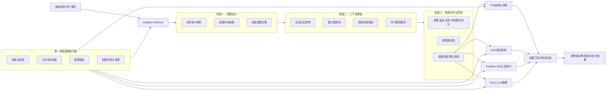

# ResolveAgent 论文解读与投稿论证说明

## 研究背景与问题陈述

随着云原生架构、微服务、容器编排和多租户平台的普及，IT 运维工作已经从“单点监控+人工排障”演变为“多源观测数据驱动的复杂决策系统”。在真实生产环境中，一个运维请求往往同时涉及以下几类能力：

- 结构化故障诊断，例如基于因果关系的根因定位；
- 运维知识检索，例如查询历史告警处置记录和 runbook；
- 外部工具执行，例如日志分析、指标检查、数据库巡检；
- 开放式推理与响应生成，例如综合多源证据形成解释和建议。

现有研究通常分别强化其中一种能力：

1. 传统 AIOps 更强调异常检测、告警关联和故障管理；
2. 仅基于 LLM 的智能体更强调自然语言推理与灵活交互；
3. 检索增强模型更强调事实性和知识对齐；
4. 工作流系统更强调确定性执行与可审计性。

但对于自主运维而言，真正关键的问题不是“哪一种能力最强”，而是“当前请求在给定约束下应该被送往哪一种机制处理”。如果路由错误，即便底层模型很强，也会导致以下问题：

- 将需要严格诊断的问题误交给自由生成模型，导致幻觉或缺乏因果结构；
- 将需要调用工具的问题误交给纯检索模块，导致执行能力不足；
- 将低风险查询误交给高成本 LLM 推理，造成不必要的时延和费用开销；
- 在能力缺失或权限不足时仍触发自动执行，增加操作风险。

ResolveAgent 论文的核心研究问题正是：**如何在安全、时延、能力可行性和准确性约束下，实现面向运维请求的多模态自适应路由。**

---

## 方法论与技术路线图示

论文提出一个统一的 AIOps 智能体平台，其核心是“效用校准路由”。该思想将请求分配问题建模为一个受约束的决策问题：系统需要在故障树分析、RAG、技能执行和直接 LLM 推理等多种候选路径之间，选择预期收益最高、风险最低的执行模式。

从方法论上看，系统主要由三层关键机制组成：

1. **智能选择器（Intelligent Selector）**：负责完成意图识别、上下文增强、能力裁剪和置信度决策；
2. **多模态执行平面**：包括 FTA 诊断、RAG 检索、沙箱技能和直接推理四种执行模式；
3. **统一控制平面**：通过单一真相源注册表统一维护工作流、技能、模型和网关配置，确保运行时一致性。

### 技术路线图

这一路线图体现了论文最重要的技术主张：**先做受约束的路由决策，再做相应的推理或执行**，而不是一开始就假定所有请求都适合进入统一的 LLM agent 循环。

---

## 关键创新点分析

### 1. 将运维路由提升为独立研究问题

本文最核心的理论创新，在于把“请求路由”从工程实现细节提升为独立建模对象。论文明确提出：运维请求的正确处理依赖于在多个候选执行模式之间做出收益-风险权衡，因此路由本质上是一个受约束的效用最大化问题，而不是简单的意图分类。

这一定义有三层学术价值：

- 它使系统设计具有明确的优化目标；
- 它为后续的校准、弃权和多路线选择提供了理论依据；
- 它把 AIOps、agent routing 和 decision-making 三类研究问题连接起来。

### 2. 三阶段智能选择器机制

现有很多 agent 系统依赖单阶段路由：要么直接关键词匹配，要么直接让 LLM 决策。本文提出的三阶段设计更适合生产运维：

- 第一阶段快速完成意图估计，保证效率；
- 第二阶段引入能力可行性和环境状态，避免“能说不能做”；
- 第三阶段通过置信度校准和弃权机制控制错误自动化。

这意味着系统不是盲目追求“总是自动执行”，而是在不确定时主动保守，这是顶级会议非常看重的系统可信性设计。

### 3. AI 增强型故障树分析

论文没有简单地把 LLM 用作统一推理器，而是保留了故障树分析的结构化因果优势，再把 `skill`、`rag`、`llm` 三类评估器接入叶节点。这样做有两个明显好处：

- 一方面，FTA 保证了因果诊断路径可解释、可审计；
- 另一方面，AI 评估器使传统故障树具备动态证据接入能力。

这是一种“符号结构 + 现代 AI 能力”的融合设计，兼顾学术创新性与工业可用性。

### 4. 安全受控的技能执行底座

许多 LLM agent 工作强调工具调用能力，但对工具执行的安全边界描述不够严格。本文将技能执行建立在声明式权限模型之上，通过主机与路径白名单、资源上限、超时限制和隔离环境保证执行安全。这使论文不仅讨论“会不会调用工具”，还讨论“调用工具是否可信、可控、可部署”。

### 5. 单一真相源控制平面

在系统论文中，真正有价值的不只是模型效果，还包括架构一致性。ResolveAgent 通过单一真相源注册表统一维护技能、工作流、模型和网关配置，显著降低了多运行时系统中的语义漂移问题。这一设计为平台化扩展和生产治理提供了理论与工程结合的支撑。

---

## 实验验证与结果

论文设计的实验验证具有较强的顶会风格，主要体现在以下几个方面：

### 1. 多数据集评测

实验不是只在单一任务集上验证，而是覆盖：

- `IncidentBench`：生产事件诊断场景；
- `OpsQA`：运维问答与知识检索场景；
- `SkillTest`：工具执行与技能调用场景。

这说明论文并不只是评估某一子任务，而是在评估一个统一运维平台的跨模式能力。

### 2. 多层次指标设计

论文报告的指标包括：

- 路由准确率（RA）
- 目标准确率（TA）
- 平均修复时间（MTTR）
- 首次响应质量（FRQ）
- 端到端延迟

这样的指标组合同时覆盖了“决策是否正确”“任务是否有效完成”和“系统是否足够高效”三个维度，更符合顶会对系统评估完整性的要求。

### 3. 主要结果

实验结果显示：

- `ResolveAgent-Hybrid` 路由准确率达到 `89.3%`；
- 相较人工流程，`MTTR` 降低 `47%`；
- 相较仅基于 LLM 的路由器，`MTTR` 进一步降低 `15%`；
- 在目标选择准确率与低时延方面同时优于各类基线。

这些结果证明，系统优势并不是来源于“使用了更强模型”，而是来源于**更合理的机制分配**。

### 4. 消融与鲁棒性分析

论文进一步通过消融实验显示：

- 意图估计和 FTA 集成是影响性能的关键组件；
- 去除弃权机制后，系统在低置信度情形下更容易犯高代价错误；
- 在技能缺失、知识漂移和高并发场景下，系统表现为平稳退化而非崩溃式失效。

这使实验结论从“平均效果好”提升为“系统机制具有解释性和鲁棒性”，明显增强了论文的学术说服力。

---

## 与现有工作的对比优势

相较现有工作，ResolveAgent 的优势不在于单点能力最强，而在于统一框架下的系统性提升。

### 相较传统 AIOps

- 传统 AIOps 更关注检测、聚类和故障管理；
- ResolveAgent 更进一步，直接研究“如何为不同运维请求分配最合适的处理机制”。

### 相较仅基于 LLM 的运维智能体

- 仅基于 LLM 的方法在开放式推理上灵活，但在结构化诊断与安全执行上存在短板；
- ResolveAgent 用 FTA 保证因果结构，用技能沙箱保证执行边界，用控制平面保证运行时一致性。

### 相较检索增强系统

- RAG 系统擅长知识接入，但不能单独承担工具执行和因果诊断；
- ResolveAgent 将 RAG 作为可选路径之一，而非默认路径，因此更适合复杂异构任务。

### 相较通用工具型 Agent

- 通用 agent 常常强调“能调多少工具”；
- ResolveAgent 更强调“该不该调用、在什么条件下调用、调用后如何治理”。

从这一点看，本文的对比优势不是局部优化，而是对“自主运维系统应该如何组织”的整体回答。

---

## 潜在应用场景

ResolveAgent 的研究成果具有明显的应用外延，适用于多个真实场景：

1. **企业级云平台运维中心**：对告警、故障、知识问答和修复动作进行统一编排；
2. **SRE 智能助手**：为值班工程师提供诊断建议、执行建议和知识支持；
3. **DevOps / MLOps 平台**：统一模型路由、任务调度和环境操作；
4. **安全事件响应系统**：将结构化排查、检索和动作执行相结合，用于半自动化 incident response；
5. **多租户 AIOps 平台产品**：通过单一真相源控制平面实现可扩展能力注册和治理。

这些场景表明，该工作不仅有理论价值，也具有显著的工业落地潜力。

---

## 投稿顶会的具体理由

### 1. 研究问题具有顶会价值

顶级软件工程会议通常更看重“问题是否重要、是否具有普适性”。本文研究的不是某个局部技巧，而是面向自主运维平台的核心瓶颈：多模态请求如何在复杂约束下被正确路由。这是一个高价值、具有普遍意义的问题。

### 2. 方法兼具理论建模与系统实现意义

论文不仅提出了明确的效用建模与三阶段决策机制，也给出了与 FTA、RAG、技能和控制平面结合的系统化实现路径。这种“从理论到系统”的完整性非常符合 ICSE、ASE、FSE 对研究论文的偏好。

### 3. 实验设计具有说服力

论文覆盖多数据集、多基线、多指标，并进一步进行消融和鲁棒性分析。实验不是单一 benchmark 的局部胜利，而是围绕研究问题逐层展开，这种结构是顶会评审普遍认可的证据组织方式。

### 4. 创新点不是简单工程拼装

虽然论文包含多个熟悉的技术模块，但真正创新之处在于：

- 用统一决策框架连接这些模块；
- 用选择性路由替代单体 agent 假设；
- 用结构化故障树和单一真相源强化系统可信性与可治理性。

这种创新不是“把现有技术堆起来”，而是提出了新的系统组织原则。

### 5. 同时具备学术影响力与产业价值

顶会尤其重视能推动学术与实践双向发展的工作。ResolveAgent 一方面对 agent routing、AIOps 和 trustworthy AI systems 有研究贡献，另一方面又直接服务于真实生产运维场景，因而具备较强的发表潜力。

---

## 总结

从学术角度看，ResolveAgent 论文的核心价值在于提出了一个面向自主 IT 运维的统一决策框架：系统不再默认所有任务都交给单一 LLM 智能体，而是先进行受约束的效用校准路由，再调用最合适的结构化诊断、知识检索、工具执行或直接推理机制。

从系统角度看，该论文将选择性路由、AI 增强型故障树、安全技能执行与控制平面一致性整合到同一平台中，形成了一个既有理论依据、又具有工程可部署性的统一架构。

从投稿角度看，这项工作具备清晰的问题定义、明确的创新边界、完整的实验验证和突出的应用潜力，因而具有冲击 `ICSE`、`ASE`、`FSE` 等顶级软件工程会议的合理基础。
