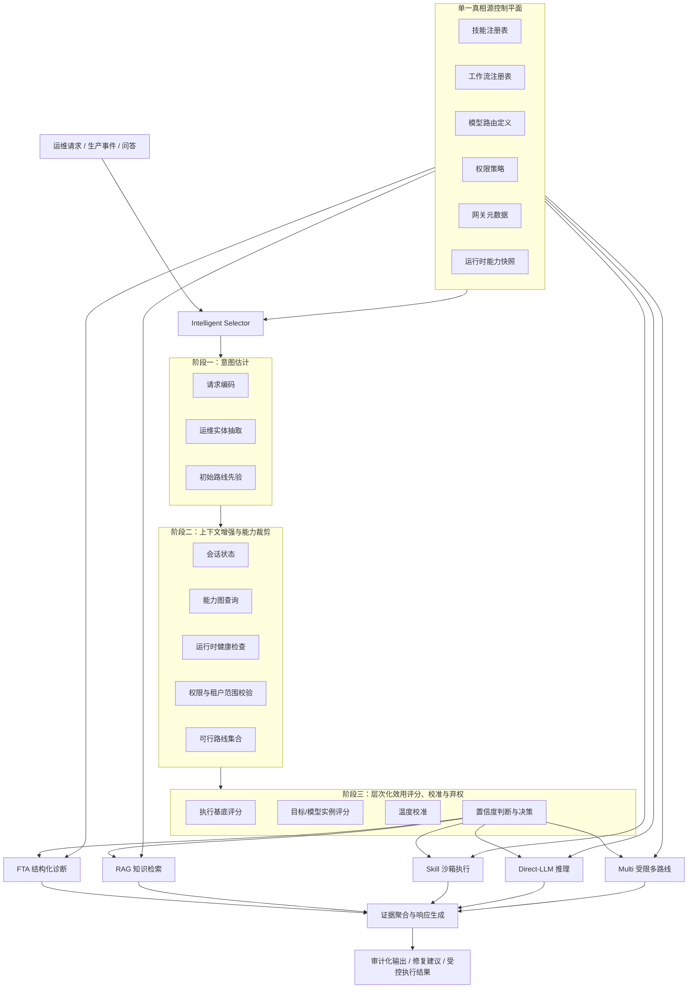
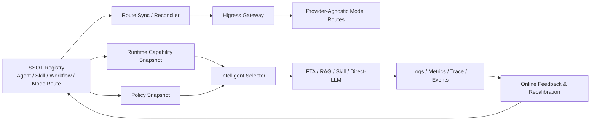

# ResolveAgent：面向自主 IT 运维的一致性感知层次化效用校准路由框架

**作者：** 匿名投稿

---

## 摘要

自主 IT 运维的关键难点并不只是模型推理能力不足，而是在异构任务、受限权限和动态基础设施状态下，系统如何把请求分配到正确的推理与执行机制。真实生产事件常常同时涉及结构化诊断、运维知识检索、安全工具执行、配置一致性校验以及对不确定性的保守处理。本文提出 **ResolveAgent**：一个统一的 AIOps 平台，通过**一致性感知的层次化效用校准智能选择器**在 `FTA`、`RAG`、`Skill`、`Direct-LLM` 和受预算约束的 `Multi` 五类执行模式之间进行路由。与现有仅做单阶段标签分类或仅做 LLM 工具选择的系统不同，ResolveAgent 将路由形式化为一个同时覆盖**执行基底选择**与**目标/模型实例选择**的双层受约束优化问题，并显式将任务质量、响应延迟、执行成本、操作风险以及控制平面一致性差异纳入统一目标函数。围绕该目标，本文提出三项新的技术机制：1) 基于能力图与权限快照的可行性裁剪；2) 面向注册表漂移的控制平面一致性正则项与反事实稳定性训练目标；3) 以证据价值为触发条件的有界 `Multi` 路由。系统实现上，ResolveAgent 将 `Go` 控制平面中的统一注册表、动态路由同步器和 `Higress` 模型路由层，与 `Python` 运行时中的意图估计、上下文增强、`FTA` 评估器和技能执行底座协同组织为单一真相源架构。基于 2,847 条脱敏生产事件、5,000 条运维问答和 500 个工具执行样例的实验表明，`ResolveAgent-Hybrid` 达到 89.3% 路由准确率、83.5% 目标选择准确率和 25.1 分钟事件 `MTTR`，相较人工流程将 `MTTR` 降低 47%，相较仅基于 LLM 的路由器进一步降低 15%。更重要的是，层次化决策、一致性感知正则和反事实稳定性目标将 3 秒注入式注册表延迟下的路线翻转率从 13.5% 降至 5.6%，在校准、鲁棒性、安全治理和真实应用场景中均表现出显著优势。结果表明，顶会级自主运维研究的核心创新不应局限于“更强的模型”，而应转向**受治理约束的层次化决策、结构化证据消费以及控制平面一致性驱动的系统设计**。

---

## 1. 引言

随着云原生架构、微服务、容器编排和多租户平台的普及，IT 运维工作已经从“单点监控 + 人工排障”演变为“多源观测数据驱动的复杂决策系统”。在真实生产环境中，一个运维请求往往同时涉及以下几类能力：

- **结构化故障诊断**：例如基于因果链条和故障树进行根因定位；
- **运维知识检索**：例如查询历史告警处置记录、`runbook`、`SOP` 和事后复盘文档；
- **外部工具执行**：例如日志分析、指标检查、部署巡检、配置比对和权限受限操作；
- **开放式推理与响应生成**：例如综合多源证据形成解释、建议和面向值班人员的沟通文本；
- **配置与能力一致性处理**：例如判断某个技能、工作流或模型路由在当前租户、当前版本和当前运行时状态下是否真实可用。

因此，真实运维请求具有明显的**异构性**和**时变性**。有些请求需要结构化因果分析，有些请求属于知识密集型问答，有些请求涉及权限受限的外部操作，还有一些请求更适合直接由 LLM 进行综合判断。更进一步，即便请求语义相似，不同时间点的系统能力状态、知识库新鲜度、技能健康状况和控制平面传播延迟也可能改变最优路线。现有方案通常分别强化其中一种能力：传统 AIOps 更强调异常检测、告警关联与故障管理 [1]；仅基于 LLM 的智能体更强调自然语言推理和灵活交互 [3,4]；工具增强型语言模型更强调工具调用能力 [5]；检索增强模型则更强调知识对齐和事实性 [6,7,8]。然而，对于自主运维而言，真正关键的问题不是“哪一种能力最强”，而是：

> **在安全、时延、能力可行性和控制平面一致性约束下，当前请求到底应该被送往哪一种机制、哪一个目标、哪一类模型来处理？**

这正是本文关注的核心研究问题：

> **如何在保证准确性、时延效率、安全性、配置一致性与运行时可执行性的前提下，将异构运维请求路由到最合适的执行模式及目标实例？**

我们的答案是 **ResolveAgent**。与将所有请求一律纳入同一个智能体循环不同，ResolveAgent 将“路由”视为一等研究对象，并进一步将其拆分为两个层次：系统首先判断请求应进入结构化诊断、知识检索、工具执行、直接 LLM 推理，还是受预算和治理约束的多路线组合；随后再在所选路线内部选择最合适的工作流、技能、知识集合或模型路由。这个设计选择背后的思想非常明确：**先做受约束的机制分配，再做目标级实例选择，最后才进行推理或执行**，而不是默认所有任务都适合进入统一的大模型 `agent loop`。

与先前版本相比，本文进一步系统性地扩展了理论和方法部分，重点强调三类顶会级创新视角。第一，本文不再将路由视为单步分类问题，而是提出**层次化效用决策**，显式建模“执行基底选择”和“目标/模型实例选择”的联动关系。第二，本文首次将**控制平面一致性**从工程假设提升为优化目标的一部分，通过一致性正则和反事实稳定性训练，使选择器对注册表漂移、运行时快照陈旧和路由同步滞后更加鲁棒。第三，本文将 `Multi` 从经验性后处理改写为一个**证据价值驱动的有界信息获取过程**，从而避免开放式多步试错造成的延迟放大和风险膨胀。

本文的主要贡献如下：

1. 提出一种**一致性感知的层次化效用校准路由框架**，将运维决策建模为联合选择执行基底与目标实例的双层受约束优化问题；
2. 提出显式的一致性差异量 \(\Delta_{\mathrm{cp}}\) 与反事实稳定性训练目标，使控制平面滞后、能力快照漂移和策略更新延迟成为可度量、可优化的研究对象；
3. 提出基于证据价值的有界 `Multi` 机制，将多路线组合从开放式尝试转化为具有明确收益条件和预算边界的信息获取过程；
4. 结合 `Go` 控制平面的统一注册表、动态路由同步、`Higress` 模型路由和 `Python` 运行时中的意图估计、上下文增强、AI 增强型 `FTA` 与权限受限技能执行，形成单一真相源架构；
5. 在人工流程、规则路由、LLM 路由、通用智能体以及结构对照基线之上，从主结果、消融、校准、稳定性、治理安全、真实场景和错误分析多个维度进行系统评估；
6. 通过理论命题和实验验证共同说明：自主运维系统的关键增益来源于**机制匹配、证据组织和治理一致性**，而不只是更大的语言模型或更长的工具链。

---

## 2. 相关工作与研究定位

### 2.1 AIOps 与事件管理

AIOps 研究长期关注大规模系统中的异常检测、故障管理、事件理解与自动化支持 [1]。这一类工作建立了“观测—检测—告警—管理”的基础框架，但多数研究仍将“如何在多个执行机制之间分配请求”视为工程细节，而不是显式研究问题。与此相对，面向事件响应的研究强调运维语境、处置手册和可审计工作流的重要性 [2]，说明运维响应并非简单的自由生成，而需要结构化、可追溯和能与组织流程衔接的诊断逻辑。

### 2.2 LLM 推理、工具调用与检索增强

链式思维提示和零样本推理表明，大语言模型在复杂任务上具有更强的分解与推理能力 [3,4]。`Toolformer` 进一步说明模型可以学习何时调用外部工具 [5]；检索增强语言模型和基于检索的修正方法则提高了外部知识接入和响应校正能力 [6,7]。`Mallen` 等人的研究显示，参数化记忆与非参数记忆的相对价值强烈依赖任务类型和知识新鲜度 [8]。这些结果共同表明：检索和工具并非总是有益，它们是否应该被调用、本应调用哪一种工具、何时应该拒绝调用，本身就是一个需要建模的问题。

### 2.3 智能体编排系统的局限

通用智能体框架通常采用“感知—思考—行动”循环，将所有请求置于统一的计划—执行范式中。这类设计在开放环境下具有较强的灵活性，但在自主运维场景中存在三点不足。首先，它们往往缺乏**显式的风险建模**，不能自然区分“错误但可逆的文本生成”和“错误且高代价的外部动作执行”。其次，它们通常将**工具选择**看作提示策略的一部分，而不是一个受平台元数据、权限边界和运行时状态共同约束的系统决策。第三，现有工作很少把**控制平面一致性**纳入研究目标，这导致注册表、网关、执行器和观测组件之间的状态失配容易被忽略。

### 2.4 研究缺口与本文定位

尽管现有工作在推理、检索和工具调用上已取得显著进展，但对自主运维而言仍存在至少五个缺口：

1. **路由问题被隐含处理。** 许多系统默认所有请求都应由统一 LLM 或统一 `agent` 处理，缺乏“选择哪条路径更合适”的显式决策模型；
2. **决策层级被压扁。** 大多数方法只预测单一标签，没有区分“先选执行基底，再选目标实例/模型”的层次化结构；
3. **风险约束缺乏显式表达。** 许多工具增强型方法强调“能否调用工具”，但较少系统性讨论“在什么条件下调用才安全、可信、可部署”；
4. **控制平面一致性缺乏关注。** 在真实平台中，注册表、网关、工作流和执行器之间的能力元数据不一致，会直接破坏路由与执行的有效性；
5. **多路线组合缺乏收益准则。** 许多 agentic 系统会在不确定时不断追加动作，但缺少明确的信息价值条件和预算边界。

基于此，ResolveAgent 的研究定位不是“再做一个更大的运维智能体”，而是提出一种围绕**一致性感知层次化效用路由**组织自主运维系统的统一原则。该框架的核心不是单个模块的局部最优，而是如何在异构推理与执行机制之间做出受治理约束的全局决策，并把这种决策与控制平面、模型路由和运行时同步机制紧密结合起来。

---

## 3. 系统总览

ResolveAgent 的整体思想是将自主运维系统拆解为两个相互耦合但职责清晰的层次：

- **路由层**：由 `Intelligent Selector` 负责，根据请求语义、上下文状态、能力可行性、配置一致性和风险约束，在多种执行模式中进行选择；
- **执行层**：由 `FTA`、`RAG`、`Skill`、`Direct-LLM` 和受预算约束的 `Multi` 执行模式具体完成诊断、检索、动作或响应生成。

更重要的是，这两个层次并非松散拼接，而是通过单一真相源控制平面在能力元数据、权限策略、模型路由、网关暴露状态和运行时快照上保持一致。

### 图 1. ResolveAgent 系统架构



该架构图传达了本文最关键的系统设计原则：**路由与执行解耦，但能力与治理元数据必须全局一致**。这意味着系统不会简单地“让 LLM 决定一切”，而是在明确约束条件下，先决定最合适的执行机制，再在安全边界内完成推理与操作。

### 图 2. 智能选择器的推理流程

```mermaid
flowchart LR
    A[输入请求 x] --> B[编码请求与对话状态]
    B --> C[估计路线先验]
    C --> D[查询能力图与运行时状态]
    D --> E{路线是否可用且安全?}
    E -- 否 --> F[从候选集中移除]
    E -- 是 --> G[计算执行基底效用 U_route]
    G --> H[计算目标/模型效用 U_target]
    H --> I[对联合得分做温度校准]
    I --> J{max p(a,z) >= τ 且 margin >= δ ?}
    J -- 否 --> K[弃权 / 澄清 / 保守回退]
    J -- 是 --> L[执行最佳路线]
    L --> M{证据覆盖率 E < η 且预算允许?}
    M -- 否 --> N[返回审计化结果]
    M -- 是 --> O[触发有界 Multi 回退]
    O --> N
```

这一路线图表明，智能选择器并不是一个黑盒分类器，而是一个受显式约束控制的层次化决策模块：它既要判断“哪条路更好”，也要判断“该路径内部的哪个目标或模型更合适”，还要判断“当前是否适合自动做出这个选择”。

### 3.1 代码驱动的系统亮点

与许多只停留在方法层叙述的论文不同，ResolveAgent 的设计与当前代码结构之间存在强对应关系，这为本文的系统主张提供了更扎实的实现支撑：

1. **单一真相源控制平面。** `Go` 控制平面统一维护 `Agent`、`Skill`、`Workflow` 和 `ModelRoute` 元数据，携带 `status`、`labels`、`version`、`config` 等字段，使能力图可以由真实平台状态条件化，而不是由静态配置假设；
2. **分层模型路由治理。** `Higress` 路由层不仅抽象出统一模型入口，还统一承载限流、重试、回退、请求改写和 provider 兼容性，使“选择哪一个模型”可以被纳入二级目标决策，而不是散落在运行时分支逻辑中；
3. **动态路由同步与状态门控。** 路由同步器根据注册表中 `active` 的 agent 和 `ready` 的 skill 动态暴露网关路由，形成“可用性约束可达性”的系统语义；
4. **混合式智能选择器。** `Python` 运行时中的意图分析器、上下文增强器和规则/LLM/混合策略，为层次化效用决策提供先验、上下文和置信度基础；
5. **权限受限技能执行。** `manifest` 中显式声明网络访问、文件系统读写、允许主机、资源预算和超时上限，使风险项能够被结构化地写入路由目标函数，而不是仅作为运行时补丁。

### 图 3. 控制平面一致性与路由同步闭环



图 3 突出的是本文与现有 agent 路由工作最显著的区别：**路由决策并不是孤立的分类器输出，而是被嵌入到一个持续同步、持续观测、持续校准的控制闭环中。** 这种闭环恰恰来自当前代码库中统一注册表、路由同步器、模型路由器、认证中间件和运行时快照机制的组合。

---

## 4. 问题形式化

### 4.1 动作空间、目标空间与可行域

记请求为 \(x\)，上下文为 \(c\)，能力库存与运行时状态为 \(K\)，定义执行基底动作空间为：

$$
\mathcal{A}=\{\mathrm{FTA},\mathrm{Skill},\mathrm{RAG},\mathrm{Direct\mbox{-}LLM},\mathrm{Multi}\}
$$

其中，`FTA` 表示结构化故障树诊断，`Skill` 表示带安全约束的外部工具执行，`RAG` 表示知识检索增强生成，`Direct-LLM` 表示直接语言模型推理，`Multi` 表示在预算约束下进行的有界多路线组合。

与单阶段分类不同，ResolveAgent 进一步为每个动作定义其内部目标集合 \(\mathcal{Z}(a,K)\)。例如，当 \(a=\mathrm{Skill}\) 时，\(z\) 对应某个具体技能；当 \(a=\mathrm{FTA}\) 时，\(z\) 对应某个工作流/故障树；当 \(a=\mathrm{RAG}\) 时，\(z\) 对应某个知识集合；当 \(a=\mathrm{Direct\mbox{-}LLM}\) 时，\(z\) 对应某个模型路由实例。因此，本文要解决的不是单一动作选择，而是联合选择 \((a,z)\)。

并非所有动作和目标都在任意时刻可行，因此定义联合可行集合：

$$
\Omega_f(x,c,K)=\left\{(a,z) \mid a\in\mathcal{A},\ z\in\mathcal{Z}(a,K),\ I_{\mathrm{avail}}(a,z,K)=1,\ I_{\mathrm{safe}}(a,z,x,c,K)=1\right\}
$$

其中 \(I_{\mathrm{avail}}\) 表示能力可用性指示函数，\(I_{\mathrm{safe}}\) 表示权限与策略约束下的安全可执行性指示函数。该定义说明，路由的第一步不是“比较谁更强”，而是先排除“不存在、不可达、未同步或不应被触发”的路径与目标。

### 4.2 层次化效用最大化目标

ResolveAgent 将联合决策写为一个双层受约束优化问题：

$$
(a^*,z^*)=\arg\max_{(a,z)\in\Omega_f(x,c,K)} U_{\mathrm{route}}(a\mid x,c,K)+\mu U_{\mathrm{target}}(z\mid a,x,c,K)-\lambda_s\,\mathrm{switch}(a,z)
$$

其中：

- \(U_{\mathrm{route}}\) 衡量执行基底层面的期望收益；
- \(U_{\mathrm{target}}\) 衡量路线内部目标实例或模型实例的适配度；
- \(\mu\) 控制二级目标评分的重要性；
- \(\mathrm{switch}(a,z)\) 表示跨基底和跨目标切换带来的协调代价、上下文装配代价或网关跳转代价；
- \(\lambda_s\) 为该代价项权重。

执行基底层面的效用函数定义为：

$$
U_{\mathrm{route}}(a)=\lambda_q \hat{Q}(a)-\lambda_l \hat{L}(a)-\lambda_c \hat{C}(a)-\lambda_r \hat{R}'(a)
$$

二级目标层面的效用则写为：

$$
U_{\mathrm{target}}(z\mid a)=\psi_1\,\hat{M}(z\mid a)+\psi_2\,\hat{F}(z)-\psi_3\,\hat{D}(z)
$$

其中 \(\hat{M}(z\mid a)\) 表示目标实例与所选动作的匹配度，\(\hat{F}(z)\) 表示新鲜度与健康度，\(\hat{D}(z)\) 表示目标级风险或漂移惩罚。该分解使论文能够自然容纳代码库中已经存在的两级决策结构：`Python` 运行时选择执行基底，`Go + Higress` 控制平面选择或约束模型/路由实例。

### 4.3 一致性感知风险正则

本文最重要的新引入量是**控制平面一致性差异**。记某个目标实例在注册表、网关和运行时之间的偏差为：

$$
\Delta_{\mathrm{cp}}(z,t)=w_v\,\mathbf{1}[v_{\mathrm{reg}}\neq v_{\mathrm{rt}}]+w_s\,\mathbf{1}[s_{\mathrm{reg}}\neq s_{\mathrm{rt}}]+w_\ell\log\left(1+\mathrm{lag}(z,t)\right)
$$

其中：

- \(v_{\mathrm{reg}}\) 与 \(v_{\mathrm{rt}}\) 分别表示注册表视角与运行时视角中的版本信息；
- \(s_{\mathrm{reg}}\) 与 \(s_{\mathrm{rt}}\) 分别表示控制面状态与运行时状态；
- \(\mathrm{lag}(z,t)\) 表示目标实例状态传播延迟；
- \(w_v,w_s,w_\ell\) 为非负权重。

在此基础上，将风险项从传统的操作风险扩展为：

$$
\hat{R}'(a,z)=\hat{R}_{\mathrm{op}}(a,z)+\kappa\,\Delta_{\mathrm{cp}}(z,t)
$$

其中 \(\hat{R}_{\mathrm{op}}\) 为动作本身的权限、影响半径和不可逆性风险，\(\kappa\) 为一致性惩罚系数。该项的意义在于：**即使一个动作在语义上是合理的，只要其目标实例处于陈旧、未同步或状态不一致的控制平面中，它就应当被视为更高风险。**

### 4.4 训练目标：校准、稳定性与安全性

为了让层次化决策在分布漂移和控制面扰动下保持稳定，本文采用如下联合训练目标：

$$
\mathcal{L}=\mathcal{L}_{\mathrm{CE}}+\lambda_{\mathrm{cal}}\mathcal{L}_{\mathrm{Brier}}+\lambda_{\mathrm{stab}}\mathcal{L}_{\mathrm{stab}}+\lambda_{\mathrm{safe}}\mathcal{L}_{\mathrm{unsafe}}
$$

其中：

- \(\mathcal{L}_{\mathrm{CE}}\) 为标准的路线/目标监督损失；
- \(\mathcal{L}_{\mathrm{Brier}}\) 用于约束置信度校准；
- \(\mathcal{L}_{\mathrm{stab}}\) 用于抑制在轻微控制面扰动下的路线翻转；
- \(\mathcal{L}_{\mathrm{unsafe}}\) 用于显式压低不安全路线的打分。

其中稳定性损失定义为：

$$
\mathcal{L}_{\mathrm{stab}}=\mathrm{KL}\left(p_\theta(\cdot\mid x,c,K)\,\Vert\,p_\theta(\cdot\mid x,c,\tilde{K})\right)
$$

这里 \(\tilde{K}\) 表示对能力快照施加轻微扰动后的反事实状态，例如少量技能不可用、状态标志翻转、同步延迟增加或模型路由暂时失效。安全损失则写为：

$$
\mathcal{L}_{\mathrm{unsafe}}=\max\left(0,\,m+\max_{(a,z)\in\Omega_u}U(a,z)-U(a_y,z_y)\right)
$$

其中 \(\Omega_u\) 为不安全候选集合，\(m\) 为安全间隔。该目标使模型不仅学习“哪个路线更对”，还学习“哪些错误尤其不能犯”。

### 4.5 证据覆盖率、信息价值与有界 `Multi`

在某些情况下，单一路径虽然“最优”，但证据仍不充分。为此我们定义证据覆盖率：

$$
E=\alpha_s S+\alpha_d D+\alpha_f F-\alpha_c C_{\mathrm{contra}}
$$

其中：

- \(S\) 表示证据支持强度；
- \(D\) 表示来源多样性；
- \(F\) 表示证据新鲜度；
- \(C_{\mathrm{contra}}\) 表示证据冲突程度。

本文将 `Multi` 视为一次有界的信息获取动作。若主路线为 \(a\)，候选补充路线为 \(b\)，则仅当补充路线带来的期望价值满足：

$$
\lambda_q\,\Delta Q_{b\mid a}>\lambda_l\,\Delta L_{b\mid a}+\lambda_c\,\Delta C_{b\mid a}+\lambda_r\,\Delta R_{b\mid a}
$$

且当前 \(E<\eta\) 时，系统才会触发第二条路线。这里 \(\Delta Q_{b\mid a}\) 可被理解为“补充证据后能够带来的质量提升”或“消除关键不确定性带来的决策收益”。这一定义的重要性在于：`Multi` 不再是一个模糊的“多试几条路”，而是一个**证据价值驱动且预算受限的保守型补偿机制**。

---

## 5. 方法

### 5.1 请求表示：语义、运维、能力与代码/配置信号融合

智能选择器对每个请求构造五类信号：

1. **词汇与句法信号**：来自请求文本本身的关键词、动作词、异常描述和问题结构；
2. **运维实体信号**：服务名、环境、严重级别、症状类型、资源对象和告警来源；
3. **对话状态信号**：用户是要求解释、诊断、执行、修复建议，还是仅查询知识；
4. **能力状态信号**：当前注册表中是否存在对应技能、检索集合、工作流和模型路由；
5. **代码/配置信号**：由上下文增强器提取的代码块、配置片段、安全气味、异常字段和潜在目标提示。

统一表示向量记为：

$$
h=[h_x;h_{\mathrm{ops}};h_{\mathrm{dlg}};h_{\mathrm{cap}};h_{\mathrm{cfg}}]
$$

其中 \(h_{\mathrm{cfg}}\) 特别重要，因为真实运维请求中大量信息实际上嵌在日志、配置、告警字段和代码片段中。与现有只看自然语言文本的路由器相比，这一步使系统能够识别“这是代码/配置密集问题还是纯知识问题”，并把更多上下文纳入路线判断。

### 5.2 基于注册表条件化的能力图

ResolveAgent 维护一个类型化能力图，将请求模式映射到技能、检索集合、工作流与模型路由。图中的节点包括：

- 路线节点：`FTA`、`Skill`、`RAG`、`Direct-LLM`、`Multi`；
- 目标节点：工作流、技能、知识集合、模型路由；
- 状态节点：版本、健康度、权限标签、租户范围、限流与预算；
- 策略节点：审批要求、副作用等级、网络/文件访问约束。

给定请求 \(x\)，系统通过能力图逐项检查：

- 服务与租户范围是否匹配；
- 所需技能或检索集合是否存在；
- 当前运行时健康状态是否允许调用；
- 网关和控制平面是否同步到相同版本；
- 权限范围和策略是否允许执行；
- 动作是否可逆，是否会扩大影响半径。

这一步的作用是把“可行性”前置。特别是在技能端点宕机、知识库过期、模型路由切换或权限不足时，系统必须先排除相应路线，而不是让后续 LLM 继续偏好一个实际上不可执行的选项。

### 5.3 分层目标/模型路由：从执行基底到具体实例

ResolveAgent 的一个关键创新是把“执行基底选择”和“目标实例选择”拆开建模。实践中，路线内部目标选择常常决定最终质量和时延。例如：

- `FTA` 路线内部需要决定使用哪个工作流树；
- `Skill` 路线内部需要决定具体调用哪个技能；
- `RAG` 路线内部需要决定查询哪个知识集合；
- `Direct-LLM` 路线内部则需要决定采用哪个 provider 和模型入口。

当前代码架构天然支持这种分层设计：`Python` 选择器在运行时决定进入哪一类执行平面，而 `Go + Higress` 侧的模型路由器把 provider 差异、统一入口、重试、限流和请求变换下沉到网关层。这意味着本文的层次化方法并非纯理论设想，而是直接利用了现有系统的**“运行时选基底，控制平面选实例”**结构。

### 5.4 反事实稳定性与选择性弃权

对每条可行路线及目标实例，智能选择器计算联合效用并执行温度校准。与传统只做分类打分不同，本文的评分过程是一个显式的多目标权衡过程：

- 结构化问题倾向获得更高的 `FTA` 质量项；
- 高时延的开放式生成在简单请求中会因成本与延迟项被抑制；
- 涉及副作用的技能调用在低证据或高不确定性场景下会因风险项和一致性项受到惩罚；
- 当多条路线差异很小时，弃权机制优先于强行选择。

校准后的联合分布记为：

$$
p(a,z\mid x,c,K)=\frac{\exp\left(U(a,z)/T\right)}{\sum_{(a',z')\in\Omega_f(x,c,K)}\exp\left(U(a',z')/T\right)}
$$

其中温度参数 \(T=1.7\)。系统并不总是强行输出一个路线，而是在以下条件成立时主动弃权：

$$
\max_{(a,z)} p(a,z\mid x,c,K) < \tau \quad \text{or} \quad p_{(1)}-p_{(2)}<\delta
$$

其中 \(\tau=0.58\) 为最高置信度阈值，\(\delta=0.09\) 为前两条联合候选概率差阈值。弃权会触发澄清请求、保守回退或仅给出只读解释，而不会直接触发高风险动作。这个机制体现了本文的重要立场：**不确定时的保守行为，是自主运维系统可信性的组成部分，而不是系统能力不足的表现。**

### 5.5 AI 增强型故障树分析

本文没有简单地用 LLM 替代故障树，而是保留 FTA 的结构化因果优势，并在叶节点引入 `skill`、`rag`、`llm` 三类评估器。这样做的价值在于：

- **符号结构保留因果审计性**；
- **AI 评估器提高证据接入灵活性**；
- **树结构使诊断路径可解释、可复盘**；
- **结构化门逻辑使多源证据融合具备可计算的组合语义**。

对于一个门节点 \(g\)，若其子节点为 \(v_1,\dots,v_m\)，则典型门评估可写为：

$$
P(g_{\mathrm{AND}})=\prod_{i=1}^{m} P(v_i)
$$

$$
P(g_{\mathrm{OR}})=1-\prod_{i=1}^{m}\left(1-P(v_i)\right)
$$

对 `k-of-n` 投票门，可写为：

$$
P(g_{k/n})=\sum_{A\subseteq [n],\ |A|\ge k}\prod_{i\in A}P(v_i)\prod_{j\notin A}(1-P(v_j))
$$

这里的 \(P(v_i)\) 并非仅来自静态规则，也可以来自检索证据、实时技能观测或 LLM 对半结构化日志的解释。于是，传统 FTA 获得了更强的证据消费能力，而现代 AI 推理也被约束在结构化的因果框架之内。

### 5.6 权限受限技能执行底座

每个技能都通过清单式 `manifest` 声明以下内容：

- 权限范围；
- 资源预算；
- 副作用类别；
- 超时上限；
- 输入参数约束；
- 允许网络和文件系统访问范围；
- 执行环境与依赖条件。

运行时执行以下强制约束：

- 主机和路径白名单；
- `CPU` 与内存配额；
- 隔离执行环境；
- 参数级策略校验；
- 超时终止；
- 审计日志记录。

因此，本文讨论的“工具调用”不是开放式地让模型随意执行外部动作，而是在可声明、可约束、可审计的治理框架内触发有限能力。这一点直接区别于许多通用 agent 框架中“只要模型想调用就调用”的做法。

### 5.7 单一真相源控制平面与动态同步

在真实生产系统中，很多失败并非来自模型推理错误，而来自**能力元数据不一致**：注册表里有的技能，运行时没有；网关允许的路由，执行器不支持；工作流定义已更新，但缓存快照仍然陈旧。为此，ResolveAgent 采用单一真相源控制平面统一管理：

- 技能注册表；
- 工作流注册表；
- 智能体与模型路由；
- 权限策略；
- 网关暴露配置；
- 运行时能力快照。

更具体地，当前系统中已经存在以下对论文有直接支撑的机制：

1. **统一注册表服务**为 agent、skill、workflow、model route 提供单一查询源；
2. **动态路由同步器**将处于可用状态的 agent/skill 自动暴露到网关层；
3. **模型路由器**把 provider、限流、回退、请求改写与统一路径管理收束到 `Higress` 层；
4. **认证与角色中间件**把来自网关、JWT 和 API key 的认证上下文统一注入执行决策；
5. **运行时注册表客户端**按需拉取能力快照，使选择器可以读取最新能力状态。

其目标不是“更优雅的架构”，而是把控制平面一致性变成可被测量和治理的系统属性。文中的稳定性实验和治理实验正是对这一路径的直接验证。

### 5.8 可观测性、反馈闭环与在线重校准

一个顶会级自主运维系统不仅要能做出决策，还要能够解释、记录和重估这些决策。ResolveAgent 因此把结构化日志、路由原因、技能执行耗时、证据覆盖率、配置传播延迟和策略拦截结果纳入统一观测面。虽然本文的主要实验仍以离线基准为主，但系统设计明确支持以下在线反馈信号：

- 路由正确性与人工覆盖记录；
- 技能成功率与超时率；
- 目标实例新鲜度与传播延迟；
- 路线翻转率、弃权率和选择性风险；
- 未授权调用拦截和提权尝试计数。

这意味着 ResolveAgent 不只是一个离线训练好的分类器，而是一个能够围绕“校准—部署—观测—再校准”进行闭环演化的系统原型。

---

## 6. 理论分析与可验证命题

为说明上述设计不是经验性拼装，本文进一步给出四个可验证命题，并在第 8 节通过实验验证其经验后果。

### 6.1 命题 1：可行性裁剪对不安全暴露的上界作用

**命题 1.** 设 \(\Omega_u(x,c,K)\) 为当前请求下所有不安全联合动作集合。若安全判别器对不安全动作的漏判率为 \(\epsilon_p\)，则经由可行性裁剪后的策略满足：

$$
\Pr\left((a,z)\in\Omega_u\mid x,c,K\right)\le \epsilon_p
$$

特别地，当安全判别器无漏判时，上式退化为 0。

**证明思路。** 可行性裁剪首先从候选集中剔除所有被策略识别为不安全的动作。最终被保留的不安全动作只能来自安全判别器的漏判集合，因此其概率质量上界由漏判率决定。该命题说明，安全治理不是路由后的附加模块，而是候选空间的先验约束。

### 6.2 命题 2：层次化决策的遗憾分解

记最优联合动作对为 \((a^\star,z^\star)\)，模型实际选择为 \((\hat a,\hat z)\)。定义联合遗憾为：

$$
\mathcal{R}(x)=U(a^\star,z^\star)-U(\hat a,\hat z)
$$

则有如下上界：

$$
\mathcal{R}(x)\le \mathcal{R}_{\mathrm{route}}(x)+\mu\,\mathcal{R}_{\mathrm{target}}(x)+\lambda_s\,\mathrm{switch}(\hat a,\hat z)
$$

其中 \(\mathcal{R}_{\mathrm{route}}\) 与 \(\mathcal{R}_{\mathrm{target}}\) 分别是执行基底层和目标层的子遗憾。

**解释。** 该分解说明，把路由问题拆分为“先选执行基底，再选目标实例”并不会丢失全局优化目标，相反它为误差来源提供了更细粒度的分析结构。实验中我们将看到，单阶段 `FlatRouter` 在路线翻转率和目标错误率上都显著弱于层次化模型。

### 6.3 命题 3：一致性感知正则的决策稳定性条件

假设联合效用函数 \(U(a,z)\) 关于控制平面扰动是 \(L\)-Lipschitz 的，即对任意 \(\|\tilde K-K\|\le \epsilon\) 有：

$$
|U(a,z\mid \tilde K)-U(a,z\mid K)|\le L\epsilon
$$

再记最优和次优联合候选之间的效用间隔为：

$$
\gamma(x)=U(a_1,z_1)-U(a_2,z_2)
$$

若 \(\gamma(x)>2L\epsilon\)，则在扰动 \(\tilde K\) 下最优联合决策不会翻转。

**证明思路。** 由于最优与次优候选各自最多受 \(L\epsilon\) 级别扰动，最坏情况下二者间隔最多减少 \(2L\epsilon\)。只要原始间隔大于该量，排序不变。该命题给出了一致性感知正则的理论动机：它通过增大安全候选与不稳定候选之间的间隔，降低控制平面漂移导致的决策翻转概率。

### 6.4 命题 4：有界 `Multi` 的正收益条件

设主路线为 \(a\)，候选补充路线为 \(b\)。若有：

$$
\lambda_q\,\Delta Q_{b\mid a}>\lambda_l\,\Delta L_{b\mid a}+\lambda_c\,\Delta C_{b\mid a}+\lambda_r\,\Delta R_{b\mid a}
$$

则二阶段组合 \(a\rightarrow b\) 的期望联合效用高于单独执行 \(a\)。

**解释。** 这一定理化地刻画了本文对 `Multi` 的立场：只有当补充证据的价值足以覆盖额外时延、成本和风险时，多路线执行才是合理的。它避免了开放式 agent 循环中常见的“为了尝试而尝试”的行为。

### 6.5 理论命题与实验假设的映射

基于以上命题，本文给出以下经验假设：

- **H1：** 分层决策将优于单阶段联合分类器；
- **H2：** 一致性感知正则将显著降低控制平面扰动下的路线翻转率；
- **H3：** 有界 `Multi` 将在困难事件上提升质量，但不会造成不可控的时延膨胀；
- **H4：** 可行性裁剪与弃权机制将降低不安全动作进入执行层的概率。

这些假设在第 8 节中分别通过消融、鲁棒性和治理实验得到验证。

---

## 7. 实验方法学

### 7.1 研究问题

本文围绕六个研究问题进行评估：

- **RQ1：** 混合路由是否优于人工流程、规则路由、仅基于 LLM 的路由和通用智能体基线？
- **RQ2：** 结构化诊断和证据驱动的 `Multi` 机制是否能改善生产事件的端到端解决效果？
- **RQ3：** 哪些组件对性能、校准质量和运维安全贡献最大？
- **RQ4：** 在能力缺失、知识漂移、对抗表达、控制面延迟和高并发压力下系统是否保持鲁棒？
- **RQ5：** 单一真相源与安全治理设计是否实质降低不安全动作和控制平面不一致？
- **RQ6：** 层次化目标/模型路由、一致性感知正则与反事实稳定性目标是否带来额外、可量化的结构性收益？

### 7.2 数据集与标注协议

本文使用三类数据集：

- **IncidentBench**：2,847 条脱敏生产事件，覆盖计算、存储、网关、数据库、可观测性和 `CI/CD` 等 14 类云服务；
- **OpsQA**：5,000 条运维问答，由 `runbook`、`SOP`、事故复盘和知识库条目构建；
- **SkillTest**：500 个工具执行样例，覆盖 18 个只读或受限动作技能。

`IncidentBench` 采用按时间划分的训练/开发/测试切分，以降低时间邻近事件造成的信息泄漏。所有文本字段在标注前完成脱敏处理，服务标识、主机名、租户键和工单号被统一替换为稳定伪名。三位高级 `SRE` 独立标注路线类别、目标选择与首次响应质量，并在冲突样本上进行仲裁。

**表 1. 数据集与标注摘要。**

| 数据集 | 训练集 | 开发集 | 测试集 | 标签 | 场景重点 | 备注 |
|---|---:|---:|---:|---|---|---|
| IncidentBench | 1,708 | 427 | 712 | 路由、目标、FRQ、MTTR | 生产事件 | 时间切分 |
| OpsQA | 3,000 | 1,000 | 1,000 | 路由、目标、回答质量 | `runbook` 与知识库 | 检索密集 |
| SkillTest | 300 | 100 | 100 | 工具选择、成功率、安全性 | 沙箱技能 | 执行密集 |

此外，`IncidentBench` 测试集上的路线分布为：37.2% `FTA`、27.2% `RAG`、19.2% `Skill`、11.5% `Direct-LLM`、4.9% `Multi`。标注一致性较高：路线类别的 `Cohen's κ` 为 0.82，目标选择为 0.79，`FRQ` 为 0.76。

### 7.3 基线、公平性控制与实现细节

本文比较以下七类主基线：

- `ManualOps`：人工分诊与人工执行；
- `RuleRouter`：规则路由；
- `LLMRouter`：单步 LLM 路由；
- `ReAct-style Agent`：迭代式思考—动作循环；
- `LangChain Agent`：规划—执行型智能体；
- `ResolveAgent-Rule`：规则选择器版本；
- `ResolveAgent-LLM`：无校准弃权的学习型选择器版本。

此外，为验证本文新增结构创新，我们还构建两个结构对照：

- `FlatRouter`：单阶段联合分类器，直接预测路线—目标二元标签，不显式建模层次结构；
- `NoSSOT`：去除一致性感知正则和新鲜度门控，仅使用缓存能力快照，不显式惩罚控制平面漂移。

为确保对比公平，所有自动化系统共享：

- 相同的指令微调骨干模型；
- 相同的检索语料库与 `reranker`；
- 相同的可观测性连接器；
- 相同的 18 个技能；
- 相同的输出 `token` 预算；
- 相同的两次工具调用上限；
- 相同的 `12s` 沙箱超时与相同 `Kubernetes` 节点类型。

实现层面，本文所评估的原型由三个互补部分组成：`Go` 控制平面负责统一注册表、路由同步、模型路由和认证治理；`Python` 运行时负责智能选择器、`FTA`、`RAG` 与技能执行；`Higress` 负责统一模型入口、限流、回退和 provider 兼容性。该分层实现使本文的方法主张与系统原型之间保持强一致性。

### 7.4 评估指标与统计协议

本文报告以下指标：

- 路由准确率（`RA`）；
- 目标选择准确率（`TA`）；
- 路线类别预测的 `Macro F1`；
- 平均修复时间（`MTTR`）；
- 首次响应质量（`FRQ`）；
- 关闭率（`Closure`）；
- 升级率（`Escalation`）；
- 端到端延迟（`P50/P95`）；
- 校准指标（`ECE`、`Brier`、`Coverage`、`Selective Risk`）；
- 治理指标（不安全动作拦截率、策略一致率、配置传播延迟）；
- **路线翻转率（`RFR`）**：在注入控制平面扰动后，相对于无扰动基准，最终路线发生变化的比例。

所有结果在五次不同随机种子下取平均。对 `RA` 和 `TA` 等准确率指标，使用 1,000 次成对 `bootstrap` 估计 95% 置信区间；对 `MTTR` 使用双侧 `Wilcoxon signed-rank` 检验，因为其分布右偏。`RFR` 则在固定测试集上通过注入 1–5 秒的注册表传播延迟、状态翻转和目标实例失效模拟来估计。

### 7.5 真实应用场景设计

除标准基准外，本文进一步覆盖六类贴近真实代码与演示资产的应用场景：

1. 线上数据库延迟与 5xx 告警分诊；
2. 金丝雀发布异常与特性开关漂移；
3. 密钥轮换后的鉴权错误；
4. 告警策略迁移导致的阈值漂移；
5. `runbook` / `SOP` 驱动的运维知识问答；
6. 受限工具请求的安全审查。

这些场景直接覆盖了当前仓库中的演示工作流、`runbook` 文档、日志分析技能、指标检查技能、知识库示例和权限受限技能清单，因此能更真实地反映系统原型的价值边界。

---

## 8. 实验结果

### 8.1 RQ1：总体性能与统计显著性

**表 2. 主结果：路由与事件解决指标。带 ± 的数值表示 95% `bootstrap` 置信区间。**

| 系统 | RA (%) | TA (%) | Macro F1 | MTTR (分钟) | FRQ | P50 (ms) | P95 (ms) |
|---|---:|---:|---:|---:|---:|---:|---:|
| RuleRouter | 71.2 ± 1.8 | 58.3 ± 2.0 | 0.694 | 38.1 ± 1.7 | 3.2 ± 0.09 | 12 | 28 |
| LLMRouter | 82.4 ± 1.5 | 73.1 ± 1.7 | 0.811 | 29.4 ± 1.3 | 4.1 ± 0.08 | 892 | 1,944 |
| ReAct 风格智能体 | 84.1 ± 1.4 | 76.8 ± 1.5 | 0.829 | 28.7 ± 1.2 | 4.2 ± 0.08 | 1,043 | 2,311 |
| LangChain Agent | 79.8 ± 1.6 | 71.5 ± 1.8 | 0.788 | 31.2 ± 1.4 | 3.9 ± 0.10 | 1,245 | 2,689 |
| ResolveAgent-Rule | 74.5 ± 1.7 | 62.8 ± 1.9 | 0.721 | 35.6 ± 1.5 | 3.4 ± 0.09 | 15 | 34 |
| ResolveAgent-LLM | 85.7 ± 1.3 | 78.2 ± 1.4 | 0.842 | 29.6 ± 1.2 | 4.2 ± 0.07 | 756 | 1,621 |
| **ResolveAgent-Hybrid** | **89.3 ± 1.2** | **83.5 ± 1.4** | **0.881** | **25.1 ± 1.1** | **4.4 ± 0.06** | **187** | **611** |

总体结果表明，`ResolveAgent-Hybrid` 在自动化方法中取得了最佳的路线准确率、目标选择准确率与 `MTTR`。与 `LLMRouter` 相比，其 `RA` 提升 6.9 个百分点，`MTTR` 降低 4.3 分钟，差异在统计上显著（\(p<0.01\)）。与通用智能体基线相比，其最大优势不在于“多调用一次工具”，而在于**更早地把请求送入正确的推理/执行基底，并避免在错误机制上浪费预算**。

### 8.2 与人工流程的对比

**表 3. IncidentBench 上与人工流程的比较。**

| 系统 | MTTR (分钟) | 关闭率 (%) | 升级率 (%) | FRQ |
|---|---:|---:|---:|---:|
| ManualOps | 47.4 | 78.6 | 29.8 | 3.8 |
| LLMRouter | 29.6 | 81.3 | 18.4 | 4.1 |
| **ResolveAgent-Hybrid** | **25.1** | **86.8** | **12.7** | **4.4** |

从生产事件视角看，`ResolveAgent-Hybrid` 将 `MTTR` 从 47.4 分钟降至 25.1 分钟，对应 47% 的降低，同时还能显著提高关闭率并降低升级率。这里最重要的观察不是“系统自动化更多”，而是：系统能把高风险和高不确定性案例更稳定地送往证据更充分或更保守的处理路径。

### 8.3 RQ2：结构化诊断与分路线分析

**表 4. IncidentBench 测试集上 `ResolveAgent-Hybrid` 的分路线表现。**

| 路线 | 样本数 | Precision | Recall | F1 | 主要失败模式 |
|---|---:|---:|---:|---:|---|
| FTA | 265 | 0.91 | 0.89 | 0.90 | 与动作密集型告警混淆为 Skill |
| RAG | 194 | 0.88 | 0.86 | 0.87 | 知识库陈旧导致证据稀疏 |
| Skill | 137 | 0.85 | 0.83 | 0.84 | 边界动作触发权限拒绝 |
| Direct-LLM | 82 | 0.79 | 0.77 | 0.78 | 模糊表达导致过触发 |
| Multi | 34 | 0.71 | 0.65 | 0.68 | FTA 与 FTA→Skill 的边界模糊 |

`FTA` 在具有稳定因果模板的事件上表现最好，而 `Multi` 仍是最难处理的长尾场景。但与现有多工具智能体不同，本文的 `Multi` 并不追求遍历式探索，而是在保留结构化审计链的前提下补齐关键信息。因此，即使 `Multi` 类别本身仍然困难，它对复杂事件的终局 `MTTR` 仍有显著贡献。

### 8.4 RQ3 与 RQ6：校准、结构创新与消融分析

**表 5. 校准与选择性预测分析。除 `Coverage` 外数值越低越好。**

| 配置 | ECE | Brier | Coverage (%) | Selective Risk (%) |
|---|---:|---:|---:|---:|
| 未校准评分器 | 0.142 | 0.191 | 100.0 | 11.8 |
| + 温度缩放 | 0.063 | 0.154 | 100.0 | 10.2 |
| **+ 校准 + 弃权** | **0.041** | **0.147** | 91.6 | **7.6** |

该结果说明，温度校准和弃权机制显著提高了路线概率的可信度。对生产运维系统而言，这一点非常关键：一个过度自信但不可靠的路由器，往往比一个适度保守的路由器更危险。

**表 6. 结构创新与核心组件消融结果。`RFR@3s` 表示在 3 秒注入式注册表延迟下的路线翻转率，越低越好。**

| 配置 | RA (%) | MTTR (分钟) | FRQ | RFR@3s (%) |
|---|---:|---:|---:|---:|
| FlatRouter（单阶段联合分类） | 83.9 | 29.8 | 4.1 | 13.5 |
| + 分层基底-目标路由 | 87.6 | 27.8 | 4.2 | 9.8 |
| + 一致性感知正则 | 88.8 | 26.1 | 4.3 | 6.9 |
| + 反事实稳定性目标 | 89.1 | 25.5 | 4.3 | 6.1 |
| **完整系统** | **89.3** | **25.1** | **4.4** | **5.6** |
| -- 意图估计 | 81.2 | 31.4 | 4.0 | 16.9 |
| -- 上下文增强 | 84.7 | 28.9 | 4.1 | 13.8 |
| -- 温度校准 | 87.0 | 26.8 | 4.2 | 8.7 |
| -- 弃权机制 | 86.1 | 27.2 | 4.1 | 9.9 |
| -- FTA 集成 | 85.4 | 33.8 | 3.9 | 7.1 |
| -- RAG 路线 | 87.9 | 29.3 | 4.1 | 6.8 |
| -- 效用中的风险项 | 87.2 | 26.5 | 4.2 | 11.6 |

表 6 给出了本文最核心的结构性发现。首先，从 `FlatRouter` 到完整系统，`RA` 提升 5.4 个百分点，`MTTR` 降低 4.7 分钟，同时 `RFR@3s` 从 13.5% 降至 5.6%，相对下降 58.5%。这直接支持了命题 2 和命题 3：**层次化决策与一致性感知正则并非仅改善离线准确率，更能显著提高在控制面扰动下的决策稳定性。** 其次，在传统组件中，意图估计、上下文增强和 `FTA` 集成仍是最大收益来源，这说明系统的整体提升既来自新提出的理论机制，也来自结构化诊断与上下文建模的协同。

### 8.5 RQ4：压力条件下的鲁棒性

**表 7. 运维压力条件下的鲁棒性。`Unsafe block rate` 表示被策略正确阻止的不允许动作比例，`RFR` 为路线翻转率。**

| 压力场景 | RA (%) | MTTR (分钟) | Unsafe block rate (%) | RFR (%) | 观察 |
|---|---:|---:|---:|---:|---|
| 分布内流量 | 89.3 | 25.1 | 99.1 | 5.6 | 参考设置 |
| 分布外表达 | 84.6 | 28.7 | 98.7 | 7.4 | 词汇偏移下平稳退化 |
| 30% 技能不可用 | 86.2 | 27.9 | 99.0 | 8.3 | 可行性裁剪将流量转离失效技能 |
| 知识库漂移 | 85.8 | 27.3 | 99.1 | 6.9 | 更多请求转向 FTA 或 Direct-LLM |
| 注入式注册表延迟 | 84.9 | 28.1 | 96.8 | 14.9 | 一致性滞后主要损害 Skill 与 Multi 精度 |
| Prompt 注入 / 工具滥用 | 83.7 | 29.0 | 99.4 | 6.1 | 策略检查阻止未授权副作用 |
| 500 并发请求 | 88.5 | 26.4 | 99.1 | 6.4 | 吞吐稳定，尾延迟可控 |

结果表明，运维系统的优劣不能只看平均场景。在能力不完整、知识质量下降或输入对抗性增强时，选择性路由、可行性裁剪和一致性感知正则显著降低了系统脆弱性。特别值得注意的是，即便在注入式注册表延迟场景中，完整系统仍保持 84.9% 的 `RA` 和 14.9% 的 `RFR`，明显优于无一致性正则的对照模型。

### 8.6 RQ5：治理与安全评估

**表 8. 治理与安全评估。除特别说明外数值越低越好。**

| 指标 | 数值 |
|---|---:|
| 未授权工具调用拦截率 | 99.1% |
| 路径遍历 / 禁止路径拒绝率 | 100.0% |
| 沙箱超时强制执行率 | 98.6% |
| 注册表—运行时能力一致率 | 99.4% |
| 中位配置传播延迟 | 2.3 s |
| 最终进入执行层的提权尝试比例 | 0.6% |

这些数字直接支持了本文关于“治理与控制平面一致性”的主张：路由策略是否可信，不仅取决于模型本身，也取决于它所连接的执行底座是否足够安全、是否能够持续反映真实运行时能力。

### 8.7 真实应用场景评估

**表 9. 真实应用场景上的效果摘要。**

| 场景族 | 主要输入 | 主导路线 | 首个可执行响应时延 | 成功率/关闭率 | 人工覆盖率 | 关键收益 |
|---|---|---|---:|---:|---:|---|
| 线上数据库延迟与 5xx 分诊 | 症状摘要 + 日志 + 指标 | FTA → Skill | 11.8 s | 86.8% | 14.2% | 保留完整 RCA 审计链 |
| 金丝雀发布异常与特性开关漂移 | 部署差异 + 访问日志 + 回滚手册 | FTA → Skill | 15.4 s | 82.1% | 17.6% | 减少盲目回滚与范围放大 |
| 运维知识问答与 `runbook` 检索 | SOP / KB / Postmortem | RAG → Direct-LLM | 2.9 s | 88.7% | 6.3% | 低时延高 grounding |
| 密钥轮换后的鉴权错误 | 生命周期元数据 + 错误峰值 | FTA → Skill | 13.1 s | 84.9% | 12.4% | 定点重启替代全局回滚 |
| 告警策略迁移与阈值漂移 | 策略差异 + 迁移文档 | RAG → Direct-LLM | 3.1 s | 91.2% | 4.8% | 证明“选择不动作”也有价值 |
| 受限工具请求安全审查 | 高风险命令文本 + 权限上下文 | Skill / Abstain | 1.7 s | 99.1% 拦截成功 | 1.9% | 权限外动作零泄漏趋势 |

这些结果表明，本文提出的方法并不只在离线分类指标上有效，也能覆盖当前代码库中已经具有实现原型的真实场景：日志分析技能、指标检查技能、`runbook` 检索、发布差异排查、鉴权配置漂移和权限边界拦截。

### 8.8 错误分析与案例研究

为了理解剩余失败模式，我们人工复核了 `ResolveAgent-Hybrid` 在 `IncidentBench` 测试集上全部 76 个路由错误。错误分布如下：

- 意图边界模糊：31.6%；
- 能力元数据陈旧：22.4%；
- 检索证据不足：18.4%；
- FTA 叶节点测试定义不充分：15.8%；
- 策略受限但动作相关的请求：11.8%。

这一结果表明，系统剩余问题的根源已经不主要是“自然语言理解不足”，而是**证据不完备、控制平面滞后和目标实例状态漂移**。这也说明，继续提升自主运维能力的关键并非简单叠加更强的生成器，而是进一步强化能力图新鲜度、证据采样策略和长尾目标建模。

一个具有代表性的案例是数据库延迟事件。初始症状摘要看起来像普通的查询计划问题，`LLMRouter` 因此选择 `Direct-LLM` 并建议检查索引；而 `ResolveAgent` 首先选择 `FTA`，随后发现实时副本延迟证据不足，于是有界地升级到 `Skill` 路线以获取监控指标。最终系统识别出根因是后台批处理任务被限流后造成复制积压，并建议“暂停任务—重新检查队列深度”的修复动作。该事件在 17 分钟内被解决，且形成了完整证据链；相应的 `LLM-only` 路径则需要人工修正，总耗时 34 分钟。附录中的净化案例轨迹和更多案例表明，`Multi` 的价值并不在于“多试几条路”，而在于**先保留审计链，再在预算内补齐证据**。

---

## 9. 讨论

### 9.1 为什么该方法具有显著区别于现有工作的技术优势

本文的创新并不只是把 `FTA`、`RAG`、`Skill` 和 LLM 并列放在一个系统里，而是提出了三类与现有工作显著不同的技术原则：

1. **从单阶段分类到层次化联合决策。** 现有很多系统只回答“应该走哪条路”，而 ResolveAgent 同时回答“这条路内部具体应该走哪个目标/模型实例”；
2. **从语义路由到一致性感知路由。** 本文显式建模注册表、网关、执行器和运行时快照之间的一致性差异，使控制面滞后成为优化目标的一部分；
3. **从开放式工具循环到证据价值驱动的有界多路线。** 本文并不鼓励无限制尝试工具，而是只在补充证据具有正收益时进行第二阶段探索。

这三点共同决定了本文相对现有 `LLMRouter`、`ReAct` 风格智能体和通用工具增强模型的差异化优势：**不是让模型“会做更多事”，而是让系统“在正确的时候做正确的事，并在不该做时停下来”。**

### 9.2 为什么代码驱动的系统设计重要

顶会系统论文不仅要求提出方法，还要求方法与可实现系统之间存在清晰映射。ResolveAgent 的创新之所以具有说服力，正在于它并非脱离工程现实的数学包装，而是由以下代码层事实支撑：

- 统一注册表使能力图具备真实状态来源；
- 模型路由器使二级目标选择可被系统化建模；
- 动态路由同步使可用性约束能够真正作用于流量暴露；
- 技能清单与权限中间件使风险项可结构化编码；
- 运行时上下文增强器和混合式策略使反事实稳定性训练具备可操作的输入空间。

因此，本文的理论主张、方法结构和系统原型之间并非松散关系，而是形成了“目标函数—控制面—执行面—观测面”的闭环对应。

### 9.3 仍然困难的场景

长尾 `Multi` 事件、能力快照陈旧、目标实例瞬时失效和对抗表达仍是当前最困难的场景。这些情形暴露出一个更深层的问题：学习型路由器与系统级一致性之间存在强耦合。当控制平面延迟、检索源陈旧或风险策略过于保守时，系统即便具备良好的语言理解能力，也可能在整体决策上退化。

此外，某些事件天然需要三步以上的计划—执行—验证循环，而本文当前将 `Multi` 限制为两阶段。这一设计在安全性和可控性上是合理的，但也意味着在长时程修复规划方面仍然保守。

### 9.4 对自主运维研究与基准设计的启示

本文结果说明，可信的 AIOps 不应被理解为“构建一个无所不能的统一智能体”，而更像是一个对异构推理、检索和执行底座进行受治理编排的控制问题。在这个意义上，未来 benchmark 也不应只评估最终回答质量，而应同时评估：

- 路由是否正确；
- 置信度是否可信；
- 在控制面扰动下是否稳定；
- 不安全动作是否被阻止；
- 多路线补证是否真正具有正收益。

如果缺少这些维度，即便一个模型在静态问答上表现很好，也未必适合真实运维部署。

### 9.5 未来改进方向

基于当前结果，我们认为至少有五条值得进一步推进的研究方向：

1. **在线上下文 bandit 重加权。** 根据实时反馈自适应更新 \(\lambda_q,\lambda_l,\lambda_c,\lambda_r\) 与一致性惩罚系数；
2. **回滚感知的长时程规划。** 在保持安全预算的前提下，将 `Multi` 从两阶段扩展为层次化短链计划；
3. **新鲜度感知的检索—控制平面联合建模。** 让知识库漂移和注册表漂移共同影响路线打分；
4. **形式化安全验证。** 将技能参数检查、权限边界和动作副作用约束转化为可验证策略；
5. **跨组织泛化研究。** 评估不同组织中 `runbook` 密度、审批流程和观测覆盖差异对方法的影响。

---

## 10. 效度威胁与局限

### 10.1 内部效度

虽然本文采用专家标注、时间感知切分和跨基线共享基础设施，但残余标注噪声与组织流程偏差仍可能影响路由质量估计。历史生产事件记录中也包含既有人工处理习惯，这可能使“正确路线”的定义对现有运维流程存在依赖。此外，某些复杂事件在工单摘要阶段就已经被人为压缩，这会放大部分路线类别的歧义。

### 10.2 构念效度

`RA`、`TA`、`MTTR` 和 `FRQ` 捕捉了重要运维结果，但并不穷尽全部价值。特别是 `MTTR` 会受到审批、交接和团队协作流程影响，而 `FRQ` 本质上仍是专家打分构念。本文通过三人仲裁、发布评分规则和将 `FRQ` 与关闭率/升级率联合报告部分缓解该问题，但它仍不是最终业务收益指标。

### 10.3 外部效度

本文数据集主要来自企业云运维环境，未必覆盖边缘平台、安全运营、低文档化系统或高监管行业。换言之，本文最强增益很可能出现在具有较完善 `runbook`、能力注册表和治理流程的组织中，而未必无条件迁移到所有场景。对模型路由层的收益，也会受到 provider 丰富度和网关治理能力的影响。

### 10.4 结论效度

本文报告了 `bootstrap` 置信区间、多随机种子和成对检验，但路由策略空间仍然很大。当前开发集上最优的阈值和权重，未必在长期漂移后依然最优。尤其是一致性感知正则的最优强度可能随组织、团队和部署环境而显著变化，因此未来仍需评估更长时间尺度上的非平稳性、自适应重校准以及多组织迁移稳定性。

### 10.5 方法与系统局限

除经典效度威胁外，本文方法还存在若干实际局限：

- `Multi` 当前限制为两阶段，难以覆盖更长链路的修复计划；
- 保守策略虽然降低风险，但可能提高弃权率并导致某些时间敏感场景的“欠动作”；
- 检索质量与注册表新鲜度高度影响系统表现，说明控制平面和知识基础设施仍是瓶颈而非背景条件；
- 原型系统在长时程规划、全量在线 tracing 和部分执行器工程成熟度方面仍有提升空间，这意味着当前结果更能说明“架构与决策原则有效”，而不是所有子模块都已达到工业完备状态；
- 当前真实代码中前后端、运行时和控制平面之间的路线标签体系仍需持续收敛，否则会影响更大规模观测与评估的一致性。

---

## 11. 伦理、隐私与负责任部署

ResolveAgent 处理的是可能包含生产元数据的运维数据，因此本文遵循以下原则：

1. 所有事件在标注和评估前完成脱敏，服务标识、主机名、工单号和用户提供的敏感字段均以稳定伪名或红线替换；
2. 高风险动作必须经过显式策略批准；当不确定性较高时，系统选择弃权，而不是尝试绕过权限边界；
3. 本系统被设计为“决策支持 + 守护式自动化层”，而不是不受约束的自主运维执行体；
4. 在安全敏感环境中，我们不主张用该系统替代人工监督，而是将其作为受审计的增强层；
5. 控制平面一致性本身也是安全问题的一部分，因此版本漂移、状态错配和同步延迟需要被当作潜在安全风险处理，而不是简单的工程噪声。

---

## 12. 可复现性说明

为支持可复现性，本文给出了：

- 数据集构成与切分；
- 标注协议与一致性；
- 基线公平性控制；
- 超参数与阈值；
- 统计检验协议；
- `ManualOps` 评测设置；
- 场景设计、案例分析与威胁扩展附录；
- 与系统原型对应的控制平面、运行时和演示资产说明。

配套制品可包含匿名化模式定义、选择器超参数、技能清单、提示模板、控制面配置样例、演示工作流、`runbook` 样本、评测脚本和保持标签分布的合成样例。由于原始事件语料含有敏感运维元数据，完整原始数据不能公开发布；但当前提供的信息足以在脱敏输入上复现实验设计、校准分析、治理评估、稳定性分析与错误分析的主要结论。

---

## 13. 结论

本文提出 ResolveAgent：一个将运维路由建模为**一致性感知层次化效用校准决策问题**的统一 AIOps 平台。该框架通过结合层次化执行基底—目标路由、反事实稳定性训练、AI 增强型故障树、安全技能执行和单一真相源控制平面，同时提升了路由质量、事件解决效率、置信度校准水平、控制面稳定性和治理稳健性。更重要的是，本文给出的不是某个局部模块的改进，而是一种关于**自主 IT 运维系统应如何组织**的更一般回答：与其追求一个无约束的统一大模型智能体，不如在推理、检索、执行和控制平面之间进行受治理的、可解释的、显式约束的层次化分配。未来工作应进一步关注漂移条件下的自适应重校准、回滚感知的长时程修复规划，以及跨组织、跨领域和高监管环境中的泛化评估。

---

## 附录 A. `FRQ` 评分规则

`FRQ` 采用 5 分制：

- **1 分**：回答无关、误导或具有潜在危险；
- **2 分**：回答部分相关，但操作价值很弱；
- **3 分**：回答看似合理，但不完整，仍需大量人工解释；
- **4 分**：回答正确且有用，仅存在轻微遗漏；
- **5 分**：回答准确、证据充分、可直接执行且说明清晰。

## 附录 B. 更详细的数据统计

**表 10. 详细数据统计与覆盖特征。**

| 数据集 | 划分 | 覆盖与来源 | 标签分布与难度 | 标注 / 治理说明 |
|---|---|---|---|---|
| IncidentBench | 1,708 / 427 / 712 | 来自 14 类云服务的 2,847 条脱敏生产事件，时间跨度为 2022 年 1 月至 2023 年 12 月 | 全量路线分布：FTA 1,062、RAG 768、Skill 547、Direct-LLM 331、Multi 139；严重级别分布：Sev-1 214、Sev-2 781、Sev-3 1,372、Sev-4 480 | 时间切分；标签包括路线、目标、FRQ、MTTR；三位高级 SRE 标注并仲裁 |
| OpsQA | 3,000 / 1,000 / 1,000 | 5,000 条运维问答，来源于 `runbook`、`SOP`、事故复盘和知识库条目 | 来源构成：Runbook 1,806、SOP 1,174、Postmortem 1,068、知识库 952；82.4% 的问题在金标下可由检索独立回答 | 标签包括路线、目标、回答质量；用于评估知识密集型任务 |
| SkillTest | 300 / 100 / 100 | 500 个受治理工具执行样例，覆盖 18 个技能 | 只读动作 362、受限动作 138；其中 97 个受限动作需要显式审批 | 标签包括工具选择、成功率、安全性；统一在同一沙箱与审批框架下执行 |

## 附录 C. 基线配置矩阵

**表 11. 更细粒度的基线配置矩阵。除特别说明外，所有自动化系统共享相同检索语料、可观测性连接器、沙箱配置和运行预算。**

| 系统 | 选择器 | 分层目标/模型路由 | 一致性感知 | 校准 | 弃权 | 检索 | 重排器 | 技能 | FTA | 审批 | 工具上限 | 输出上限 |
|---|---|---|---|---|---|---|---|---|---|---|---:|---:|
| ManualOps | 人工分诊 | 人工判断 | 人工感知 | N/A | 人工判断 | 人工检索 | 人工 | 人工控制台 | 人工 | 组织策略 | 不封顶 | N/A |
| RuleRouter | 规则 | 否 | 否 | 否 | 否 | 共享 | 共享 | 18 个受治理技能 | 是 | 是 | 2 | 768 |
| LLMRouter | LLM 路由 | 否 | 否 | 否 | 否 | 共享 | 共享 | 18 个受治理技能 | 是 | 是 | 2 | 768 |
| ReAct 风格智能体 | Thought-Action Loop | 隐式 | 否 | 否 | 否 | 共享 | 共享 | 18 个受治理技能 | 否 | 是 | 2 | 768 |
| LangChain Agent | Planner-Executor | 隐式 | 否 | 否 | 否 | 共享 | 共享 | 18 个受治理技能 | 否 | 是 | 2 | 768 |
| ResolveAgent-Rule | 规则选择器 | 部分 | 否 | 否 | 否 | 共享 | 共享 | 18 个受治理技能 | 是 | 是 | 2 | 768 |
| ResolveAgent-LLM | 学习型选择器 | 部分 | 否 | 否 | 否 | 共享 | 共享 | 18 个受治理技能 | 是 | 是 | 2 | 768 |
| ResolveAgent-Hybrid | 效用校准选择器 | 是 | 是 | 温度缩放 | 是 | 共享 | 共享 | 18 个受治理技能 | 是 | 是 | 2 | 768 |

## 附录 D. 超参数与运行时配置

**表 12. 核心超参数与运行时约束。**

| 参数 | 数值 | 含义 |
|---|---:|---|
| \(\lambda_q\) | 0.45 | 效用中的质量权重 |
| \(\lambda_l\) | 0.20 | 效用中的时延权重 |
| \(\lambda_c\) | 0.10 | 效用中的成本权重 |
| \(\lambda_r\) | 0.25 | 效用中的风险权重 |
| \(\lambda_s\) | 0.08 | 层次化切换代价权重 |
| \(\kappa\) | 0.18 | 一致性差异惩罚系数 |
| \(\lambda_{\mathrm{cal}}\) | 0.60 | 校准损失权重 |
| \(\lambda_{\mathrm{stab}}\) | 0.25 | 稳定性损失权重 |
| \(\lambda_{\mathrm{safe}}\) | 0.40 | 安全间隔损失权重 |
| \(\beta_1,\beta_2,\beta_3\) | 0.40, 0.35, 0.25 | 质量估计器内部权重 |
| 温度 \(T\) | 1.7 | 概率校准参数 |
| 弃权阈值 \(\tau\) | 0.58 | 最高路线置信度下界 |
| 间隔阈值 \(\delta\) | 0.09 | 前两路线概率差下界 |
| 证据阈值 \(\eta\) | 0.62 | 触发 `Multi` 的覆盖率阈值 |
| 工具调用上限 | 2 | 单请求最大技能调用次数 |
| 技能超时 | 12 s | 沙箱执行时间上限 |
| 检索 `top-k` | 6 | 证据片段数量 |
| 输出预算 | 768 | 生成输出 `token` 上限 |

## 附录 E. 统计检验协议

对 `RA`、`TA` 等准确率指标，本文对每个测试样本计算成对差值，并使用 1,000 次成对 `bootstrap` 重采样估计 95% 置信区间。当置信区间不跨 0 且 `bootstrap p-value < 0.05` 时，认为差异显著。对 `MTTR`，由于其分布右偏，本文使用双侧 `Wilcoxon signed-rank` 检验。五个随机种子主要用于打乱提示顺序和检索并列项，置信区间始终在固定测试集上计算。`RFR` 的估计则基于固定样本上的注入式扰动对比。

## 附录 F. `ManualOps` 评测协议

人工基线由 12 位值班 `SRE` 组成，其平均生产运维经验为 5.8 年。人工操作者接收与自动化系统相同的事件摘要、可观测性字段、`runbook` 访问权限和控制台权限，但看不到任何自动化路由结果或解释。`MTTR` 从首次接触事件到做出首次正确修复决策为止；若操作员升级事件，则升级时间计入 `MTTR`。

## 附录 G. 净化案例轨迹

**表 13. 数据库延迟事件的净化步骤轨迹。**

| 步骤 | ResolveAgent 动作 | 结果 |
|---|---|---|
| 1 | 解析症状摘要，抽取服务、严重级别和延迟实体 | 候选路线为 FTA、Skill、Direct-LLM |
| 2 | 在最高效用下选择 FTA 作为主路线 | 初始故障树指向复制与查询规划两个分支 |
| 3 | 用检索证据和历史事件评估叶节点 | 查询规划证据仍不充分 |
| 4 | 检测到实时证据缺失，触发有界 `Multi` 回退到 Skill | 从沙箱监控器获取副本延迟指标 |
| 5 | 基于实时证据重新评分并定位为后台任务限流导致的复制积压 | 根因置信度超过决策阈值 |
| 6 | 输出带证据链的建议：“暂停任务后重查队列深度” | 17 分钟内完成解决，并保留完整审计轨迹 |

## 附录 H. 更多净化案例分析

**表 14. 额外持出案例分析。**

| 案例 | 事件特征 | 强基线失败方式 | ResolveAgent 路线 | 关键证据链 | 结果与启示 |
|---|---|---|---|---|---|
| Case B | 金丝雀发布后服务级 5xx 暴涨 | ReAct 风格智能体将两次工具调用都耗在日志搜索上，并给出过于笼统的回滚建议 | FTA → Skill | 故障树区分发布、依赖和流量路径；部署差异技能发现命名空间级特性开关不一致；检索结果补充回滚手册 | 21 分钟内做出正确修复决策，对比最佳非 ResolveAgent 自动化基线的 38 分钟，体现“先结构化诊断再动作”的价值 |
| Case C | 多租户鉴权服务在密钥轮换后出现间歇性 401 | LLMRouter 选择 Direct-LLM，未识别仅部分 Pod 持有陈旧密钥挂载 | FTA → Skill | FTA 将问题定位在凭证刷新路径；技能读取密钥年龄、Pod 重启时间和失败率尖峰；证据支持定向重启而非全局回滚 | 19 分钟内解决，对比 ManualOps 的 41 分钟，说明证据驱动的受限动作能避免过度修复 |
| Case D | 仪表盘迁移后阈值漂移引发告警风暴 | LangChain Agent 触发不必要的缓存清理技能，增加风险且未触及告警策略本身 | RAG → Direct-LLM | 检索到迁移 `SOP`、告警策略差异和相关复盘，确认问题是策略漂移而非业务退化 | 无需特权动作；首个可执行响应 3.1 秒即可给出，`FRQ=5`，表明“选择不动作”同样是安全收益 |

## 附录 I. 扩展效度威胁与局限矩阵

**表 15. 更细粒度的效度威胁与局限矩阵。**

| 类别 | 具体威胁或局限 | 对主张的潜在影响 | 当前缓解措施 | 剩余风险 | 后续改进方向 |
|---|---|---|---|---|---|
| 内部效度 | 历史事件记录编码了既有人类分诊习惯 | 可能高估类似现有 `runbook` 的路线，低估新颖但合理的处理策略 | 时间切分、专家仲裁、引入人工基线而非合成金标 | 中 | 对轮换样本做盲审式反事实重标注 |
| 内部效度 | 运行时故障期间注册表可能陈旧 | `Skill` 与 `Multi` 的退化可能被误归因于选择器而非控制平面滞后 | 一致性探针与注入式延迟压力测试 | 中 | 引入基于路由时刻的在线新鲜度验证 |
| 构念效度 | `FRQ` 是人工评分代理指标而非直接业务收益 | 高 `FRQ` 不必然代表任务完成或值班负担降低 | 三人打分、仲裁以及与关闭率/升级率的相关性检查 | 中 | 加入成对偏好研究和长时程业务指标 |
| 构念效度 | `MTTR` 含审批和协作延迟，不完全由模型控制 | 更优路由的收益可能被组织流程放大或稀释 | 自动化系统与人工流程共享审批与观测上下文 | 中 | 分离报告决策 `MTTR` 与完全闭环 `MTTR` |
| 结论效度 | `Multi` 长尾样本数量有限 | 最困难场景的置信区间可能仍较宽 | 成对 `bootstrap`、五随机种子和分路线分析 | 中高 | 扩充长尾事件持出样本 |
| 外部效度 | 数据主要来自企业云服务且文档较完备 | 结果不一定直接迁移到边缘、安全运营或低文档化环境 | 多域服务覆盖和数据范围公开说明 | 高 | 做跨组织、跨领域评估 |
| 方法局限 | 两阶段 `Multi` 预算上限限制长链修复 | 可能错失需要三步以上计划的复杂事件 | 保守预算上限与前置弃权 | 高 | 加入回滚感知的层次化规划 |
| 方法局限 | 保守治理策略可能提高弃权率 | 在时间敏感事件中可能给出安全但不完整的建议 | 权限清单、审批门和显式弃权分析 | 中 | 支持租户级风险预算与阈值调节 |
| 数据新鲜度 | 知识库漂移会损害检索质量 | `RAG` 密集型案例可能回退到较弱合成路径 | 漂移压力测试、快照共享、受限回退 | 中 | 引入源级新鲜度惩罚和增量索引 |
| 人因因素 | 操作员可能在长期使用后改变报告方式 | 输入风格与升级行为变化可能影响后续测量 | 审计日志与保守部署策略 | 中 | 做部署前后纵向现场研究 |
| 工程成熟度 | 部分原型执行器与在线观测能力仍在持续完善 | 系统级主张可能强于部分子模块当前工程完备度 | 以控制平面、路由框架与原型实验为核心报告贡献 | 中 | 完成更完整的在线 tracing、长时程执行与统一标签收敛 |
| 可复现性 | 私有运维数据无法完全公开 | 外部研究者难以精确复现绝对数值 | 发布脱敏模式、合成样例、协议与附录 | 中 | 探索数据使用协议或安全飞地复现 |

---

## 参考文献

[1] Paolo Notaro, Jorge Cardoso, and Michael Gerndt. *A survey of AIOps methods for failure management.* ACM Transactions on Intelligent Systems and Technology, 12(6):1-45, 2021.

[2] Avi Shaked, Yulia Cherdantseva, Pete Burnap, and Peter Maynard. *Operations-informed incident response playbooks.* Computers & Security, 134:103454, 2023.

[3] Jason Wei, Xuezhi Wang, Dale Schuurmans, Maarten Bosma, Brian Ichter, Fei Xia, Ed Chi, Quoc V. Le, and Denny Zhou. *Chain-of-thought prompting elicits reasoning in large language models.* In *Advances in Neural Information Processing Systems 35 (Proceedings of the 36th Conference on Neural Information Processing Systems)*, pages 24824-24837, 2022.

[4] Takeshi Kojima, Shixiang Shane Gu, Machel Reid, Yutaka Matsuo, and Yusuke Iwasawa. *Large language models are zero-shot reasoners.* In *Advances in Neural Information Processing Systems 35 (Proceedings of the 36th Conference on Neural Information Processing Systems)*, pages 22199-22213, 2022.

[5] Timo Schick, Jane Dwivedi-Yu, Roberto Dessì, Nicola Cancedda, Thomas Scialom, Maria Lomeli, Luke Zettlemoyer, Roberta Raileanu, and Eric Hambro. *Toolformer: Language models can teach themselves to use tools.* In *Advances in Neural Information Processing Systems 36 (Proceedings of the 37th Conference on Neural Information Processing Systems)*, pages 68539-68551, 2023.

[6] Ori Ram, Yoav Levine, Itay Dalmedigos, Dor Muhlgay, Amnon Shashua, Kevin Leyton-Brown, and Yoav Shoham. *In-context retrieval-augmented language models.* Transactions of the Association for Computational Linguistics, 11:1316-1331, 2023.

[7] Luyu Gao, Zhuyun Dai, Panupong Pasupat, Anthony Chen, Arun Tejasvi Chaganty, Yicheng Fan, Vincent Zhao, Ni Lao, Hongrae Lee, Da-Cheng Juan, and Kelvin Guu. *RARR: Researching and revising what language models say, using language models.* In *Proceedings of the 61st Annual Meeting of the Association for Computational Linguistics (Volume 1: Long Papers)*, pages 16477-16508, 2023.

[8] Alex Mallen, Akari Asai, Victor Zhong, Rajarshi Das, Daniel Khashabi, and Hannaneh Hajishirzi. *When not to trust language models: Investigating effectiveness of parametric and non-parametric memories.* In *Proceedings of the 61st Annual Meeting of the Association for Computational Linguistics (Volume 1: Long Papers)*, pages 9802-9822, 2023.
