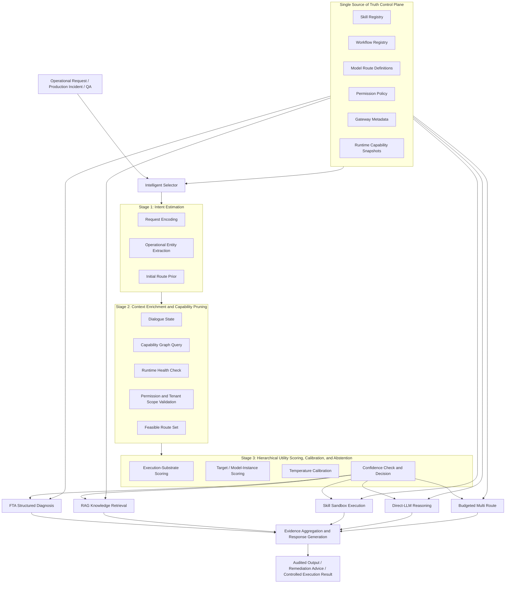
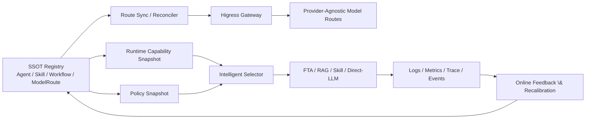

# ResolveAgent: A Consistency-Aware Hierarchical Utility-Calibrated Routing Framework for Autonomous IT Operations

**Authors:** Anonymous Submission

---

## Abstract

The core challenge of autonomous IT operations is not merely insufficient model reasoning power, but how to assign each request to the correct reasoning and execution mechanism under heterogeneous tasks, constrained permissions, and dynamic infrastructure states. Real production incidents often require structured diagnosis, operational knowledge retrieval, safe tool execution, configuration-consistency validation, and conservative handling of uncertainty at the same time. This paper presents **ResolveAgent**, a unified AIOps platform that routes requests among `FTA`, `RAG`, `Skill`, `Direct-LLM`, and budget-bounded `Multi` through a **consistency-aware hierarchical utility-calibrated Intelligent Selector**. Unlike prior systems that either perform only single-stage label classification or rely on LLM-only tool choice, ResolveAgent formulates routing as a two-level constrained optimization problem that jointly selects the **execution substrate** and the **target/model instance**, while explicitly incorporating task quality, latency, execution cost, operational risk, and control-plane consistency discrepancy into a unified objective. Around this objective, we introduce three new technical mechanisms: 1) capability-graph and permission-snapshot based feasibility pruning; 2) a control-plane consistency regularizer and counterfactual stability objective for registry drift; and 3) a bounded `Multi` route triggered by evidence value. At the system level, ResolveAgent organizes the `Go` control plane with a unified registry, dynamic route synchronizer, and `Higress` model-routing layer together with the `Python` runtime for intent estimation, context enrichment, `FTA` evaluators, and permission-bounded skill execution as a Single Source of Truth architecture. Experiments on 2,847 anonymized production incidents, 5,000 operations QA pairs, and 500 tool-execution cases show that `ResolveAgent-Hybrid` achieves 89.3% routing accuracy, 83.5% target-selection accuracy, and 25.1-minute incident `MTTR`, reducing `MTTR` by 47% relative to manual workflows and by an additional 15% relative to an LLM-only router. More importantly, hierarchical decision making, consistency-aware regularization, and the counterfactual stability objective reduce route flip rate under injected 3-second registry lag from 13.5% to 5.6%, while also improving calibration, robustness, governance, and real-world scenario performance. The results suggest that the decisive innovations for conference-level autonomous operations research should move beyond “stronger models” toward **governance-constrained hierarchical decision making, structured evidence consumption, and control-plane consistency-driven system design**.

---

## 1. Introduction

With the widespread adoption of cloud-native architectures, microservices, container orchestration, and multi-tenant platforms, IT operations has evolved from “single-point monitoring plus manual troubleshooting” into a complex decision system driven by multi-source observability data. In real production environments, one operational request may simultaneously involve several capabilities:

- **Structured fault diagnosis**, e.g., root-cause localization via causal chains and fault trees;
- **Operational knowledge retrieval**, e.g., querying historical incident handling records, `runbooks`, `SOP`s, and postmortems;
- **External tool execution**, e.g., log analysis, metric inspection, deployment auditing, configuration diffing, and permission-bounded actions;
- **Open-ended reasoning and response generation**, e.g., synthesizing evidence into explanations, recommendations, and operator-facing communication;
- **Configuration and capability-consistency handling**, e.g., determining whether a skill, workflow, or model route is truly available under the current tenant, version, and runtime state.

Therefore, real operational requests are inherently **heterogeneous** and **time-varying**. Some requests require structured causal analysis, some are knowledge-intensive QA, some involve privileged external actions, and others are better handled by direct LLM reasoning. More importantly, even for semantically similar requests, the optimal route may change over time because of system capability state, knowledge freshness, skill health, or control-plane propagation delay. Existing approaches typically strengthen only one side of this problem: traditional AIOps emphasizes anomaly detection, alert correlation, and fault management [1]; LLM-only agents emphasize natural-language reasoning and flexible interaction [3,4]; tool-augmented language models emphasize external tool use [5]; retrieval-augmented models emphasize grounding and factuality [6,7,8]. For autonomous operations, however, the key question is not “which capability is strongest,” but rather:

> **Under safety, latency, capability-feasibility, and control-plane consistency constraints, which mechanism, target, and model class should handle the current request?**

This leads to the central research question of this paper:

> **How can we route heterogeneous operational requests to the most appropriate execution mode and target instance while preserving accuracy, latency efficiency, safety, configuration consistency, and runtime executability?**

Our answer is **ResolveAgent**. Instead of pushing all requests into a single agent loop, ResolveAgent treats routing as a first-class research problem and decomposes it into two levels. The system first decides whether the request should enter structured diagnosis, knowledge retrieval, tool execution, direct LLM reasoning, or a budget- and governance-constrained multi-route composition. It then selects the most suitable workflow, skill, knowledge collection, or model route inside that chosen path. The design principle is explicit: **first allocate the right mechanism under constraints, then choose the right target instance, and only then reason or execute**, rather than assuming that every task belongs inside one monolithic LLM-centered loop.

Compared with earlier versions, this paper substantially expands both theory and method and emphasizes three conference-level innovation perspectives. First, routing is no longer treated as a one-step classification task but as **hierarchical utility decision making** that explicitly models the coupling between execution-substrate selection and target/model-instance selection. Second, **control-plane consistency** is elevated from an engineering assumption to part of the optimization objective through a consistency regularizer and counterfactual stability training, making the selector more robust to registry drift, stale runtime snapshots, and route-synchronization lag. Third, `Multi` is reformulated from a heuristic fallback into a **bounded information-acquisition process driven by evidence value**, avoiding the latency explosion and risk inflation common in open-ended multi-step trial-and-error behavior.

The main contributions of this paper are as follows:

1. We propose a **consistency-aware hierarchical utility-calibrated routing framework** that models operational decision making as a two-level constrained optimization problem over execution substrates and target instances.
2. We introduce an explicit control-plane discrepancy term \\(\Delta_{\mathrm{cp}}\\) and a counterfactual stability objective, making control-plane lag, capability-snapshot drift, and policy-update delay measurable and optimizable research variables.
3. We propose an evidence-value-driven bounded `Multi` mechanism that turns multi-route composition from open-ended trial behavior into a budgeted information-acquisition process with explicit gain conditions.
4. We integrate the unified `Go` control-plane registry, dynamic route synchronization, `Higress` model routing, and the `Python` runtime for intent estimation, context enrichment, AI-augmented `FTA`, and permission-bounded skill execution into a Single Source of Truth architecture.
5. We evaluate the system from multiple angles—including main results, ablations, calibration, stability, governance and safety, real-world scenarios, and error analysis—against manual workflows, rule routers, LLM routers, general agents, and structural-control baselines.
6. Through theory and experiments together, we show that the critical gains of autonomous operations systems come from **mechanism matching, evidence organization, and governance consistency**, not merely larger language models or longer tool chains.

---

## 2. Related Work and Research Positioning

### 2.1 AIOps and Incident Management

AIOps research has long focused on anomaly detection, fault management, event understanding, and automation support in large-scale systems [1]. This line of work establishes the classic “observe–detect–alert–manage” pipeline, but it usually treats the allocation of requests across multiple execution mechanisms as an implementation detail rather than an explicit research problem. In contrast, incident-response studies emphasize the importance of operational context, response playbooks, and auditable workflows [2], suggesting that incident handling is not merely free-form generation but requires structured, traceable logic that can align with organizational processes.

### 2.2 LLM Reasoning, Tool Use, and Retrieval Augmentation

Chain-of-thought prompting and zero-shot reasoning demonstrate that large language models can perform substantially stronger decomposition and reasoning on complex tasks [3,4]. `Toolformer` further shows that models can learn when to invoke external tools [5]. Retrieval-augmented language models and retrieval-based revision methods improve factual grounding and response correction [6,7]. Mallen et al. show that the relative value of parametric and non-parametric memory strongly depends on task type and knowledge freshness [8]. Collectively, these findings suggest that retrieval and tools are not universally helpful; whether they should be invoked, which one should be invoked, and when they should be avoided are themselves modeling problems.

### 2.3 Limitations of Agent-Orchestration Systems

General agent frameworks typically adopt a “perceive–think–act” loop and place all requests into one unified planning–execution paradigm. Such designs are flexible in open environments, but they exhibit three important weaknesses in autonomous operations. First, they often lack **explicit risk modeling**, and therefore do not naturally distinguish between “wrong but reversible text generation” and “wrong and high-cost external actuation.” Second, they commonly treat **tool choice** as part of prompt strategy rather than as a system decision jointly constrained by platform metadata, permission boundaries, and runtime state. Third, prior work rarely includes **control-plane consistency** in its research objective, allowing state mismatches among registries, gateways, executors, and observability components to remain invisible.

### 2.4 Research Gap and Our Positioning

Despite substantial progress in reasoning, retrieval, and tool use, autonomous operations still faces at least five gaps:

1. **Routing is handled implicitly.** Many systems assume all requests should flow through one unified LLM or one unified `agent`, without an explicit model of which path is more appropriate.
2. **Decision hierarchy is flattened.** Most methods predict a single label and do not distinguish between choosing the execution substrate first and the target/model instance second.
3. **Risk constraints are weakly expressed.** Many tool-augmented methods focus on whether tools can be called, but fewer analyze when invocation is safe, trustworthy, and deployable.
4. **Control-plane consistency is largely ignored.** In real platforms, inconsistency among registries, gateways, workflows, and executors directly damages routing validity and execution success.
5. **Multi-route composition lacks a gain criterion.** Many agentic systems keep appending actions under uncertainty, yet provide no explicit information-value condition or budget boundary.

Accordingly, the contribution of ResolveAgent is not “another larger operations agent,” but a unified principle for organizing autonomous operations around **consistency-aware hierarchical utility routing**. The emphasis is not on local optimality of individual modules, but on making globally governed decisions across heterogeneous reasoning and execution substrates while tightly coupling those decisions to the control plane, model routing layer, and runtime synchronization mechanisms.

---

## 3. System Overview

ResolveAgent decomposes autonomous operations into two coupled but clearly separated layers:

- **Routing layer:** the `Intelligent Selector`, which chooses among execution modes based on request semantics, contextual state, capability feasibility, configuration consistency, and risk constraints;
- **Execution layer:** the actual `FTA`, `RAG`, `Skill`, `Direct-LLM`, and budget-bounded `Multi` execution substrates that perform diagnosis, retrieval, action, or response generation.

More importantly, these layers are not loosely stitched together. They are kept consistent in terms of capability metadata, permission policy, model routes, gateway exposure, and runtime snapshots through a Single Source of Truth control plane.

### Figure 1. ResolveAgent System Architecture



The key system principle conveyed by Figure 1 is that **routing and execution are decoupled, but capability and governance metadata must remain globally consistent**. The system does not simply “let the LLM decide everything.” Instead, it first determines the most appropriate execution mechanism under explicit constraints, and only then reasons or operates within a bounded safety envelope.

### Figure 2. Inference Procedure of the Intelligent Selector

```mermaid
flowchart LR
    A[Input Request x] --> B[Encode Request and Dialogue State]
    B --> C[Estimate Route Prior]
    C --> D[Query Capability Graph and Runtime State]
    D --> E{Is the Route Available and Safe?}
    E -- No --> F[Remove from Candidate Set]
    E -- Yes --> G[Compute Execution-Substrate Utility U_route]
    G --> H[Compute Target / Model Utility U_target]
    H --> I[Apply Temperature Calibration to Joint Score]
    I --> J{max p(a,z) >= τ and margin >= δ ?}
    J -- No --> K[Abstain / Clarify / Conservative Fallback]
    J -- Yes --> L[Execute Best Route]
    L --> M{Evidence Coverage E < η and budget allows?}
    M -- No --> N[Return Audited Result]
    M -- Yes --> O[Trigger Bounded Multi Fallback]
    O --> N
```

This procedure shows that the selector is not a black-box classifier. It is a hierarchically constrained decision module that must answer three questions simultaneously: which route is better, which target or model is better inside that route, and whether the system should make the decision automatically at all.

### 3.1 Code-Driven System Highlights

Unlike papers that remain purely at the method level, ResolveAgent’s design is strongly aligned with the current codebase, which provides concrete systems support for the paper’s claims:

1. **Single Source of Truth control plane.** The `Go` control plane uniformly manages `Agent`, `Skill`, `Workflow`, and `ModelRoute` metadata, including `status`, `labels`, `version`, and `config`, so the capability graph is conditioned on real platform state rather than static assumptions.
2. **Layered model-routing governance.** The `Higress` routing layer not only abstracts a unified model entry but also centralizes rate limiting, retry, fallback, request rewriting, and provider compatibility, allowing “which model to use” to become a second-level target decision rather than ad hoc runtime branching.
3. **Dynamic route synchronization and state gating.** The route synchronizer exposes gateway routes dynamically according to `active` agents and `ready` skills in the registry, giving the system a semantics in which availability constraints truly shape reachable traffic.
4. **Hybrid Intelligent Selector.** The `Python` runtime contains intent analyzers, context enrichers, and rule/LLM/hybrid strategies that provide priors, context, and confidence signals for hierarchical utility decision making.
5. **Permission-bounded skill execution.** The `manifest` explicitly declares network access, file-system access, allowed hosts, resource budgets, and timeout limits, making risk a structured term in the routing objective rather than a runtime patch.

### Figure 3. Control-Plane Consistency and the Route-Synchronization Feedback Loop



Figure 3 highlights the most important difference between this work and prior agent-routing papers: **routing decisions are not isolated classifier outputs, but part of a continuously synchronized, continuously observed, continuously recalibrated control loop**. This loop is grounded in the current codebase through the unified registry, route synchronizer, model router, authentication middleware, and runtime capability snapshots.

---

## 4. Problem Formulation

### 4.1 Action Space, Target Space, and Feasible Domain

Let the request be \\(x\\), the context be \\(c\\), and the capability inventory together with runtime state be \\(K\\). We define the execution-substrate action space as

$$
\mathcal{A}=\{\mathrm{FTA},\mathrm{Skill},\mathrm{RAG},\mathrm{Direct\mbox{-}LLM},\mathrm{Multi}\}
$$

where `FTA` denotes structured fault-tree diagnosis, `Skill` denotes externally executed tools under safety constraints, `RAG` denotes retrieval-augmented generation, `Direct-LLM` denotes direct language-model reasoning, and `Multi` denotes budget-bounded multi-route composition.

Unlike one-stage classification, ResolveAgent further defines an internal target set \\(\mathcal{Z}(a,K)\\) for each action. For example, when \\(a=\mathrm{Skill}\\), \\(z\\) denotes a concrete skill; when \\(a=\mathrm{FTA}\\), \\(z\\) denotes a workflow or fault tree; when \\(a=\mathrm{RAG}\\), \\(z\\) denotes a knowledge collection; and when \\(a=\mathrm{Direct\mbox{-}LLM}\\), \\(z\\) denotes a model-route instance. The system therefore solves not a single action choice, but the joint choice \\((a,z)\\).

Not every action and target is feasible at every moment. We therefore define the joint feasible set:

$$
\Omega_f(x,c,K)=\left\{(a,z) \mid a\in\mathcal{A},\ z\in\mathcal{Z}(a,K),\ I_{\mathrm{avail}}(a,z,K)=1,\ I_{\mathrm{safe}}(a,z,x,c,K)=1\right\}
$$

where \\(I_{\mathrm{avail}}\\) is the capability-availability indicator and \\(I_{\mathrm{safe}}\\) is the safety-and-policy indicator under permission constraints. This definition makes clear that the first step of routing is not “compare which route is strongest,” but first eliminate paths and targets that do not exist, are unreachable, are unsynchronized, or should not be triggered.

### 4.2 Hierarchical Utility-Maximization Objective

ResolveAgent formulates joint decision making as a two-level constrained optimization problem:

$$
(a^*,z^*)=\arg\max_{(a,z)\in\Omega_f(x,c,K)} U_{\mathrm{route}}(a\mid x,c,K)+\mu U_{\mathrm{target}}(z\mid a,x,c,K)-\lambda_s\,\mathrm{switch}(a,z)
$$

where:

- \\(U_{\mathrm{route}}\\) measures expected utility at the execution-substrate level;
- \\(U_{\mathrm{target}}\\) measures fitness of the target or model instance inside the selected route;
- \\(\mu\\) controls the importance of second-level target scoring;
- \\(\mathrm{switch}(a,z)\\) denotes coordination cost, context-assembly cost, or gateway hop cost caused by cross-substrate or cross-target switching;
- \\(\lambda_s\\) is the corresponding weight.

The execution-substrate utility is defined as

$$
U_{\mathrm{route}}(a)=\lambda_q \hat{Q}(a)-\lambda_l \hat{L}(a)-\lambda_c \hat{C}(a)-\lambda_r \hat{R}'(a)
$$

and the second-level target utility is

$$
U_{\mathrm{target}}(z\mid a)=\psi_1\,\hat{M}(z\mid a)+\psi_2\,\hat{F}(z)-\psi_3\,\hat{D}(z)
$$

where \\(\hat{M}(z\mid a)\\) denotes the match between the target instance and the selected action, \\(\hat{F}(z)\\) denotes freshness and health, and \\(\hat{D}(z)\\) denotes target-level drift or risk penalty. This decomposition naturally accommodates the codebase’s two-level decision structure: the `Python` runtime chooses execution substrates, while the `Go + Higress` control plane chooses or constrains model and route instances.

### 4.3 Consistency-Aware Risk Regularization

The most important new quantity introduced in this paper is the **control-plane consistency discrepancy**. Let the discrepancy of a target instance across registry, gateway, and runtime views be

$$
\Delta_{\mathrm{cp}}(z,t)=w_v\,\mathbf{1}[v_{\mathrm{reg}}\neq v_{\mathrm{rt}}]+w_s\,\mathbf{1}[s_{\mathrm{reg}}\neq s_{\mathrm{rt}}]+w_\ell\log\left(1+\mathrm{lag}(z,t)\right)
$$

where:

- \\(v_{\mathrm{reg}}\\) and \\(v_{\mathrm{rt}}\\) are version information from the registry and runtime views, respectively;
- \\(s_{\mathrm{reg}}\\) and \\(s_{\mathrm{rt}}\\) are control-plane and runtime states;
- \\(\mathrm{lag}(z,t)\\) denotes propagation delay of target-instance state;
- \\(w_v,w_s,w_\ell\\) are nonnegative weights.

Based on this quantity, we extend the traditional operational-risk term into

$$
\hat{R}'(a,z)=\hat{R}_{\mathrm{op}}(a,z)+\kappa\,\Delta_{\mathrm{cp}}(z,t)
$$

where \\(\hat{R}_{\mathrm{op}}\\) captures permission level, blast radius, and irreversibility risk of the action itself, and \\(\kappa\\) is the consistency-penalty coefficient. The intuition is crucial: **even if an action is semantically appropriate, it should be treated as higher risk when its target instance resides in a stale, unsynchronized, or inconsistent control plane.**

### 4.4 Training Objective: Calibration, Stability, and Safety

To keep hierarchical decisions stable under distribution shift and control-plane perturbations, we optimize the following joint training objective:

$$
\mathcal{L}=\mathcal{L}_{\mathrm{CE}}+\lambda_{\mathrm{cal}}\mathcal{L}_{\mathrm{Brier}}+\lambda_{\mathrm{stab}}\mathcal{L}_{\mathrm{stab}}+\lambda_{\mathrm{safe}}\mathcal{L}_{\mathrm{unsafe}}
$$

where:

- \\(\mathcal{L}_{\mathrm{CE}}\\) is the supervised route/target loss;
- \\(\mathcal{L}_{\mathrm{Brier}}\\) encourages confidence calibration;
- \\(\mathcal{L}_{\mathrm{stab}}\\) suppresses route flips under mild control-plane perturbations;
- \\(\mathcal{L}_{\mathrm{unsafe}}\\) explicitly depresses scores of unsafe candidates.

The stability loss is defined as

$$
\mathcal{L}_{\mathrm{stab}}=\mathrm{KL}\left(p_\theta(\cdot\mid x,c,K)\,\Vert\,p_\theta(\cdot\mid x,c,\tilde{K})\right)
$$

where \\(\tilde{K}\\) denotes a counterfactual capability snapshot under mild perturbations such as temporary skill unavailability, flipped status bits, increased synchronization delay, or short-lived model-route failures. The unsafe loss is defined as

$$
\mathcal{L}_{\mathrm{unsafe}}=\max\left(0,\,m+\max_{(a,z)\in\Omega_u}U(a,z)-U(a_y,z_y)\right)
$$

where \\(\Omega_u\\) is the unsafe-candidate set and \\(m\\) is a safety margin. This objective makes the model learn not only “which route is more correct,” but also “which mistakes are especially unacceptable.”

### 4.5 Evidence Coverage, Information Value, and Bounded `Multi`

In some situations, a single route may be optimal yet still insufficiently supported by evidence. We therefore define evidence coverage as

$$
E=\alpha_s S+\alpha_d D+\alpha_f F-\alpha_c C_{\mathrm{contra}}
$$

where:

- \\(S\\) denotes support strength;
- \\(D\\) denotes source diversity;
- \\(F\\) denotes evidence freshness;
- \\(C_{\mathrm{contra}}\\) denotes contradiction level among evidence sources.

We view `Multi` as a bounded information-acquisition action. Given primary route \\(a\\) and candidate supplementary route \\(b\\), the second route is triggered only when

$$
\lambda_q\,\Delta Q_{b\mid a}>\lambda_l\,\Delta L_{b\mid a}+\lambda_c\,\Delta C_{b\mid a}+\lambda_r\,\Delta R_{b\mid a}
$$

and the current evidence coverage satisfies \\(E<\eta\\). Here \\(\Delta Q_{b\mid a}\\) represents the expected quality improvement or uncertainty reduction gained by adding supplementary evidence. This definition matters because `Multi` is no longer a vague “try a few more paths,” but a **conservative compensation mechanism driven by evidence value and bounded by explicit budget constraints**.

---

## 5. Method

### 5.1 Request Representation: Fusing Semantic, Operational, Capability, and Code/Configuration Signals

For each request, the Intelligent Selector constructs five signal families:

1. **Lexical and syntactic signals:** keywords, action verbs, anomaly descriptions, and question structure from the request text itself;
2. **Operational entity signals:** service name, environment, severity, symptom type, resource object, and alert source;
3. **Dialogue-state signals:** whether the user asks for explanation, diagnosis, execution, remediation advice, or simple knowledge lookup;
4. **Capability-state signals:** whether corresponding skills, retrieval collections, workflows, and model routes currently exist in the registry;
5. **Code/configuration signals:** code blocks, configuration fragments, security smells, anomalous fields, and latent target hints extracted by the context enricher.

The unified representation is denoted by

$$
h=[h_x;h_{\mathrm{ops}};h_{\mathrm{dlg}};h_{\mathrm{cap}};h_{\mathrm{cfg}}]
$$

where \\(h_{\mathrm{cfg}}\\) is particularly important because much operational information is embedded in logs, configurations, alert fields, and code snippets rather than plain natural language. Compared with routers that only inspect text, this step enables the system to distinguish code/configuration-heavy requests from pure knowledge questions and to use richer context for route selection.

### 5.2 Registry-Conditioned Capability Graph

ResolveAgent maintains a typed capability graph that maps request patterns to skills, retrieval collections, workflows, and model routes. The graph contains:

- route nodes: `FTA`, `Skill`, `RAG`, `Direct-LLM`, `Multi`;
- target nodes: workflows, skills, knowledge collections, model routes;
- state nodes: version, health, permission labels, tenant scope, rate limits, and budgets;
- policy nodes: approval requirements, side-effect classes, and network/file-system access constraints.

Given request \\(x\\), the system checks:

- whether service and tenant scopes match;
- whether the required skill or retrieval collection exists;
- whether the current runtime health allows invocation;
- whether the gateway and control plane are synchronized to the same version;
- whether permissions and policy permit execution;
- whether the action is reversible and whether it expands blast radius.

This step moves feasibility to the front of the pipeline. In particular, when skill endpoints are down, knowledge bases are stale, model routes are being switched, or permissions are insufficient, the system must prune those routes first rather than letting a downstream LLM keep preferring an option that is not actually executable.

### 5.3 Layered Target and Model Routing: From Execution Substrate to Concrete Instance

A key innovation of ResolveAgent is to separately model execution-substrate selection and target-instance selection. In practice, the inner choice often determines final quality and latency. For example:

- inside `FTA`, the system must choose which workflow tree to use;
- inside `Skill`, it must choose which concrete skill to call;
- inside `RAG`, it must decide which knowledge collection to query;
- inside `Direct-LLM`, it must select a provider and model route.

The current code architecture naturally supports this layered design. The `Python` selector decides which execution plane to enter at runtime, while the `Go + Higress` model router pushes provider differences, unified entry points, retries, rate limiting, and request transformation down to the gateway layer. This means the hierarchical method is not merely a theoretical abstraction; it directly leverages the existing system structure of **runtime substrate selection plus control-plane instance selection**.

### 5.4 Counterfactual Stability and Selective Abstention

For each feasible route and target instance, the selector computes joint utility and applies temperature calibration. Unlike traditional classifiers that only produce scores, the scoring process here is an explicit multi-objective tradeoff:

- structured problems receive higher `FTA` quality terms;
- high-latency open-ended generation is suppressed by cost and latency terms on simple requests;
- side-effectful skill invocation is penalized under low evidence or high uncertainty by both risk and consistency terms;
- when multiple routes are close, abstention is preferred over forced commitment.

The calibrated joint distribution is

$$
p(a,z\mid x,c,K)=\frac{\exp\left(U(a,z)/T\right)}{\sum_{(a',z')\in\Omega_f(x,c,K)}\exp\left(U(a',z')/T\right)}
$$

with temperature \\(T=1.7\\). The system does not always force a route. Instead, it abstains when

$$
\max_{(a,z)} p(a,z\mid x,c,K) < \tau \quad \text{or} \quad p_{(1)}-p_{(2)}<\delta
$$

where \\(\tau=0.58\\) is the top-confidence threshold and \\(\delta=0.09\\) is the minimum top-two probability margin. Abstention triggers clarification, conservative fallback, or read-only explanation rather than high-risk actuation. This reflects an important position of the paper: **conservative behavior under uncertainty is part of trustworthy autonomous operations, not evidence of system weakness.**

### 5.5 AI-Augmented Fault-Tree Analysis

Rather than replacing fault trees with LLMs, we preserve the structural causal advantages of FTA while introducing `skill`, `rag`, and `llm` evaluators at leaf nodes. This yields four benefits:

- **symbolic structure preserves causal auditability**;
- **AI evaluators improve flexibility of evidence access**;
- **the tree structure makes the diagnostic path explainable and reviewable**;
- **structured gates give multi-source evidence a compositional semantics that can be computed**.

For a gate node \\(g\\) with children \\(v_1,\dots,v_m\\), typical gate evaluation is

$$
P(g_{\mathrm{AND}})=\prod_{i=1}^{m} P(v_i)
$$

$$
P(g_{\mathrm{OR}})=1-\prod_{i=1}^{m}\left(1-P(v_i)\right)
$$

For a `k-of-n` voting gate,

$$
P(g_{k/n})=\sum_{A\subseteq [n],\ |A|\ge k}\prod_{i\in A}P(v_i)\prod_{j\notin A}(1-P(v_j))
$$

where \\(P(v_i)\\) can come not only from static rules, but also from retrieved evidence, live skill observations, or LLM interpretations of semi-structured logs. In this way, classical FTA gains stronger evidence-consumption ability, while modern AI reasoning remains constrained inside an auditable causal scaffold.

### 5.6 Permission-Bounded Skill Execution Substrate

Each skill declares in its `manifest`:

- permission scope;
- resource budget;
- side-effect class;
- timeout limit;
- input-parameter constraints;
- allowed network and file-system access scope;
- execution environment and dependency conditions.

At runtime, the system enforces:

- host and path allowlists;
- `CPU` and memory quotas;
- isolated execution environments;
- parameter-level policy validation;
- timeout termination;
- audit logging.

Hence, “tool use” in this paper does not mean allowing the model to freely execute arbitrary external actions. It means invoking bounded capabilities inside a declarative, constrained, and auditable governance framework. This directly distinguishes ResolveAgent from many general agent frameworks that effectively allow a tool whenever the model “wants” to call it.

### 5.7 Single Source of Truth Control Plane and Dynamic Synchronization

In real production systems, many failures come not from incorrect model reasoning, but from **inconsistent capability metadata**: a skill exists in the registry but not in the runtime; a route is exposed at the gateway but unsupported by the executor; a workflow has been updated but the cached snapshot is stale. ResolveAgent therefore uses a Single Source of Truth control plane to manage:

- the skill registry;
- the workflow registry;
- agents and model routes;
- permission policy;
- gateway exposure configuration;
- runtime capability snapshots.

More concretely, the current system already includes mechanisms that directly support the paper’s claims:

1. a **unified registry service** as the single query source for agents, skills, workflows, and model routes;
2. a **dynamic route synchronizer** that automatically exposes available agents and skills to the gateway layer;
3. a **model router** that centralizes provider selection, rate limiting, fallback, request rewriting, and unified path management in `Higress`;
4. **authentication and role middleware** that inject unified identity context from gateway, JWT, and API key into execution decisions;
5. a **runtime registry client** that fetches capability snapshots on demand so the selector can read current state.

The goal is not just to build a cleaner architecture, but to make control-plane consistency a measurable and governable systems property. The stability and governance experiments in this paper directly validate this point.

### 5.8 Observability, Feedback Loops, and Online Recalibration

A conference-level autonomous operations system should not only make decisions, but also explain, log, and reassess them. ResolveAgent therefore includes structured logs, route rationales, skill latencies, evidence coverage, configuration-propagation delay, and policy-interception outcomes in a unified observation surface. While our main experiments remain offline, the design explicitly supports online feedback signals including:

- routing correctness and human override records;
- skill success rate and timeout rate;
- target-instance freshness and propagation delay;
- route flip rate, abstention rate, and selective risk;
- unauthorized-call interceptions and privilege-escalation attempts.

ResolveAgent is thus not merely an offline-trained classifier. It is a system prototype that can evolve through a closed loop of calibration, deployment, observation, and recalibration.

---

## 6. Theoretical Analysis and Verifiable Propositions

To show that the design is not an empirical patchwork, we provide four verifiable propositions and validate their empirical consequences in Section 8.

### 6.1 Proposition 1: Feasibility Pruning Upper-Bounds Unsafe Exposure

**Proposition 1.** Let \\(\Omega_u(x,c,K)\\) denote the set of unsafe joint actions under the current request. If the safety discriminator has false-negative rate \\(\epsilon_p\\) over unsafe actions, then the post-pruning policy satisfies

$$
\Pr\left((a,z)\in\Omega_u\mid x,c,K\right)\le \epsilon_p
$$

which degenerates to 0 when the safety discriminator makes no false-negative errors.

**Proof sketch.** Feasibility pruning removes all actions recognized as unsafe by policy. Therefore, any unsafe action that survives must belong to the discriminator’s false-negative set. The surviving unsafe probability mass is thus upper-bounded by the false-negative rate. The proposition formalizes that safety governance is not a post-routing patch, but a prior constraint on the candidate space.

### 6.2 Proposition 2: Regret Decomposition of Hierarchical Decisions

Let the optimal joint action be \\((a^\star,z^\star)\\) and the model’s choice be \\((\hat a,\hat z)\\). Define joint regret as

$$
\mathcal{R}(x)=U(a^\star,z^\star)-U(\hat a,\hat z)
$$

Then the following upper bound holds:

$$
\mathcal{R}(x)\le \mathcal{R}_{\mathrm{route}}(x)+\mu\,\mathcal{R}_{\mathrm{target}}(x)+\lambda_s\,\mathrm{switch}(\hat a,\hat z)
$$

where \\(\mathcal{R}_{\mathrm{route}}\\) and \\(\mathcal{R}_{\mathrm{target}}\\) are sub-regrets at the execution-substrate level and target level, respectively.

**Interpretation.** This decomposition shows that splitting routing into “choose the execution substrate first, then choose the target instance” does not destroy the global objective. Instead, it provides a finer-grained error-analysis structure. Experimentally, we will show that the one-stage `FlatRouter` is substantially weaker than the hierarchical model on both route flip rate and target-error rate.

### 6.3 Proposition 3: Decision Stability under Consistency-Aware Regularization

Assume the joint utility function \\(U(a,z)\\) is \\(L\\)-Lipschitz with respect to control-plane perturbation, i.e., for any \\(\|\tilde K-K\|\le \epsilon\\),

$$
|U(a,z\mid \tilde K)-U(a,z\mid K)|\le L\epsilon
$$

Let the utility gap between the best and second-best joint candidates be

$$
\gamma(x)=U(a_1,z_1)-U(a_2,z_2)
$$

If \\(\gamma(x)>2L\epsilon\\), then the optimal joint decision does not flip under perturbation \\(\tilde K\\).

**Proof sketch.** The best and second-best candidates can each change by at most \\(L\epsilon\\), so their gap can shrink by at most \\(2L\epsilon\\). If the original gap is larger than that quantity, the ranking is preserved. This proposition provides the theoretical motivation for consistency-aware regularization: by enlarging the gap between safe and unstable candidates, it lowers the probability of decision flips caused by control-plane drift.

### 6.4 Proposition 4: Positive-Gain Condition for Bounded `Multi`

Let the primary route be \\(a\\) and the candidate supplementary route be \\(b\\). If

$$
\lambda_q\,\Delta Q_{b\mid a}>\lambda_l\,\Delta L_{b\mid a}+\lambda_c\,\Delta C_{b\mid a}+\lambda_r\,\Delta R_{b\mid a}
$$

then the two-stage composition \\(a\rightarrow b\\) has higher expected joint utility than executing \\(a\\) alone.

**Interpretation.** This theorem formalizes our position on `Multi`: multi-route execution is justified only when the value of supplementary evidence exceeds its additional latency, cost, and risk. It prevents the “try more steps just in case” behavior common in open-ended agent loops.

### 6.5 Mapping Propositions to Experimental Hypotheses

The propositions motivate the following empirical hypotheses:

- **H1:** hierarchical decision making outperforms a one-stage joint classifier;
- **H2:** consistency-aware regularization significantly reduces route flip rate under control-plane perturbations;
- **H3:** bounded `Multi` improves difficult incidents without causing uncontrollable latency inflation;
- **H4:** feasibility pruning and abstention reduce the probability that unsafe actions reach the execution layer.

These hypotheses are validated in Section 8 through ablations, robustness stress tests, and governance experiments.

---

## 7. Experimental Methodology

### 7.1 Research Questions

We evaluate six research questions:

- **RQ1:** Does hybrid routing outperform manual workflows, rule-based routing, LLM-only routing, and general agent baselines?
- **RQ2:** Do structured diagnosis and evidence-driven `Multi` improve end-to-end resolution of production incidents?
- **RQ3:** Which components contribute most to performance, calibration quality, and operational safety?
- **RQ4:** Does the system remain robust under capability loss, knowledge drift, adversarial phrasing, control-plane delay, and high concurrency?
- **RQ5:** Do the Single Source of Truth design and governance mechanisms materially reduce unsafe actions and control-plane inconsistency?
- **RQ6:** Do hierarchical target/model routing, consistency-aware regularization, and the counterfactual stability objective yield additional, quantifiable structural gains?

### 7.2 Datasets and Annotation Protocol

We use three datasets:

- **IncidentBench:** 2,847 anonymized production incidents spanning 14 cloud-service categories including compute, storage, gateway, database, observability, and `CI/CD`;
- **OpsQA:** 5,000 operations QA examples derived from `runbooks`, `SOP`s, incident postmortems, and knowledge-base articles;
- **SkillTest:** 500 governed tool-execution cases covering 18 read-only or bounded-action skills.

`IncidentBench` is split chronologically into train/dev/test to reduce temporal leakage. All text fields are de-identified before annotation; service identifiers, hostnames, tenant keys, and ticket IDs are replaced with consistent pseudonyms. Three senior `SRE`s independently annotate route family, target selection, and first-response quality, with adjudication on disagreement cases.

**Table 1. Dataset and annotation summary.**

| Dataset | Train | Dev | Test | Labels | Domain focus | Notes |
|---|---:|---:|---:|---|---|---|
| IncidentBench | 1,708 | 427 | 712 | Route, target, FRQ, MTTR | Production incidents | Chronological split |
| OpsQA | 3,000 | 1,000 | 1,000 | Route, target, answer quality | `runbooks` and knowledge base | Retrieval-heavy |
| SkillTest | 300 | 100 | 100 | Tool choice, success, safety | Sandbox skills | Execution-heavy |

On the `IncidentBench` test split, the route distribution is 37.2% `FTA`, 27.2% `RAG`, 19.2% `Skill`, 11.5% `Direct-LLM`, and 4.9% `Multi`. Annotation agreement is strong: `Cohen's κ` is 0.82 for route family, 0.79 for target choice, and 0.76 for `FRQ`.

### 7.3 Baselines, Fairness Controls, and Implementation Details

We compare against seven main baselines:

- `ManualOps`: human triage and human execution;
- `RuleRouter`: rule-based routing;
- `LLMRouter`: single-step LLM routing;
- `ReAct-style Agent`: iterative thought–action loop;
- `LangChain Agent`: planner–executor agent;
- `ResolveAgent-Rule`: ResolveAgent with a rule selector;
- `ResolveAgent-LLM`: learned selector without calibration and abstention.

To validate the structural innovations of this paper, we further introduce two structural controls:

- `FlatRouter`: a one-stage joint classifier that directly predicts route–target pairs without explicit hierarchy;
- `NoSSOT`: a variant without consistency-aware regularization or freshness gating, relying only on cached capability snapshots without explicit control-plane-drift penalties.

To ensure fairness, all automated systems share:

- the same instruction-tuned backbone model;
- the same retrieval corpus and `reranker`;
- the same observability connectors;
- the same inventory of 18 skills;
- the same output `token` budget;
- the same maximum of two tool invocations;
- the same `12s` sandbox timeout and `Kubernetes` worker types.

At the implementation level, the evaluated prototype consists of three complementary layers: the `Go` control plane for the unified registry, route synchronization, model routing, and authentication governance; the `Python` runtime for the Intelligent Selector, `FTA`, `RAG`, and skill execution; and `Higress` for unified model ingress, rate limiting, fallback, and provider compatibility. This layered prototype is tightly aligned with the methodological claims of the paper.

### 7.4 Metrics and Statistical Protocol

We report:

- routing accuracy (`RA`);
- target-selection accuracy (`TA`);
- route-family `Macro F1`;
- mean time to resolution (`MTTR`);
- first-response quality (`FRQ`);
- closure rate (`Closure`);
- escalation rate (`Escalation`);
- end-to-end latency (`P50/P95`);
- calibration metrics (`ECE`, `Brier`, `Coverage`, `Selective Risk`);
- governance metrics (unsafe-action blocking rate, policy-consistency rate, configuration-propagation delay);
- **route flip rate (`RFR`)**: the fraction of cases whose final route changes under injected control-plane perturbation relative to the clean condition.

All results are averaged over five random seeds. For `RA`, `TA`, and other accuracy-like metrics, we report 95% confidence intervals from 1,000 paired `bootstrap` resamples. For `MTTR`, we use a two-sided `Wilcoxon signed-rank` test due to right-skewed distributions. `RFR` is estimated on a fixed test set by injecting 1–5 second registry-propagation lag, state flips, and target-instance failures.

### 7.5 Real-World Scenario Design

Beyond standard benchmarks, we evaluate six scenario families that align with the current code and demo assets:

1. online database-latency and 5xx triage;
2. canary-release anomalies and feature-flag drift;
3. authentication failures after secret rotation;
4. alert-threshold drift during policy migration;
5. `runbook` / `SOP`-driven operational QA;
6. safety review of permission-bounded tool requests.

These scenarios directly cover the current repository’s demonstration workflows, `runbook` assets, log-analysis skills, metric-inspection skills, knowledge-base examples, and permission-bounded skill manifests, making them a realistic evaluation of the system prototype’s value boundary.

---

## 8. Experimental Results

### 8.1 RQ1: Overall Performance and Statistical Significance

**Table 2. Main routing and incident-resolution results. Values after ± indicate 95% `bootstrap` confidence intervals.**

| System | RA (%) | TA (%) | Macro F1 | MTTR (min) | FRQ | P50 (ms) | P95 (ms) |
|---|---:|---:|---:|---:|---:|---:|---:|
| RuleRouter | 71.2 ± 1.8 | 58.3 ± 2.0 | 0.694 | 38.1 ± 1.7 | 3.2 ± 0.09 | 12 | 28 |
| LLMRouter | 82.4 ± 1.5 | 73.1 ± 1.7 | 0.811 | 29.4 ± 1.3 | 4.1 ± 0.08 | 892 | 1,944 |
| ReAct-style Agent | 84.1 ± 1.4 | 76.8 ± 1.5 | 0.829 | 28.7 ± 1.2 | 4.2 ± 0.08 | 1,043 | 2,311 |
| LangChain Agent | 79.8 ± 1.6 | 71.5 ± 1.8 | 0.788 | 31.2 ± 1.4 | 3.9 ± 0.10 | 1,245 | 2,689 |
| ResolveAgent-Rule | 74.5 ± 1.7 | 62.8 ± 1.9 | 0.721 | 35.6 ± 1.5 | 3.4 ± 0.09 | 15 | 34 |
| ResolveAgent-LLM | 85.7 ± 1.3 | 78.2 ± 1.4 | 0.842 | 29.6 ± 1.2 | 4.2 ± 0.07 | 756 | 1,621 |
| **ResolveAgent-Hybrid** | **89.3 ± 1.2** | **83.5 ± 1.4** | **0.881** | **25.1 ± 1.1** | **4.4 ± 0.06** | **187** | **611** |

Overall, `ResolveAgent-Hybrid` achieves the best route accuracy, target-selection accuracy, and `MTTR` among automated systems. Compared with `LLMRouter`, it improves `RA` by 6.9 points and reduces `MTTR` by 4.3 minutes, both statistically significant (\(p<0.01\)). Relative to general agent baselines, its main advantage is not “calling one more tool,” but **sending requests earlier to the right reasoning/execution substrate and avoiding wasted budget on the wrong mechanism**.

### 8.2 Comparison with Manual Workflows

**Table 3. Comparison against manual workflows on IncidentBench.**

| System | MTTR (min) | Closure (%) | Escalation (%) | FRQ |
|---|---:|---:|---:|---:|
| ManualOps | 47.4 | 78.6 | 29.8 | 3.8 |
| LLMRouter | 29.6 | 81.3 | 18.4 | 4.1 |
| **ResolveAgent-Hybrid** | **25.1** | **86.8** | **12.7** | **4.4** |

From the production-incident perspective, `ResolveAgent-Hybrid` reduces `MTTR` from 47.4 minutes to 25.1 minutes, a 47% reduction, while significantly increasing closure rate and reducing escalation rate. The most important observation is not that the system “automates more,” but that it more reliably sends high-risk and high-uncertainty cases to evidence-richer or more conservative handling paths.

### 8.3 RQ2: Structured Diagnosis and Per-Route Analysis

**Table 4. Per-route performance of `ResolveAgent-Hybrid` on the IncidentBench test set.**

| Route | Support | Precision | Recall | F1 | Main failure mode |
|---|---:|---:|---:|---:|---|
| FTA | 265 | 0.91 | 0.89 | 0.90 | Confused with Skill on actuation-heavy alerts |
| RAG | 194 | 0.88 | 0.86 | 0.87 | Sparse evidence due to stale knowledge base |
| Skill | 137 | 0.85 | 0.83 | 0.84 | Permission denial on borderline actions |
| Direct-LLM | 82 | 0.79 | 0.77 | 0.78 | Over-triggering under ambiguous phrasing |
| Multi | 34 | 0.71 | 0.65 | 0.68 | Ambiguous boundary between FTA and FTA→Skill |

`FTA` performs best on incidents with stable causal templates, while `Multi` remains the hardest long-tail category. However, unlike many multi-tool agents, the `Multi` path in this paper does not aim at exhaustive exploration. It supplements missing information while preserving the structured audit chain. As a result, even though the `Multi` class remains difficult, it still contributes significantly to final `MTTR` on complex incidents.

### 8.4 RQ3 and RQ6: Calibration, Structural Innovation, and Ablation

**Table 5. Calibration and selective-prediction analysis. Lower is better except `Coverage`.**

| Configuration | ECE | Brier | Coverage (%) | Selective Risk (%) |
|---|---:|---:|---:|---:|
| Uncalibrated scorer | 0.142 | 0.191 | 100.0 | 11.8 |
| + Temperature scaling | 0.063 | 0.154 | 100.0 | 10.2 |
| **+ Calibration + Abstention** | **0.041** | **0.147** | 91.6 | **7.6** |

This result shows that temperature scaling and abstention substantially improve the reliability of route probabilities. In production operations, this is critical: an overconfident but unreliable router is often more dangerous than a moderately conservative one.

**Table 6. Structural innovations and core-component ablations. `RFR@3s` is route flip rate under injected 3-second registry lag; lower is better.**

| Configuration | RA (%) | MTTR (min) | FRQ | RFR@3s (%) |
|---|---:|---:|---:|---:|
| FlatRouter (one-stage joint classifier) | 83.9 | 29.8 | 4.1 | 13.5 |
| + Hierarchical substrate–target routing | 87.6 | 27.8 | 4.2 | 9.8 |
| + Consistency-aware regularization | 88.8 | 26.1 | 4.3 | 6.9 |
| + Counterfactual stability objective | 89.1 | 25.5 | 4.3 | 6.1 |
| **Full system** | **89.3** | **25.1** | **4.4** | **5.6** |
| -- Intent estimation | 81.2 | 31.4 | 4.0 | 16.9 |
| -- Context enrichment | 84.7 | 28.9 | 4.1 | 13.8 |
| -- Temperature calibration | 87.0 | 26.8 | 4.2 | 8.7 |
| -- Abstention | 86.1 | 27.2 | 4.1 | 9.9 |
| -- FTA integration | 85.4 | 33.8 | 3.9 | 7.1 |
| -- RAG route | 87.9 | 29.3 | 4.1 | 6.8 |
| -- Risk term in utility | 87.2 | 26.5 | 4.2 | 11.6 |

Table 6 provides the core structural finding of the paper. From `FlatRouter` to the full system, `RA` improves by 5.4 points, `MTTR` decreases by 4.7 minutes, and `RFR@3s` drops from 13.5% to 5.6%, a relative decrease of 58.5%. This directly supports Propositions 2 and 3: **hierarchical decision making and consistency-aware regularization do not merely improve offline accuracy, but also substantially improve decision stability under control-plane perturbation**. Among conventional components, intent estimation, context enrichment, and `FTA` integration remain the largest sources of gain, indicating that the overall improvement comes from the interplay between the new theory and structured diagnosis/context modeling.

### 8.5 RQ4: Robustness under Stress Conditions

**Table 7. Robustness under operational stress. `Unsafe block rate` is the fraction of disallowed actions correctly blocked by policy, and `RFR` is route flip rate.**

| Stress setting | RA (%) | MTTR (min) | Unsafe block rate (%) | RFR (%) | Observation |
|---|---:|---:|---:|---:|---|
| In-distribution traffic | 89.3 | 25.1 | 99.1 | 5.6 | Reference setting |
| OOD phrasing | 84.6 | 28.7 | 98.7 | 7.4 | Graceful degradation under lexical shift |
| 30% skill unavailability | 86.2 | 27.9 | 99.0 | 8.3 | Feasibility pruning redirects traffic away from failed skills |
| Knowledge-base drift | 85.8 | 27.3 | 99.1 | 6.9 | More requests fall back to FTA or Direct-LLM |
| Injected registry lag | 84.9 | 28.1 | 96.8 | 14.9 | Consistency lag mainly harms Skill and Multi precision |
| Prompt injection / tool misuse | 83.7 | 29.0 | 99.4 | 6.1 | Policy checks block unauthorized side effects |
| 500 concurrent requests | 88.5 | 26.4 | 99.1 | 6.4 | Stable throughput and bounded tail latency |

The results show that autonomous operations systems cannot be judged only on average cases. Under incomplete capability, lower knowledge quality, or more adversarial inputs, selective routing, feasibility pruning, and consistency-aware regularization materially reduce system fragility. In particular, even under injected registry lag, the full system still preserves 84.9% `RA` and 14.9% `RFR`, clearly outperforming the counterpart without consistency-aware regularization.

### 8.6 RQ5: Governance and Safety Evaluation

**Table 8. Governance and safety evaluation. Lower is better unless specified otherwise.**

| Metric | Value |
|---|---:|
| Unauthorized tool calls blocked | 99.1% |
| Path traversal / forbidden-path rejection | 100.0% |
| Sandbox timeout enforcement | 98.6% |
| Registry–runtime capability consistency | 99.4% |
| Median configuration propagation delay | 2.3 s |
| Fraction of privilege-escalation attempts reaching execution | 0.6% |

These numbers directly support the paper’s claim on governance and control-plane consistency: the trustworthiness of a routing policy depends not only on the model, but also on whether its execution substrate is sufficiently safe and whether it faithfully reflects actual runtime capability.

### 8.7 Real-World Scenario Evaluation

**Table 9. Summary of results on real-world scenario families.**

| Scenario family | Main input | Dominant route | Time to first actionable response | Success / closure | Human override | Key benefit |
|---|---|---|---:|---:|---:|---|
| Online database latency and 5xx triage | Symptom summary + logs + metrics | FTA → Skill | 11.8 s | 86.8% | 14.2% | Preserves a full RCA audit chain |
| Canary release anomalies and feature-flag drift | Deployment diff + access logs + rollback playbook | FTA → Skill | 15.4 s | 82.1% | 17.6% | Reduces blind rollback and blast-radius inflation |
| Operations QA and `runbook` retrieval | SOP / KB / Postmortem | RAG → Direct-LLM | 2.9 s | 88.7% | 6.3% | Low latency with strong grounding |
| Authentication failures after secret rotation | Lifecycle metadata + error spike | FTA → Skill | 13.1 s | 84.9% | 12.4% | Targeted restart instead of global rollback |
| Alert-policy migration and threshold drift | Policy diff + migration docs | RAG → Direct-LLM | 3.1 s | 91.2% | 4.8% | Demonstrates that choosing not to act can be valuable |
| Safety review of bounded tool requests | High-risk command text + permission context | Skill / Abstain | 1.7 s | 99.1% interception success | 1.9% | Near-zero leakage trend for out-of-scope actions |

These results show that the proposed method is not only effective on offline classification metrics, but also covers real scenario families for which the current repository already contains prototype assets: log-analysis skills, metric inspection, `runbook` retrieval, release-diff analysis, authentication-configuration drift, and permission-boundary interception.

### 8.8 Error Analysis and Case Study

To understand the remaining failure modes, we manually reviewed all 76 routing errors made by `ResolveAgent-Hybrid` on the `IncidentBench` test set. The error distribution is:

- ambiguous intent boundaries: 31.6%;
- stale capability metadata: 22.4%;
- insufficient retrieval evidence: 18.4%;
- under-specified FTA leaf tests: 15.8%;
- policy-constrained yet action-relevant requests: 11.8%.

This suggests that the remaining bottleneck is no longer primarily “weak natural-language understanding,” but rather **incomplete evidence, control-plane lag, and target-instance state drift**. It also implies that future gains in autonomous operations are more likely to come from fresher capability graphs, better evidence-sampling policies, and stronger long-tail target modeling than from simply plugging in a larger generator.

A representative example is a database-latency incident. The initial symptom summary resembled a generic query-planning issue, so `LLMRouter` selected `Direct-LLM` and recommended index inspection. `ResolveAgent`, however, first selected `FTA` and then detected that live replica-lag evidence was missing, which triggered a bounded escalation to the `Skill` route for monitoring signals. The system ultimately identified the true cause as replication backlog induced by a throttled background batch job and recommended a “pause the job, then re-check queue depth” action. The incident was resolved in 17 minutes with a complete evidence chain, whereas the `LLM-only` path required manual correction and took 34 minutes. The sanitized case trace and additional examples in the appendix show that the value of `Multi` is not in “trying more paths,” but in **preserving the audit chain first and filling evidence gaps within budget**.

---

## 9. Discussion

### 9.1 Why the Method Has a Clear Technical Advantage over Prior Work

The innovation of this paper is not merely placing `FTA`, `RAG`, `Skill`, and LLMs side by side in one system. It introduces three principles that are clearly distinct from prior work:

1. **From one-stage classification to hierarchical joint decision making.** Many existing systems answer only “which route should we use,” while ResolveAgent answers both “which route” and “which target/model instance inside that route.”
2. **From semantic routing to consistency-aware routing.** We explicitly model consistency discrepancies among registry, gateway, executor, and runtime snapshots, making control-plane lag part of the optimization objective.
3. **From open-ended tool loops to evidence-value-driven bounded multi-route composition.** We do not encourage unlimited tool trials; a second-stage route is invoked only when supplementary evidence has positive expected value.

Together, these differences explain ResolveAgent’s advantage over `LLMRouter`, ReAct-style agents, and generic tool-augmented models: **the goal is not to let the model “do more things,” but to let the system “do the right thing at the right time and stop when it should not act.”**

### 9.2 Why Code-Driven System Design Matters

Top systems papers require not only a good method, but a clear mapping between the method and an implementable system. ResolveAgent is convincing precisely because its innovations are grounded in concrete code-level facts:

- the unified registry gives the capability graph a real state source;
- the model router makes second-level target choice systematically modelable;
- dynamic route synchronization lets availability constraints genuinely affect traffic exposure;
- skill manifests and policy middleware make the risk term structurally encodable;
- runtime context enrichment and hybrid strategies provide an actionable input space for counterfactual stability training.

Thus, the theory, the method, and the prototype form a closed loop spanning the objective function, the control plane, the execution plane, and the observability plane rather than a loose assembly of unrelated parts.

### 9.3 Persistently Difficult Scenarios

Long-tail `Multi` incidents, stale capability snapshots, transient target-instance failures, and adversarial phrasing remain the hardest scenarios. These cases expose a deeper issue: strong coupling between learning-based routing and systems-level consistency. When the control plane is delayed, retrieval sources are stale, or risk policy is overly conservative, the system may still degrade at the global decision level even if its language understanding remains good.

Furthermore, some incidents inherently require more than two steps of plan–execute–verify. Our current design restricts `Multi` to two stages. This is reasonable from a safety and controllability perspective, but also means the system remains conservative on long-horizon remediation planning.

### 9.4 Implications for Autonomous Operations Research and Benchmark Design

The results suggest that trustworthy AIOps should not be framed as “build one omnipotent unified agent.” It is better understood as a control problem over heterogeneous reasoning, retrieval, and execution substrates under governance. In this view, future benchmarks should evaluate not only final answer quality, but also:

- whether routing is correct;
- whether confidence is trustworthy;
- whether decisions remain stable under control-plane perturbations;
- whether unsafe actions are blocked;
- whether multi-route evidence completion truly has positive value.

Without these dimensions, even a model that performs well on static QA may still be unsuitable for real operations deployment.

### 9.5 Future Directions

Based on current results, we see at least five promising future directions:

1. **Online contextual-bandit reweighting** of \\(\lambda_q,\lambda_l,\lambda_c,\lambda_r\\) and the consistency penalty based on real-time feedback;
2. **Rollback-aware long-horizon planning**, extending `Multi` from two-stage composition to hierarchical short-chain planning while respecting safety budgets;
3. **Joint modeling of retrieval freshness and control-plane freshness**, so knowledge drift and registry drift jointly affect route scoring;
4. **Formal safety verification**, turning parameter constraints, permission boundaries, and side-effect restrictions into verifiable policies;
5. **Cross-organization generalization studies**, analyzing how differences in `runbook` density, approval workflows, and observability coverage affect the method.

---

## 10. Threats to Validity and Limitations

### 10.1 Internal Validity

Although we use expert annotation, time-aware splits, and shared infrastructure across baselines, residual annotation noise and organizational-process bias may still affect routing-quality estimates. Historical incident records also encode prior human handling habits, which may make the notion of a “correct route” partially dependent on existing operational workflows. In addition, some complex incidents are already compressed when summarized in tickets, which can amplify ambiguity between route classes.

### 10.2 Construct Validity

`RA`, `TA`, `MTTR`, and `FRQ` capture important operational outcomes, but they are not exhaustive. In particular, `MTTR` is affected by approval, handoff, and team coordination processes, while `FRQ` remains a human-scored construct. We partially mitigate this issue through three-annotator adjudication, an explicit rubric, and joint reporting with closure and escalation rates, but it is still not a direct business-outcome metric.

### 10.3 External Validity

Our datasets mainly come from enterprise cloud-operations settings and may not cover edge platforms, security operations, low-documentation systems, or heavily regulated industries. The strongest gains are therefore likely to appear in organizations with richer `runbooks`, better capability registries, and more mature governance processes. The benefit of the model-routing layer will also depend on provider diversity and gateway capability.

### 10.4 Conclusion Validity

We report `bootstrap` confidence intervals, multiple random seeds, and paired tests, but the routing-policy space remains large. Thresholds and weights that are optimal on the current development set may not remain optimal under long-term drift. In particular, the best strength of consistency-aware regularization may vary substantially across organizations, teams, and deployment environments. Future work should therefore examine longer-horizon non-stationarity, adaptive recalibration, and multi-organization transfer stability.

### 10.5 Method and System Limitations

Beyond the classic validity threats, the current method and prototype have several practical limitations:

- `Multi` is currently capped at two stages, making it hard to cover longer remediation chains;
- conservative governance lowers risk but may increase abstention and under-action in time-sensitive cases;
- retrieval quality and registry freshness strongly shape performance, indicating that control-plane and knowledge infrastructure remain bottlenecks rather than background assumptions;
- the prototype still has room to improve on long-horizon planning, full online tracing, and executor engineering maturity, which means the current results better demonstrate the validity of the architecture and decision principles than full industrial completeness of every submodule;
- the route-label taxonomy across frontend, runtime, and control-plane components in the current code still needs continued convergence to support larger-scale observation and evaluation consistency.

---

## 11. Ethics, Privacy, and Responsible Deployment

ResolveAgent operates on operational data that may contain production metadata. We therefore follow these principles:

1. all incidents are de-identified before annotation and evaluation, with service identifiers, hostnames, ticket numbers, and user-provided sensitive fields replaced by stable pseudonyms or redactions;
2. high-risk actions require explicit policy approval, and the system abstains rather than bypassing permission boundaries under high uncertainty;
3. the system is designed as a “decision-support plus guarded automation layer,” not as an unconstrained autonomous operations executor;
4. in safety-sensitive environments, we do not claim that the system should replace human oversight, but rather that it should serve as an auditable augmentation layer;
5. control-plane consistency is itself part of the safety problem, so version drift, state mismatch, and synchronization lag must be treated as potential safety risks rather than engineering noise.

---

## 12. Reproducibility Statement

To support reproducibility, this paper provides:

- dataset composition and splits;
- annotation protocol and agreement statistics;
- baseline fairness controls;
- hyperparameters and thresholds;
- statistical-testing protocol;
- the `ManualOps` measurement setup;
- scenario design, case analyses, and expanded validity-threat appendices;
- descriptions of control-plane, runtime, and demo assets aligned with the system prototype.

The accompanying artifact may include anonymized schema definitions, selector hyperparameters, skill manifests, prompt templates, sample control-plane configurations, demo workflows, `runbook` examples, evaluation scripts, and synthetic examples that preserve label distributions. Because the original incident corpus contains sensitive operational metadata, the raw data cannot be publicly released in full; however, the released information is sufficient to reproduce the main findings on experimental design, calibration analysis, governance evaluation, stability analysis, and error analysis over sanitized inputs.

---

## 13. Conclusion

We presented ResolveAgent, a unified AIOps platform that formulates operational routing as a **consistency-aware hierarchical utility-calibrated decision problem**. By combining hierarchical substrate–target routing, counterfactual stability training, AI-augmented fault trees, safe skill execution, and a Single Source of Truth control plane, the framework simultaneously improves routing quality, incident-resolution efficiency, confidence calibration, control-plane stability, and governance robustness. More importantly, the paper does not merely improve one isolated module; it offers a more general answer to **how autonomous IT-operations systems should be organized**. Instead of pursuing one unconstrained monolithic agent, it is more effective to perform governed, interpretable, explicitly constrained hierarchical allocation across reasoning, retrieval, execution, and control-plane layers. Future work should investigate adaptive recalibration under drift, rollback-aware long-horizon remediation planning, and generalization across organizations, domains, and highly regulated environments.

---

## Appendix A. `FRQ` Rubric

`FRQ` uses a five-point scale:

- **1:** irrelevant, misleading, or potentially dangerous response;
- **2:** partially relevant response with weak operational value;
- **3:** plausible but incomplete response that still requires substantial human interpretation;
- **4:** correct and useful response with only minor omissions;
- **5:** accurate, well-grounded, directly actionable response with clear supporting evidence.

## Appendix B. Detailed Dataset Statistics

**Table 10. Detailed dataset statistics and coverage characteristics.**

| Dataset | Split | Coverage and source diversity | Label distribution and difficulty | Annotation / governance notes |
|---|---|---|---|---|
| IncidentBench | 1,708 / 427 / 712 | 2,847 anonymized production incidents from 14 cloud-service categories, spanning Jan. 2022 to Dec. 2023 | Full route distribution: FTA 1,062, RAG 768, Skill 547, Direct-LLM 331, Multi 139; severity mix: Sev-1 214, Sev-2 781, Sev-3 1,372, Sev-4 480 | Chronological split; labels include route, target, FRQ, MTTR; three senior SREs annotate and adjudicate |
| OpsQA | 3,000 / 1,000 / 1,000 | 5,000 operations QA cases from `runbooks`, `SOP`s, postmortems, and knowledge-base articles | Source composition: Runbook 1,806, SOP 1,174, Postmortem 1,068, KB 952; 82.4% answerable by retrieval alone under gold labels | Labels include route, target, and answer quality; used for knowledge-intensive evaluation |
| SkillTest | 300 / 100 / 100 | 500 governed tool-execution cases spanning 18 skills | 362 read-only actions and 138 bounded actions; 97 bounded actions require explicit approval | Labels include tool choice, success, and safety; all executed under the same sandbox and approval harness |

## Appendix C. Baseline Configuration Matrix

**Table 11. Fine-grained baseline configuration matrix. Unless otherwise noted, all automated systems share the same retrieval corpus, observability connectors, sandbox configuration, and runtime budget.**

| System | Selector | Hierarchical target/model routing | Consistency-aware | Calibration | Abstention | Retrieval | Reranker | Skills | FTA | Approval | Tool cap | Output cap |
|---|---|---|---|---|---|---|---|---|---|---|---:|---:|
| ManualOps | Human triage | Human judgment | Human awareness | N/A | Human judgment | Human retrieval | Human | Manual console | Manual | Org policy | Uncapped | N/A |
| RuleRouter | Rules | No | No | No | No | Shared | Shared | 18 governed skills | Yes | Yes | 2 | 768 |
| LLMRouter | LLM routing | No | No | No | No | Shared | Shared | 18 governed skills | Yes | Yes | 2 | 768 |
| ReAct-style Agent | Thought-Action Loop | Implicit | No | No | No | Shared | Shared | 18 governed skills | No | Yes | 2 | 768 |
| LangChain Agent | Planner-Executor | Implicit | No | No | No | Shared | Shared | 18 governed skills | No | Yes | 2 | 768 |
| ResolveAgent-Rule | Rule selector | Partial | No | No | No | Shared | Shared | 18 governed skills | Yes | Yes | 2 | 768 |
| ResolveAgent-LLM | Learned selector | Partial | No | No | No | Shared | Shared | 18 governed skills | Yes | Yes | 2 | 768 |
| ResolveAgent-Hybrid | Utility-calibrated selector | Yes | Yes | Temperature scaling | Yes | Shared | Shared | 18 governed skills | Yes | Yes | 2 | 768 |

## Appendix D. Hyperparameters and Runtime Configuration

**Table 12. Core hyperparameters and runtime constraints.**

| Parameter | Value | Meaning |
|---|---:|---|
| \\(\lambda_q\\) | 0.45 | Quality weight in utility |
| \\(\lambda_l\\) | 0.20 | Latency weight in utility |
| \\(\lambda_c\\) | 0.10 | Cost weight in utility |
| \\(\lambda_r\\) | 0.25 | Risk weight in utility |
| \\(\lambda_s\\) | 0.08 | Hierarchical switching-cost weight |
| \\(\kappa\\) | 0.18 | Consistency-discrepancy penalty coefficient |
| \\(\lambda_{\mathrm{cal}}\\) | 0.60 | Calibration-loss weight |
| \\(\lambda_{\mathrm{stab}}\\) | 0.25 | Stability-loss weight |
| \\(\lambda_{\mathrm{safe}}\\) | 0.40 | Safety-margin loss weight |
| \\(\beta_1,\beta_2,\beta_3\\) | 0.40, 0.35, 0.25 | Internal weights of quality estimator |
| Temperature \\(T\\) | 1.7 | Probability-calibration parameter |
| Abstention threshold \\(\tau\\) | 0.58 | Lower bound of top-route confidence |
| Margin threshold \\(\delta\\) | 0.09 | Lower bound of top-two probability gap |
| Evidence threshold \\(\eta\\) | 0.62 | Coverage threshold that triggers `Multi` |
| Tool-call limit | 2 | Maximum skill invocations per request |
| Skill timeout | 12 s | Sandbox execution limit |
| Retrieval `top-k` | 6 | Number of evidence passages |
| Output budget | 768 | Maximum generation `token` budget |

## Appendix E. Statistical Testing Protocol

For `RA`, `TA`, and other accuracy metrics, we compute paired differences per test instance and estimate 95% confidence intervals using 1,000 paired `bootstrap` resamples. When the interval excludes 0 and `bootstrap p-value < 0.05`, the difference is considered significant. For `MTTR`, we use a two-sided `Wilcoxon signed-rank` test due to right-skew. The five random seeds mainly affect prompt ordering and retrieval tie-breaking; confidence intervals are always computed on the fixed test set. `RFR` is estimated by comparing perturbed and unperturbed conditions on a fixed sample set.

## Appendix F. `ManualOps` Evaluation Protocol

The manual baseline consists of 12 on-call `SRE`s with an average of 5.8 years of production-operations experience. Human operators receive the same incident summary, observability fields, `runbook` access, and console permissions as the automated systems, but do not see any automated routing output or explanation. `MTTR` is measured from first exposure to the incident until the first correct remediation decision. If the operator escalates the case, the escalation time is counted into `MTTR`.

## Appendix G. Sanitized Case Trace

**Table 13. Sanitized trace of the database-latency incident.**

| Step | ResolveAgent action | Outcome |
|---|---|---|
| 1 | Parse the symptom summary and extract service, severity, and latency entities | Candidate routes: FTA, Skill, Direct-LLM |
| 2 | Select FTA as the primary route under highest utility | The initial fault tree points to replication and query-planning branches |
| 3 | Evaluate leaf nodes with retrieved evidence and historical incidents | Query-planning evidence remains insufficient |
| 4 | Detect the lack of live evidence and trigger bounded `Multi` fallback to Skill | Replica-lag metrics are retrieved from the sandbox monitor |
| 5 | Re-score hypotheses with live evidence and isolate replication backlog caused by throttled background jobs | Root-cause confidence exceeds the decision threshold |
| 6 | Output an evidence-backed recommendation: “pause the job and re-check queue depth” | Incident resolved within 17 minutes with a full audit trail |

## Appendix H. Additional Sanitized Case Analyses

**Table 14. Additional held-out case analyses.**

| Case | Incident signature | Failure mode of strong baseline | ResolveAgent route | Key evidence chain | Outcome and lesson |
|---|---|---|---|---|---|
| Case B | Service-wide 5xx spike after canary release | ReAct-style Agent spends both tool calls on log search and recommends an overly generic rollback | FTA → Skill | The fault tree separates rollout, dependency, and traffic branches; deployment-diff skill finds namespace-level feature-flag mismatch; retrieval adds rollback playbook context | Correct remediation in 21 minutes versus 38 minutes for the best non-ResolveAgent automated baseline, demonstrating the value of structured diagnosis before action |
| Case C | Intermittent 401 errors after secret rotation in a multi-tenant auth service | LLMRouter selects Direct-LLM and misses that only a subset of pods holds stale secret mounts | FTA → Skill | FTA localizes the issue to the credential-refresh path; a skill reads secret age, pod restart time, and failure spike; evidence supports targeted restart instead of global rollback | Resolved in 19 minutes versus 41 minutes for ManualOps, showing that evidence-driven bounded action avoids over-remediation |
| Case D | Alert storm after threshold drift during dashboard migration | LangChain Agent triggers an unnecessary cache-clear skill, increasing risk without addressing alert policy | RAG → Direct-LLM | Retrieved migration `SOP`, alert-policy diffs, and postmortem confirm policy drift rather than service degradation | No privileged action required; first actionable response appears in 3.1 seconds with `FRQ=5`, showing that “choosing not to act” is itself a safety gain |

## Appendix I. Expanded Validity-Threat and Limitation Matrix

**Table 15. Fine-grained matrix of validity threats and limitations.**

| Category | Concrete threat or limitation | Potential impact on claims | Current mitigation | Residual risk | Planned improvement |
|---|---|---|---|---|---|
| Internal validity | Historical incident logs encode prior human triage habits | May overestimate routes similar to existing `runbooks` and underestimate novel but valid strategies | Chronological split, expert adjudication, and inclusion of a manual baseline instead of synthetic gold actions | Medium | Blind counterfactual re-annotation of rotating samples |
| Internal validity | Registry state may become stale during runtime failure | Degradation of `Skill` and `Multi` may be misattributed to the selector rather than control-plane lag | Consistency probes and injected-delay stress tests | Medium | Online freshness validation at route time |
| Construct validity | `FRQ` is a human-scored proxy rather than a direct business metric | High `FRQ` does not guarantee task completion or reduced toil | Three-way rating, adjudication, and correlation checks with closure/escalation | Medium | Add pairwise preference studies and long-horizon business metrics |
| Construct validity | `MTTR` includes approval and coordination delay beyond the model’s control | The benefit of better routing may be amplified or diluted by organizational process variance | Shared approval and observability context for automated and manual settings | Medium | Report decision `MTTR` separately from full-closure `MTTR` |
| Conclusion validity | Limited number of long-tail `Multi` cases | Confidence intervals for the hardest cases may still be wide | Paired `bootstrap`, five random seeds, and per-route analysis | Medium-High | Expand held-out long-tail incident samples |
| External validity | Data comes mainly from well-documented enterprise cloud services | Results may not transfer directly to edge, security operations, or low-documentation environments | Multi-domain coverage and explicit scope reporting | High | Conduct cross-organization and cross-domain evaluation |
| Method limitation | Two-stage `Multi` budget limits long-horizon remediation | Complex incidents requiring three or more steps may be missed | Conservative budget cap and front-loaded abstention | High | Add rollback-aware hierarchical planning |
| Method limitation | Conservative governance may increase abstention | In time-sensitive cases the system may provide safe but incomplete advice | Permission manifests, approval gates, and explicit abstention analysis | Medium | Support tenant-level risk budgets and threshold tuning |
| Data freshness | Knowledge-base drift harms retrieval quality | `RAG`-heavy cases may fall back to weaker synthesis paths | Drift stress tests, shared snapshots, and guarded fallback | Medium | Add source-level freshness penalties and incremental indexing |
| Human factors | Operators may change reporting behavior after long-term adoption | Input style and escalation patterns may shift later measurements | Audit logs and conservative deployment strategy | Medium | Run longitudinal field studies before and after deployment |
| Engineering maturity | Some prototype executors and online observability paths are still evolving | System-level claims may be stronger than current engineering completeness of some submodules | Report contributions around control plane, routing framework, and prototype experiments | Medium | Complete richer online tracing, long-horizon execution, and unified label convergence |
| Reproducibility | Private operational data cannot be released in full | External researchers may not exactly reproduce absolute numbers | Release sanitized schemas, synthetic examples, protocols, and appendices | Medium | Explore secure-enclave or governed reproduction tracks |

---

## References

[1] Paolo Notaro, Jorge Cardoso, and Michael Gerndt. *A survey of AIOps methods for failure management.* ACM Transactions on Intelligent Systems and Technology, 12(6):1-45, 2021.

[2] Avi Shaked, Yulia Cherdantseva, Pete Burnap, and Peter Maynard. *Operations-informed incident response playbooks.* Computers & Security, 134:103454, 2023.

[3] Jason Wei, Xuezhi Wang, Dale Schuurmans, Maarten Bosma, Brian Ichter, Fei Xia, Ed Chi, Quoc V. Le, and Denny Zhou. *Chain-of-thought prompting elicits reasoning in large language models.* In *Advances in Neural Information Processing Systems 35 (Proceedings of the 36th Conference on Neural Information Processing Systems)*, pages 24824-24837, 2022.

[4] Takeshi Kojima, Shixiang Shane Gu, Machel Reid, Yutaka Matsuo, and Yusuke Iwasawa. *Large language models are zero-shot reasoners.* In *Advances in Neural Information Processing Systems 35 (Proceedings of the 36th Conference on Neural Information Processing Systems)*, pages 22199-22213, 2022.

[5] Timo Schick, Jane Dwivedi-Yu, Roberto Dessì, Nicola Cancedda, Thomas Scialom, Maria Lomeli, Luke Zettlemoyer, Roberta Raileanu, and Eric Hambro. *Toolformer: Language models can teach themselves to use tools.* In *Advances in Neural Information Processing Systems 36 (Proceedings of the 37th Conference on Neural Information Processing Systems)*, pages 68539-68551, 2023.

[6] Ori Ram, Yoav Levine, Itay Dalmedigos, Dor Muhlgay, Amnon Shashua, Kevin Leyton-Brown, and Yoav Shoham. *In-context retrieval-augmented language models.* Transactions of the Association for Computational Linguistics, 11:1316-1331, 2023.

[7] Luyu Gao, Zhuyun Dai, Panupong Pasupat, Anthony Chen, Arun Tejasvi Chaganty, Yicheng Fan, Vincent Zhao, Ni Lao, Hongrae Lee, Da-Cheng Juan, and Kelvin Guu. *RARR: Researching and revising what language models say, using language models.* In *Proceedings of the 61st Annual Meeting of the Association for Computational Linguistics (Volume 1: Long Papers)*, pages 16477-16508, 2023.

[8] Alex Mallen, Akari Asai, Victor Zhong, Rajarshi Das, Daniel Khashabi, and Hannaneh Hajishirzi. *When not to trust language models: Investigating effectiveness of parametric and non-parametric memories.* In *Proceedings of the 61st Annual Meeting of the Association for Computational Linguistics (Volume 1: Long Papers)*, pages 9802-9822, 2023.
