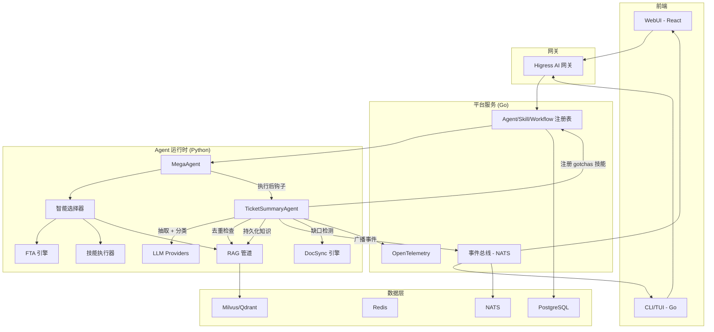
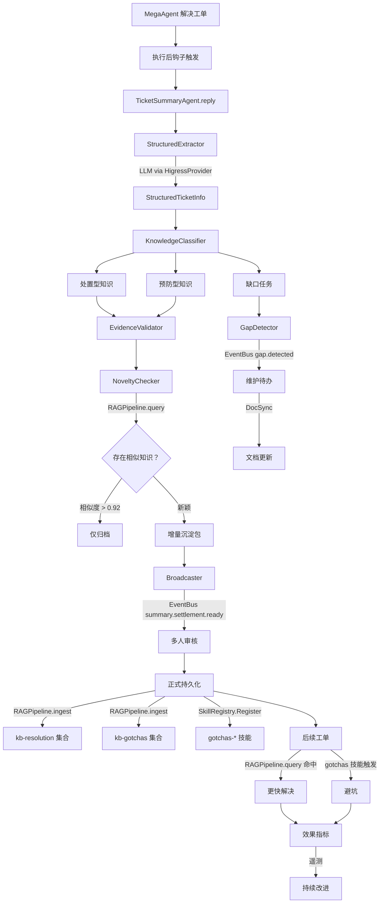
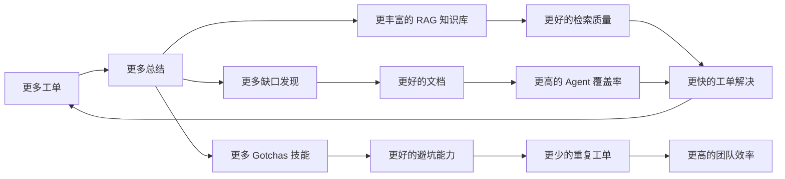
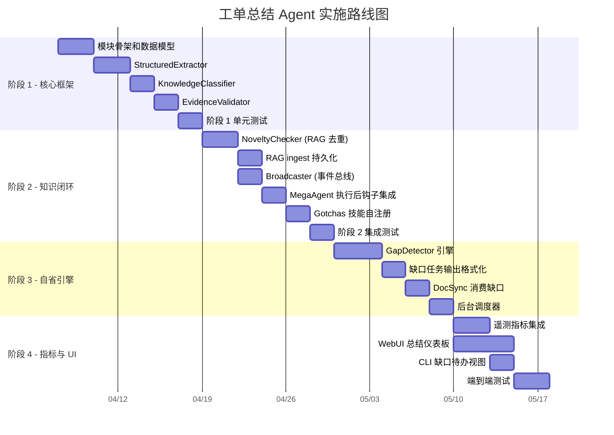

# 工单总结 Agent — 集成分析报告

> **状态**: 技术可行性评估  
> **范围**: 工单总结 Agent 设计哲学与 ResolveAgent 平台的完整集成  
> **结论**: 架构兼容、技术可行、零入侵集成路径可用

---

## 目录

1. [执行摘要](#执行摘要)
2. [架构兼容性评估](#1-架构兼容性评估)
3. [技术实现可行性](#2-技术实现可行性)
4. [集成路径规划](#3-集成路径规划)
5. [扩展影响评估](#4-扩展影响评估)
6. [实施建议](#5-实施建议)

---

## 执行摘要

工单总结 Agent 的设计哲学 — 以**三类增量产出**（解法、预防、体系修补）和**七大设计原则**为核心 — 与现有 ResolveAgent 架构**高度兼容**。平台当前的组件栈（Agent 系统、RAG 管道、技能系统、事件总线、智能选择器）已经提供了集成所需的基础设施。

**核心发现：**

- **零架构冲突**：七大设计原则全部映射到现有系统能力
- **执行后触发模型**：Summary Agent 作为后处理步骤运行，而非路由目标 — 无需修改智能选择器的核心路由逻辑
- **Go 平台改动极小**：仅需事件总线主题扩展；核心注册表、网关和存储层保持不变
- **主要在 Python 运行时实现**：新建 `summary/` 模块继承 `BaseAgent`，复用现有 RAG、Skills 和 LLM 抽象
- **MVP 约 1 周可达**：三个核心能力（结构化抽取、RAG 去重、事件广播）构成最小可行闭环

---

## 1. 架构兼容性评估

### 1.1 四层架构对齐

工单总结 Agent 的知识生产闭环可以清晰映射到 ResolveAgent 现有的四层架构：

```
┌────────────────────────────────────────────────────────────────────┐
│  客户端层                                                          │
│  CLI/TUI · WebUI · 外部 API                                       │
│  ─── Summary Agent 新增: 缺口仪表板、总结信息流 ───                │
├────────────────────────────────────────────────────────────────────┤
│  HIGRESS AI/API 网关                                               │
│  认证 · 限流 · 模型路由                                            │
│  ─── 无需修改 ───                                                  │
├────────────────────────────────────────────────────────────────────┤
│  平台服务层 (Go)                                                   │
│  注册表 · 事件总线 · 遥测 · 配置                                   │
│  ─── Summary Agent 新增: summary.* 事件、缺口指标 ───             │
├────────────────────────────────────────────────────────────────────┤
│  Agent 运行时 (Python / AgentScope)                                │
│  选择器 · FTA · Skills · RAG · LLM                                │
│  ─── Summary Agent 新增: summary/ 模块（核心逻辑）───             │
├────────────────────────────────────────────────────────────────────┤
│  数据层                                                            │
│  PostgreSQL · Redis · NATS · Milvus/Qdrant                        │
│  ─── Summary Agent 新增: 向量库中的知识集合 ───                    │
└────────────────────────────────────────────────────────────────────┘
```

### 1.2 七大原则 × 现有组件映射

每个设计原则都直接映射到一个或多个现有系统能力：

| 设计原则 | 支撑组件 | 源文件 | 兼容性 |
|---|---|---|---|
| **P1: 发现未知** | RAG Pipeline `query()` 检测知识新颖性 | `python/src/resolveagent/rag/pipeline.py` | ✅ 直接使用 |
| **P2: 组织公开化** | 事件总线 (NATS) 支持一写多读广播 | `pkg/event/event.go`, `pkg/event/nats.go` | ✅ 直接使用 |
| **P3: 证据化** | `Execution` proto 包含 `trace_id`、`route_decision`、时间戳 | `api/proto/resolveagent/v1/agent.proto` | ✅ 直接使用 |
| **P4: 增量沉淀** | RAG Pipeline `query()` 去重 + `ingest()` 持久化 | `python/src/resolveagent/rag/pipeline.py` | ✅ 扩展使用 |
| **P5: 能力化闭环** | Skill Registry 动态注册；现有 `SkillManifest` 模型 | `pkg/registry/skill.go`, `python/.../skills/manifest.py` | ✅ 直接使用 |
| **P6: 避坑预防** | 技能系统支持新技能分类（如 `gotchas-*`） | `python/src/resolveagent/skills/executor.py` | ✅ 扩展使用 |
| **P7: 自省能力** | 工作流系统 + DocSync 引擎用于后台缺口检测 | `pkg/registry/workflow.go`, `python/.../docsync/` | ⚠️ 新建模块 |

### 1.3 Agent 类型注册

Proto 定义无需修改即可容纳 Summary Agent：

```protobuf
// api/proto/resolveagent/v1/agent.proto
enum AgentType {
  AGENT_TYPE_UNSPECIFIED = 0;
  AGENT_TYPE_MEGA = 1;
  AGENT_TYPE_SKILL = 2;
  AGENT_TYPE_FTA = 3;
  AGENT_TYPE_RAG = 4;
  AGENT_TYPE_CUSTOM = 5;  // ← Summary Agent 在此注册
}
```

Go 端的 `AgentDefinition.Type` 字段（`pkg/registry/agent.go`）是自由格式字符串，可以直接使用 `"summary"` 作为类型值。`AgentRegistry` 接口（`Create`, `Get`, `List`, `Update`, `Delete`）完全满足 Summary Agent 实例管理需求。

### 1.4 兼容性评定

| 维度 | 评估 | 详情 |
|---|---|---|
| Proto/API 协议 | ✅ 无需修改 | `AGENT_TYPE_CUSTOM` 覆盖 Summary Agent |
| Agent 注册表 | ✅ 无需修改 | `AgentDefinition.Type = "summary"` 直接可用 |
| Skill 注册表 | ✅ 无需修改 | Gotchas 技能通过现有 `SkillRegistry.Register()` 注册 |
| Workflow 注册表 | ✅ 无需修改 | 缺口检测可注册为工作流 |
| 事件总线 | ✅ 仅扩展 | 新增 `summary.*` 和 `gap.*` 事件类型 |
| Store 接口 | ✅ 无需修改 | 知识通过 RAG 向量库持久化 |
| 网关/Higress | ✅ 无需修改 | Summary Agent 使用现有 LLM 路由 |

---

## 2. 技术实现可行性

### 2.1 Python 运行时 — 核心实现

Summary Agent 的主要逻辑位于 Python 运行时，作为继承自 `BaseAgent` 的新模块：

**建议模块结构：**

```
python/src/resolveagent/summary/
├── __init__.py                    # 模块导出
├── agent.py                       # TicketSummaryAgent（继承 BaseAgent）
├── models.py                      # Pydantic 数据模型
├── extractor.py                   # 结构化信息抽取（LLM 驱动）
├── classifier.py                  # 三类知识分类器
├── evidence_validator.py          # 证据链验证器
├── novelty_checker.py             # 增量新颖性检测（基于 RAG）
├── gap_detector.py                # 后台缺口识别引擎
└── broadcaster.py                 # 一写多读事件广播器
```

### 2.2 组件级实现映射

每个 Summary Agent 组件都映射到利用现有基础设施的具体实现方案：

#### 2.2.1 TicketSummaryAgent (`summary/agent.py`)

**继承自：** `BaseAgent`（`python/src/resolveagent/agent/base.py`）

**设计原理：** `BaseAgent` 已提供 `reply()`、`add_memory()`、`get_memory()` 和 `reset()` 方法。Summary Agent 重写 `reply()` 实现完整的知识生产管道。`MemoryManager`（`agent/memory.py`）提供会话上下文追踪。

```python
class TicketSummaryAgent(BaseAgent):
    """知识生产引擎，用于工单总结。
    
    以七大设计原则实现后处理管道：
    1. 结构化抽取（P1: 发现未知）
    2. 三类分类（P6: 预防）
    3. 证据链验证（P3: 证据化）
    4. 新颖性检测 via RAG 去重（P4: 增量化）
    5. 事件广播（P2: 组织公开化）
    6. 正式持久化到 Skills/RAG（P5: 能力化闭环）
    7. 后台缺口检测（P7: 自省能力）
    """
```

#### 2.2.2 结构化抽取器 (`summary/extractor.py`)

**使用：** `python/src/resolveagent/llm/` 中的 LLM Provider（特别是 `higress_provider.py`，用于网关路由的 LLM 调用）

**方案：** LLM 驱动的结构化抽取，配合 Pydantic 输出解析。接收原始工单内容（症状、错误日志、对话历史、解决操作），输出 `StructuredTicketInfo` 模型。

#### 2.2.3 知识分类器 (`summary/classifier.py`)

**使用：** `python/src/resolveagent/selector/selector.py` 中的选择器模式

**方案：** 采用与 `IntelligentSelector` 相同的混合策略模式 — 规则快速路径处理明确分类、LLM 兜底处理模糊场景。将抽取信息分为三类：

- **处置型知识** → 结构化解决方案产物
- **预防型知识 (Gotchas)** → 反模式和避坑警告
- **维护型知识** → 体系缺口识别

#### 2.2.4 证据验证器 (`summary/evidence_validator.py`)

**使用：** `api/proto/resolveagent/v1/agent.proto` 中的 `Execution` 记录（字段：`trace_id`、`route_decision`、`started_at`、`completed_at`、`duration_ms`）

**方案：** 验证每个总结结论具有完整的证据链：`结论 ↔ 根因 ↔ 采取行动 ↔ 成功条件 ↔ 适用范围`。拒绝缺少关键证据字段的结论。

#### 2.2.5 新颖性检查器 (`summary/novelty_checker.py`)

**使用：** `python/src/resolveagent/rag/pipeline.py` 中的 `RAGPipeline.query()`

**方案：** 持久化任何知识前，用候选总结查询现有 RAG 集合。如果相似度超过阈值（如 0.92），案例仅归档而不提升为公共知识。实现原则四（增量沉淀），防止重复/噪声条目。

#### 2.2.6 广播器 (`summary/broadcaster.py`)

**使用：** `pkg/event/event.go` 和 `pkg/event/nats.go` 中的事件总线

**方案：** 通过基于 NATS 的事件总线发布结构化事件：

| 事件类型 | 触发条件 | 消费者 |
|---|---|---|
| `summary.created` | 新总结生成 | WebUI 信息流、CLI 通知 |
| `summary.settlement.ready` | 增量包形成 | 工单负责人、值班人员、产品负责人 |
| `summary.persisted` | 知识正式持久化 | 审计日志、指标 |
| `gap.detected` | 体系缺口识别 | 维护待办、DocSync |
| `gap.task.created` | 缺口转为维护任务 | WebUI 仪表板、指派人 |

#### 2.2.7 缺口检测器 (`summary/gap_detector.py`)

**使用：** `python/src/resolveagent/docsync/engine.py` 中的 DocSync 引擎、RAG Pipeline

**方案：** 实现四类缺口（缺失、冲突、过时、隐性经验）的后台分析引擎。输出结构化的 `GapTask` 对象，适用于维护待办队列。

### 2.3 Go 平台层 — 最小改动

Go 平台仅需**新增性改动**，无需修改现有接口：

| 组件 | 改动类型 | 详情 |
|---|---|---|
| `pkg/event/event.go` | **无需改动** | `Event` 结构体的 `Type`、`Subject`、`Data` 已足够 |
| `pkg/event/nats.go` | **无需改动** | `NATSBus.Publish()` 接受任意事件类型字符串 |
| `pkg/registry/agent.go` | **无需改动** | `AgentDefinition.Type` 为自由格式字符串 |
| `pkg/registry/skill.go` | **无需改动** | `SkillRegistry.Register()` 接受任意技能定义 |
| `pkg/telemetry/metrics.go` | **扩展** | 添加 summary 相关指标计数器 |

### 2.4 数据模型定义

总结系统的核心 Pydantic 模型：

```python
# python/src/resolveagent/summary/models.py

class StructuredTicketInfo(BaseModel):
    """从工单抽取的结构化信息"""
    ticket_id: str
    symptom: str                    # 可观测现象
    error_messages: list[str]       # 错误日志和消息
    environment: dict[str, str]     # 版本、配置、基础设施上下文
    diagnosis_path: list[str]       # 逐步排查路径
    root_cause: str                 # 已验证的根因
    resolution: str                 # 采取的行动
    success_condition: str          # 验证修复是否有效的方法
    applicable_scope: str           # 边界和限制

class ResolutionKnowledge(BaseModel):
    """类型 1: 如何更快处理问题"""
    ...来自 StructuredTicketInfo 的字段...
    evidence_chain: EvidenceChain

class GotchasKnowledge(BaseModel):
    """类型 2: 如何避免踩坑"""
    dangerous_operations: list[str]
    misleading_diagnostics: list[str]
    order_dependencies: list[str]
    mandatory_prechecks: list[str]
    common_misjudgments: list[str]

class GapTask(BaseModel):
    """类型 3: 体系缺口的可维护任务"""
    gap_type: Literal["missing", "conflicting", "stale", "tacit_personal"]
    product_module: str
    related_ticket_count: int
    impact_scope: str
    suggested_location: str
    suggested_content: str
    priority: Literal["critical", "high", "medium", "low"]
    owner: str

class SettlementPackage(BaseModel):
    """增量知识沉淀包"""
    resolution: ResolutionKnowledge | None
    gotchas: GotchasKnowledge | None
    gap_tasks: list[GapTask]
    is_novel: bool
    archived_only: bool
```

### 2.5 触发机制 — 执行后钩子

Summary Agent **不是路由目标** — 它是 `MegaAgent` 管道中的**执行后钩子（post-execution hook）**：

```python
# python/src/resolveagent/agent/mega.py（概念扩展）
class MegaAgent(BaseAgent):
    async def reply(self, message):
        # 步骤 1: 现有路由逻辑
        decision = await selector.route(...)
        result = await self._execute(decision)
        
        # 步骤 2: 执行后总结触发（新增）
        if self._should_summarize(message, result, decision):
            summary_agent = TicketSummaryAgent(model_id=self.model_id)
            await summary_agent.reply({
                "content": message["content"],
                "resolution": result,
                "execution_context": {
                    "route_type": decision.route_type,
                    "route_target": decision.route_target,
                    "confidence": decision.confidence,
                    "trace_id": ctx.trace_id,
                },
            })
        
        return result
```

此方案确保：
- **零入侵** 现有 `IntelligentSelector` 路由逻辑
- **无需新 `RouteType`** 在 proto 定义中
- 总结**异步运行** 在工单解决之后
- 可**条件触发** 基于工单复杂度、置信度或显式请求

### 2.6 RAG 集合策略

知识库使用专用 RAG 集合存储每类知识：

| 集合 ID | 内容 | 用途 |
|---|---|---|
| `kb-resolution` | 处置型知识条目 | 去重检查 + 未来检索 |
| `kb-gotchas` | 预防型/Gotchas 条目 | 工单处理时的前置检查 |
| `kb-gaps` | 体系缺口记录 | 后台分析和趋势追踪 |

所有集合使用现有 `RAGPipeline` 配合 `bge-large-zh` 嵌入模型和 Milvus/Qdrant 向量后端 — 无需新基础设施。

---

## 3. 集成路径规划

### 3.1 集成架构



### 3.2 数据流 — 完整知识生产闭环



### 3.3 组件交互矩阵

| Summary 组件 | 交互对象 | 方向 | 方式 |
|---|---|---|---|
| `TicketSummaryAgent` | `BaseAgent` | 继承 | Python 类继承 |
| `TicketSummaryAgent` | `MegaAgent` | 被调用 | 执行后钩子 |
| `StructuredExtractor` | `HigressProvider` | 调用 | 通过 Higress 网关的 LLM API |
| `KnowledgeClassifier` | `IntelligentSelector` | 模式复用 | 混合策略模式 |
| `EvidenceValidator` | `Execution` proto | 读取 | 执行跟踪数据 |
| `NoveltyChecker` | `RAGPipeline` | 调用 | `query()` 相似性检查 |
| `Broadcaster` | 事件总线 (NATS) | 发布 | `summary.*` 和 `gap.*` 事件 |
| `GapDetector` | DocSync 引擎 | 触发 | 缺口驱动的文档同步任务 |
| 正式持久化 | `RAGPipeline` | 调用 | `ingest()` 到向量库 |
| 正式持久化 | `SkillRegistry` | 调用 | `Register()` 注册 gotchas 技能 |
| 效果指标 | OpenTelemetry | 上报 | 自定义指标计数器 |

---

## 4. 扩展影响评估

### 4.1 正向协同效应（飞轮效应）

Summary Agent 创造了一个**知识飞轮**，放大每个现有组件的价值：



| 现有组件 | 协同效应 | 机制 |
|---|---|---|
| **智能选择器** | 路由准确度持续提升 | 总结抽取的意图模式成为选择器训练数据 |
| **FTA 引擎** | 自动生成故障树 | 解法知识中的诊断路径 → 新 FTA 子树 |
| **RAG 管道** | 知识库持续丰富 | 每个新颖总结扩充检索语料；后续工单命中缓存知识 |
| **技能系统** | 技能库自扩展 | Gotchas 知识自动注册为可调用技能；前置检查成为技能前提条件 |
| **DocSync 引擎** | 基于缺口的优先文档同步 | 缺口检测识别过时/缺失文档 → DocSync 自动生成更新任务 |
| **事件总线** | 丰富的分析事件流 | `summary.*` 事件支持知识生产指标仪表板 |

### 4.2 对现有组件的影响

| 组件 | 影响程度 | 详情 |
|---|---|---|
| `python/src/resolveagent/agent/mega.py` | **低** | 添加执行后钩子（约 10 行） |
| `python/src/resolveagent/rag/pipeline.py` | **无** | 直接使用 `query()` 和 `ingest()` |
| `python/src/resolveagent/skills/executor.py` | **无** | 直接用于 gotchas 技能执行 |
| `python/src/resolveagent/selector/selector.py` | **无** | 无路由改动；总结是后处理 |
| `pkg/telemetry/metrics.go` | **低** | 添加 summary 相关计数器 |
| `web/` | **中** | 新增总结信息流和缺口待办仪表板页面 |

### 4.3 风险评估

| 风险 | 严重度 | 概率 | 缓解措施 |
|---|---|---|---|
| **RAG 集合膨胀** | 中 | 低 | 原则四（增量化）+ 相似度阈值过滤 |
| **LLM 调用量增加** | 中 | 中 | 规则前置过滤 + 批量总结 + 响应缓存 |
| **事件总线背压** | 低 | 低 | 事件聚合 + `NATSBus` 限流 |
| **技能注册碎片化** | 中 | 中 | Gotchas 技能合并策略 + 定期整合 |
| **总结质量波动** | 中 | 中 | 证据链验证门控 + 人工审核环节 |
| **缺口误报** | 低 | 中 | 工单数量阈值控制缺口升级 |

---

## 5. 实施建议

### 5.1 分阶段实施计划



### 5.2 阶段 1：核心框架（第 1-2 周）

**目标：** 结构化抽取 + 三类分类 + 证据验证

| 优先级 | 任务 | 目标文件 | 依赖 |
|---|---|---|---|
| **P0** | 创建 `summary/` 模块骨架 | `python/src/resolveagent/summary/__init__.py` | 无 |
| **P0** | 定义 Pydantic 数据模型 | `python/src/resolveagent/summary/models.py` | 无 |
| **P0** | 实现 `TicketSummaryAgent` 继承 `BaseAgent` | `python/src/resolveagent/summary/agent.py` | `agent/base.py` |
| **P0** | 实现 `StructuredExtractor` 及 LLM 提示词 | `python/src/resolveagent/summary/extractor.py` | `llm/` providers |
| **P1** | 实现 `KnowledgeClassifier`（混合策略） | `python/src/resolveagent/summary/classifier.py` | Selector 模式 |
| **P1** | 实现 `EvidenceValidator` | `python/src/resolveagent/summary/evidence_validator.py` | Proto `Execution` |
| **P2** | 在 Go 平台注册 Summary Agent | 使用现有 `AgentRegistry.Create()` | `pkg/registry/agent.go` |
| **P2** | 阶段 1 单元测试 | `python/tests/unit/test_summary_*.py` | 以上全部 |

**交付物：** Agent 接收工单数据 → 输出分类、验证过的三类知识候选。

### 5.3 阶段 2：知识闭环（第 3-4 周）

**目标：** 去重 + RAG 持久化 + 技能注册 + 事件广播

| 优先级 | 任务 | 目标文件 | 依赖 |
|---|---|---|---|
| **P0** | 实现 `NoveltyChecker` 使用 `RAGPipeline.query()` | `summary/novelty_checker.py` | `rag/pipeline.py` |
| **P0** | 实现 RAG `ingest()` 知识持久化 | `summary/agent.py` | `rag/pipeline.py` |
| **P1** | 实现 `Broadcaster` 使用事件总线 | `summary/broadcaster.py` | `pkg/event/` |
| **P2** | 在 `MegaAgent.reply()` 添加执行后钩子 | `agent/mega.py` | 阶段 1 |
| **P2** | 实现 gotchas 技能自注册 | `summary/agent.py` | `skills/manifest.py` |

**交付物：** 完整知识生产闭环：工单 → 抽取 → 分类 → 验证 → 去重 → 持久化 → 广播。

### 5.4 阶段 3：自省引擎（第 5-6 周）

**目标：** 后台缺口检测 + 可维护任务输出 + DocSync 集成

### 5.5 阶段 4：指标与 UI（第 7-8 周）

**目标：** 可观测性 + 用户面仪表板

**效果指标追踪：**

| 指标 | 说明 | 目标 |
|---|---|---|
| `summary.hit_rate` | 复用已有知识的工单占比 | 3 个月内 > 40% |
| `summary.reuse_rate` | 已持久化知识实际被复用的占比 | 3 个月内 > 30% |
| `summary.pitfall_reduction_rate` | 重复/相似工单的下降率 | 6 个月内 > 20% |
| `summary.gap_discovery_rate` | 每 100 张工单发现的缺口数 | > 5 个/100 张 |
| `summary.novel_ratio` | 产出新颖知识的工单占比 | 15-25%（健康范围） |

### 5.6 MVP — 最快价值交付（约 1 周）

为最快验证核心价值，仅实现三个组件：

1. **`TicketSummaryAgent`** + **`StructuredExtractor`** — LLM 驱动的三类知识抽取
2. **`NoveltyChecker`** — 基于 RAG 的 `RAGPipeline.query()` 去重
3. **`Broadcaster`** — 事件总线发布 `summary.created` 事件

MVP 交付最小可行知识生产闭环：

```
工单 → 抽取 → 分类 → 去重 → 持久化 → 广播
```

### 5.7 无需修改的文件

以下组件完全不受影响：

| 组件 | 路径 | 原因 |
|---|---|---|
| 网关集成 | `pkg/gateway/` | Summary Agent 使用现有 LLM 路由 |
| Store 抽象 | `pkg/store/` | 知识通过 RAG 向量库存储 |
| 配置系统 | `pkg/config/` | 现有配置结构已足够 |
| 选择器策略 | `python/.../selector/strategies/` | 总结是后处理，非路由 |
| FTA 核心引擎 | `python/.../fta/` | 被 Summary Agent 消费，不被修改 |
| Proto 定义 | `api/proto/resolveagent/v1/` | `AGENT_TYPE_CUSTOM` 已足够 |

---

## 附录 A：设计哲学参考

完整的设计哲学文档（包含七大原则、三类知识和知识生产闭环），请参阅：

- [工单总结 Agent — 设计哲学](./ticket-summary-agent.md)

## 附录 B：相关架构文档

- [架构设计](./architecture.md) — 系统整体架构
- [AgentScope 与 Higress 集成](./agentscope-higress-integration.md) — 网关集成详情
- [智能选择器](./intelligent-selector.md) — 自适应路由（KnowledgeClassifier 复用其模式）
- [FTA 工作流引擎](./fta-engine.md) — 故障树分析（被 Summary Agent 消费用于诊断路径抽取）

## 附录 C：术语表

| 术语 | 定义 |
|---|---|
| **沉淀包 (Settlement Package)** | 经验证、去重的解法 + gotchas + 缺口知识捆绑，准备持久化 |
| **新颖性检查 (Novelty Check)** | 基于 RAG 的相似性查询，判断知识是否已存在于知识库 |
| **证据链 (Evidence Chain)** | 结论 → 根因 → 行动 → 成功条件 → 范围 的链式关联 |
| **缺口任务 (Gap Task)** | 结构化的可维护任务，标识知识体系的特定薄弱环节 |
| **Gotchas 技能** | 注册的包含预防知识的技能（反模式、避坑警告） |
| **执行后钩子 (Post-Execution Hook)** | MegaAgent 完成工单处理后激活 Summary Agent 的触发机制 |
| **知识飞轮 (Knowledge Flywheel)** | 自强化循环：更多总结 → 更好的 RAG → 更快解决 → 更多数据 |
