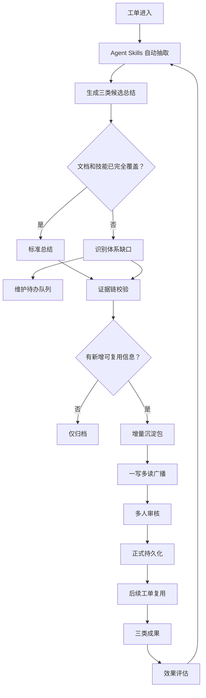

# 工单总结 Agent — 设计哲学

> **从"解决一张工单"升级为"为组织新增一项能力"。**

工单总结 Agent 不是报告生成器 — 它是一个**知识生产引擎**，将每个个案转化为可复用的组织能力。每张工单同时服务三个目标：解决问题、预防再次发生、暴露知识体系的缺口。

## 核心论点

> 工单总结的终极目标，不是写出一篇总结，而是让组织更会处理问题、更会避免踩坑、也更会修补自己的知识体系。

每张工单应产出三种增量价值：

| 增量类型 | 说明 |
|----------|------|
| **解法增量** | 结构化的解决方案知识，让未来处理更快 |
| **避坑增量** | Gotchas 和反模式，避免重复犯错 |
| **体系修补增量** | 文档和技能缺口识别，持续改进 |

---

## 七大设计原则

### 原则一：目标不是省力，而是发现未知

自动化不是为了生成漂亮的总结，而是**系统性地识别现有文档未覆盖的问题**，从个案中结构化提取新认知。

- 自动检测工单是否引入了尚未被记录的知识
- 即使是"常规"解决方案也要提取结构化洞察

### 原则二：知识必须组织公开化

Agent 不能是唯一变聪明的实体。总结必须**先送达相关人员，再沉淀为永久存储**，形成团队共享记忆。

- 广播给值班工程师、工单负责人和产品负责人
- 多人审核后再正式持久化
- 一写多读分发模式

### 原则三：结论必须证据化

工单知识不是口口相传的民间传说 — 它必须是**可回放的证据链**。没有证据链的总结容易变成幻觉知识或传说知识。

- 每个结论关联：根因、采取的行动、成功条件、适用范围
- 知识持久化前进行证据链验证

### 原则四：沉淀必须增量化

目标不是"所有处理过的工单"，而是**"为组织贡献了新认知价值的工单"**。防止重复条目、噪声污染和知识囤积。

- 对已有知识库进行去重检查
- 只在确实是新知识时才提升为公共知识
- 常规案例仅归档

### 原则五：知识必须能力化闭环

文档不是终点。知识只有**进入下一个处理管道成为可调用、可训练、可检查、可复用的能力**时才算真正沉淀。

- 持久化到：技能库、Runbook、FAQ、培训材料、QA 规则
- 后续工单优先复用已沉淀的知识
- 度量：命中率、复用率

### 原则六：经验不只帮解题，也要帮避坑

总结不仅要回答"怎么修"，还要回答**"怎么避免"**。优秀的团队不只是更会修问题 — 他们更会避免制造、放大和误判问题。

- Gotchas 提取：危险操作、误导性诊断、顺序依赖
- 高风险场景的前置检查要求
- 最常见的误判模式

### 原则七：系统要具备自省能力

Agent 不仅消费知识 — 它必须**持续发现知识体系本身的薄弱环节**。缺口识别应该是后台守护进程，而非事后的人工补救。

- 后台持续运行的缺口检测
- 输出为可维护的任务，而非仅仅是告警

---

## 三类总结产物

### 1. 处置型知识

回答：**当问题来了，如何更快更可靠地处理。**

| 字段 | 说明 |
|------|------|
| 现象 | 可观测的现象和错误消息 |
| 环境 | 版本、配置、基础设施上下文 |
| 排查路径 | 逐步的故障排查序列 |
| 根因 | 已验证的根本原因 |
| 解决方案 | 采取的修复行动 |
| 成功条件 | 如何验证修复是否有效 |
| 适用范围 | 方案的边界和限制 |

### 2. 预防型知识 — Gotchas

回答：**在问题来之前，如何避免踩坑。**

- 容易误触发问题的操作
- 已知兼容性陷阱的版本组合
- "看起来合理"但实际会误导的诊断操作
- 不可逆转顺序的依赖性流程
- 需要强制前置检查的场景
- 最常见的误判模式

### 3. 维护型知识 — 体系缺口

回答：**为什么这类工单仍然需要人工回退。**

- 该场景缺少文档
- 现有 Runbook 不完整
- 现有技能无法覆盖该案例
- 不同来源的文档冲突
- 过时的文档指向旧版本/路径/参数
- 关键经验仅存在于个别工程师脑中

### 产物矩阵

| 知识类型 | 内容 | 影响方向 |
|----------|------|----------|
| **处置型** | 现象、报错、诊断、方案、范围 | 提升未来工单处理效率和一致性 |
| **预防型 (Gotchas)** | 易错点、误导路径、危险操作、前置检查 | 降低踩坑率、误操作率、返工率 |
| **维护型** | 缺文档、缺技能、冲突、过时内容 | 持续修补知识体系，提高 Agent 覆盖率 |

---

## 知识生产闭环

---

## 后台缺口识别引擎

缺口识别**不是附加在总结上的一次性操作** — 它是持续运行的后台能力。

### 四类缺口

| 类别 | 检测信号 |
|------|----------|
| **缺失** | 工单无法映射到任何现有文档/技能；关键步骤没有标准描述 |
| **冲突** | 两份文档给出不同的解决路径；技能输出与人工最佳实践矛盾 |
| **过时** | 文档引用旧版本/路径/参数；解决方案已变但文档未更新 |
| **隐性经验** | 解决方案依赖某人的口头补充；同类问题总是需要人工"再加一句提示" |

### 缺口输出格式 — 可维护任务

| 字段 | 说明 |
|------|------|
| 缺口类型 | 缺失 / 冲突 / 过时 / 隐性经验 |
| 产品/模块 | 影响的产品领域 |
| 关联工单数 | 多少工单触及此缺口 |
| 影响范围 | 对运维的影响广度 |
| 建议位置 | 在文档/技能树中添加内容的位置 |
| 建议内容 | 应该编写内容的草稿 |
| 优先级 | 基于频率和影响 |
| 责任人 | 负责修复缺口的人员 |

---

## 集成分析

工单总结 Agent 与 ResolveAgent 现有架构**完全兼容**，采用零入侵集成方式：

- **触发机制**：作为 MegaAgent 的执行后钩子（post-execution hook），不修改 Intelligent Selector 路由逻辑
- **Agent 类型**：使用现有 `AGENT_TYPE_CUSTOM` 注册，Go 平台无需修改
- **知识存储**：通过现有 RAG Pipeline 的 `query()` 和 `ingest()` 接口
- **事件广播**：通过 NATS Event Bus 发布 `summary.*` 和 `gap.*` 事件
- **技能注册**：Gotchas 知识自动注册为可调用技能

详细集成分析请参阅 [集成分析报告](./ticket-summary-agent-integration-analysis.md)。

---

## 相关文档

- [集成分析报告](./ticket-summary-agent-integration-analysis.md) — 技术可行性评估与实施计划
- [架构设计](./architecture.md) — 系统整体架构
- [智能选择器](./intelligent-selector.md) — 自适应路由引擎
- [FTA 工作流引擎](./fta-engine.md) — 故障树分析
- [数据库 Schema](./database-schema.md) — 数据库架构设计
